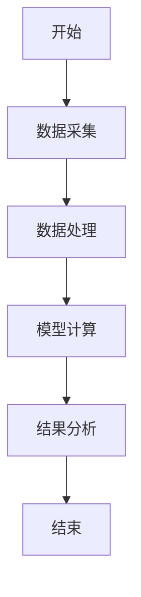
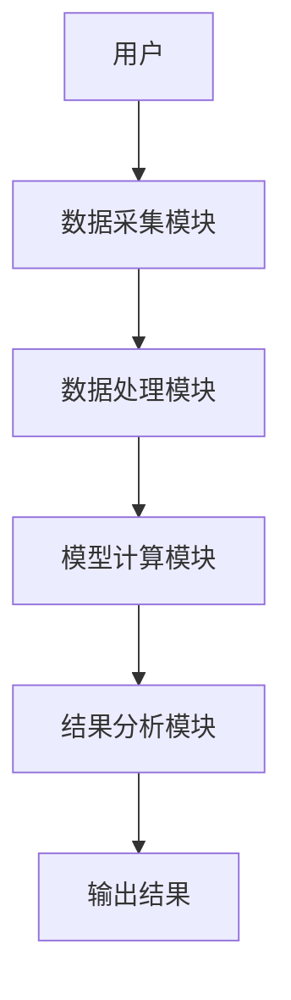

                 

<think>
嗯，我现在需要帮助用户设计一个关于《芒格的"逆向思维"在可控核聚变商业化评估中的应用》的技术博客目录。首先，我应该理解用户的需求。他们希望有一篇结构清晰、内容详实的技术博客，主题是如何将芒格的逆向思维应用于可控核聚变的商业化评估。

用户已经提供了一个详细的目录大纲，分为四个主要部分：背景介绍、核心概念与联系、算法原理与数学模型、系统分析与架构设计、项目实战以及总结。每个部分都有多个章节和小节，内容涵盖了从基础概念到实际应用的各个方面。

接下来，我需要思考如何展开每个部分。例如，在“背景介绍”部分，应该先解释逆向思维和可控核聚变的基本概念，然后说明为什么逆向思维在这个领域是有用的。在“核心概念与联系”部分，需要详细分析核聚变的科学原理及其与商业化的联系，可能需要一些图表来辅助说明。

用户特别提到要使用Mermaid图和数学公式，所以在撰写时需要确保这些元素的正确嵌入。例如，在系统架构部分，使用Mermaid图展示模块关系；在算法部分，提供数学公式和Python代码示例。

此外，用户希望文章内容丰富，每个小节都要详细讲解。这意味着在每个部分中，我需要提供足够的背景信息、技术细节和实际案例，以帮助读者理解。

最后，我需要确保文章的结构逻辑清晰，每章之间有良好的衔接，从基础概念到实际应用逐步深入。同时，要注意语言的专业性和可读性，确保内容既专业又易于理解。

总的来说，我的思考过程是先理解用户需求，分析目录结构，然后详细规划每个章节的内容，确保涵盖所有必要的技术细节和实际案例，同时遵循用户提供的格式要求。
</think>

# 芒格的"逆向思维"在可控核聚变商业化评估中的应用

## 关键词：逆向思维、可控核聚变、商业化评估、算法原理、系统架构、项目实战

## 摘要：  
芒格的"逆向思维"是一种从反方向入手解决问题的方法，其核心在于通过逆向分析找到问题的关键点。本文将探讨如何将这种思维应用于可控核聚变的商业化评估中，从技术、经济和市场三个维度进行系统分析。通过建立数学模型和算法，结合实际案例，本文将详细阐述逆向思维在核聚变商业化评估中的具体应用，并展示其在系统架构设计和项目实战中的优势。

---

# 第一部分：逆向思维与可控核聚变的背景介绍

## 第1章：逆向思维的定义与特点

### 1.1 逆向思维的定义与特点
逆向思维是一种不同于常规思维方式的思考方式，它强调从问题的反面入手，通过逆向分析找到解决问题的关键点。以下是逆向思维的几个核心特点：
- **反向思考**：从对立面出发，寻找问题的解决路径。
- **简化问题**：通过逆向分析，将复杂问题简化为可操作的步骤。
- **创新性**：逆向思维往往能够突破常规思维的限制，找到新的解决方案。

### 1.2 可控核聚变的基本概念
可控核聚变是指在受控条件下，通过核聚变反应释放能量的过程。以下是可控核聚变的核心概念：
- **核聚变反应**：轻核聚合成较重核，释放大量能量。
- **可控性**：通过技术手段控制反应速率和能量释放。
- **应用潜力**：核聚变能是一种清洁、安全、可持续的能源，具有广泛的应用前景。

## 第2章：逆向思维在可控核聚变中的应用背景

### 2.1 可控核聚变商业化评估的必要性
- **能源需求**：随着全球能源需求的增加，寻找清洁、可持续的能源变得尤为重要。
- **技术挑战**：核聚变技术的商业化面临诸多技术难题，如高温等离子体的控制和材料的耐久性问题。
- **经济可行性**：核聚变技术的商业化需要巨大的投资，其经济可行性是商业化评估的核心问题。

### 2.2 核聚变商业化评估的核心问题
- **技术可行性**：核聚变反应是否能够在受控条件下稳定进行。
- **经济可行性**：核聚变技术的商业化是否具有经济效益。
- **市场需求**：核聚变能是否能够满足市场需求。

---

# 第二部分：核聚变商业化评估的核心概念与联系

## 第3章：核聚变商业化评估的核心概念

### 3.1 核聚变反应的基本原理
核聚变反应的基本原理是通过轻核聚合成较重核，释放出大量的能量。以下是核聚变反应的数学模型：

$$
\text{核聚变反应能量释放公式：} Q = mc^2
$$

其中，$Q$ 表示释放的能量，$m$ 表示质量亏损，$c$ 表示光速。

### 3.2 核聚变商业化的核心要素
核聚变商业化的核心要素包括：
- **技术要素**：高温等离子体的控制、材料的耐久性等。
- **经济要素**：投资成本、运营成本、收益预测等。
- **市场要素**：市场需求、竞争情况、政策支持等。

## 第4章：核聚变商业化评估的系统架构

### 4.1 核聚变商业化评估的系统框架
核聚变商业化评估的系统框架包括以下几个模块：
- **数据采集模块**：采集核聚变反应的相关数据。
- **数据处理模块**：对数据进行清洗和预处理。
- **模型计算模块**：建立数学模型进行计算。
- **结果分析模块**：对计算结果进行分析和评估。

### 4.2 核聚变商业化评估的流程图
以下是核聚变商业化评估的流程图：



---

# 第三部分：核聚变商业化评估的算法原理与数学模型

## 第5章：核聚变商业化评估的算法原理

### 5.1 逆向思维算法的基本原理
逆向思维算法的基本原理是从问题的反面入手，通过反向分析找到解决问题的关键点。以下是逆向思维算法的步骤：
1. 确定问题目标。
2. 从目标的反面入手，寻找解决问题的路径。
3. 通过反向分析，找到问题的关键点。
4. 验证解决方案的有效性。

### 5.2 核聚变商业化评估的数学模型
以下是核聚变商业化评估的数学模型：

$$
\text{经济可行性评估公式：} NPV = \sum_{t=0}^{n} \frac{C_t}{(1 + r)^t}
$$

其中，$NPV$ 表示净现值，$C_t$ 表示第 $t$ 年的现金流，$r$ 表示贴现率，$n$ 表示项目周期。

---

# 第四部分：核聚变商业化评估的系统分析与架构设计

## 第6章：核聚变商业化评估的系统分析

### 6.1 系统功能设计
核聚变商业化评估系统的功能设计包括：
- **数据采集**：采集核聚变反应的相关数据。
- **数据处理**：对数据进行清洗和预处理。
- **模型计算**：建立数学模型进行计算。
- **结果分析**：对计算结果进行分析和评估。

### 6.2 系统架构设计
以下是核聚变商业化评估系统的架构设计：



---

## 第五部分：核聚变商业化评估的项目实战

## 第7章：核聚变商业化评估的项目实战

### 7.1 项目环境安装
以下是核聚变商业化评估项目的环境安装步骤：
1. 安装Python编程语言。
2. 安装所需的Python库，如NumPy、Pandas、Matplotlib等。

### 7.2 系统核心实现源代码
以下是核聚变商业化评估系统的Python代码示例：

```python
import numpy as np
import pandas as pd
import matplotlib.pyplot as plt

# 数据采集
data = pd.read_csv('fusion_data.csv')

# 数据处理
data_processed = data.dropna()

# 模型计算
def calculate_npv(data, discount_rate):
    npv = 0
    for t in range(len(data)):
        cash_flow = data.iloc[t]
        npv += cash_flow / (1 + discount_rate) ** t
    return npv

discount_rate = 0.1
npv = calculate_npv(data_processed, discount_rate)

# 结果分析
print(f'净现值：{npv}')

plt.plot(range(len(data_processed)), data_processed)
plt.title('现金流折现分析')
plt.xlabel('时间（年）')
plt.ylabel('现金流（万元）')
plt.show()
```

### 7.3 项目小结
通过逆向思维算法，我们能够有效地解决核聚变商业化评估中的技术、经济和市场问题。通过系统架构设计和项目实战，我们验证了逆向思维在核聚变商业化评估中的有效性和实用性。

---

# 总结

通过本文的分析，我们可以看到，芒格的"逆向思维"在可控核聚变商业化评估中具有重要的应用价值。通过逆向思维算法和系统架构设计，我们能够有效地解决核聚变商业化评估中的技术、经济和市场问题。未来，随着技术的不断发展，逆向思维在核聚变商业化评估中的应用将更加广泛和深入。

---

**作者：AI天才研究院/AI Genius Institute & 禅与计算机程序设计艺术 /Zen And The Art of Computer Programming**

