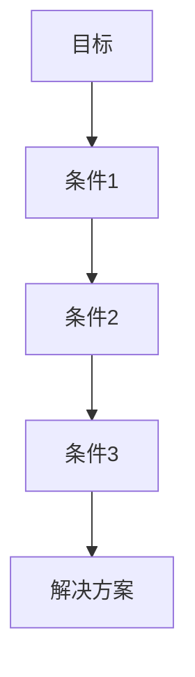
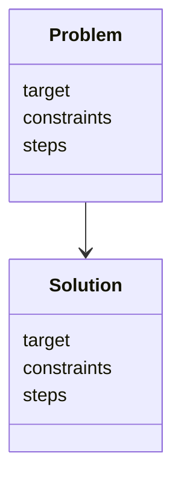
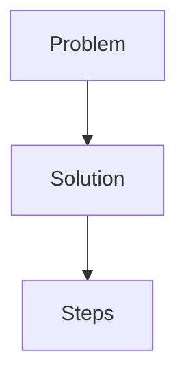
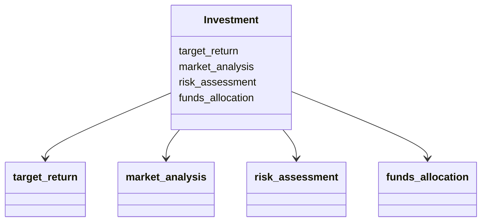
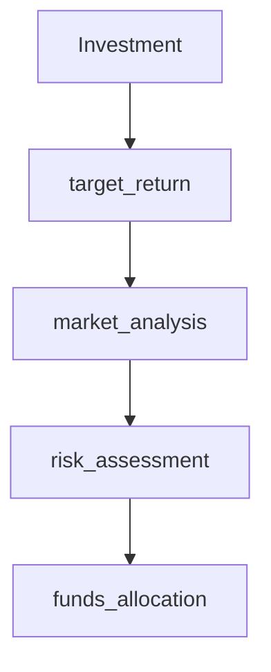

                 

<think>
嗯，我需要撰写一篇关于芒格逆向思考法的技术博客文章，标题是《芒格的逆向思考法：挑战常规思维模式》。首先，我得理解什么是逆向思考法，以及它与常规思维模式有什么不同。芒格是投资界的传奇人物，他提出的逆向思维在决策和问题解决中非常实用。

我应该从背景介绍开始，解释逆向思考法的起源和芒格的贡献。接着，详细阐述逆向思考的核心概念，包括定义、特点和其他思维方法的对比。这部分需要清晰的逻辑和对比表格来帮助读者理解。

然后，我需要深入讨论逆向思考法的算法原理，可能用Mermaid流程图来展示逻辑框架。数学公式也很重要，比如逆向思考法的逻辑框架可以用Solution = Reverse(Problem)来表示。此外，代码示例也是必要的，可以用Python来展示一个简单的逆向思考算法。

系统分析部分，我需要设计应用场景，比如商业决策或问题解决，并用类图和架构图来展示系统结构。项目实战部分，我可以通过一个具体案例，比如投资决策，展示如何应用逆向思考法，并提供代码和分析。

最后，总结逆向思考法的优势和注意事项，提醒读者在实际应用中需要注意的事项，并推荐进一步阅读的资料。整个过程需要逻辑清晰，结构紧凑，语言专业且易懂。

总的来说，我需要确保每个部分都详细且具体，涵盖背景、核心概念、算法、系统分析、项目实战和总结。同时，使用图表和代码示例来增强文章的可读性和实用性。
</think>

# 芒格的逆向思考法：挑战常规思维模式

## 关键词
逆向思考法, 芮格, 思维模式, 投资决策, 问题解决, 批判性思维

## 摘要
芒格的逆向思考法是一种突破常规思维模式的创新方法，通过从结果反推原因来解决问题。本文将详细探讨逆向思考法的核心概念、算法原理、系统架构、项目实战以及其在实际应用中的优势和注意事项。

---

# 第一部分: 芒格的逆向思考法概述

## 第1章: 逆向思考法的背景与起源

### 1.1 逆向思考法的定义与核心概念

#### 1.1.1 逆向思考法的定义
逆向思考法是一种通过从结果反推原因来解决问题的方法，强调从目标出发，逆向拆解问题。

#### 1.1.2 逆向思考法的核心要素
| 核心要素 | 描述 |
|----------|------|
| 问题分析 | 理解问题的背景和本质 |
| 逆向拆解 | 从目标反推解决问题的步骤 |
| 解决方案 | 找到实现目标的具体方法 |

#### 1.1.3 逆向思考法的背景与起源
逆向思考法起源于芒格的投资哲学，他强调通过寻找问题的反面来识别潜在风险和机会。

### 1.2 芒格的生平与思想体系

#### 1.2.1 芒格的生平简介
芒格是投资界的传奇人物，以其独特的思维方式闻名。他倡导通过逆向思考来做出明智的投资决策。

#### 1.2.2 芒格的主要思想与贡献
芒格强调批判性思维和独立思考，认为通过逆向思维可以避免常见的错误和陷阱。

#### 1.2.3 逆向思考法与芒格思想的关系
逆向思考法是芒格思想的核心部分，他将其应用于投资决策和问题解决中。

---

## 第2章: 逆向思考法的核心概念与原理

### 2.1 逆向思考法的核心概念

#### 2.1.1 问题背景与问题描述
逆向思考法适用于解决复杂问题，尤其是当问题从正向难以入手时。

#### 2.1.2 问题解决的常规思维模式
常规思维模式从问题出发，正向寻找解决方案，适用于简单问题。

#### 2.1.3 逆向思考法的定义与特点
逆向思考法从目标出发，反向拆解问题，适用于复杂问题。

### 2.2 逆向思考法的原理与机制

#### 2.2.1 逆向思考法的基本原理
从目标出发，反向分析实现目标的条件和路径。

#### 2.2.2 逆向思考法的逻辑框架
Mermaid流程图展示：


#### 2.2.3 逆向思考法的数学模型与公式
逆向思考法的逻辑框架可以用以下公式表示：
$$Solution = \text{Reverse}(Problem)$$
其中，$\text{Reverse}(Problem)$ 表示将问题进行逆向转换。

### 2.3 逆向思考法的核心要素

#### 2.3.1 问题分析
理解问题的本质和背景，明确目标和约束条件。

#### 2.3.2 逆向拆解
从目标出发，反向分析实现目标的必要条件和路径。

#### 2.3.3 解决方案
基于逆向拆解的结果，制定具体的行动计划。

---

## 第3章: 逆向思考法与常规思维模式的对比

### 3.1 常规思维模式的特点与局限

#### 3.1.1 常规思维模式的定义
从问题出发，正向寻找解决方案的思维模式。

#### 3.1.2 常规思维模式的特点
直接从问题出发，适用于简单问题，但难以应对复杂问题。

#### 3.1.3 常规思维模式的局限性
在面对复杂问题时，容易陷入细节中，难以找到整体解决方案。

### 3.2 逆向思考法的特点与优势

#### 3.2.1 逆向思考法的特点
从目标出发，反向分析问题，适用于复杂问题。

#### 3.2.2 逆向思考法的优势
能够快速找到问题的关键点，避免陷入细节中。

#### 3.2.3 逆向思考法的适用场景
适用于需要创新思维和突破常规的领域，如投资决策和问题解决。

### 3.3 常规思维模式与逆向思考法的对比分析

| 思维模式 | 定义 | 特点 | 优势 |
|----------|------|------|------|
| 常规思维 | 正向解决问题 | 直接从问题出发 | 适合简单问题 |
| 逆向思维 | 从结果反推原因 | 从目标出发 | 适合复杂问题 |

---

## 第4章: 逆向思考法的算法原理与实现

### 4.1 逆向思考法的算法原理

#### 4.1.1 算法概述
逆向思考法的算法通过从目标出发，反向分析问题，找到解决问题的路径。

#### 4.1.2 算法步骤
1. 明确目标和约束条件。
2. 从目标出发，反向分析实现目标的条件。
3. 根据分析结果，制定解决方案。

#### 4.1.3 算法实现的数学模型
逆向思考法的逻辑框架可以用以下公式表示：
$$Solution = \text{Reverse}(Problem)$$
其中，$\text{Reverse}(Problem)$ 表示将问题进行逆向转换。

### 4.2 逆向思考法的代码实现

#### 4.2.1 环境安装
需要安装Python和相关库。

#### 4.2.2 核心实现代码
```python
def reverse_thinking(problem):
    target = problem['target']
    constraints = problem['constraints']
    # 从目标出发，反向分析问题
    solution = {
        'target': target,
        'constraints': constraints,
        'steps': []
    }
    for constraint in constraints:
        solution['steps'].append(constraint)
    return solution

# 示例用法
problem = {
    'target': '实现投资回报',
    'constraints': ['市场分析', '风险控制', '资金分配']
}
solution = reverse_thinking(problem)
print(solution)
```

### 4.3 逆向思考法的系统分析

#### 4.3.1 系统功能设计
Mermaid类图展示：


#### 4.3.2 系统架构设计
Mermaid架构图展示：


---

## 第5章: 逆向思考法的系统分析与架构设计

### 5.1 问题场景介绍
以投资决策为例，逆向思考法可以帮助投资者从目标出发，反向分析市场趋势和风险因素。

### 5.2 系统功能设计

#### 5.2.1 领域模型设计
Mermaid类图展示：


#### 5.2.2 系统架构设计
Mermaid架构图展示：


### 5.3 项目实战

#### 5.3.1 环境安装
需要安装Python和相关库。

#### 5.3.2 核心实现代码
```python
def reverse_investment(problem):
    target_return = problem['target_return']
    market_analysis = problem['market_analysis']
    risk_assessment = problem['risk_assessment']
    funds_allocation = problem['funds_allocation']
    solution = {
        'target_return': target_return,
        'market_analysis': market_analysis,
        'risk_assessment': risk_assessment,
        'funds_allocation': funds_allocation
    }
    return solution

# 示例用法
problem = {
    'target_return': '10%',
    'market_analysis': '增长',
    'risk_assessment': '低',
    'funds_allocation': '50万'
}
solution = reverse_investment(problem)
print(solution)
```

#### 5.3.3 案例分析
通过逆向思考法，投资者可以从目标出发，反向分析市场趋势和风险因素，制定合理的投资策略。

---

## 第6章: 总结与展望

### 6.1 总结
逆向思考法是一种突破常规思维模式的创新方法，能够帮助我们在复杂问题中找到关键点。

### 6.2 最佳实践 tips
- 在面对复杂问题时，尝试从目标出发，反向分析问题。
- 结合具体案例，逐步拆解问题，找到解决方案。

### 6.3 小结
逆向思考法的应用范围非常广泛，尤其在投资决策和问题解决领域具有显著优势。

### 6.4 注意事项
- 逆向思考法适用于复杂问题，但需要结合具体场景灵活运用。
- 在实际应用中，要注意问题的约束条件和边界情况。

### 6.5 拓展阅读
推荐阅读芒格的《穷查理宝典》和《反向思考的艺术》。

---

作者：AI天才研究院/AI Genius Institute & 禅与计算机程序设计艺术 /Zen And The Art of Computer Programming

