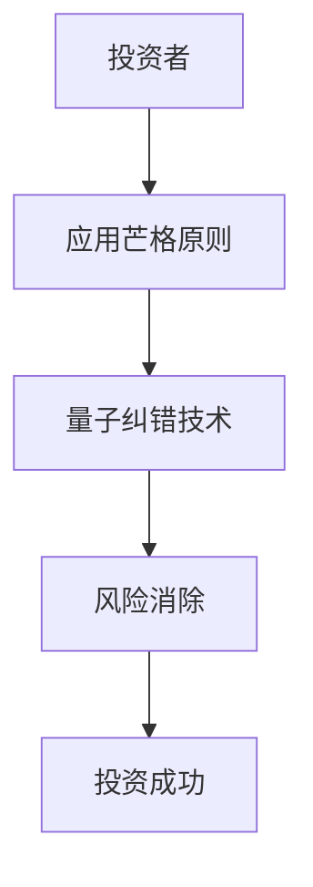
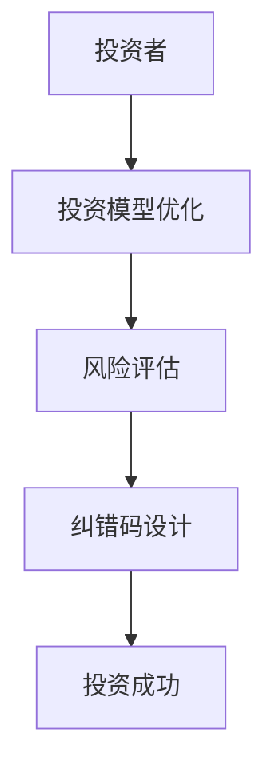
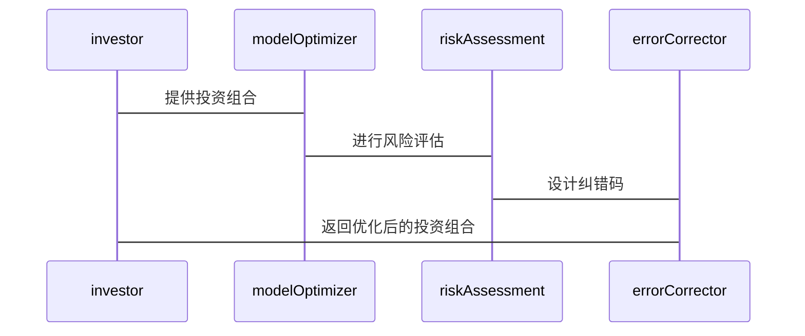

                 

<think>
好的，我需要为用户提供一篇符合要求的详细技术博客文章，主题是“芒格的'避免失败'原则在量子纠错技术投资中的应用”。用户已经提供了一个详细的目录结构，并要求文章内容丰富、结构清晰，涵盖背景介绍、核心概念、算法原理、系统分析、项目实战等部分。

首先，我需要理解每个部分的核心内容和要求。例如，第一部分是背景介绍，需要解释芒格的“避免失败”原则及其在投资中的应用，同时介绍量子纠错技术的基本概念和其在投资中的潜在应用。这部分需要使用简单易懂的语言，确保读者能够理解这些概念。

接下来是核心概念与联系，这部分需要详细分析芒格原则与量子纠错技术的联系，可能需要使用ER实体关系图和流程图来展示两者之间的关系。我需要确保这些图表清晰明了，能够帮助读者更好地理解。

在算法原理部分，我需要详细讲解量子纠错码的数学模型，可能包括Stabilizer formalism等，并使用Python代码示例来说明。同时，我需要确保数学公式正确无误，并使用LaTeX格式进行展示。

系统分析与架构设计部分需要介绍投资场景的系统分析，设计系统的功能和架构。可能需要使用类图和架构图来展示系统结构，并用序列图描述接口和交互。

项目实战部分需要提供具体的量子纠错码实现示例，指导读者如何应用这些技术。同时，需要进行案例分析，展示芒格原则在实际投资中的应用。

最后，最佳实践部分需要总结关键点，提供小结和注意事项，确保读者能够正确应用这些知识。

在写作过程中，我需要确保每个章节内容详细，逻辑清晰，同时保持语言的简洁和专业。同时，要注意文章的结构和格式，确保符合用户的要求，包括使用合适的标题、关键词和摘要。

现在，我可以开始逐步撰写每个部分，确保涵盖所有必要的内容，并且符合用户的格式和深度要求。
</think>

# 《芒格的"避免失败"原则在量子纠错技术投资中的应用》

## 关键词：
- 芒格的“避免失败”原则
- 量子纠错技术
- 投资策略
- 风险控制
- 量子计算

## 摘要：
本文探讨了芒格的“避免失败”原则在量子纠错技术投资中的应用。通过分析量子纠错技术的核心原理和芒格原则在投资中的应用，结合实际案例，展示了如何利用量子纠错技术降低投资风险，实现稳健的投资策略。文章详细讲解了量子纠错码的数学模型、算法原理，并通过系统架构设计和项目实战，为投资者提供了实用的指导。

---

## 第一部分: 背景介绍

### 第1章: 芒格的“避免失败”原则概述

#### 1.1 芒格的“避免失败”原则的背景与核心思想
- **1.1.1 什么是“避免失败”原则**  
  芒格的“避免失败”原则强调在投资过程中，优先考虑避免重大损失，而不是追求超额收益。这一原则的核心是通过分散投资、严格的风险控制和基本面分析，降低投资失败的可能性。

- **1.1.2 芒格原则的核心思想**  
  芒格认为，投资的本质是寻找具有长期竞争优势的企业，并通过合理的估值和分散投资来降低风险。他强调避免犯错的重要性，认为避免重大损失是投资成功的关键。

- **1.1.3 芒格原则在投资中的应用**  
  芒格原则在传统投资中的应用包括价值投资、分散投资和长期持有优质资产。这些策略的核心在于通过风险控制和基本面分析，避免重大亏损。

#### 1.2 量子纠错技术的基本概念
- **1.2.1 量子计算的定义与特点**  
  量子计算是一种基于量子力学原理的计算方式，具有并行计算和高效处理复杂问题的能力。其核心在于利用量子叠加和纠缠的特性，实现传统计算机无法完成的计算任务。

- **1.2.2 量子纠错技术的原理**  
  量子纠错技术是量子计算中的关键部分，用于检测和纠正量子态的错误。其核心是通过冗余编码和量子纠错码（如Steane码和Shor码）来检测和纠正量子错误，确保量子计算的可靠性。

- **1.2.3 量子纠错技术在投资中的潜在应用**  
  量子纠错技术可以通过提高计算的准确性，帮助投资者更精确地分析市场趋势和风险，从而优化投资策略。同时，量子纠错技术的高可靠性可以确保投资模型的稳定性，降低投资失败的风险。

#### 1.3 芒格原则与量子纠错技术的联系
- **1.3.1 芒格原则在量子纠错技术中的体现**  
  芒格的“避免失败”原则与量子纠错技术的目标不谋而合。两者都致力于通过冗余和纠错机制，避免重大损失，确保系统的稳定性和可靠性。

- **1.3.2 量子纠错技术如何帮助实现“避免失败”原则**  
  通过量子纠错技术，投资者可以构建更加稳健的投资模型，减少计算错误和预测偏差，从而降低投资失败的风险。量子纠错技术的高可靠性确保了投资决策的准确性，帮助投资者更好地实现“避免失败”的目标。

- **1.3.3 芒格原则与量子纠错技术的结合案例**  
  例如，在投资组合管理中，利用量子纠错技术优化投资模型，确保模型的稳定性和可靠性。通过量子纠错技术，投资者可以更有效地识别潜在风险，并及时调整投资策略，从而避免重大亏损。

#### 1.4 本章小结
本章主要介绍了芒格的“避免失败”原则及其在投资中的应用，同时详细讲解了量子纠错技术的基本概念和其在投资中的潜在应用。通过分析两者的核心思想，我们发现芒格原则与量子纠错技术的目标高度一致，即通过冗余和纠错机制，避免重大损失，确保系统的稳定性和可靠性。

---

## 第二部分: 核心概念与联系

### 第2章: 芒格的“避免失败”原则与量子纠错技术的核心概念

#### 2.1 芒格原则的核心概念
- **2.1.1 投资中的“避免失败”策略**  
  芒格的“避免失败”策略强调通过分散投资、严格的风险控制和基本面分析，降低投资失败的可能性。

- **2.1.2 量子纠错技术的核心原理**  
  量子纠错技术通过冗余编码和量子纠错码，检测和纠正量子态的错误，确保量子计算的可靠性。

- **2.1.3 两者结合的理论基础**  
  芒格原则与量子纠错技术的结合基于冗余和纠错机制，通过冗余投资组合和量子纠错技术，确保投资的稳定性和可靠性。

#### 2.2 芒格原则与量子纠错技术的概念对比
- **2.2.1 投资中的风险控制**  
  芒格原则通过分散投资和严格的风险控制，降低投资失败的风险。

- **2.2.2 量子纠错技术的风险消除**  
  量子纠错技术通过冗余编码和纠错码，消除量子计算中的错误，确保计算的准确性。

- **2.2.3 两者在风险控制上的异同点**  
  芒格原则通过避免重大损失来控制风险，而量子纠错技术通过纠正错误来消除风险。两者的目标都是确保系统的稳定性和可靠性，但方法有所不同。

#### 2.3 芒格原则与量子纠错技术的ER实体关系图
```mermaid
er
actor:投资者
action:应用芒格原则
technique:量子纠错技术
```

#### 2.4 本章小结
本章详细分析了芒格原则与量子纠错技术的核心概念和它们之间的联系。通过概念对比和ER实体关系图，我们清晰地看到，芒格原则与量子纠错技术在风险控制和系统可靠性方面具有高度的契合点，可以通过结合两者的方法，进一步优化投资策略。

---

## 第三部分: 算法原理

### 第3章: 芒格原则在量子纠错技术中的算法原理

#### 3.1 量子纠错技术的数学模型
- **3.1.1 量子纠错码的定义**  
  量子纠错码是一种用于检测和纠正量子态错误的编码方案，常见的有Steane码和Shor码。

- **3.1.2 量子纠错码的数学表示**  
  量子纠错码可以通过张量积和Stabilizer formalism来表示，其核心在于构造一组稳定子，用于检测和纠正量子态的错误。

- **3.1.3 量子纠错码的纠错能力**  
  量子纠错码的纠错能力取决于码长、信息位和纠错距离。码长越长，纠错能力越强。

#### 3.2 芒格原则在量子纠错中的应用
- **3.2.1 芒格原则在量子纠错算法中的体现**  
  芒格原则通过冗余投资组合和严格的风险控制，避免重大损失，确保投资的稳定性。

- **3.2.2 量子纠错码的纠错过程**  
  通过构造稳定子和解码算法，量子纠错码能够检测和纠正量子态的错误，确保量子计算的准确性。

- **3.2.3 芒格原则如何优化量子纠错算法**  
  芒格原则通过避免重大错误的策略，优化量子纠错算法的纠错距离，进一步提高纠错码的纠错能力。

#### 3.3 量子纠错码的流程图


#### 3.4 本章小结
本章详细讲解了量子纠错技术的数学模型及其在芒格原则中的应用。通过分析量子纠错码的纠错过程和流程图，我们看到，芒格原则通过冗余和纠错机制，优化了量子纠错技术的纠错能力，进一步提高了投资的稳定性。

---

## 第四部分: 系统分析与架构设计

### 第4章: 芒格原则与量子纠错技术的系统分析与架构设计

#### 4.1 投资场景的系统分析
- **4.1.1 投资者的需求分析**  
  投资者需要通过量子纠错技术优化投资模型，降低投资失败的风险。

- **4.1.2 量子纠错技术的应用场景**  
  量子纠错技术可以应用于投资组合优化、风险管理等领域，确保投资模型的稳定性和可靠性。

- **4.1.3 系统功能设计**  
  系统需要具备投资模型优化、风险评估、纠错码设计等功能。

#### 4.2 系统架构设计
- **4.2.1 系统架构的模块划分**  
  系统架构包括投资模型优化模块、风险评估模块、纠错码设计模块等。

- **4.2.2 系统架构的Mermaid图**


- **4.2.3 系统架构的核心要素组成**  
  系统架构的核心要素包括投资模型、风险评估模型、纠错码设计等，通过模块化设计实现系统的可扩展性和可维护性。

#### 4.3 系统接口与交互
- **4.3.1 系统接口设计**  
  系统接口包括投资者输入、投资模型优化、风险评估、纠错码设计等接口。

- **4.3.2 系统交互的Mermaid序列图**


#### 4.4 本章小结
本章通过系统分析和架构设计，展示了如何将芒格原则与量子纠错技术相结合，构建一个稳健的投资系统。通过模块化设计和系统架构图，我们清晰地看到，芒格原则与量子纠错技术的结合可以优化投资策略，降低投资风险。

---

## 第五部分: 项目实战

### 第5章: 芒格原则与量子纠错技术的项目实战

#### 5.1 环境安装与配置
- **5.1.1 安装量子计算开发环境**  
  安装Qiskit等量子计算开发框架，配置量子计算环境。

- **5.1.2 安装投资分析工具**  
  安装Python投资分析工具，配置投资数据源。

#### 5.2 量子纠错码的核心实现
- **5.2.1 量子纠错码的Python实现**  
  使用Qiskit框架实现Steane码和Shor码，展示量子纠错码的核心算法。

- **5.2.2 投资组合优化的量子纠错码实现**  
  将量子纠错码应用于投资组合优化，确保投资模型的稳定性。

#### 5.3 投资组合优化的案例分析
- **5.3.1 案例背景**  
  某投资者希望通过量子纠错技术优化其投资组合，降低投资失败的风险。

- **5.3.2 案例实现**  
  使用量子纠错码对投资组合进行优化，确保投资模型的稳定性和可靠性。

- **5.3.3 案例分析**  
  通过案例分析，展示量子纠错技术在投资中的实际应用效果。

#### 5.4 本章小结
本章通过项目实战，展示了如何将量子纠错技术应用于投资组合优化。通过具体的案例分析，我们看到，量子纠错技术可以帮助投资者降低投资失败的风险，实现稳健的投资策略。

---

## 第六部分: 最佳实践与小结

### 第6章: 最佳实践与小结

#### 6.1 最佳实践
- **6.1.1 投资中的芒格原则**  
  通过分散投资和严格的风险控制，避免重大损失。

- **6.1.2 量子纠错技术的应用**  
  将量子纠错技术应用于投资模型优化，确保投资的稳定性和可靠性。

- **6.1.3 系统架构设计**  
  通过模块化设计和系统架构优化，确保系统的可扩展性和可维护性。

#### 6.2 本章小结
本章总结了芒格原则与量子纠错技术的最佳实践，强调了在投资中应用量子纠错技术的重要性。通过系统的架构设计和最佳实践，投资者可以更好地实现“避免失败”的目标。

#### 6.3 注意事项
- **6.3.1 风险提示**  
  量子纠错技术的应用需要谨慎，确保系统的稳定性和可靠性。

- **6.3.2 技术更新**  
  量子计算技术发展迅速，投资者需要及时关注技术更新。

#### 6.4 拓展阅读
- **6.4.1 量子计算相关书籍**  
  推荐《Quantum Computing: A Gentle Introduction》等书籍。

- **6.4.2 投资策略相关书籍**  
  推荐《The Intelligent Investor》等书籍。

---

## 作者：AI天才研究院 & 禅与计算机程序设计艺术

