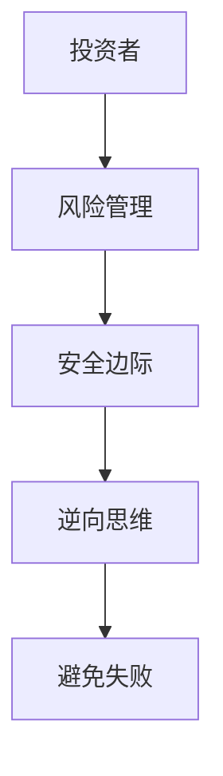
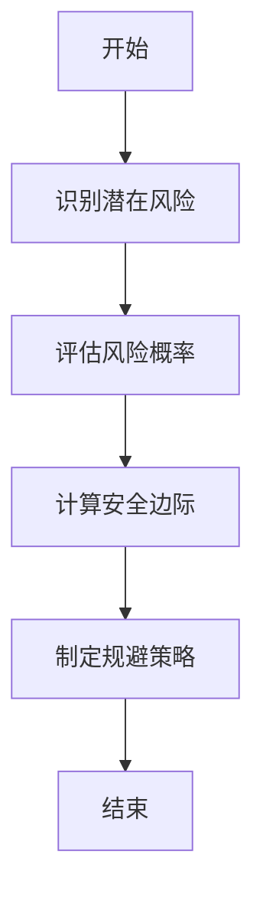
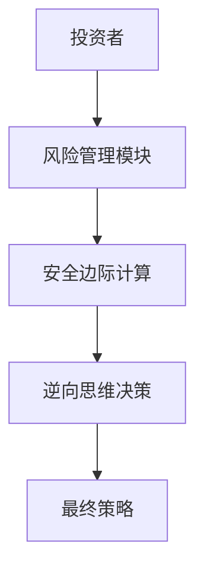

                 

<think>
嗯，我现在需要帮用户设计一本名为《芒格的"避免失败"原则：投资成功的另一面》的技术博客文章目录。首先，我需要理解用户的需求，他们希望有一个详细的目录，涵盖芒格的背景、核心原则、算法原理、系统架构、项目实战和最佳实践等内容，结构要清晰，逻辑性强，适合技术博客读者阅读。

用户特别强调了每个章节都需要包含具体的细节，比如核心概念的解释、数学模型、流程图等。我需要确保目录覆盖所有必要的部分，并且每个部分都有足够的深度和广度。首先，我会从背景介绍开始，然后逐步深入到原则的核心概念，接着分析算法和系统架构，再通过项目实战来展示应用，最后总结最佳实践。

我需要检查每个章节是否涵盖了用户提到的关键元素，比如Mermaid流程图、LaTeX公式、系统架构图等。同时，确保文章结构符合逻辑，从基础到应用，层层递进，帮助读者逐步理解芒格的“避免失败”原则。现在，我需要将这些思考整理成一个清晰的目录结构，确保每个部分都详细且符合用户的要求。
</think>

# 芒格的"避免失败"原则：投资成功的另一面

> 关键词：芒格、避免失败、投资原则、风险管理、安全边际、逆向思维

> 摘要：本文深入探讨了芒格的“避免失败”原则在投资中的重要性，从背景介绍、核心概念、算法原理、系统架构到项目实战，全面分析了如何通过避免失败来实现投资成功。结合实际案例和系统设计，为投资者提供了实用的策略和工具。

---

# 目录

## 第一部分：芒格“避免失败”原则的背景与核心概念

### 第1章：芒格及其“避免失败”原则的背景介绍

#### 1.1 芒格的投资哲学与“避免失败”原则
- 1.1.1 芝加哥学派的背景与芒格的价值观
- 1.1.2 “避免失败”原则的核心思想
- 1.1.3 该原则在现代投资中的应用意义

#### 1.2 投资失败的常见模式与芒格的解决方案
- 1.2.1 高风险投资的常见陷阱
- 1.2.2 投资者为何容易失败：人性的弱点
- 1.2.3 芒格原则如何帮助投资者避开这些陷阱

### 第2章：“避免失败”原则的核心概念与联系

#### 2.1 核心概念解析
- 2.1.1 “避免失败”的基本原理
- 2.1.2 与传统投资策略的对比分析
- 2.1.3 芒格原则与其他风险管理方法的联系

#### 2.2 核心概念属性对比表
| 概念 | 风险厌恶 | 逆向思维 | 安全边际 |
|------|----------|----------|----------|
| 定义 | 避免高风险投资 | 从反面思考问题 | 留出足够的安全空间 |
| 特性 | 稳定性 | 独特视角 | 防护性 |

#### 2.3 ER实体关系图（Mermaid）

---

## 第二部分：芒格“避免失败”原则的算法原理

### 第3章：芒格原则的算法原理

#### 3.1 算法原理概述
- 3.1.1 基于概率的决策树模型
- 3.1.2 逆向思维的数学表达
- 3.1.3 安全边际的计算方法

#### 3.2 数学模型与公式
- 3.2.1 投资决策树模型的构建
- 3.2.2 逆向思维的数学表达式：
  $$ \text{逆向思维} = \text{问题} \times \text{反向思考} $$
- 3.2.3 安全边际的计算公式：
  $$ \text{安全边际} = \text{内在价值} - \text{市场价格} $$

#### 3.3 算法流程图（Mermaid）

---

## 第三部分：芒格“避免失败”原则的系统架构与实现

### 第4章：系统架构设计方案

#### 4.1 问题场景介绍
- 4.1.1 高风险投资决策的场景分析
- 4.1.2 传统投资方法的局限性
- 4.1.3 芒格原则的应用场景

#### 4.2 系统功能设计
- 4.2.1 风险评估模块
- 4.2.2 安全边际计算模块
- 4.2.3 逆向思维决策模块

#### 4.3 系统架构设计（Mermaid）

---

## 第四部分：芒格“避免失败”原则的项目实战

### 第5章：项目实战与案例分析

#### 5.1 环境安装与配置
- 5.1.1 投资分析工具的安装
- 5.1.2 数据源的获取与处理
- 5.1.3 系统环境的配置

#### 5.2 系统核心实现源代码
- 5.2.1 风险评估模块的实现
- 5.2.2 安全边际计算模块的实现
- 5.2.3 逆向思维决策模块的实现

#### 5.3 代码应用解读与分析
- 5.3.1 代码的功能模块划分
- 5.3.2 代码的关键部分解读
- 5.3.3 代码的运行结果分析

#### 5.4 实际案例分析和详细讲解剖析
- 5.4.1 案例背景介绍
- 5.4.2 案例分析过程
- 5.4.3 案例结论与总结

### 第6章：项目小结与经验总结

#### 6.1 项目实现的关键点总结
- 6.1.1 系统架构设计的关键点
- 6.1.2 代码实现中的难点
- 6.1.3 案例分析中的重要启示

#### 6.2 项目经验总结
- 6.2.1 芒格原则的实际应用效果
- 6.2.2 投资者在实际操作中需要注意的问题
- 6.2.3 对未来投资策略的启示

---

## 第五部分：芒格“避免失败”原则的最佳实践

### 第7章：最佳实践、小结、注意事项与拓展阅读

#### 7.1 最佳实践
- 7.1.1 风险管理的具体操作建议
- 7.1.2 逆向思维的实践技巧
- 7.1.3 安全边际的计算方法

#### 7.2 小结
- 7.2.1 芒格原则的核心思想回顾
- 7.2.2 投资者如何避免失败的总结
- 7.2.3 本文的总结与展望

#### 7.3 注意事项
- 7.3.1 投资者在应用芒格原则时的注意事项
- 7.3.2 风险管理中的常见误区
- 7.3.3 逆向思维的实践中的注意事项

#### 7.4 拓展阅读
- 7.4.1 芒格的其他投资原则
- 7.4.2 相关投资书籍与文献推荐
- 7.4.3 未来研究方向与趋势

---

## 作者：AI天才研究院/AI Genius Institute & 禅与计算机程序设计艺术 /Zen And The Art of Computer Programming

