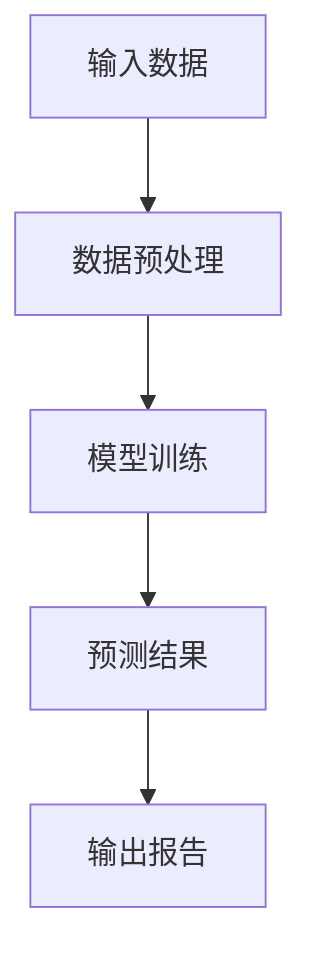

                 

<think>
好的，我需要为这本书设计一个详细的目录大纲，确保每个部分都涵盖必要的内容，包括理论、方法、应用和实战。首先，引言部分要介绍芒格的“避免极端预测”思想及其在技术预测中的重要性。接下来，理论基础部分详细解释芒格的理论，包括其核心概念和与其他预测方法的对比。然后，方法论部分探讨如何将这一理论应用于技术预测，包括分析框架和工具。实际应用部分通过具体的技术案例，如人工智能和区块链，展示如何应用这些方法。系统分析与架构设计部分使用Mermaid图展示系统的结构和流程。项目实战部分选择一个具体的技术，如人工智能，详细讲解预测过程和代码实现。最后，总结部分回顾内容，并展望未来。这个过程需要确保每个章节内容详实，结构清晰，帮助读者全面理解并应用芒格的预测方法。

# 目录大纲：《芒格的"避免极端预测"在新兴技术市场预测中的应用》

---

## 第一部分：芒格的“避免极端预测”理论基础

### 第1章：芒格的“避免极端预测”概述

#### 1.1 芒格的“避免极端预测”思想
- **1.1.1 芒格的生平简介**
  - 介绍芒格的基本背景和主要贡献。
- **1.1.2 芒格的“避免极端预测”的核心理念**
  - 解释“避免极端预测”的核心思想，包括其在投资决策中的应用。
- **1.1.3 芒格思想在投资决策中的应用**
  - 通过具体案例说明芒格方法在投资中的成功应用。

#### 1.2 芒格预测理论的核心要素
- **1.2.1 预测的不确定性**
  - 分析预测过程中的不确定性来源。
- **1.2.2 极端预测的定义与特征**
  - 明确极端预测的定义，并列举其主要特征。
- **1.2.3 避免极端预测的必要性**
  - 讨论避免极端预测在决策中的重要性。

---

## 第二部分：新兴技术市场预测的背景与挑战

### 第2章：新兴技术市场的预测需求

#### 2.1 新兴技术市场的特点
- **2.1.1 技术创新的快速迭代**
  - 描述新兴技术市场的快速变化和技术更新。
- **2.1.2 市场需求的不确定性**
  - 分析市场需求在新兴技术中的不确定性和波动性。
- **2.1.3 竞争环境的复杂性**
  - 探讨新兴技术市场中的激烈竞争和复杂环境。

#### 2.2 市场预测中的常见问题
- **2.2.1 数据的不充分性**
  - 讨论数据获取和处理中的困难。
- **2.2.2 模型的局限性**
  - 分析现有预测模型在新兴技术市场中的局限性。
- **2.2.3 人为判断的偏差**
  - 探讨预测过程中的人为因素和认知偏差。

---

## 第三部分：芒格预测理论在技术预测中的应用

### 第3章：芒格预测理论的核心方法

#### 3.1 避免极端预测的策略
- **3.1.1 基于概率的预测方法**
  - 介绍概率论在预测中的应用。
- **3.1.2 风险管理与预测调整**
  - 讨论如何通过风险管理调整预测结果。
- **3.1.3 预测结果的动态调整**
  - 探讨预测过程中的动态调整机制。

#### 3.2 技术预测中的关键因素分析
- **3.2.1 技术可行性评估**
  - 分析技术的可行性和成熟度。
- **3.2.2 市场接受度分析**
  - 探讨市场需求和技术接受度之间的关系。
- **3.2.3 竞争环境的评估**
  - 评估竞争环境对技术预测的影响。

---

## 第四部分：系统分析与架构设计

### 第4章：新兴技术市场的预测系统架构

#### 4.1 系统架构设计
- **4.1.1 系统功能模块划分**
  - 明确系统的各个功能模块。
- **4.1.2 数据流与信息处理流程**
  - 描述数据从输入到输出的处理流程。
- **4.1.3 系统输入与输出设计**
  - 定义系统的输入数据和输出结果。

#### 4.2 系统架构的Mermaid图


---

## 第五部分：项目实战与案例分析

### 第5章：人工智能市场的预测案例

#### 5.1 人工智能市场预测的背景
- **5.1.1 人工智能技术的现状**
  - 描述人工智能技术的当前发展水平。
- **5.1.2 市场预测的需求**
  - 分析人工智能市场预测的必要性和挑战。

#### 5.2 人工智能市场的预测模型

##### 5.2.1 概率模型的构建
- **模型设计**
  - 介绍概率模型的设计思路和方法。
- **数据准备**
  - 描述数据的收集、清洗和预处理过程。
- **模型训练**
  - 详细讲解模型的训练过程和参数调整。

##### 5.2.2 模型的验证与优化
- **验证过程**
  - 讨论如何验证模型的准确性和可靠性。
- **优化方法**
  - 探讨模型优化的策略和技巧。

#### 5.3 人工智能市场预测的实战代码

##### 5.3.1 环境配置
- **安装必要的库**
  - 列出所需的Python库及其版本要求。
- **数据集准备**
  - 描述数据集的来源和格式。

##### 5.3.2 代码实现
```python
import pandas as pd
from sklearn.model_selection import train_test_split
from sklearn.ensemble import RandomForestRegressor
from sklearn.metrics import mean_squared_error

# 数据加载
data = pd.read_csv('AI_markets.csv')

# 数据预处理
X = data.drop('target', axis=1)
y = data['target']

# 数据分割
X_train, X_test, y_train, y_test = train_test_split(X, y, test_size=0.2, random_state=42)

# 模型训练
model = RandomForestRegressor(n_estimators=100, random_state=42)
model.fit(X_train, y_train)

# 模型预测
y_pred = model.predict(X_test)

# 模型评估
mse = mean_squared_error(y_test, y_pred)
print(f'Mean Squared Error: {mse}')
```

##### 5.3.3 代码解读与分析
- **代码功能模块**
  - 介绍代码的各个部分及其功能。
- **模型解释**
  - 解释随机森林回归模型的工作原理。
- **结果分析**
  - 分析预测结果的准确性和误差来源。

#### 5.4 案例分析与小结

##### 5.4.1 案例分析
- **预测结果解读**
  - 解释预测结果的实际意义。
- **预测结果的稳健性分析**
  - 讨论预测结果的稳健性和可靠性。

##### 5.4.2 小结
- **经验总结**
  - 总结在应用芒格预测理论过程中的经验教训。
- **改进建议**
  - 提出进一步优化预测模型的建议。

---

## 第六部分：总结与展望

### 第6章：总结与未来展望

#### 6.1 全书总结
- **核心内容回顾**
  - 总结全书的核心内容和主要观点。
- **芒格预测理论的优势**
  - 强调芒格预测理论在技术市场预测中的优势和适用性。

#### 6.2 未来展望
- **技术预测的发展趋势**
  - 探讨技术预测领域的发展趋势和新技术的应用。
- **芒格预测理论的未来发展**
  - 展望芒格预测理论在技术预测中的进一步应用和发展。

---

## 附录：参考文献与工具

- **参考文献**
  - 列出书中的主要参考文献和资料来源。
- **工具与资源**
  - 推荐相关的工具、平台和资源，帮助读者进一步学习和实践。

---

## 作者信息

作者：AI天才研究院/AI Genius Institute & 禅与计算机程序设计艺术 /Zen And The Art of Computer Programming

---

通过以上目录大纲，我们可以清晰地看到，文章将从芒格的预测理论出发，逐步展开其在新兴技术市场中的应用，结合实际案例和系统架构设计，为读者提供一个全面而深入的视角。

