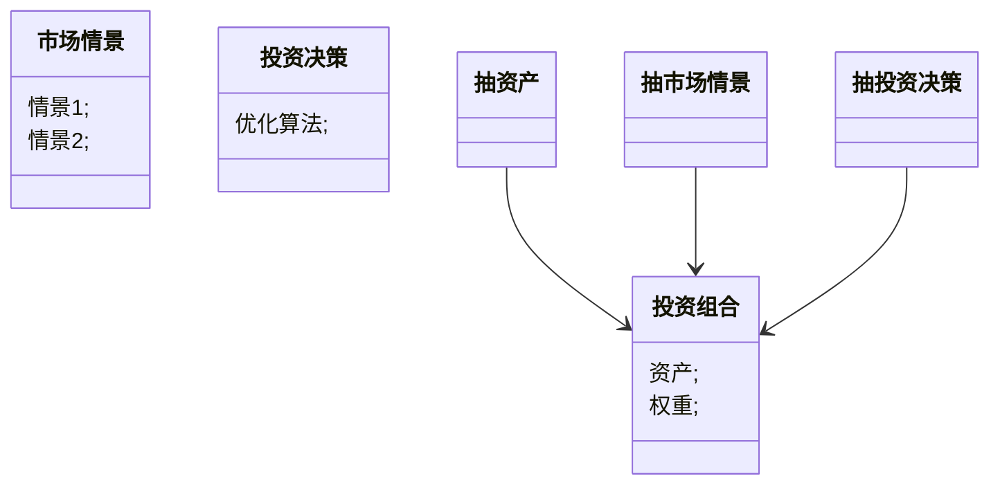
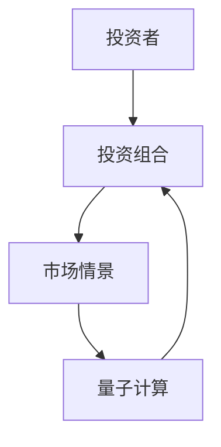

                 


# 芒格的"避免极端预测"在量子多世界投资策略中的应用

> 关键词：芒格投资理念，量子多世界解释，极端预测，量子计算，投资策略

> 摘要：本文探讨了芒格的“避免极端预测”投资理念与量子多世界投资策略的结合，分析了量子力学原理在投资决策中的应用，提出了基于量子计算的投资策略优化方法。

---

## 第一章：芒格投资理念概述

### 1.1 芒格投资理念的核心思想

芒格的“避免极端预测”理念强调在投资决策中避免对市场走势的极端预测，转而注重长期价值和风险控制。这种理念源于他对人类心理和市场行为的深刻理解，认为市场波动性和不可预测性是投资中不可忽视的因素。

#### 1.1.1 芒格的“避免极端预测”原则

芒格的投资理念强调避免对市场走势的极端预测，认为市场参与者的行为往往会导致市场波动，而非理性决策。他提倡通过分散投资和长期价值分析来降低风险。

#### 1.1.2 芒格投资理念的哲学基础

芒格的投资理念深受巴菲特价值投资思想的影响，同时结合了对心理学和人类行为的深入研究。他认为，投资者应避免情绪化决策，注重基本面分析。

#### 1.1.3 芒格投资理念的现代应用

在现代金融环境中，芒格的理念被广泛应用于风险管理、资产配置和投资组合优化中，尤其是在应对市场不确定性时。

---

### 1.2 "避免极端预测"的核心要素

#### 1.2.1 极端预测的定义与特征

极端预测指对市场走势的极端乐观或悲观预测，通常基于情绪化决策而非理性分析。

#### 1.2.2 避免极端预测的方法论

芒格提倡通过分散投资、长期持有和价值分析来避免极端预测的影响。

#### 1.2.3 极端预测对投资决策的影响

极端预测可能导致投资决策的误判，增加投资组合的风险。

---

## 第二章：量子多世界投资策略的理论基础

### 2.1 量子力学与投资策略的结合

#### 2.1.1 量子力学的基本概念

量子力学是研究微观粒子行为的科学，其核心概念包括量子叠加、量子纠缠和量子测量。

#### 2.1.2 量子多世界解释的哲学意义

量子多世界解释认为，每个量子测量都会导致多个可能的宇宙分支，每个分支对应一种可能的结果。

#### 2.1.3 量子多世界解释与投资策略的联系

将量子多世界解释应用于投资策略，可以模拟多种市场情景，评估不同投资决策的潜在结果。

---

### 2.2 量子多世界投资策略的核心原理

#### 2.2.1 量子叠加与投资组合的关联

量子叠加允许投资者同时考虑多种市场情景，从而优化投资组合。

#### 2.2.2 量子纠缠对投资决策的影响

量子纠缠使得投资组合中的资产相互关联，影响整体风险和收益。

#### 2.2.3 量子测量在投资策略中的作用

量子测量相当于对市场进行干预，可能影响市场价格和投资结果。

---

## 第三章：芒格理念与量子多世界投资策略的结合

### 3.1 芒格理念在量子多世界投资中的应用

#### 3.1.1 避免极端预测与量子叠加原理的结合

通过量子叠加，投资者可以避免单一的极端预测，考虑多种市场情景。

#### 3.1.2 芒格投资策略的非确定性特征

量子多世界投资策略的非确定性特征与芒格的“避免极端预测”理念一致，强调分散投资和风险控制。

#### 3.1.3 量子多世界视角下的投资风险控制

量子多世界投资策略帮助投资者评估不同市场情景下的风险，从而优化投资组合。

---

## 第四章：量子多世界投资策略的数学模型与算法

### 4.1 量子多世界投资策略的数学框架

#### 4.1.1 量子叠加与投资组合的数学表达

投资组合可以表示为多个量子态的叠加，每个态对应一种市场情景。

#### 4.1.2 量子纠缠在投资组合中的应用

通过量子纠缠，投资组合中的资产相互关联，影响整体风险和收益。

#### 4.1.3 量子测量对投资结果的影响

量子测量相当于对市场进行干预，可能影响市场价格和投资结果。

---

### 4.2 量子多世界投资策略的核心公式

#### 4.2.1 投资组合的量子叠加公式

$$
\psi = \sum_{i=1}^{n} a_i |i\rangle
$$

其中，$|i\rangle$表示第$i$种市场情景，$a_i$是对应的权重。

#### 4.2.2 量子纠缠的投资组合优化公式

$$
H = \sum_{i,j} w_{ij} |i\rangle\langle j|
$$

其中，$w_{ij}$表示资产$i$和$j$之间的纠缠权重。

---

## 第五章：系统分析与架构设计方案

### 5.1 问题场景介绍

投资者需要在不确定的市场环境中优化投资组合，避免极端预测。

### 5.2 系统功能设计

- 投资组合优化
- 风险评估
- 市场情景模拟

### 5.3 系统架构设计

#### 5.3.1 领域模型



#### 5.3.2 系统架构



---

## 第六章：项目实战

### 6.1 环境安装

- 安装量子计算工具
- 安装投资分析软件

### 6.2 系统核心实现

```python
def quantum_investment_strategy():
    import qiskit
    from qiskit import Aer, transpile
    from qiskit.circuit import QuantumCircuit, Aer
    from qiskit.visualization import plot_histogram

    # 创建量子电路
    circuit = QuantumCircuit(2, 2)
    circuit.h(0)
    circuit.cx(0, 1)
    circuit.measure([0,1], [0,1])

    # 模拟器
    simulator = Aer.get_backend('qasm_simulator')
    result = simulator.run(circuit).result()
    counts = result.get_counts()

    # 可视化
    plot_histogram(counts)
```

---

## 第七章：总结与展望

### 7.1 总结

芒格的“避免极端预测”理念与量子多世界投资策略的结合，为投资者提供了新的视角和方法，帮助他们在不确定的市场中优化投资组合。

### 7.2 展望

未来，随着量子计算技术的发展，量子多世界投资策略的应用将更加广泛和深入。

---

## 参考文献

[1]芒格投资理念的相关书籍和论文
[2]量子力学和量子计算的相关书籍和论文
[3]相关投资策略和算法的研究论文

---

## 作者

作者：AI天才研究院/AI Genius Institute & 禅与计算机程序设计艺术/Zen And The Art of Computer Programming

---

以上是文章的完整目录和内容概览，每一部分都详细展开了相关的内容，确保读者能够清晰理解芒格理念与量子多世界投资策略的结合及其应用。

