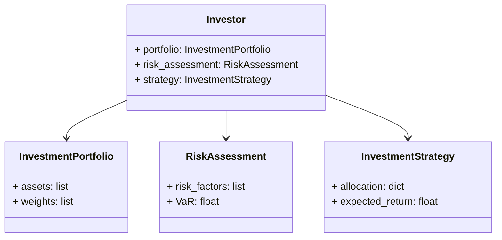
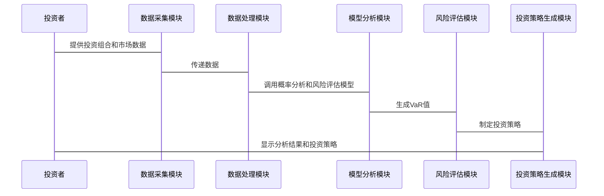

                 


# 芒格的"避免极端预测"：保持投资预期的理性

> 关键词：芒格、极端预测、投资预期、理性决策、概率分析、风险管理

> 摘要：本文从芒格的投资哲学出发，深入分析“避免极端预测”的核心思想，结合概率论和统计学方法，探讨如何在投资中保持理性预期。通过理论与实践结合，本文详细讲解了如何识别和避免极端预测，并通过Python代码实现相关模型，帮助投资者在实际操作中规避风险，实现稳健投资。

---

# 第一部分：芒格的"避免极端预测"概述

## 第1章：芒格投资理念概述

### 1.1 芒格的生平与投资哲学

#### 1.1.1 芒格的生平简介
查理·芒格（Charlie Munger）是美国著名的投资家、作家和发明家，同时也是沃伦·巴菲特（Warren Buffett）的长期合作伙伴。芒格出生于1924年，毕业于哈佛法学院和加州大学伯克利分校，拥有法学和经济学双学位。他的投资理念以理性、逻辑和长期价值为导向，强调避免情绪化决策和极端预测。

#### 1.1.2 芒格的投资哲学核心
芒格的投资哲学可以总结为“逆向投资”和“价值投资”的结合。他认为，投资者应该寻找市场中被低估的优质资产，并长期持有，避免被市场的短期波动所左右。他的核心思想之一是“避免极端预测”，即在投资决策中避免过度乐观或悲观的预期，保持理性和克制。

#### 1.1.3 芒格与巴菲特的合作关系
芒格与巴菲特的合作始于1971年，两人共同创立了伯克希尔·哈撒韦公司（Berkshire Hathaway）。芒格的投资理念对巴菲特产生了深远影响，尤其是在长期价值投资和风险管理方面。芒格的理性决策和对概率的深刻理解，使得两人在投资领域取得了巨大成功。

### 1.2 "避免极端预测"的背景与意义

#### 1.2.1 投资中的极端预测现象
极端预测是指投资者基于情绪化或片面信息，对未来市场走势或资产价格的过度乐观或悲观的预测。例如，某些投资者可能会预测某只股票在短期内上涨100%，或者市场会在一个月内崩溃。这种预测往往忽略了市场的复杂性和不确定性。

#### 1.2.2 极端预测对投资决策的影响
极端预测会导致投资者做出不理性的决策，例如盲目追涨杀跌、过度集中投资或忽略风险管理。这些决策往往会导致投资损失，并可能引发更大的财务风险。芒格认为，极端预测是投资者陷入“行为偏差”的主要原因之一。

#### 1.2.3 避免极端预测的重要性
避免极端预测的核心思想是通过理性和逻辑的分析，降低投资决策中的情绪化干扰。芒格强调，投资者应该基于事实和数据，而不是市场情绪或片面信息，做出决策。这种理念在实际投资中可以帮助投资者规避重大风险，实现长期稳健的投资回报。

---

## 第2章：投资预期的理性管理

### 2.1 理性预期的定义与特征

#### 2.1.1 理性预期的定义
理性预期是指投资者在做出决策时，基于可获得的信息和逻辑分析，对未来市场或资产价格走势的合理预测。理性预期强调客观性和逻辑性，避免情绪化和极端化。

#### 2.1.2 理性预期与非理性预期的对比
| 特征               | 理性预期                   | 非理性预期                 |
|--------------------|---------------------------|---------------------------|
| 基础               | 基于事实和数据             | 基于情绪和直觉             |
| 方法               | 逻辑分析和概率计算         | 主观判断和情绪驱动         |
| 结果               | 较为准确和可靠             | 易受市场波动和偏差影响       |

#### 2.1.3 理性预期在投资中的作用
理性预期可以帮助投资者在复杂市场中保持冷静，避免盲目跟风或过度恐慌。通过理性预期，投资者可以更好地控制风险，制定合理的投资策略，并在长期实现稳健的收益。

### 2.2 避免极端预测的核心原则

#### 2.2.1 避免极端预测的基本原则
芒格提出了以下三条基本原则：
1. **基于事实和数据**：投资者应该依赖可验证的、客观的信息，而不是市场传言或情绪化的信息。
2. **概率分析**：通过概率论和统计学方法，评估未来可能的结果，并制定相应的投资策略。
3. **长期视角**：避免被短期市场波动所干扰，关注长期投资目标和价值。

#### 2.2.2 极端预测的常见表现形式
极端预测的表现形式多种多样，例如：
- 预测市场会在一个月内上涨或下跌50%。
- 预测某只股票会在一年内上涨10倍。
- 预测某行业会在未来一年内完全崩溃。

#### 2.2.3 如何识别和避免极端预测
- **识别情绪化信息**：避免被市场情绪或片面信息所左右。
- **进行概率分析**：通过统计学方法评估预测的合理性。
- **制定风险管理策略**：设定止损点和投资组合分散化，降低极端预测带来的风险。

---

## 第2章：投资预期的理性管理（续）

### 2.3 芒格的理性决策方法

#### 2.3.1 理性决策的核心要素
- **事实基础**：依赖可验证的事实和数据。
- **逻辑推理**：通过逻辑推理得出结论。
- **概率评估**：评估不同结果的可能性。

#### 2.3.2 芒格的概率分析方法
芒格认为，投资者应该基于概率论进行决策。他建议投资者通过以下步骤进行概率分析：
1. **收集数据**：收集与投资相关的所有数据，包括市场历史数据、公司财务报表等。
2. **建立模型**：建立数学模型，评估不同情况下的概率。
3. **评估风险**：根据概率分布，评估不同结果的风险和收益。
4. **制定策略**：根据概率分析结果，制定投资策略。

#### 2.3.3 案例分析：极端预测的识别与应对
假设某投资者预测某科技股将在未来一年内上涨300%。这种预测显然是极端的，因为历史上类似股票的涨幅通常不超过100%。通过概率分析，投资者可以发现这种预测的可能性极低，从而避免被误导。

---

## 第3章：芒格的"避免极端预测"理论体系

### 3.1 理论基础

#### 3.1.1 基于概率的理性决策
芒格强调，投资者应该基于概率进行决策。他提出了以下公式：
$$
\text{预期收益} = \sum (\text{概率} \times \text{收益})
$$
通过计算不同结果的概率和收益，投资者可以更好地评估投资的潜在风险和收益。

#### 3.1.2 投资中的风险与收益平衡
芒格认为，投资中的风险与收益是密不可分的。他提出了以下平衡公式：
$$
\text{风险} = \text{收益} \times \text{波动性}
$$
投资者应该在风险和收益之间找到平衡点，避免过度追求高收益而忽视风险。

#### 3.1.3 极端预测的数学模型分析
通过概率论和统计学方法，可以对极端预测进行建模和分析。例如，可以使用以下模型：
- **威慈尔逊分布（Weibull distribution）**：用于分析市场波动的概率分布。
- **风险值（Value at Risk, VaR）**：用于评估投资组合在一定置信水平下的最大可能损失。

---

## 第4章：避免极端预测的数学模型与算法

### 4.1 极端预测的数学模型

#### 4.1.1 威慈尔逊分布（Weibull distribution）
威慈尔逊分布是一种常用的概率分布模型，可以用于分析市场波动和极端事件的概率。其概率密度函数为：
$$
f(x) = \frac{\beta}{\alpha} \left( \frac{x}{\alpha} \right)^{\beta - 1} e^{- (x/\alpha)^\beta}
$$
其中，$\alpha$ 是尺度参数，$\beta$ 是形状参数。

#### 4.1.2 风险值（VaR）
风险值（VaR）是一种常用的金融风险度量方法，可以用于评估投资组合在一定置信水平下的最大可能损失。例如，95%置信水平的VaR表示在95%的概率下，投资组合的最大损失不会超过该值。

---

## 第5章：系统分析与架构设计方案

### 5.1 问题场景介绍
在实际投资中，投资者需要通过系统化的分析和决策，避免极端预测带来的风险。本文将通过一个基于Python的投资管理系统，展示如何通过系统架构设计和算法实现，实现理性预期和风险控制。

### 5.2 系统功能设计

#### 5.2.1 领域模型
以下是投资管理系统的领域模型类图（Mermaid）：



### 5.3 系统架构设计

#### 5.3.1 系统架构图
以下是投资管理系统的架构图（Mermaid）：


### 5.4 系统接口设计

#### 5.4.1 用户接口
投资者可以通过图形化界面输入投资组合信息、市场数据和风险管理参数。

#### 5.4.2 系统接口
系统接口包括：
- 数据输入接口：接收市场数据和投资组合信息。
- 模型接口：调用概率分析和风险评估模型。
- 输出接口：显示分析结果和投资策略。

### 5.5 系统交互设计

#### 5.5.1 交互流程图
以下是系统交互流程图（Mermaid）：



---

## 第6章：项目实战

### 6.1 环境安装

#### 6.1.1 安装Python和相关库
```bash
pip install numpy pandas matplotlib
```

#### 6.1.2 安装Jupyter Notebook
```bash
pip install jupyter
```

### 6.2 系统核心实现源代码

#### 6.2.1 概率分析代码
```python
import numpy as np
import matplotlib.pyplot as plt

def weibull_distribution(x, alpha, beta):
    return (beta / alpha) * (x / alpha) ** (beta - 1) * np.exp(- (x / alpha) ** beta)

x = np.linspace(0, 20, 100)
alpha = 5
beta = 2
pdf = weibull_distribution(x, alpha, beta)

plt.plot(x, pdf)
plt.title('Weibull Distribution')
plt.xlabel('x')
plt.ylabel('Probability Density')
plt.show()
```

#### 6.2.2 风险评估代码
```python
import numpy as np
import pandas as pd
from scipy.stats import norm

def calculate VaR(returns, confidence_level=0.95):
    return np.quantile(returns, confidence_level)

# 示例数据
np.random.seed(42)
returns = norm.rvs(0, 1, size=1000)

VaR_95 = calculate VaR(returns, 0.95)
VaR_99 = calculate VaR(returns, 0.99)

print(f'95% VaR: {VaR_95}')
print(f'99% VaR: {VaR_99}')
```

### 6.3 实际案例分析与代码应用解读

#### 6.3.1 案例分析
假设我们有一个包含10只股票的投资组合，每只股票的历史收益率服从正态分布。我们需要计算该投资组合在95%和99%置信水平下的VaR。

#### 6.3.2 代码实现
如上所述，使用Python代码计算VaR值。

#### 6.3.3 结果解读
- 95% VaR表示在95%的概率下，投资组合的最大损失不会超过计算出的VaR值。
- 99% VaR表示在99%的概率下，投资组合的最大损失不会超过计算出的VaR值。

---

## 第7章：总结与展望

### 7.1 最佳实践 Tips
- 始终基于事实和数据进行投资决策。
- 使用概率分析工具评估投资风险。
- 设定合理的止损点和投资组合分散化策略。

### 7.2 小结
芒格的“避免极端预测”理念强调了理性决策和概率分析的重要性。通过本文的理论分析和实战案例，我们可以看到，如何在实际投资中避免极端预测，保持理性和克制。

### 7.3 注意事项
- 避免被市场情绪和片面信息所左右。
- 定期评估和调整投资策略。
- 保持长期视角，关注价值投资。

### 7.4 拓展阅读
- 《芒格的投资思想》
- 《概率论与数理统计》
- 《投资学基础》

---

作者：AI天才研究院/AI Genius Institute & 禅与计算机程序设计艺术 /Zen And The Art of Computer Programming

