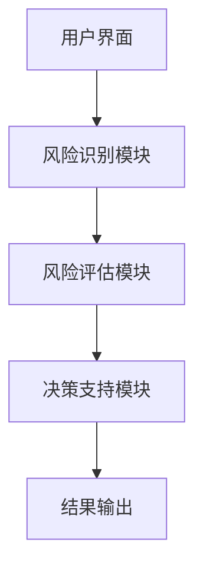

                 


#芒格的"避免首要否认"在前沿科技风险评估中的重要性

> 关键词：芒格、避免首要否认、前沿科技、风险评估、心理模型、决策逻辑、科技伦理

> 摘要：本文探讨了芒格的“避免首要否认”理论在前沿科技风险评估中的应用价值，通过结合心理学、风险管理与科技伦理，分析了该理论如何帮助科技从业者更全面地识别和应对潜在风险，构建更稳健的决策框架。

---

# 引言

在前沿科技快速发展的今天，风险评估已成为科技从业者和决策者不可忽视的重要课题。从人工智能的伦理争议到量子计算的技术不确定性，从生物技术的潜在风险到新材料的安全隐患，如何在复杂多变的技术环境中做出明智的决策，成为摆在我们面前的重要挑战。本文将结合芒格的“避免首要否认”理论，探讨这一心理学智慧在科技风险评估中的重要性。

---

## 第1章 芒格的"避免首要否认"理论概述

### 1.1 芒格的"避免首要否认"理论的起源与核心观点

芒格的“避免首要否认”理论是其“心理模型”思想的重要组成部分。这一理论强调在决策过程中，要避免过早地陷入“首要思维”，即在面对复杂问题时，不要过早地将注意力集中在某一单一因素上，而是要保持开放的思维，全面考虑多种可能性。

- **核心观点**：
  - 避免首要否认的核心在于“延迟判断”，通过全面分析不同的可能性，避免偏见和认知局限。
  - 在决策过程中，芒格强调要构建多元化的心理模型，这有助于避免单一维度的思维陷阱。

### 1.2 "避免首要否认"理论的哲学基础

芒格的理论深深植根于心理学和哲学的土壤之中，特别是行为决策理论和认知心理学。他提出，人类的认知过程往往受到潜意识偏见的影响，尤其是在面对复杂问题时，人们容易陷入“确认偏差”和“锚定效应”，导致决策失误。

- **心理学视角**：
  - 确认偏差：人们倾向于寻找支持自己已有假设的信息，忽略反面证据。
  - 锚定效应：人们在决策时容易受到第一个信息点的强烈影响。

---

## 第2章 前沿科技风险评估的背景与挑战

### 2.1 前沿科技发展的现状与趋势

当前，前沿科技的发展呈现出多领域交叉、技术迭代加速的特点。例如，人工智能技术的进步正在改变我们的生活方式，但同时也带来了数据隐私、算法偏见等新的伦理问题。同样，量子计算的突破性进展可能彻底改变密码学领域，但其潜在的国家安全风险也不容忽视。

- **主要领域**：
  - 人工智能与大数据：算法偏见、数据隐私、失业问题。
  - 区块链：去中心化带来的信任问题、技术安全漏洞。
  - 生物技术：基因编辑的伦理争议、生物安全风险。

### 2.2 前沿科技风险评估的核心问题

在前沿科技领域，风险评估的核心问题主要体现在以下几个方面：

- **技术风险**：技术本身的不确定性，例如算法的不可预测性、新材料的安全隐患。
- **市场风险**：市场需求的波动性，技术商业化过程中可能面临的市场接受度问题。
- **政策风险**：政策法规的变化可能对技术发展产生重大影响，例如数据隐私法规的出台。
- **伦理风险**：技术应用可能引发的伦理争议，例如AI在医疗中的应用引发的隐私问题。

### 2.3 前沿科技风险评估的挑战

- **技术复杂性**：前沿科技往往涉及复杂的系统和多学科交叉，导致风险评估的难度增大。
- **数据不足**：许多前沿技术尚处于探索阶段，缺乏足够的历史数据支持风险评估。
- **动态变化**：技术发展日新月异，风险因素也在不断变化，传统的静态评估方法难以应对。

---

## 第3章 "避免首要否认"理论在科技风险评估中的应用框架

### 3.1 "避免首要否认"的决策模型

芒格提出的“避免首要否认”决策模型是一种基于多维度分析的框架，旨在帮助决策者全面考虑各种可能性。

- **模型结构**：
  1. **问题定义**：明确风险评估的目标和范围。
  2. **构建心理模型**：从多个角度分析问题，构建多元化的认知框架。
  3. **评估可能性**：逐一分析各种可能的情境，评估其风险和影响。
  4. **优化决策**：根据评估结果，优化决策方案，制定应对策略。

- **关键步骤**：
  1. 明确问题：确定风险评估的具体目标和范围。
  2. 建立模型：构建包含多种可能性的心理模型。
  3. 评估影响：分析各种可能情景的风险和影响。
  4. 制定策略：根据评估结果，制定最优决策方案。

### 3.2 前沿科技风险评估中的"避免首要否认"应用

在前沿科技风险评估中，“避免首要否认”理论可以帮助决策者避免单一维度的思维陷阱，全面考虑技术、市场、政策和伦理等多个维度的风险因素。

- **具体应用**：
  - **技术层面**：评估技术的可行性和潜在风险。
  - **市场层面**：分析市场需求和竞争环境。
  - **政策层面**：预测政策变化对技术发展的影响。
  - **伦理层面**：评估技术应用可能引发的伦理争议。

---

## 第4章 前沿科技风险评估的系统分析与架构设计

### 4.1 系统功能设计

- **核心功能模块**：
  - 风险识别模块：识别潜在的风险因素。
  - 风险评估模块：评估风险的影响和概率。
  - 决策支持模块：提供优化决策的建议。

- **功能流程**：
  1. 风险识别：收集和整理潜在风险因素。
  2. 风险评估：分析风险的影响和概率。
  3. 决策支持：基于评估结果，优化决策方案。

### 4.2 系统架构设计

- **系统架构图**：



---

## 第5章 项目实战：基于"避免首要否认"的前沿科技风险评估系统开发

### 5.1 项目背景与目标

- **项目背景**：某科技公司计划开发一款人工智能辅助医疗诊断系统，需要进行全面的风险评估。
- **项目目标**：基于“避免首要否认”理论，构建一个风险评估系统，帮助公司识别和应对潜在风险。

### 5.2 系统核心实现

- **核心代码实现**：

```python
def risk_assessment(factor_list):
    # 输入：factor_list 包含多个风险因素
    # 输出：风险评估结果字典
    result = {}
    for factor in factor_list:
        # 分析每个因素的影响和概率
        impact = assess_impact(factor)
        probability = assess_probability(factor)
        result[factor] = (impact, probability)
    return result
```

- **算法实现**：
  1. 风险因素识别：通过问卷调查和专家访谈，收集潜在风险因素。
  2. 风险影响评估：采用层次分析法（AHP）评估每个因素的影响程度。
  3. 风险概率评估：基于历史数据和专家意见，评估每个因素的发生概率。
  4. 综合评估：计算每个因素的综合风险值，确定优先处理的风险因素。

---

## 第6章 总结与展望

### 6.1 总结

芒格的“避免首要否认”理论为我们提供了一种全新的视角，帮助我们在复杂多变的前沿科技领域做出更明智的决策。通过构建多元化的心理模型，我们可以更全面地识别和应对潜在风险，制定更稳健的决策方案。

### 6.2 展望

未来，随着科技的不断发展，“避免首要否认”理论在风险评估中的应用将更加广泛和深入。我们需要进一步研究该理论与其他风险管理方法的结合，探索更多创新性的应用方式，为科技从业者提供更有力的决策支持。

---

## 作者：AI天才研究院/AI Genius Institute & 禅与计算机程序设计艺术 /Zen And The Art of Computer Programming

---

## 最佳实践 Tips

- 在进行前沿科技风险评估时，建议结合“避免首要否认”理论，从多个维度全面分析潜在风险。
- 使用系统化的工具和方法，如层次分析法（AHP）和决策树模型，提高风险评估的科学性和准确性。
- 定期更新和优化风险评估模型，以适应技术发展和环境变化。

---

## 小结

通过本文的探讨，我们可以看到，“避免首要否认”理论为我们提供了一种全新的思维方式，帮助我们在复杂多变的科技环境中做出更明智的决策。这一理论不仅适用于个人决策，也为组织和企业的风险管理提供了重要的指导意义。未来，随着科技的不断发展，我们将继续探索更多创新性的应用方式，为科技从业者提供更有力的决策支持。

