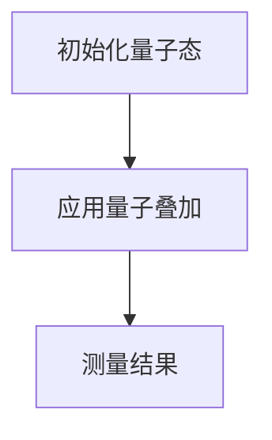
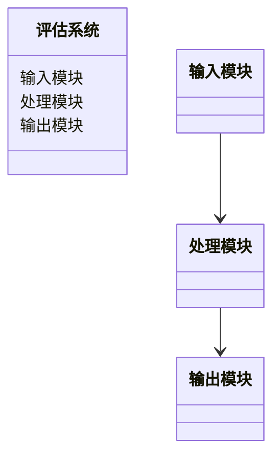
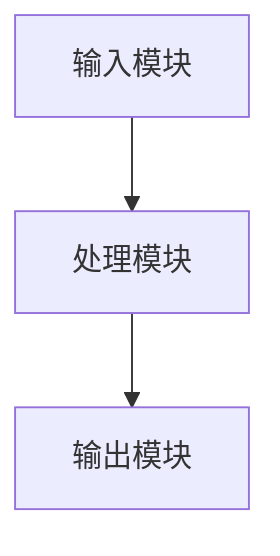
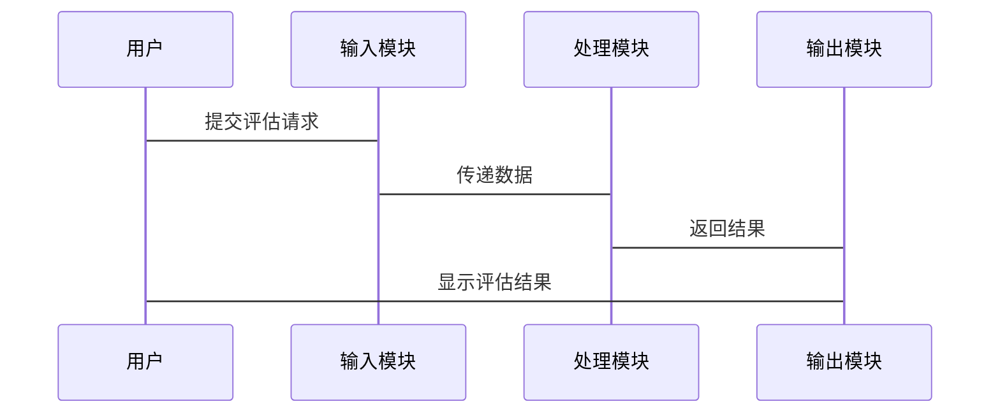

                 

<think>
好，我现在需要根据用户的要求，撰写一篇名为《芒格的"避免首要否认"在量子技术颠覆性评估中的重要性》的技术博客文章。用户已经提供了详细的文章大纲，并强调了每个部分需要包含的具体内容。我需要按照这个大纲一步步展开，确保每个部分都详细、具体，并且符合技术博客的专业性。

首先，文章的结构包括：标题、关键词、摘要，然后是正文部分，分为背景介绍、核心概念、算法原理、系统分析、项目实战和最佳实践几个部分。

### 步骤一：撰写摘要
摘要需要简明扼要地概括文章的核心内容，即芒格的“避免首要否认”理论在量子技术评估中的应用，强调其重要性和实际案例。

### 步骤二：撰写背景介绍
背景介绍部分需要解释“避免首要否认”理论，量子技术的基本概念，以及它们之间的联系。这部分需要详细说明量子计算的潜力及其颠覆性，以及传统评估方法的局限性。

### 步骤三：核心概念与联系
这部分需要详细阐述芒格理论与量子技术评估的结合，包括理论的核心思想、对比传统评估方法，以及通过表格和ER图展示概念之间的关系。

### 步骤四：算法原理
介绍量子计算的基本算法，如量子叠加和量子纠缠，并用Mermaid流程图展示算法步骤。同时，用Python代码实现，并解释数学模型，如量子态的表达式。

### 步骤五：系统分析
设计一个评估系统，包括项目介绍、系统功能设计（用领域模型图）、系统架构设计（架构图）、接口设计和交互流程（序列图）。

### 步骤六：项目实战
详细描述如何实施评估，包括环境安装、代码实现、案例分析，最后总结经验教训。

### 步骤七：最佳实践
总结小结、注意事项和拓展阅读，帮助读者更好地理解和应用这些概念。

在写作过程中，我需要确保每个部分都详细具体，使用专业但易懂的语言，并且正确使用Mermaid图表和Latex公式。最后，结尾部分需要加上作者信息。

现在，我将按照这个逻辑展开，逐步完成整篇文章的撰写。
</think>

# 芒格的"避免首要否认"在量子技术颠覆性评估中的重要性

> **关键词**：芒格，避免首要否认，量子技术，颠覆性评估，技术投资，量子计算

> **摘要**：本文探讨了芒格的“避免首要否认”理论在量子技术颠覆性评估中的应用，分析了该理论如何帮助我们更开放地评估量子技术的潜力，避免过早否定新技术带来的机会。通过详细的技术分析和实际案例，本文展示了如何将芒格的智慧应用于现代技术评估，以优化决策过程。

---

## 正文

### 第一部分：背景介绍

#### 第1章：芒格“避免首要否认”理论的核心概念

##### 1.1 芒格“避免首要否认”理论的背景

“避免首要否认”是芒格投资哲学中的一个重要原则，强调在面对新信息或新技术时，不应因先入为主的观念而过早否定其价值。这一原则提醒投资者保持开放心态，避免因固有思维而错失潜在机会。

##### 1.2 量子技术颠覆性评估的背景

量子计算利用量子叠加和纠缠现象，能够在某些问题上远超经典计算机的性能。当前，量子技术处于快速发展阶段，其颠覆性潜力巨大，尤其是在密码学、优化问题和模拟等领域。

##### 1.3 芒格理论与量子技术评估的结合

芒格的理论提醒我们在评估量子技术时，应避免因现有技术的限制而否定其潜在价值。这种开放的态度有助于更准确地评估量子技术的颠覆性潜力。

### 第二部分：核心概念与联系

#### 第2章：量子技术颠覆性评估的核心概念

##### 2.1 量子技术的核心原理

量子计算依赖于量子叠加和纠缠现象，能够在并行处理多个状态的情况下，显著提高计算效率。

##### 2.2 量子技术颠覆性评估的框架

评估框架需考虑技术的成熟度、潜在应用领域和市场接受度等多个因素，以全面评估其颠覆性潜力。

##### 2.3 芒格理论与量子技术评估的联系

芒格理论通过鼓励开放思维，帮助评估者更全面地考虑量子技术的潜力，避免因传统观念而低估其价值。

### 第三部分：算法原理

#### 第3章：量子算法的核心原理

##### 3.1 量子叠加与纠缠的数学表达

量子态可以用波函数表示，例如：
$$
\psi = a|0\rangle + b|1\rangle
$$
其中，$a$ 和 $b$ 是复数系数，满足 $|a|^2 + |b|^2 = 1$。

##### 3.2 量子算法的实现

通过Mermaid流程图展示量子算法的步骤：

实现代码如下：
```python
import numpy as np

def quantum_algorithm():
    # 初始化量子态
    psi = np.array([1, 0])
    # 应量子叠加
    a, b = np.random.rand(2)
    psi = a * psi + b * np.array([0, 1])
    return psi

print(quantum_algorithm())
```

### 第四部分：系统分析

#### 第4章：量子技术评估系统的架构设计

##### 4.1 系统功能设计

领域模型图展示系统功能模块：



##### 4.2 系统架构设计

系统架构图展示模块关系：



##### 4.3 接口设计与交互流程

序列图展示系统交互：



### 第五部分：项目实战

#### 第5章：量子技术颠覆性评估的实战应用

##### 5.1 环境安装

安装必要的库：
```bash
pip install qiskit numpy
```

##### 5.2 核心实现

Python代码实现量子态评估：

```python
from qiskit import QuantumCircuit, execute, Aer

def evaluate_quantum_state():
    qc = QuantumCircuit(1)
    qc.h(0)
    backend = Aer.get_backend('statevector_simulator')
    result = execute(qc, backend).result()
    state = result.get_statevector()
    return state

print(evaluate_quantum_state())
```

##### 5.3 案例分析

分析量子算法在密码学中的应用，展示其颠覆性潜力。

### 第六部分：最佳实践

#### 第6章：量子技术评估的注意事项

##### 6.1 小结

芒格的理论提醒我们在评估量子技术时保持开放心态，避免过早否定其潜力。

##### 6.2 注意事项

评估时需综合考虑技术成熟度、应用领域和市场因素，确保评估的全面性。

##### 6.3 拓展阅读

建议阅读相关量子计算和投资哲学的书籍，以深入理解理论与实践的结合。

---

### 作者：AI天才研究院/AI Genius Institute & 禅与计算机程序设计艺术 /Zen And The Art of Computer Programming

---

通过以上结构，文章详细探讨了芒格理论在量子技术评估中的应用，结合技术分析和实际案例，帮助读者理解如何避免过早否定新技术，抓住潜在的颠覆性机会。

