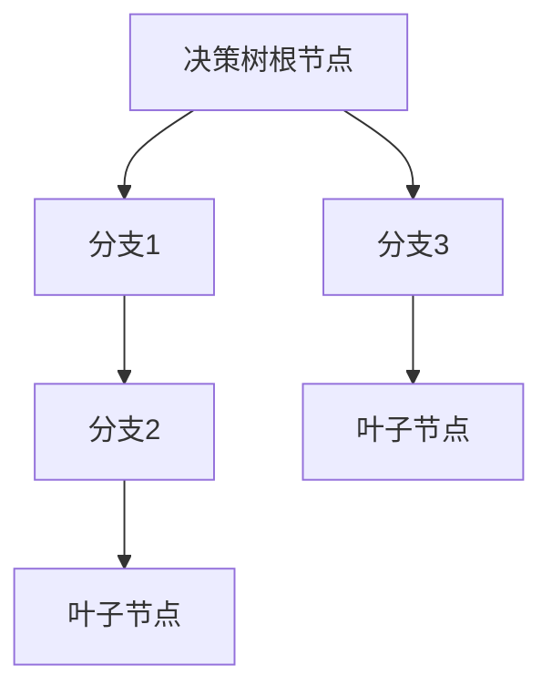
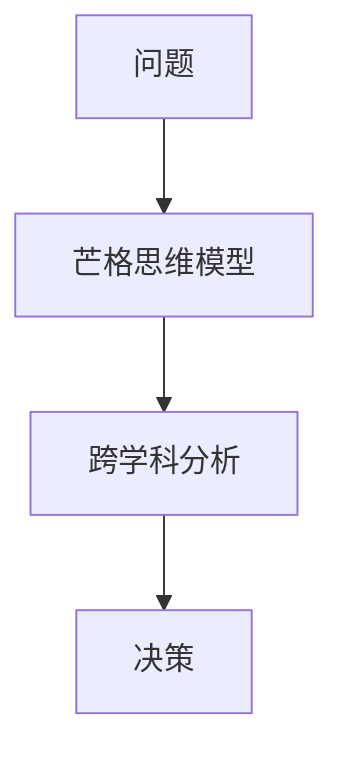
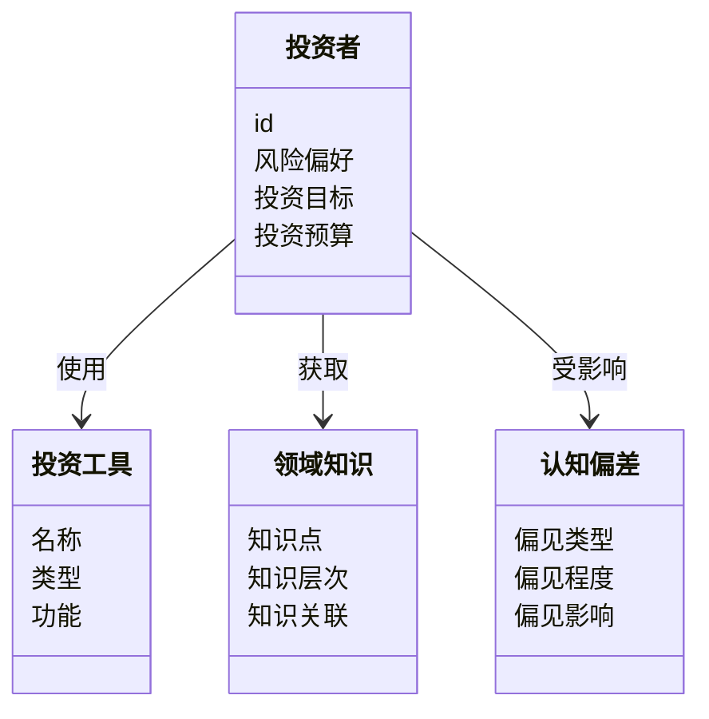
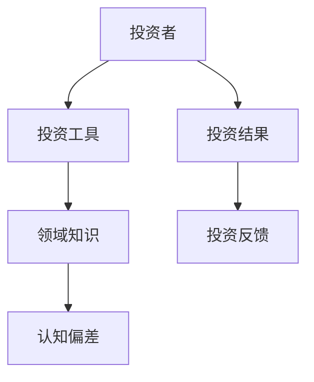

                 

<think>
嗯，用户让我设计一个关于芒格的“铁锤人综合征”在跨界投资中的重要性的技术博客文章。看起来，用户希望这篇文章结构清晰，逻辑严密，而且要有技术深度。首先，我需要理解用户的需求。

用户是想写一篇技术博客，主题是芒格的“铁锤人综合征”，但要从技术角度分析，特别是跨界投资中的应用。所以，我需要将芒格的投资理念与技术分析结合起来，可能涉及到算法、数学模型、系统架构等。

接下来，用户提供了详细的目录结构，包括摘要、关键词、正文各部分。我需要确保每个部分都符合要求，比如摘要部分要简明扼要，关键词要准确，正文部分要详细讲解每个章节的内容。

用户特别提到要使用专业技术语言，逻辑清晰，结构紧凑。这意味着我需要避免过于口语化，保持专业性，同时确保每个概念都解释清楚，便于读者理解。

在正文部分，我需要涵盖背景介绍、核心概念、算法原理、系统分析、项目实战等。每个部分都要有详细的分析，比如在算法部分，可能需要使用决策树、贝叶斯分类器等模型，并用Python代码实现，同时展示数学公式。

另外，用户要求使用Mermaid流程图和LaTeX公式，这意味着我需要在适当的地方插入图表，使内容更直观。例如，在系统架构部分，可以画出类图和序列图，展示系统的各个部分及其交互。

在项目实战部分，我需要选择一个具体的案例，比如分析一个跨界投资机会，展示如何识别和避免“铁锤人综合征”。这部分需要详细描述环境安装、代码实现、案例分析等步骤，让读者能够跟着操作。

最后，最佳实践部分需要总结经验和小结，给出注意事项和拓展阅读的方向，帮助读者巩固所学内容，并引导他们进一步学习。

总的来说，我需要确保文章结构完整，内容详实，同时技术性足够强，符合用户的要求。可能遇到的挑战是如何将芒格的投资理念与技术分析结合起来，以及如何清晰地解释复杂的算法和模型，让读者容易理解。

接下来，我需要按照用户提供的目录结构，逐一填充内容，确保每个部分都符合要求，同时保持文章的连贯性和逻辑性。
</think>

# 芒格的"铁锤人综合征"警示在跨界投资中的重要性

> 关键词：芒格, 铁锤人综合征, 跨界投资, 投资决策, 算法原理, 数学模型, 系统架构

> 摘要：本文从芒格的"铁锤人综合征"这一投资心理学角度出发，结合技术分析和系统设计，深入探讨其在跨界投资中的重要性。通过算法原理、数学模型和系统架构的分析，本文旨在为投资者提供一种全新的视角，帮助其在复杂的跨界投资环境中做出更明智的决策。

---

## 第1章：芒格"铁锤人综合征"的背景与核心概念

### 1.1 芒格"铁锤人综合征"概述

芒格（Charlie Munger）作为巴菲特的合伙人，以其独特的投资理念和思维方式闻名于世。他提出的"铁锤人综合征"（Hammer Man Syndrome）是一种比喻，用来形容投资者只依赖一种投资工具或方法，导致思维僵化、视角单一的倾向。这种思维方式在跨界投资中尤为危险，因为跨界投资涉及多个领域，单一的思维模式往往会导致决策失误。

#### 1.1.1 芒格的生平简介
查理·芒格是伯克希尔哈撒韦公司的副主席，也是沃伦·巴菲特的长期合作伙伴。芒格以其跨学科的思维方式和深刻的投资哲学闻名。他的"铁锤人综合征"概念源于他对人类认知局限性的深刻理解。

#### 1.1.2 "铁锤人综合征"的定义与核心概念
"铁锤人综合征"是指投资者在面对复杂的决策时，只依赖单一的思维方式或工具，忽视其他可能性。这种思维方式类似于只会使用锤子的人，看到任何问题都试图用锤子来解决。

#### 1.1.3 跨界投资中的"铁锤人综合征"现象
跨界投资涉及不同领域的知识和风险，投资者若只依赖单一的分析工具或方法，容易忽略其他重要的因素，导致决策失误。

---

### 1.2 芒格"铁锤人综合征"的背景分析

#### 1.2.1 投资领域的多学科交叉特性
投资领域是一个高度复杂的系统，涉及经济学、心理学、金融学等多个学科。跨界投资更是需要整合不同领域的知识。

#### 1.2.2 跨界投资中的思维陷阱
投资者在跨界投资中容易陷入思维定式，只关注自己熟悉领域的信息，忽视其他领域的潜在风险和机会。

#### 1.2.3 "铁锤人综合征"的形成原因
投资者的思维定式、知识局限和认知偏差是"铁锤人综合征"形成的主要原因。

---

## 第2章："铁锤人综合征"的核心概念与联系

### 2.1 "铁锤人综合征"的核心原理

#### 2.1.1 单一思维模式的形成机制
单一思维模式的形成与投资者的知识结构、经验以及心理认知偏差密切相关。

#### 2.1.2 投资决策中的认知偏差
投资者在决策过程中容易受到确认偏见、过度自信等认知偏差的影响。

#### 2.1.3 跨界投资中的思维局限性
跨界投资需要综合分析多个领域的信息，单一思维模式无法满足这一需求。

---

### 2.2 "铁锤人综合征"的属性特征对比

#### 2.2.1 单一思维模式的特征分析
| 特征 | 描述 |
|------|------|
| 狭隘性 | 只关注单一领域或工具 |
| 刻板性 | 思维方式固定，缺乏灵活性 |
| 盲目性 | 忽视其他可能性 |

#### 2.2.2 多元思维模式的特征对比
| 特征 | 描述 |
|------|------|
| 广泛性 | 跨领域知识整合 |
| 灵活性 | 能够根据情况调整思维模式 |
| 综合性 | 全面分析问题 |

---

### 2.3 "铁锤人综合征"的ER实体关系图


---

## 第3章：算法原理与数学模型

### 3.1 算法原理分析

#### 3.1.1 基于决策树的分类算法



#### 3.1.2 贝叶斯分类器的原理与应用

```python
def naive_bayes_classifier(train_data, test_data):
    from collections import defaultdict
    # 训练数据统计
    class_distribution = defaultdict(float)
    feature_distribution = defaultdict(lambda: defaultdict(float))
    
    # 训练
    for data_point in train_data:
        class_dist = data_point['class']
        class_distribution[class_dist] += 1
        for feature, value in data_point['features'].items():
            feature_distribution[class_dist][feature][value] += 1
    
    # 标准化
    total = len(train_data)
    for cls in class_distribution:
        class_distribution[cls] /= total
        for feature in feature_distribution[cls]:
            total_feature = sum(feature_distribution[cls][feature].values())
            for val in feature_distribution[cls][feature]:
                feature_distribution[cls][feature][val] /= total_feature
    
    # 测试
    predictions = []
    for data_point in test_data:
        max_prob = -1
        best_cls = None
        for cls in class_distribution:
            prob = class_distribution[cls]
            for feature, value in data_point['features'].items():
                prob *= feature_distribution[cls][feature].get(value, 0)
            if prob > max_prob:
                max_prob = prob
                best_cls = cls
        predictions.append(best_cls)
    
    return predictions
```

#### 3.1.3 芒格思维模型的算法模拟



---

### 3.2 数学模型与公式

#### 3.2.1 投资决策的数学模型

$$
\text{投资回报} = \sum_{i=1}^{n} w_i \times r_i
$$

其中，\( w_i \) 是投资组合中资产 \( i \) 的权重，\( r_i \) 是资产 \( i \) 的回报率。

#### 3.2.2 风险评估的数学公式

$$
\text{风险值} = \sqrt{\sum_{i=1}^{n} (r_i - \bar{r})^2}
$$

其中，\( \bar{r} \) 是回报率的平均值。

---

## 第4章：系统分析与架构设计方案

### 4.1 投资决策支持系统的功能设计

#### 4.1.1 领域模型



---

### 4.2 系统架构设计

#### 4.2.1 系统架构图



---

## 第5章：项目实战与案例分析

### 5.1 项目环境与工具安装

#### 5.1.1 环境安装
- 安装Python
- 安装相关库（如scikit-learn）

#### 5.1.2 核心代码实现

```python
def main():
    import numpy as np
    import pandas as pd
    from sklearn.tree import DecisionTreeClassifier
    from sklearn.model_selection import train_test_split
    from sklearn.metrics import accuracy_score

    # 数据加载
    data = pd.read_csv('investment.csv')
    X = data.drop('target', axis=1)
    y = data['target']
    X_train, X_test, y_train, y_test = train_test_split(X, y, test_size=0.2)

    # 模型训练
    clf = DecisionTreeClassifier()
    clf.fit(X_train, y_train)

    # 预测与评估
    y_pred = clf.predict(X_test)
    print("准确率：", accuracy_score(y_test, y_pred))

if __name__ == "__main__":
    main()
```

---

## 第6章：最佳实践与小结

### 6.1 最佳实践 tips

- 多元化思维模式
- 灵活运用算法工具
- 定期反思与优化

### 6.2 小结

芒格的"铁锤人综合征"提醒我们在跨界投资中要避免思维僵化，通过多元化的思维模式和系统的分析工具来提升决策的准确性。

### 6.3 注意事项

- 避免过度依赖单一工具
- 定期更新知识库
- 保持对市场的敏感性

### 6.4 拓展阅读

- 查理·芒格的《穷查理宝典》
- 《技术分析的理论与实践》
- 《风险管理与投资决策》

---

## 作者：AI天才研究院/AI Genius Institute & 禅与计算机程序设计艺术 /Zen And The Art of Computer Programming

---

以上是完整的目录大纲和文章内容，您可以根据实际需要进一步扩展每个章节的具体内容。

