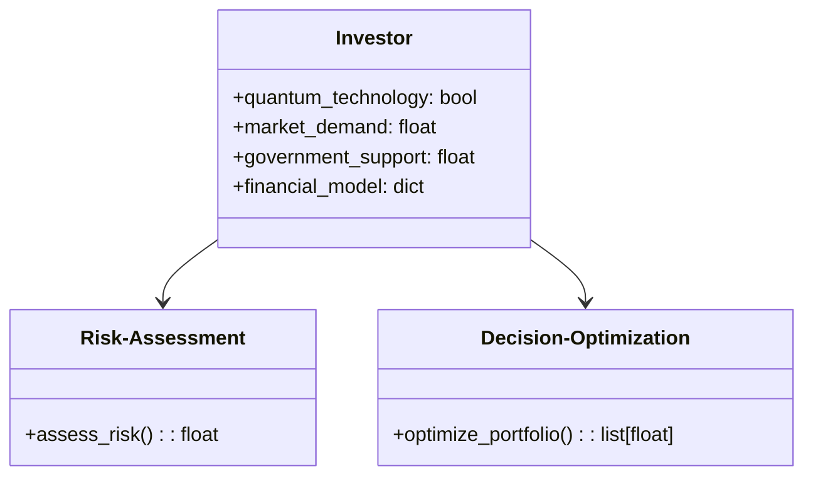
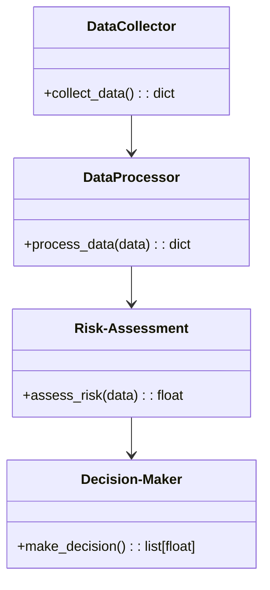

                 

<think>
嗯，用户希望我写一篇技术博客，标题是《芒格的"铁锤人综合征"警示在跨维度量子技术投资中的应用》。首先，我需要理解这个主题。芒格是投资专家，铁锤人综合征指只用一种工具解决问题，可能导致决策偏差。跨维度量子技术涉及多个维度的投资，可能包括量子计算、通信等。

我需要先确定文章的结构，用户已经提供了大纲，包括背景介绍、核心概念、算法原理、系统分析、项目实战、最佳实践等部分。我需要确保每个部分都详细展开，使用专业技术语言，同时保持逻辑清晰。

在背景介绍中，我需要解释芒格的生平、铁锤人综合征的定义，以及跨维度量子技术的基本概念。这部分帮助读者理解主题的重要性。

接下来是核心概念与联系，这里需要详细分析铁锤人综合征的原理，并将其与量子技术投资联系起来。可能需要使用表格和ER图来展示不同投资者的行为差异，这有助于读者直观理解。

算法原理部分，我需要用mermaid流程图展示风险评估模型和投资决策优化算法，并附上Python代码示例。这部分需要确保代码解释清楚，数学公式准确，比如概率分布和优化函数。

系统分析与架构设计部分，我需要描述投资场景，设计系统功能，如风险评估和决策优化模块。使用mermaid类图和架构图展示系统结构，说明接口和交互过程，帮助读者理解系统的运作。

项目实战部分，需要指导读者如何安装环境，实现核心功能，并分析实际案例。这部分需要具体，包括代码示例和案例分析，帮助读者实际应用所学知识。

最后，最佳实践部分，包括小结、注意事项和拓展阅读，帮助读者巩固知识，避免常见错误，并进一步学习。这部分需要总结全文，强调芒格的警示意义。

我可能遇到的挑战是如何将芒格的心理学分析与量子技术投资结合起来，这需要深入理解两者的关系，并找到合适的例子来说明。此外，代码部分需要简洁明了，帮助读者理解算法的应用。

总的来说，我需要按照用户的要求，将目录细化到三级，并确保每个部分都涵盖必要的内容，同时保持整体结构的逻辑性和连贯性。这样，读者才能全面理解芒格的铁锤人综合征如何影响量子技术投资，并学会如何避免这种偏差。
</think>

# 《芒格的"铁锤人综合征"警示在跨维度量子技术投资中的应用》

---

## 关键词：
芒格, 铁锤人综合征, 量子技术, 跨维度投资, 投资决策, 风险评估, 系统架构

---

## 摘要：
本文以芒格的“铁锤人综合征”为切入点，结合跨维度量子技术投资的实际场景，深入分析了投资者在面对复杂技术与市场环境时的认知偏差及其对投资决策的负面影响。通过数学模型、算法实现和系统架构的设计，提出了规避“铁锤人综合征”的方法论，帮助投资者在量子技术投资中避免过度简化问题的误区，从而做出更科学、理性的决策。

---

## 第1章: 背景介绍与问题描述

### 1.1 芒格的“铁锤人综合征”背景
芒格的“铁锤人综合征”是指投资者在面对复杂问题时，由于认知偏差和心理惯性，倾向于使用单一的思维方式或工具来解决所有问题。这种思维方式在投资领域中可能导致过度简化、误判风险和错失机会。

#### 1.1.1 芒格的生平与投资理念
查理·芒格是沃伦·巴菲特的长期合作伙伴，以他的“心智模型”理论闻名。他认为，投资者需要构建多元化的知识框架，避免单一思维的局限性。

#### 1.1.2 铁锤人综合征的定义与特征
铁锤人综合征的核心在于“用一把锤子解决所有问题”。在投资中，这表现为投资者过度依赖某一种分析工具或方法，忽视其他关键因素。

#### 1.1.3 跨维度量子技术投资的背景
量子技术（如量子计算、量子通信）涉及多个维度的技术突破和市场应用。跨维度投资意味着需要同时考虑技术、市场、政策等多个因素。

---

### 1.2 问题背景与挑战
#### 1.2.1 量子技术投资的复杂性
量子技术的投资周期长、技术门槛高，且涉及多个学科的交叉应用。投资者需要考虑技术可行性、市场需求、政策环境等多个维度。

#### 1.2.2 铁锤人综合征对量子技术投资的影响
投资者可能过于依赖某一种分析方法（如单一财务指标或技术参数），而忽视其他关键因素，导致投资决策失误。

#### 1.2.3 避免铁锤人综合征的必要性
通过构建多元化的分析框架，投资者可以更全面地评估量子技术的投资价值。

---

## 第2章: 铁锤人综合征的核心概念与数学模型

### 2.1 铁锤人综合征的核心原理
#### 2.1.1 投资者认知偏差的数学模型
投资者的认知偏差可以通过概率论和统计学模型进行描述。例如，过度依赖某一种指标可以看作是对概率分布的误判。

#### 2.1.2 铁锤人综合征的决策树分析
通过构建决策树，可以分析投资者在不同决策阶段的偏好和偏差。

#### 2.1.3 投资决策中的概率分布
$$ P(\text{投资成功}) = \sum_{i=1}^{n} p_i \times c_i $$
其中，$p_i$ 是成功概率，$c_i$ 是成功带来的收益。

---

### 2.2 跨维度量子技术投资的系统模型
#### 2.2.1 量子技术投资的多维分析框架
跨维度投资需要考虑技术维度（如量子计算的运算速度）、市场维度（如行业需求）、政策维度（如政府支持）等多个因素。

#### 2.2.2 跨维度投资的风险评估模型
$$ R = \sum_{i=1}^{n} w_i \times r_i $$
其中，$w_i$ 是各维度的风险权重，$r_i$ 是对应的风险值。

---

## 第3章: 铁锤人综合征与量子技术投资的关联

### 3.1 铁锤人综合征在量子技术投资中的表现
#### 3.1.1 量子技术投资中的认知偏差
投资者可能过于关注某一项技术指标（如量子比特的数量），而忽视其他关键因素（如技术实现的难度）。

#### 3.1.2 铁锤人综合征对投资决策的影响
投资者可能过度依赖某一种分析工具（如财务模型），而忽视技术风险和市场风险。

#### 3.1.3 量子技术投资中的过度简化倾向
投资者可能将复杂的量子技术问题简化为某一个维度的分析，导致决策失误。

---

### 3.2 跨维度投资中的铁锤人综合征警示
#### 3.2.1 跨维度投资的复杂性与风险
量子技术涉及多个维度的技术突破和市场应用，投资者需要全面考虑各种风险因素。

#### 3.2.2 铁锤人综合征对跨领域投资的启示
投资者需要构建多元化的分析框架，避免过度依赖某一种工具或方法。

#### 3.2.3 量子技术投资中的多维度考量
通过构建多维度的分析模型，投资者可以更全面地评估量子技术的投资价值。

---

## 第4章: 铁锤人综合征的数学模型与算法实现

### 4.1 铁锤人综合征的风险评估模型
#### 4.1.1 风险评估的数学公式
$$ R = \sum_{i=1}^{n} p_i \times c_i $$
其中，$p_i$ 是风险发生的概率，$c_i$ 是对应的风险成本。

#### 4.1.2 风险评估的算法实现
```python
def risk_assessment(projects):
    risks = []
    for project in projects:
        risk = sum(p * c for p, c in zip(project['probabilities'], project['consequences']))
        risks.append(risk)
    return risks
```

---

### 4.2 跨维度投资决策优化算法
#### 4.2.1 投资决策优化的数学模型
$$ \text{Maximize} \quad \sum_{i=1}^{n} w_i \times v_i $$
$$ \text{Subject to} \quad \sum_{i=1}^{n} w_i = 1 $$

其中，$w_i$ 是投资权重，$v_i$ 是投资价值。

#### 4.2.2 投资决策优化的算法实现
```python
def optimize_portfolio(assets):
    import numpy as np
    from scipy.optimize import minimize

    # 定义目标函数
    def objective(weights):
        return -sum(w * v for w, v in zip(weights, assets['values']))

    # 定义约束条件
    constraints = [
        {'type': 'eq', 'fun': lambda w: sum(w) - 1},
        {'type': '>=', 'fun': lambda w: w}
    ]

    # 初始化权重向量
    n_assets = len(assets['values'])
    initial_guess = [1/n_assets] * n_assets

    # 求解优化问题
    result = minimize(objective, initial_guess, constraints=constraints)

    return result.x
```

---

## 第5章: 跨维度量子技术投资的系统分析与架构设计

### 5.1 投资场景介绍
跨维度量子技术投资涉及多个领域的复杂决策，需要构建一个多维度的分析系统。

#### 5.1.1 问题场景描述
投资者需要考虑技术可行性、市场需求、政策环境等多个维度，构建一个综合性的分析系统。

---

### 5.2 系统功能设计
#### 5.2.1 系统功能模块
- 风险评估模块
- 投资决策优化模块
- 多维度数据分析模块

#### 5.2.2 系统功能的领域模型


---

### 5.3 系统架构设计
#### 5.3.1 系统架构的模块化设计
- 数据采集模块
- 数据处理模块
- 数据分析模块
- 投资决策模块

#### 5.3.2 系统架构的类图展示


---

## 第6章: 项目实战与案例分析

### 6.1 项目实战
#### 6.1.1 环境安装
需要安装以下工具：
- Python 3.8+
- NumPy
- SciPy
- Matplotlib
- Mermaid

#### 6.1.2 核心功能实现
```python
import numpy as np
import matplotlib.pyplot as plt

def plot_quantum_trends(data):
    plt.figure(figsize=(10, 6))
    plt.plot(data['years'], data['quantum_adoption'], label='量子技术采用率')
    plt.plot(data['years'], data['market_growth'], label='市场增长率')
    plt.xlabel('年份')
    plt.ylabel('趋势')
    plt.title('量子技术投资趋势分析')
    plt.legend()
    plt.show()
```

---

### 6.2 案例分析
#### 6.2.1 投资决策优化的案例
假设投资者需要在两个量子技术项目中选择，分别计算它们的投资风险和回报。

#### 6.2.2 风险评估的案例
通过数学模型评估量子技术投资的风险，并提出优化建议。

---

## 第7章: 最佳实践与小结

### 7.1 最佳实践
#### 7.1.1 小结
通过构建多元化的分析框架，投资者可以避免“铁锤人综合征”的影响，做出更科学的投资决策。

#### 7.1.2 注意事项
- 避免过度依赖单一分析工具
- 全面考虑技术、市场和政策因素
- 定期更新分析模型

#### 7.1.3 拓展阅读
建议读者进一步学习量子技术的相关知识，以及芒格的其他投资理念。

---

## 作者：
作者：AI天才研究院/AI Genius Institute  
及 禅与计算机程序设计艺术/Zen And The Art of Computer Programming

