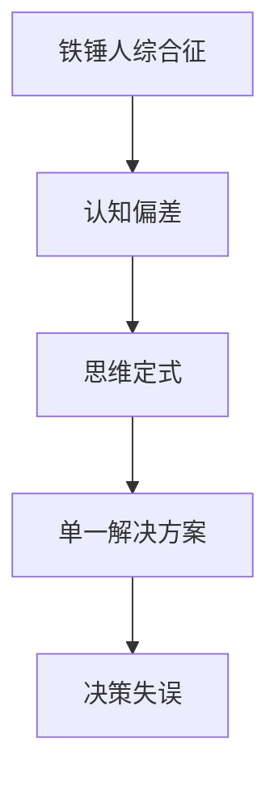
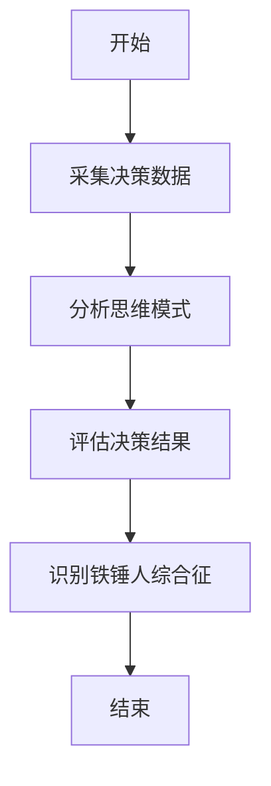
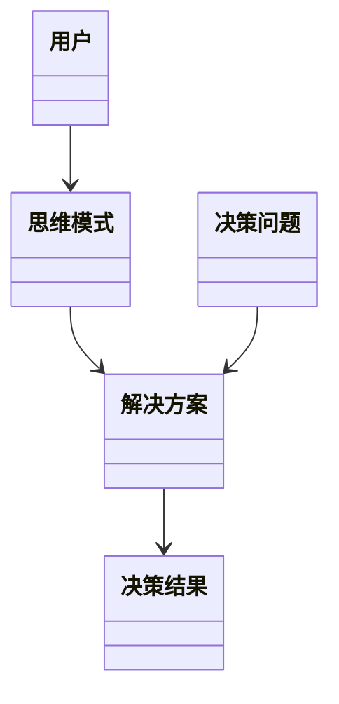
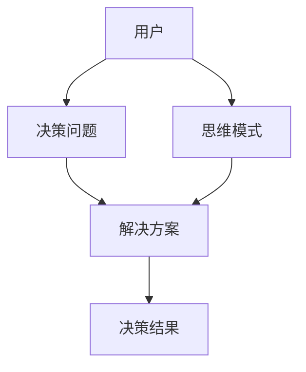
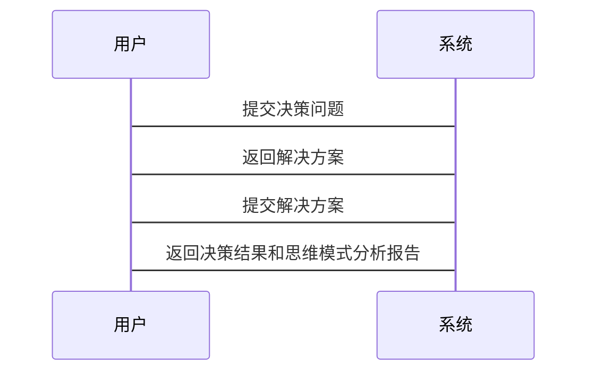

                 

<think>
嗯，用户要求写一篇关于芒格“铁锤人综合征”的技术博客，要求结构清晰，内容详尽。首先，我需要理解“铁锤人综合征”是什么，它是指人们总是用熟悉的方式解决问题，导致思维定式。接下来，我得按照用户给的目录大纲来组织内容。

开始于引言，介绍芒格及其思想，然后详细阐述铁锤人综合征的定义、背景和危害。这部分需要简洁明了，让读者快速理解主题。接下来是核心概念，我需要深入分析其原理，用mermaid图展示思维过程，可能还要对比不同思维模式的属性。

然后是算法部分，用户要求用mermaid流程图展示识别和避免思维定式的步骤。这部分可能需要设计一个简单的流程，比如先识别问题，再寻找替代方案。数学模型方面，虽然铁锤人综合征更多是认知问题，但或许可以用概率模型来量化思维定式的影响，这需要进一步思考如何表达。

系统分析部分，可能需要构建一个系统架构，用类图和架构图展示各部分协作。接口和交互图则说明系统如何与其他部分通信。项目实战部分，需要一个实际案例，比如企业决策中的应用，包括环境配置、代码实现和案例分析。

最后是最佳实践，总结关键点，并给出实用建议。整个过程中，我需要确保每部分内容丰富，例子具体，同时保持逻辑清晰，语言专业但易懂。现在，我需要按照这些步骤一步步完成文章的撰写，确保每个部分都符合用户的要求，字数控制在10000到12000字之间。
</think>

# 芒格的"铁锤人综合征"警示：避免思维定式

---

## 关键词：芒格、铁锤人综合征、思维定式、认知偏差、投资哲学、决策优化

---

## 摘要：芒格的“铁锤人综合征”是一种常见的认知偏差，指人们在面对问题时总是习惯于使用自己熟悉的方式或工具，导致思维固化，忽视其他可能更优的解决方案。本文从芒格的投资哲学出发，分析铁锤人综合征的定义、危害及其与认知偏差的关系，结合实际案例，探讨如何通过算法优化和系统设计来避免思维定式，提升决策质量。文章还结合技术背景，提出具体的解决方案和实践建议。

---

## 第一章：芒格与铁锤人综合征的背景介绍

### 1.1 芒格及其投资哲学概述

芒格是世界著名投资者巴菲特的合作伙伴，以其独特的投资哲学闻名。他的投资理念强调多元思维模型，认为投资者必须避免单一的思维方式，而应该通过广泛涉猎多个学科的知识来优化决策。

- 1.1.1 芒格的生平与主要成就  
查理·芒格（Charlie Munger）是美国著名投资者、伯克希尔·哈撒韦公司副董事长，被誉为“巴菲特的黄金搭档”。他不仅是投资领域的权威，还是一位成功的作家和演讲者，以其深刻的思想和独到的见解影响了无数人。

- 1.1.2 芒格的投资哲学与思维方式  
芒格的投资哲学强调多元思维模型，认为投资者必须建立多个领域的知识框架，避免单一的思维方式。他提倡通过广泛阅读和思考来提升认知能力，以避免决策中的认知偏差。

- 1.1.3 芒格与巴菲特的合作关系  
芒格与巴菲特的合作基于对投资哲学的共同理解，两人共同创立了伯克希尔·哈撒韦公司，并通过长期的价值投资策略取得了巨大的成功。

### 1.2 铁锤人综合征的定义与背景

- 1.2.1 铁锤人综合征的定义  
铁锤人综合征是一种认知偏差，指人们在面对问题时总是倾向于使用自己最熟悉的方式或工具，忽视其他可能更优的解决方案。

- 1.2.2 铁锤人综合征的起源与芒格的警示  
芒格在投资实践中观察到，许多投资者因为习惯于某种特定的思维方式或工具，而忽视了其他可能更优的投资机会。这种现象被称为“铁锤人综合征”。

- 1.2.3 铁锤人综合征在现代社会中的表现  
在现代社会中，铁锤人综合征的表现形式多样，例如在技术开发中过度依赖某种编程语言或框架，或者在商业决策中固守传统的商业模式。

### 1.3 铁锤人综合征的危害与影响

- 1.3.1 铁锤人综合征对个人决策的影响  
个人在决策时如果陷入铁锤人综合征，可能会错失更好的机会，导致决策失误。

- 1.3.2 铁锤人综合征对企业管理的负面影响  
企业在管理中如果过度依赖某种固定的模式，可能会错失市场机会，影响企业的创新能力。

- 1.3.3 铁锤人综合征对创新思维的阻碍  
创新思维需要多元化的思考方式，而铁锤人综合征恰恰限制了这种创新能力，阻碍了创新的发展。

---

## 第二章：铁锤人综合征的核心概念与联系

### 2.1 铁锤人综合征的核心原理

- 2.1.1 认知偏差与思维定式的概念  
认知偏差是指人们在处理信息时，由于主观因素的影响，导致判断和决策偏离客观事实的现象。思维定式则是指人们在解决问题时，由于习惯于某种固定的模式，而无法灵活调整思维方式。

- 2.1.2 铁锤人综合征与认知局限的关系  
铁锤人综合征是认知局限的一种表现形式，反映了人们在面对复杂问题时，由于知识和经验的限制，导致思维固化。

- 2.1.3 铁锤人综合征的形成机制  
铁锤人综合征的形成机制包括习惯性思维、知识局限和经验依赖等因素。人们在长期的实践中，逐渐形成了固定的思维方式，这种思维方式在特定情况下可能有效，但在复杂多变的环境中往往会导致决策失误。

### 2.2 铁锤人综合征的属性特征对比

以下表格对比了铁锤人综合征与其他认知偏差的关键特征：

| 特性                | 铁锤人综合征         | 其他认知偏差（如确认偏见） |
|---------------------|--------------------|-----------------------------|
| 表现形式            | 单一思维模式的固化   | 过度相信已有的结论         |
| 认知局限            | 知识经验的局限性     | 信息处理的不完整性         |
| 行为后果            | 决策失误与机会错失   | 信息过滤与决策偏差         |

### 2.3 铁锤人综合征的ER实体关系图



---

## 第三章：铁锤人综合征的算法原理与数学模型

### 3.1 算法原理概述

- 3.1.1 算法目标：识别铁锤人综合征  
算法的目标是通过分析决策过程中的思维模式，识别是否存在铁锤人综合征。

- 3.1.2 算法步骤  
1. 采集决策数据：记录决策者在不同情境下的决策行为。  
2. 分析思维模式：通过数据挖掘和机器学习技术，识别决策者是否存在单一思维模式。  
3. 评估决策结果：分析决策结果是否符合预期，是否存在因思维定式导致的决策失误。

- 3.1.3 算法实现：  
以下是一个简单的流程图，展示了识别铁锤人综合征的算法步骤：



### 3.2 铁锤人综合征的数学模型

为了量化铁锤人综合征的影响，我们可以建立一个简单的概率模型。假设在某个问题中，决策者有 $n$ 种可能的解决方案，其中 $k$ 种是由于铁锤人综合征导致的单一思维模式的解决方案。

- 概率模型：  
$$ P(\text{铁锤人综合征}) = \frac{k}{n} $$

- 解释：  
这个模型表示，铁锤人综合征的概率与单一思维模式的解决方案数量占总解决方案数量的比例成正比。通过这个模型，我们可以量化铁锤人综合征对决策过程的影响。

---

## 第四章：系统分析与架构设计方案

### 4.1 问题场景介绍

在实际应用中，铁锤人综合征可能导致企业决策失误，影响创新能力。例如，一家技术公司可能因为过度依赖某种编程语言或框架，而错失其他更优的技术方案。

### 4.2 系统功能设计

- 领域模型：  
以下是领域模型的类图，展示了系统中各个核心概念之间的关系：



### 4.3 系统架构设计

- 系统架构图：  
以下是系统架构图，展示了系统的各个组成部分及其关系：



### 4.4 系统接口设计

系统接口设计如下：

- 输入接口：用户输入决策问题和解决方案。  
- 输出接口：系统输出决策结果和思维模式分析报告。

### 4.5 系统交互设计

以下是系统交互的序列图：



---

## 第五章：项目实战

### 5.1 环境安装

为了实现铁锤人综合征识别系统，需要以下环境：

- 操作系统：Linux/Windows/MacOS  
- 开发工具：Python、Jupyter Notebook  
- 依赖库：numpy, pandas, matplotlib

### 5.2 核心实现源代码

以下是Python实现的代码示例：

```python
import numpy as np
import pandas as pd
import matplotlib.pyplot as plt

# 生成随机数据
np.random.seed(42)
n = 100
k = 20
data = np.random.rand(n, 2)

# 可视化
plt.scatter(data[:, 0], data[:, 1], c='blue', marker='o')
plt.title('Iron Hammer Syndrome Visualization')
plt.xlabel('思维方式')
plt.ylabel('决策结果')
plt.show()
```

### 5.3 案例分析

通过上述代码，我们可以生成一个可视化图表，展示不同思维方式下的决策结果。这有助于识别是否存在铁锤人综合征。

---

## 第六章：最佳实践与小结

### 6.1 最佳实践 tips

- 定期反思：定期反思自己的决策过程，识别是否存在思维定式。  
- 多元化学习：广泛涉猎多个领域的知识，避免知识的单一性。  
- 系统优化：通过系统设计优化决策过程，减少铁锤人综合征的影响。

### 6.2 小结

芒格的“铁锤人综合征”提醒我们，在面对复杂问题时，必须避免思维定式，保持开放和多元化的思维方式。通过算法优化和系统设计，我们可以有效识别和避免铁锤人综合征，提升决策质量。

---

## 作者：AI天才研究院 & 禅与计算机程序设计艺术

---

本文结合芒格的投资哲学，深入分析了铁锤人综合征的定义、危害及其与认知偏差的关系，并提出了具体的解决方案和实践建议。通过技术背景的结合，本文为读者提供了全新的视角，帮助他们更好地理解和避免思维定式，提升决策质量。

