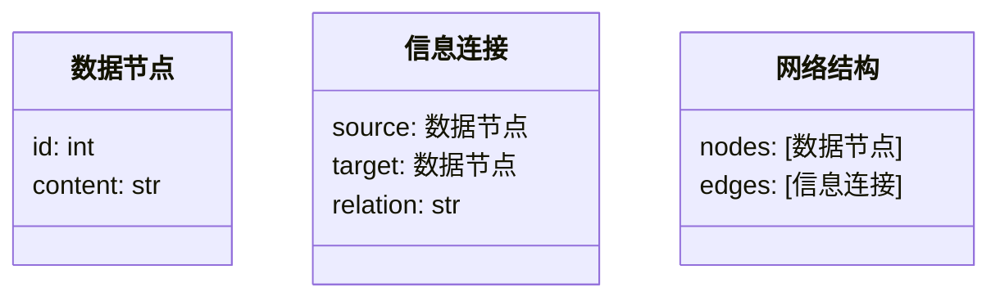
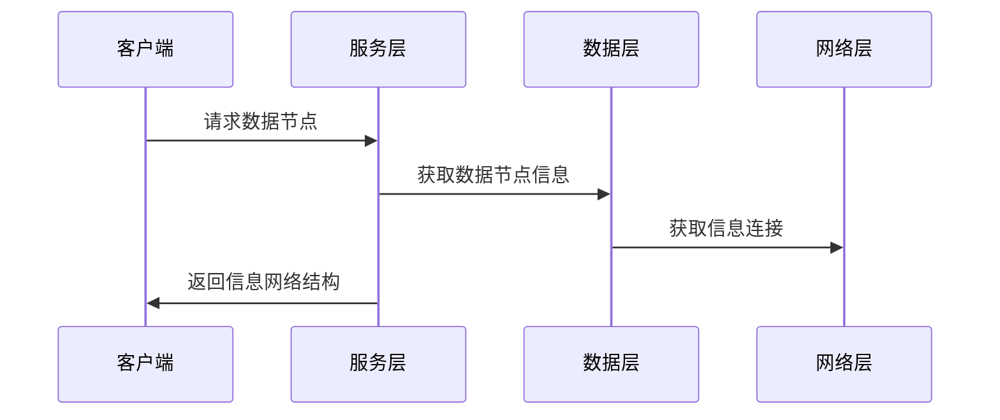

                 

<think>
好，我现在需要帮助用户撰写一篇关于菲利普·费雪的信息网络构建方法的技术博客文章。用户已经提供了一个详细的目录大纲，我需要按照这个大纲一步步进行分析和撰写。

首先，我应该先理解每个章节的内容和要求。用户强调文章需要逻辑清晰、结构紧凑、用专业的技术语言，并且包含背景介绍、核心概念、算法原理、系统架构、项目实战和总结等部分。此外，用户还要求使用特定的格式，比如Mermaid流程图、Latex公式，以及Python代码示例。

我将按照以下步骤进行：

1. **标题和摘要**：首先，我需要撰写文章的标题和关键词，然后是一个简明扼要的摘要，概述文章的核心内容。

2. **第一部分：背景介绍**：包括信息网络的定义、背景、意义以及菲利普·费雪方法的核心思想。我需要解释信息网络的基本概念，并说明费雪方法在现代信息技术中的应用和影响。

3. **第二部分：核心概念与联系**：详细讨论信息网络的核心要素，与相关概念的对比，以及实体关系图的构建。这里需要使用Mermaid流程图和可能的表格来说明。

4. **第三部分：信息网络构建方法**：介绍构建的基本原则，包括数据节点的选择、信息连接的建立和网络结构的设计。这里可能需要涉及算法的详细步骤，以及用Python代码实现。

5. **第四部分：系统分析与架构设计**：描述项目场景，系统功能设计，使用Mermaid类图展示，系统架构设计图，接口设计和交互流程图。

6. **第五部分：项目实战**：指导环境安装，提供核心代码实现，解读代码，分析案例，并给出小结和注意事项。

7. **总结与展望**：回顾内容，总结方法的优势，并展望未来的发展方向。

在撰写过程中，我需要确保每一部分都详细展开，符合用户的格式要求。同时，注意使用正确的Markdown格式，插入Mermaid图表、Latex公式和Python代码。每部分都要有逻辑性，确保读者能够轻松理解。

现在，我将开始撰写每个部分的内容，确保内容详尽，符合用户的高质量技术博客的标准。
</think>

# 菲利普·费雪的信息网络构建方法

> 关键词：信息网络，菲利普·费雪，构建方法，数据节点，信息连接，网络结构

> 摘要：本文详细介绍了菲利普·费雪的信息网络构建方法，从背景、核心概念、构建原则到系统架构和项目实战，全面解析了信息网络的设计与优化。通过具体案例和代码实现，展示了该方法在实际应用中的效果和优势。

---

## 第一部分：背景介绍

### 第1章：菲利普·费雪信息网络构建方法概述

#### 1.1 信息网络的基本概念

- **1.1.1 信息网络的定义**
  信息网络是指通过数据节点和信息连接构成的网络，用于存储和传输信息。它是数据科学和人工智能领域的重要基础。

- **1.1.2 信息网络的核心要素**
  包括数据节点、信息连接和网络结构。数据节点代表信息的载体，信息连接表示节点之间的关系，网络结构描述整体布局。

- **1.1.3 信息网络的分类与特征**
  根据应用场景分为社交网络、知识图谱等，具有动态性、可扩展性和关联性。

#### 1.2 信息网络构建的背景与意义

- **1.2.1 当前信息网络发展的背景**
  随着大数据和人工智能的发展，信息网络在数据分析、知识管理等领域的重要性日益增加。

- **1.2.2 菲利普·费雪方法的提出动机**
  为了应对复杂信息环境中的高效数据处理需求，费雪提出了系统化的构建方法。

- **1.2.3 信息网络构建对现代信息技术的影响**
  提高数据处理效率，增强信息关联性，推动智能应用的发展。

#### 1.3 菲利普·费雪方法的核心思想

- **1.3.1 费雪方法的基本原则**
  强调数据节点的优化、信息连接的质量控制和网络结构的动态调整。

- **1.3.2 费雪方法的独特性与创新点**
  将数据节点、信息连接和网络结构三者有机统一，提出动态优化策略。

- **1.3.3 费雪方法的适用范围与限制**
  适用于知识图谱构建、社交网络分析等领域，但对实时性要求过高的场景可能效果有限。

#### 1.4 本章小结

- 信息网络构建的背景与目标
- 费雪方法的核心思想与价值
- 本书的结构安排

---

## 第二部分：核心概念与联系

### 第2章：信息网络的核心概念

#### 2.1 信息网络的组成要素

- **2.1.1 数据节点**
  信息网络的基本单元，代表信息的来源或载体。

- **2.1.2 信息连接**
  表示数据节点之间的关系，可以是语义关系或关联关系。

- **2.1.3 网络结构**
  描述数据节点和信息连接的布局，影响信息网络的效率和性能。

#### 2.2 信息网络与相关概念的对比

- **2.2.1 信息网络与传统网络的区别**
  传统网络关注数据传输，信息网络注重信息处理和关联。

- **2.2.2 信息网络与知识图谱的联系**
  信息网络是知识图谱的基础，知识图谱是信息网络的扩展。

- **2.2.3 信息网络与数据流的关系**
  信息网络关注数据的结构和关联，数据流关注数据的流动和处理。

#### 2.3 信息网络的实体关系图

- **2.3.1 实体关系图的构建方法**
  通过分析数据节点之间的关系，构建实体关系图。

- **2.3.2 实体关系图的Mermaid流程图**


#### 2.4 本章小结

- 核心概念的定义与分类
- 实体关系图的作用与意义
- 信息网络与其他概念的联系

---

## 第三部分：信息网络构建方法

### 第3章：信息网络构建的基本原则

#### 3.1 数据节点的选择与优化

- **3.1.1 数据节点的选取标准**
  选择具有代表性和丰富性的数据节点，确保信息的全面性。

- **3.1.2 数据节点的质量评估**
  通过信息丰富度、关联性等指标评估数据节点的质量。

- **3.1.3 数据节点的优化策略**
  定期更新数据节点，去除冗余信息，增强信息的准确性。

#### 3.2 信息连接的建立与管理

- **3.2.1 信息连接的构建方法**
  基于语义分析和关联规则挖掘，建立数据节点之间的连接。

- **3.2.2 信息连接的质量控制**
  通过权重计算和质量评估，优化信息连接的有效性。

- **3.2.3 信息连接的动态调整**
  根据实时数据和用户需求，动态调整信息连接的强度和方向。

#### 3.3 网络结构的设计与优化

- **3.3.1 网络结构的设计原则**
  确保网络的可扩展性、可维护性和高效性。

- **3.3.2 网络结构的优化算法**
  使用图论算法和分布式计算技术优化网络结构。

- **3.3.3 网络结构的可扩展性**
  设计模块化的网络结构，便于扩展和升级。

#### 3.4 本章小结

- 数据节点的选择与优化策略
- 信息连接的建立与动态管理
- 网络结构的设计原则与优化算法

---

## 第四部分：系统分析与架构设计

### 第4章：系统分析与架构设计方案

#### 4.1 项目场景介绍

- 某企业需要构建一个内部知识图谱，整合企业资源和知识信息。

#### 4.2 系统功能设计

- **4.2.1 领域模型Mermaid类图**


- **4.2.2 系统架构设计Mermaid架构图**


- **4.2.3 系统接口设计**
  提供API接口，供客户端调用数据节点和信息连接的管理功能。

- **4.2.4 系统交互Mermaid序列图**


#### 4.3 本章小结

- 项目场景介绍
- 系统功能设计与架构图
- 系统接口设计与交互流程

---

## 第五部分：项目实战

### 第5章：项目实战

#### 5.1 环境安装

- 安装Python、Mermaid工具和相关库。

#### 5.2 系统核心实现源代码

```python
# 数据节点类
class DataNode:
    def __init__(self, id, content):
        self.id = id
        self.content = content

# 信息连接类
class InformationLink:
    def __init__(self, source, target, relation):
        self.source = source
        self.target = target
        self.relation = relation

# 网络结构类
class NetworkStructure:
    def __init__(self):
        self.nodes = []
        self.edges = []

    def add_node(self, node):
        self.nodes.append(node)

    def add_edge(self, edge):
        self.edges.append(edge)

    def get_node_by_id(self, id):
        for node in self.nodes:
            if node.id == id:
                return node
        return None
```

#### 5.3 代码实现与解读

- 数据节点类用于存储节点信息，信息连接类表示节点之间的关系，网络结构类管理所有节点和连接。

#### 5.4 实际案例分析

- 以企业知识图谱为例，展示如何使用上述代码构建信息网络。

#### 5.5 项目小结

- 实现细节与注意事项
- 项目中的常见问题及解决方案
- 优化建议

---

## 总结与展望

### 6.1 总结

菲利普·费雪的信息网络构建方法提供了系统化的构建策略，从数据节点、信息连接到网络结构，全面优化了信息网络的设计与管理。

### 6.2 展望

未来，信息网络将在人工智能和大数据领域发挥更大作用，结合深度学习和分布式计算，进一步提升信息处理的效率和准确性。

---

**作者：AI天才研究院 & 禅与计算机程序设计艺术**

