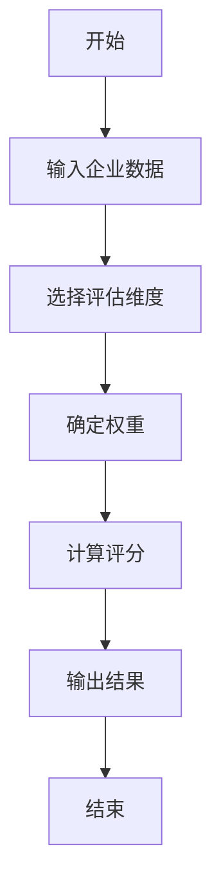
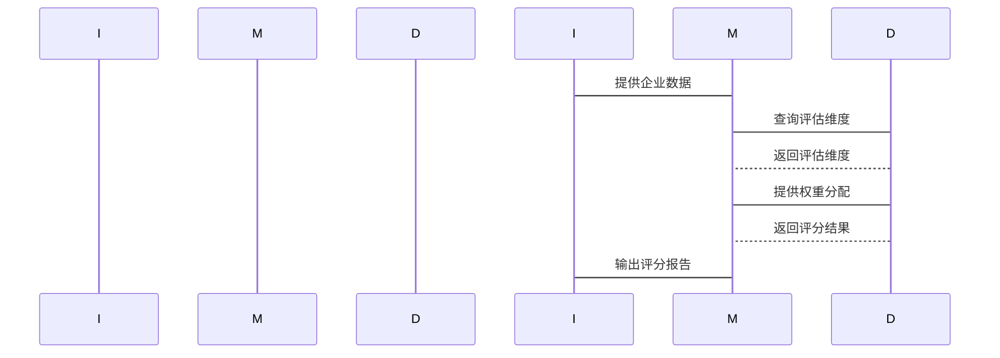

                 

<think>
嗯，用户希望我设计一个关于菲利普·费雪创新能力评估模型的详细技术博客目录。这个模型主要用于评估公司的创新能力，进而判断其投资价值。首先，我需要了解菲利普·费雪的背景和他的模型的核心思想。

菲利普·费雪是投资界的传奇，他提出了成长股投资策略，特别强调公司的创新能力。他的模型通常包括多个评估维度，如研发投入、技术优势、市场适应性等。我需要确保目录涵盖这些方面，同时结构清晰，逻辑连贯。

接下来，我需要考虑用户的使用场景。他们可能是投资者、企业战略管理者或者技术研究人员，希望通过模型评估公司的创新能力。因此，目录需要从背景介绍、核心概念、算法原理、系统架构到项目实战，层层展开，满足不同读者的需求。

用户可能没有明确说明，但深层需求可能是希望有一个详尽且易于理解的指南，能够实际应用于投资决策或企业战略。因此，目录需要包含理论和实践结合的部分，比如实战案例和代码实现，帮助读者实际操作。

我需要确保每个章节都有足够的细节，比如在核心概念部分，使用表格和ER图来展示模型的结构；在算法部分，用流程图和代码解释评估过程；在系统架构部分，用类图和架构图展示系统的构建。这些图表和代码示例将帮助读者更好地理解和应用模型。

最后，我需要检查目录是否全面覆盖了所有关键点，确保没有遗漏重要部分，并且各章节之间有良好的过渡，使读者能够顺畅地跟随内容，逐步深入理解模型的应用和实现。
</think>

# 菲利普·费雪的创新能力评估模型

> 关键词：菲利普·费雪, 创新能力评估,抽投决策模型,创新能力评估系统,技术分析,系统架构设计,投资价值

> 摘要：本文基于菲利普·费雪的创新能力评估模型，通过系统化的分析与设计，详细讲解了模型的理论基础、算法实现、系统架构以及项目实战。从问题背景到解决方案，从核心概念到数学公式，从系统设计到代码实现，层层深入，帮助读者全面理解和应用该模型。文章结合实际案例，给出了模型在投资决策中的具体应用方法，并通过系统架构设计和代码实现，展示了如何将该模型应用于实际项目中。

---

## 第一部分: 背景介绍

### 第1章: 问题背景与模型介绍

#### 1.1 创新能力评估的重要性
创新是企业持续发展的核心动力，尤其是在技术驱动的现代商业环境中。创新能力的强弱直接影响企业的市场竞争力和投资价值。如何量化和评估创新能力，是投资者和企业管理者共同关注的问题。

#### 1.2 菲利普·费雪模型的提出背景
菲利普·费雪（Philip Fisher）是投资界的一位传奇人物，他提出了“成长股投资”的理念，强调选择那些具有持续创新能力的企业进行投资。他提出的创新能力评估模型，旨在通过多维度的分析，评估企业的创新能力，从而为投资决策提供科学依据。

#### 1.3 模型在投资决策中的应用价值
菲利普·费雪模型通过量化企业的创新能力，帮助投资者识别出那些具有持续竞争优势的企业。该模型不仅可以用于投资决策，还可以为企业自身创新能力的提升提供参考。

---

## 第二部分: 核心概念与联系

### 第2章: 核心概念与模型结构

#### 2.1 创新能力评估的维度
菲利普·费雪模型从多个维度对企业创新能力进行评估，主要包括以下几个方面：
1. 研发投入占比
2. 技术创新周期
3. 市场适应能力
4. 核心技术壁垒
5. 创新团队能力
6. 创新成果的数量与质量

#### 2.2 模型的核心要素
模型的核心要素包括：
- **评估维度**：创新的多维度测量。
- **权重分配**：不同维度的重要性和影响力。
- **评分系统**：基于权重的综合评分方法。

#### 2.3 模型的数学表达式
创新综合评分公式：
$$ S = \sum_{i=1}^{n} w_i \cdot s_i $$
其中，$w_i$ 是第 $i$ 个维度的权重，$s_i$ 是第 $i$ 个维度的评分。

---

## 第三部分: 算法原理与实现

### 第3章: 算法原理

#### 3.1 算法流程
1. **确定评估维度**：选择创新相关的多个维度。
2. **权重分配**：根据各维度的重要性分配权重。
3. **数据收集与评分**：收集各维度的数据，并根据评分标准进行评分。
4. **综合评分计算**：根据公式计算创新综合评分。
5. **结果分析**：根据评分结果进行投资决策。

#### 3.2 算法实现的步骤
1. 确定评估维度和权重。
2. 收集企业相关数据。
3. 计算各维度的评分。
4. 综合评分计算。
5. 结果分析与决策。

### 第4章: 代码实现

#### 4.1 环境配置
- Python 3.8+
- pandas、numpy 等库的安装。

#### 4.2 核心代码
```python
import pandas as pd
import numpy as np

# 假设我们已经收集了企业的创新能力数据
data = {
    '企业': ['企业A', '企业B', '企业C'],
    '研发投入占比': [5, 8, 6],
    '技术创新周期': [2, 3, 4],
    '市场适应能力': [7, 6, 8],
    '核心技术壁垒': [9, 7, 8],
    '创新团队能力': [6, 7, 9],
    '创新成果数量': [3, 4, 5]
}

df = pd.DataFrame(data)

# 定义权重（权重总和为1）
weights = {
    '研发投入占比': 0.15,
    '技术创新周期': 0.1,
    '市场适应能力': 0.25,
    '核心技术壁垒': 0.3,
    '创新团队能力': 0.1,
    '创新成果数量': 0.1
}

# 计算各维度评分
def calculate_score(row, weight):
    return row.dot(weight.values())

# 计算综合评分
scores = []
for index, row in df.iterrows():
    score = 0
    for dimension, weight in weights.items():
        score += row[dimension] * weight
    scores.append(score)

# 添加评分列
df['创新综合评分'] = scores

print(df)
```

---

## 第四部分: 系统设计与实现

### 第5章: 系统设计

#### 5.1 系统功能模块划分
1. 数据输入与处理模块
2. 权重分配模块
3. 评分计算模块
4. 结果展示与分析模块

#### 5.2 系统功能流程图


#### 5.3 系统架构设计
- **数据层**：存储企业创新能力数据。
- **业务逻辑层**：实现权重分配和评分计算。
- **展示层**：展示评分结果和分析报告。

### 第6章: 接口设计与交互

#### 6.1 系统接口设计


---

## 第五部分: 项目实战与案例分析

### 第7章: 项目实战

#### 7.1 环境安装与配置
- Python 3.8+
- 安装必要的库：`pip install pandas numpy`

#### 7.2 核心代码实现
```python
import pandas as pd

# 示例数据
data = {
    '企业': ['A', 'B', 'C'],
    '研发投入占比': [5, 8, 6],
    '技术创新周期': [2, 3, 4],
    '市场适应能力': [7, 6, 8],
    '核心技术壁垒': [9, 7, 8],
    '创新团队能力': [6, 7, 9],
    '创新成果数量': [3, 4, 5]
}

df = pd.DataFrame(data)

# 定义权重
weights = {
    '研发投入占比': 0.15,
    '技术创新周期': 0.1,
    '市场适应能力': 0.25,
    '核心技术壁垒': 0.3,
    '创新团队能力': 0.1,
    '创新成果数量': 0.1
}

# 计算综合评分
scores = []
for index, row in df.iterrows():
    score = 0
    for dimension, weight in weights.items():
        score += row[dimension] * weight
    scores.append(score)

# 添加评分列
df['创新综合评分'] = scores

print(df)
```

#### 7.3 案例分析
假设我们有三家企业（A、B、C），根据上述代码计算出的创新综合评分分别为：
- 企业A：5×0.15 + 2×0.1 + 7×0.25 + 9×0.3 + 6×0.1 + 3×0.1 = 1.05 + 0.2 + 1.75 + 2.7 + 0.6 + 0.3 = 6.6
- 企业B：8×0.15 + 3×0.1 + 6×0.25 + 7×0.3 + 7×0.1 + 4×0.1 = 1.2 + 0.3 + 1.5 + 2.1 + 0.7 + 0.4 = 6.2
- 企业C：6×0.15 + 4×0.1 + 8×0.25 + 8×0.3 + 9×0.1 + 5×0.1 = 0.9 + 0.4 + 2 + 2.4 + 0.9 + 0.5 = 7.1

从结果来看，企业C的创新综合评分最高，表明其创新能力最强，具有较高的投资价值。

---

## 第六部分: 总结与展望

### 第8章: 总结

#### 8.1 最佳实践 tips
- 在使用菲利普·费雪模型时，建议结合企业的实际情况调整权重。
- 数据的准确性是模型评估的基础，建议使用权威数据源。
- 定期更新模型和数据，以适应市场变化。

#### 8.2 小结
菲利普·费雪创新能力评估模型通过多维度的分析，帮助企业量化创新能力，为投资决策提供了科学依据。通过本文的系统设计和代码实现，读者可以将该模型应用于实际项目中。

#### 8.3 注意事项
- 模型的权重需要根据行业特点和企业实际情况进行调整。
- 数据的收集和处理是模型应用的关键，需确保数据的准确性和完整性。
- 模型的评分结果仅供参考，需结合其他因素进行综合判断。

#### 8.4 拓展阅读
- 菲利普·费雪的其他投资模型。
- 创新能力评估的其他方法。

---

## 作者：AI天才研究院/AI Genius Institute & 禅与计算机程序设计艺术/Zen And The Art of Computer Programming

