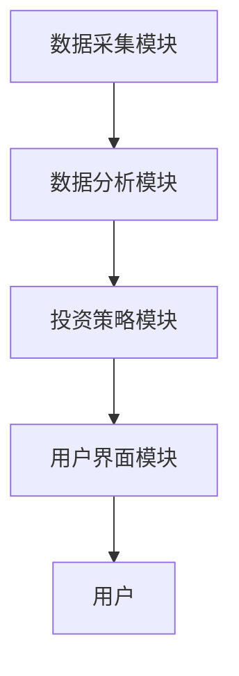

                 


# 《菲利普·费雪的成长型股票投资策略》

---

## 关键词

- 菲利普·费雪
- 成长型股票
- 投资策略
- 财务分析
- 长期投资

---

## 摘要

菲利普·费雪是成长型股票投资策略的鼻祖，他的理念强调选择具有持续增长潜力的公司，并通过长期持有实现财富增值。本文详细解读了菲利普·费雪的投资理念、选股标准、财务分析方法、行业分析、投资策略实施步骤、风险管理、长期投资理念以及实际案例分析，为读者提供一套系统的学习和应用框架。

---

## 第一部分: 菲利普·费雪的成长型投资理念概述

---

### 第1章: 菲利普·费雪及其投资理念

#### 1.1 菲利普·费雪的生平简介

菲利普·费雪（Philip Fisher）是美国著名的投资家和作家，被誉为“成长型股票投资之父”。他于1907年出生于加利福尼亚州，早年就读于斯坦福大学，并在1930年代开始涉足投资领域。费雪的投资理念与传统的价值投资有所不同，他更关注公司的成长潜力和管理团队的稳定性。

#### 1.2 成长型股票投资的定义与特点

成长型股票是指那些收入和利润持续增长的公司股票。其核心特点是：

- **收入增长率高**：公司收入年增长率超过行业平均水平。
- **利润增长率高**：公司净利润年增长率稳定且高于行业平均水平。
- **市场份额扩大**：公司在市场中占据越来越大的份额。
- **竞争优势明显**：公司具有独特的竞争优势，如技术创新、品牌优势等。

#### 1.3 菲利普·费雪的成长型投资理念

- **长期投资与复利效应**：费雪认为，投资的最终收益来源于复利效应，长期持有优质股票能够带来指数级增长。
- **选择具有持续增长潜力的公司**：费雪强调，投资者应选择那些具有持续增长潜力的公司，而非仅仅关注当前的盈利能力。
- **集中投资与风险控制**：费雪主张集中投资于少数优质股票，并通过长期持有分散风险。

---

### 第2章: 成长型股票的投资策略

#### 2.1 成长型股票的选股标准

- **收入增长率**：公司收入年增长率应高于行业平均水平。
- **利润增长率**：公司净利润年增长率应稳定且高于行业平均水平。
- **市场份额与竞争优势**：公司在市场中占据越来越大的份额，并具有竞争优势。
- **管理团队的稳定性**：管理团队应具备长期稳定性和良好的决策能力。

#### 2.2 财务报表分析

- **收入与利润分析**：通过分析公司的收入和利润增长情况，评估公司的成长潜力。
- **现金流分析**：现金流是公司健康的重要指标，正现金流意味着公司能够持续增长。
- **负债与财务健康状况**：公司应保持较低的负债水平，避免财务风险。

#### 2.3 行业分析与宏观经济因素

- **行业生命周期分析**：选择处于成长期的行业，避免衰退期行业。
- **宏观经济对成长型股票的影响**：宏观经济政策、利率变化等都会影响成长型股票的表现。
- **政策环境对成长型股票的影响**：政策支持的行业更有可能获得成长机会。

---

### 第3章: 菲利普·费雪的成长型投资策略实施步骤

#### 3.1 确定投资目标与风险承受能力

- **投资目标的设定**：明确投资目标，如追求年均15%以上的收益。
- **风险承受能力的评估**：根据自身的财务状况和风险偏好，评估能够承受的最大亏损比例。
- **投资期限的确定**：长期投资更适合成长型股票，因为其价值需要时间来体现。

#### 3.2 寻找具有持续增长潜力的公司

- **市场调研与行业分析**：通过市场调研和行业分析，筛选出具有成长潜力的行业。
- **财务数据的收集与分析**：收集目标公司的财务数据，进行详细分析。
- **管理团队的考察**：评估公司管理团队的能力和稳定性。

#### 3.3 建立投资组合

- **投资组合的构建原则**：集中投资于少数优质股票，避免过度分散。
- **股票权重的分配**：根据股票的成长潜力和风险水平，合理分配权重。
- **定期调整与优化**：定期评估投资组合的表现，进行必要的调整和优化。

#### 3.4 监测与评估投资表现

- **定期评估投资组合**：每季度或半年评估一次投资组合的表现。
- **与市场基准的比较**：将投资组合的收益与市场基准进行比较，评估表现是否优于市场。
- **调整投资策略的时机**：根据市场变化和公司情况，调整投资策略。

---

## 第二部分: 菲利普·费雪成长型投资策略的数学模型与系统架构

---

### 第4章: 数学模型与算法

#### 4.1 费雪成长率模型

费雪成长率模型用于评估公司的成长潜力，公式如下：

$$
\text{成长率} = \frac{\text{净利润增长率} + \text{收入增长率}}{2}
$$

- **净利润增长率**：（本期净利润 - 上期净利润）/ 上期净利润 × 100%
- **收入增长率**：（本期收入 - 上期收入）/ 上期收入 × 100%

#### 4.2 投资组合优化模型

使用马科维茨均值-方差模型优化投资组合，目标是在给定风险下实现最大收益。

$$
\text{收益最大化} = \sum_{i=1}^{n} w_i r_i
$$

$$
\text{风险最小化} = \sum_{i=1}^{n} \sum_{j=1}^{n} w_i w_j \sigma_i \sigma_j
$$

其中：
- \( w_i \)：第i只股票的权重
- \( r_i \)：第i只股票的预期收益率
- \( \sigma_i \)：第i只股票的收益波动率

---

### 第5章: 系统架构与接口设计

#### 5.1 系统功能设计

- **数据采集模块**：收集公司财务数据、行业信息、宏观经济数据。
- **数据分析模块**：计算成长率、风险指标，评估公司成长潜力。
- **投资策略模块**：根据模型生成投资建议。
- **用户界面模块**：提供可视化界面，展示分析结果。

#### 5.2 系统架构设计



---

### 第6章: 项目实战

#### 6.1 环境安装

- 安装Python和相关库（如Pandas、NumPy、Matplotlib）。
- 安装数据分析工具（如Excel、Tableau）。

#### 6.2 核心实现源代码

```python
import pandas as pd
import numpy as np

# 示例数据
data = {
    '公司': ['A', 'B', 'C'],
    '收入增长率': [20, 15, 10],
    '净利润增长率': [15, 10, 5],
}
df = pd.DataFrame(data)

# 计算成长率
df['成长率'] = (df['收入增长率'] + df['净利润增长率']) / 2

print(df)
```

#### 6.3 案例分析

以某科技公司为例，分析其财务数据，评估其成长潜力，并生成投资建议。

---

## 第三部分: 总结与展望

---

### 第7章: 总结与展望

- **本章小结**：菲利普·费雪的成长型投资策略强调选择具有持续增长潜力的公司，通过长期持有实现财富增值。
- **风险管理**：投资者需注意市场波动、公司基本面变化等风险。
- **长期投资理念**：坚持长期投资，避免短期波动的干扰。
- **案例分析**：通过具体案例分析，展示成长型投资策略的应用效果。

---

## 附录

- **附录A**：常用财务分析工具
- **附录B**：进一步阅读的书籍推荐

---

## 作者

作者：AI天才研究院/AI Genius Institute & 禅与计算机程序设计艺术 /Zen And The Art of Computer Programming

---

以上是《菲利普·费雪的成长型股票投资策略》的完整目录和内容框架，涵盖了从理论到实践的各个方面，确保读者能够全面理解并掌握菲利普·费雪的成长型投资策略。

