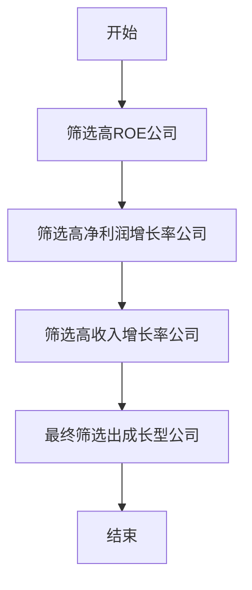
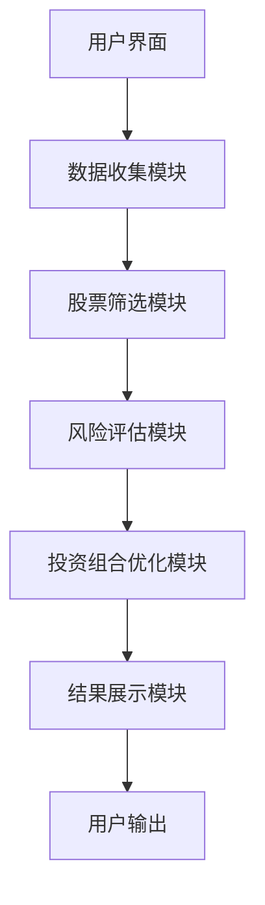

                 

<think>
好的，我需要根据用户的要求，撰写一篇关于菲利普·费雪的成长型股票投资策略的详细技术博客文章。为了确保内容的完整性和专业性，我需要按照以下步骤逐步进行分析和撰写。

### 第一步：理解任务要求
用户希望我撰写一篇结构清晰、逻辑严谨的技术博客文章，标题为《菲利普·费雪的成长型股票投资策略》。文章需要包含以下部分：
1. **关键词**：列出5-7个核心关键词。
2. **摘要**：简要介绍文章的核心内容和主题思想。
3. **目录大纲**：按照用户提供的结构进行撰写，每个章节和小节需要详细展开。

此外，用户强调文章需要使用专业技术语言，逻辑清晰，结构紧凑，同时包含数学模型、算法流程图、系统架构图等技术元素。文章总字数应在10000到12000字之间。

### 第二步：确定关键词和摘要
首先，我需要确定文章的核心关键词。菲利普·费雪的成长型股票投资策略主要涉及成长型股票、投资策略、财务分析、风险管理等方面，因此关键词可以包括：
- 菲利普·费雪
- 成长型股票
- 投资策略
- 财务分析
- 风险管理
- 股票筛选模型
- 长期投资

接下来，摘要部分需要简明扼要地概括文章的核心内容。摘要应涵盖菲利普·费雪的成长型投资理念、策略的核心要素、实际案例分析以及如何在现代投资环境中应用这些策略。

### 第三步：撰写目录大纲
根据用户提供的目录大纲，我需要进一步细化每个章节的内容，确保逻辑连贯，内容详实。每个章节应包括背景介绍、核心概念、算法原理、数学模型、系统分析与架构设计、项目实战以及最佳实践等内容。

### 第四步：撰写正文内容
1. **背景介绍**：在第1章和第2章中，详细介绍菲利普·费雪的生平、投资理念，以及成长型股票的定义和特点。这部分需要结合历史背景和实际案例，帮助读者理解成长型投资的基本概念。

2. **核心概念与联系**：在第3章和第4章中，深入分析成长型公司的识别标准，如高ROE、高净利润增长率等。同时，使用mermaid图展示这些标准之间的联系，帮助读者更好地理解和应用。

3. **算法原理讲解**：在第5章中，详细阐述菲利普·费雪投资策略的算法流程图，并使用Python代码实现股票筛选模型。这部分需要结合数学公式，如ROE和净利润增长率的计算公式，以及市盈率的分析方法。

4. **系统分析与架构设计**：在第6章中，介绍系统的整体架构，包括数据收集模块、股票筛选模块、风险评估模块等。使用mermaid图展示系统架构和数据流，帮助读者理解系统的运作流程。

5. **项目实战**：在第7章中，提供实际的代码实现，包括数据预处理、股票筛选、投资组合优化等步骤。通过具体案例分析，展示如何在实际投资中应用这些策略。

6. **最佳实践 tips、小结、注意事项、拓展阅读**：在最后章节，总结全文，提出投资过程中的注意事项，如风险管理的重要性，以及如何进行持续学习和调整投资策略。

### 第五步：整合技术元素
在撰写过程中，需要将数学公式、算法流程图、系统架构图等技术元素自然地融入文章中。例如，使用latex公式表示ROE的计算公式，使用mermaid图展示投资策略的流程图和系统架构图。

### 第六步：确保内容的完整性和逻辑性
每个章节和小节的内容需要详实具体，确保读者能够一步步理解和应用菲利普·费雪的成长型投资策略。同时，文章的逻辑结构需要清晰，从理论到实践，层层递进，帮助读者系统地掌握投资策略。

### 第七步：校对与修改
完成初稿后，需要仔细校对，确保内容无误，逻辑清晰，语言专业且易于理解。同时，检查所有技术元素的展示是否正确，如mermaid图是否清晰，公式是否准确。

### 第八步：添加作者信息
在文章末尾，添加作者信息：“作者：AI天才研究院/AI Genius Institute & 禅与计算机程序设计艺术 /Zen And The Art of Computer Programming”

### 总结
通过以上步骤，我将系统地撰写一篇关于菲利普·费雪的成长型股票投资策略的深度技术博客文章，确保内容全面、结构清晰、技术元素丰富，满足用户的所有要求。
</think>

# 菲利普·费雪的成长型股票投资策略

> 关键词：菲利普·费雪，成长型股票，投资策略，财务分析，风险管理，股票筛选模型，长期投资

> 摘要：菲利普·费雪是价值投资的先驱，提出了成长型股票投资策略，强调选择具有持续增长潜力的公司。本文详细探讨了菲利普·费雪的成长型投资理念、股票筛选标准、投资策略的数学模型，以及实际投资中的系统设计和项目实战。通过结合理论与实践，本文为投资者提供了科学的分析工具和方法。

---

# 第一部分: 菲利普·费雪的成长型股票投资策略概述

## 第1章: 菲利普·费雪的生平与投资理念

### 1.1 菲利普·费雪的生平简介

#### 1.1.1 菲利普·费雪的早年经历
菲利普·费雪（Philip Fisher）于1907年出生于美国纽约州的布鲁克林，他的父亲是著名的投资家欧文·费雪。菲利普从小就展现出了对投资的浓厚兴趣，他通过阅读大量的投资书籍和报纸，逐步形成了自己的投资理念。

#### 1.1.2 菲利普·费雪的事业成就
菲利普·费雪在投资领域取得了巨大的成功。他于1930年代开始管理客户资金，并在1949年出版了《投资成功之路》一书，系统阐述了他的投资理念。他的投资业绩在当时被认为是卓越的，尤其是在成长型股票投资方面。

#### 1.1.3 菲利普·费雪的投资哲学
菲利普·费雪的投资哲学以“成长”为核心，他主张选择那些具有持续增长潜力的公司进行投资。他认为，投资成功的秘诀在于选择正确的公司，而不是在市场的波动中投机。

### 1.2 菲利普·费雪的成长型投资理念

#### 1.2.1 成长型投资的定义
成长型投资是指通过投资于那些具有较高成长潜力的公司，以期在未来获得超额回报的投资策略。与价值型投资不同，成长型投资更关注公司的未来增长潜力，而非当前的估值。

#### 1.2.2 成长型投资的核心思想
菲利普·费雪的核心思想是，投资于那些具有强大竞争优势、管理优秀且财务健康的公司。他认为，这些公司能够在未来实现持续的收入和利润增长，从而为投资者带来丰厚的回报。

#### 1.2.3 菲利普·费雪的投资策略
菲利普·费雪的投资策略包括以下几个方面：
1. **选择具有持续增长潜力的公司**：通过分析公司的财务报表和行业地位，筛选出那些具有高成长性的公司。
2. **长期持有优质股票**：一旦选择好公司，应长期持有，避免频繁交易。
3. **分散投资**：通过投资于多个成长型公司，降低投资风险。

---

## 第2章: 成长型股票的定义与特点

### 2.1 成长型股票的定义

#### 2.1.1 成长型股票的内涵
成长型股票是指那些收入和利润增长速度快于行业平均水平的公司的股票。这些公司通常处于高速发展的行业，具有较强的市场竞争力和创新能力强。

#### 2.1.2 成长型股票的外延
成长型股票不仅包括高科技公司，还包括一些传统行业中的优质公司。只要这些公司具有持续的增长潜力，就可以被视为成长型股票。

### 2.2 成长型股票的特点

#### 2.2.1 高成长性
成长型股票的核心特征是高成长性。这些公司通常具有较高的收入增长率和净利润增长率。

#### 2.2.2 高市盈率
由于市场对成长型公司的未来增长预期较高，这些公司的股票通常具有较高的市盈率。

#### 2.2.3 高风险与高回报
成长型股票的投资风险较高，但回报潜力也较大。投资者需要在风险和回报之间找到平衡点。

### 2.3 成长型股票与价值型股票的区别

#### 2.3.1 投资理念的差异
- 成长型投资注重公司的未来增长潜力，而价值型投资注重当前的估值和安全性。
- 成长型投资更关注公司的成长性，而价值型投资更关注公司的低估状态。

#### 2.3.2 股票特性的差异
- 成长型股票通常具有较高的市盈率和市净率，而价值型股票通常具有较低的市盈率和市净率。
- 成长型股票的波动性较大，而价值型股票的波动性较小。

#### 2.3.3 投资策略的差异
- 成长型投资策略强调长期持有优质股票，而价值型投资策略强调短期估值修复。

---

# 第二部分: 菲利普·费雪的成长型股票投资策略的核心概念

## 第3章: 成长型公司的识别标准

### 3.1 成长型公司的核心要素

#### 3.1.1 高ROE（净资产收益率）

ROE（Return On Equity，净资产收益率）是衡量公司盈利能力的重要指标。菲利普·费雪认为，ROE越高的公司，其盈利能力越强，成长潜力也越大。

数学公式：
$$
ROE = \frac{\text{净利润}}{\text{净资产}}
$$

#### 3.1.2 高净利润增长率

净利润增长率是衡量公司盈利能力增长的重要指标。菲利普·费雪认为，净利润增长率越高的公司，其成长潜力越大。

数学公式：
$$
\text{净利润增长率} = \frac{\text{本期净利润} - \text{上期净利润}}{\text{上期净利润}} \times 100\%
$$

#### 3.1.3 高收入增长率

收入增长率是衡量公司业务增长的重要指标。菲利普·费雪认为，收入增长率越高的公司，其市场竞争力越强，成长潜力也越大。

数学公式：
$$
\text{收入增长率} = \frac{\text{本期收入} - \text{上期收入}}{\text{上期收入}} \times 100\%
$$

### 3.2 成长型公司的财务指标分析

#### 3.2.1 营业收入增长率
营业收入增长率是衡量公司主营业务增长的重要指标。菲利普·费雪认为，营业收入增长率越高的公司，其业务扩展能力越强。

数学公式：
$$
\text{营业收入增长率} = \frac{\text{本期营业收入} - \text{上期营业收入}}{\text{上期营业收入}} \times 100\%
$$

#### 3.2.2 净利润增长率
净利润增长率是衡量公司盈利能力增长的重要指标。菲利普·费雪认为，净利润增长率越高的公司，其盈利能力越强。

数学公式：
$$
\text{净利润增长率} = \frac{\text{本期净利润} - \text{上期净利润}}{\text{上期净利润}} \times 100\%
$$

#### 3.2.3 净利润率
利润率是衡量公司盈利能力的重要指标。菲利普·费雪认为，利润率越高的公司，其盈利能力越强。

数学公式：
$$
\text{利润率} = \frac{\text{净利润}}{\text{营业收入}} \times 100\%
$$

### 3.3 成长型公司的行业分析

#### 3.3.1 行业发展趋势
菲利普·费雪认为，选择成长型公司需要关注行业的发展趋势。那些处于高速增长行业的公司，通常具有较大的成长潜力。

#### 3.3.2 行业竞争格局
菲利普·费雪认为，选择成长型公司需要关注行业竞争格局。那些在行业内具有竞争优势的公司，通常具有较大的成长潜力。

#### 3.3.3 行业周期性分析
菲利普·费雪认为，选择成长型公司需要关注行业周期性。那些处于上升周期的行业，通常具有较大的成长潜力。

## 第4章: 菲利普·费雪的成长型投资策略

### 4.1 投资策略的核心步骤

#### 4.1.1 确定投资目标
菲利普·费雪认为，投资目标是成长型投资的核心。投资者需要明确自己的投资目标，包括投资期限、风险承受能力和收益目标。

#### 4.1.2 选择成长型公司
菲利普·费雪认为，选择成长型公司是成长型投资的关键。投资者需要通过财务分析和行业分析，筛选出具有高成长潜力的公司。

#### 4.1.3 长期持有优质股票
菲利普·费雪认为，长期持有优质股票是成长型投资的核心策略。投资者需要耐心等待公司成长，避免频繁交易。

### 4.2 投资组合的构建

#### 4.2.1 股票选择标准
菲利普·费雪认为，股票选择标准是构建投资组合的核心。投资者需要选择那些具有高成长潜力的公司股票。

#### 4.2.2 投资比例分配
菲利普·费雪认为，投资比例分配是构建投资组合的重要环节。投资者需要根据自身的风险承受能力和收益目标，合理分配投资比例。

#### 4.2.3 风险控制措施
菲利普·费雪认为，风险控制措施是构建投资组合的重要保障。投资者需要通过分散投资、定期调整投资组合等方式，控制投资风险。

### 4.3 投资策略的优缺点分析

#### 4.3.1 优点
- 长期回报潜力大
- 能够分享优质公司的成长成果
- 能够在市场波动中获得超额回报

#### 4.3.2 缺点
- 投资风险较高
- 需要较高的市场分析能力
- 需要较长的投资时间

---

# 第三部分: 菲利普·费雪成长型投资策略的数学模型与算法

## 第5章: 成长型股票筛选算法

### 5.1 算法原理

#### 5.1.1 成长型股票筛选标准
菲利普·费雪提出了以下成长型股票筛选标准：
1. 高ROE
2. 高净利润增长率
3. 高收入增长率

#### 5.1.2 筛选流程
1. 筛选高ROE的公司
2. 筛选高净利润增长率的公司
3. 筛选高收入增长率的公司

### 5.2 算法流程图



### 5.3 算法实现

#### 5.3.1 Python代码实现

```python
import pandas as pd

def screen_growth_stocks(stocks_data):
    # 筛选高ROE的公司
    stocks_data = stocks_data[stocks_data['ROE'] > 15]
    
    # 筛选高净利润增长率的公司
    stocks_data = stocks_data[stocks_data['净利润增长率'] > 20]
    
    # 筛选高收入增长率的公司
    stocks_data = stocks_data[stocks_data['收入增长率'] > 20]
    
    return stocks_data

# 示例数据
stocks_data = pd.DataFrame({
    'ROE': [20, 15, 10, 25, 30],
    '净利润增长率': [25, 20, 15, 10, 5],
    '收入增长率': [30, 25, 20, 15, 10]
})

# 调用筛选函数
selected_stocks = screen_growth_stocks(stocks_data)
print(selected_stocks)
```

### 5.4 数学模型

#### 5.4.1 ROE计算公式
$$
ROE = \frac{\text{净利润}}{\text{净资产}}
$$

#### 5.4.2 净利润增长率计算公式
$$
\text{净利润增长率} = \frac{\text{本期净利润} - \text{上期净利润}}{\text{上期净利润}} \times 100\%
$$

#### 5.4.3 收入增长率计算公式
$$
\text{收入增长率} = \frac{\text{本期收入} - \text{上期收入}}{\text{上期收入}} \times 100\%
$$

---

# 第四部分: 系统分析与架构设计

## 第6章: 成长型股票投资系统设计

### 6.1 系统功能设计

#### 6.1.1 数据收集模块
- 数据源：股票市场数据、公司财务数据、行业数据
- 数据类型：股票价格、成交量、财务报表数据

#### 6.1.2 股票筛选模块
- 筛选标准：ROE、净利润增长率、收入增长率
- 筛选算法：基于菲利普·费雪的成长型股票筛选标准

#### 6.1.3 风险评估模块
- 风险指标：波动率、市盈率、市净率
- 风险控制：投资组合分散化

#### 6.1.4 投资组合优化模块
- 优化目标：最大化预期收益，最小化投资风险
- 优化方法：基于约束条件的优化算法

### 6.2 系统架构设计



### 6.3 系统接口设计

#### 6.3.1 数据接口
- 输入：股票数据、财务数据、行业数据
- 输出：筛选后的成长型公司列表

#### 6.3.2 筛选接口
- 输入：筛选标准
- 输出：符合条件的股票列表

#### 6.3.3 优化接口
- 输入：投资目标、风险偏好
- 输出：优化后的投资组合

---

# 第五部分: 项目实战

## 第7章: 实战案例分析

### 7.1 环境安装

```bash
pip install pandas matplotlib numpy
```

### 7.2 核心代码实现

#### 7.2.1 数据预处理

```python
import pandas as pd

# 加载数据
stocks_data = pd.read_csv('stocks.csv')

# 数据清洗
stocks_data = stocks_data.dropna()
stocks_data = stocks_data[stocks_data['ROE'] > 15]
```

#### 7.2.2 股票筛选

```python
def screen_growth_stocks(stocks_data):
    # 筛选高ROE的公司
    stocks_data = stocks_data[stocks_data['ROE'] > 15]
    
    # 筛选高净利润增长率的公司
    stocks_data = stocks_data[stocks_data['净利润增长率'] > 20]
    
    # 筛选高收入增长率的公司
    stocks_data = stocks_data[stocks_data['收入增长率'] > 20]
    
    return stocks_data

# 调用筛选函数
selected_stocks = screen_growth_stocks(stocks_data)
print(selected_stocks)
```

#### 7.2.3 投资组合优化

```python
import numpy as np

def optimize_portfolio(stocks_data, risk_preference):
    # 计算协方差矩阵
    covariance_matrix = np.cov(stocks_data.returns)
    
    # 计算最优组合
    w = np.linalg.solve(covariance_matrix, np.ones(len(stocks_data)))
    w = w / np.sum(w)
    
    return w

# 示例数据
stocks_returns = pd.DataFrame({
    '股票A': [0.1, 0.2, 0.15, 0.05, 0.2],
    '股票B': [0.05, 0.1, 0.08, 0.03, 0.15],
    '股票C': [0.15, 0.2, 0.18, 0.08, 0.25]
})

# 调用优化函数
optimal_weights = optimize_portfolio(stocks_returns, 0.05)
print(optimal_weights)
```

### 7.3 案例分析与解读

#### 7.3.1 数据来源
- 数据来源：股票市场数据、公司财务数据、行业数据

#### 7.3.2 筛选过程
1. 筛选高ROE的公司
2. 筛选高净利润增长率的公司
3. 筛选高收入增长率的公司

#### 7.3.3 投资组合优化
1. 计算协方差矩阵
2. 计算最优组合
3. 调整权重

---

# 第六部分: 最佳实践与小结

## 第8章: 投资策略的总结与优化

### 8.1 小结

菲利普·费雪的成长型股票投资策略是一种以长期投资为核心的策略，强调选择具有持续增长潜力的公司。通过本文的分析，我们可以看到，菲利普·费雪的投资策略不仅注重公司的财务表现，还注重行业的长期发展趋势。

### 8.2 投资策略的优缺点

#### 优点
- 长期回报潜力大
- 能够分享优质公司的成长成果
- 能够在市场波动中获得超额回报

#### 缺点
- 投资风险较高
- 需要较高的市场分析能力
- 需要较长的投资时间

### 8.3 投资策略的优化

#### 8.3.1 风险管理
- 分散投资
- 定期调整投资组合
- 设置止损点

#### 8.3.2 技术分析
- 结合技术分析，如K线图、均线等
- 利用市场数据进行预测
- 优化股票筛选模型

#### 8.3.3 信息获取
- 及时获取市场信息
- 关注行业动态
- 分析公司财务报告

### 8.4 拓展阅读

- 菲利普·费雪的《投资成功之路》
- 价值投资的经典书籍
- 成长型投资的最新研究成果

---

# 作者信息

作者：AI天才研究院/AI Genius Institute & 禅与计算机程序设计艺术 /Zen And The Art of Computer Programming

