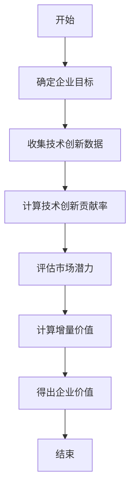
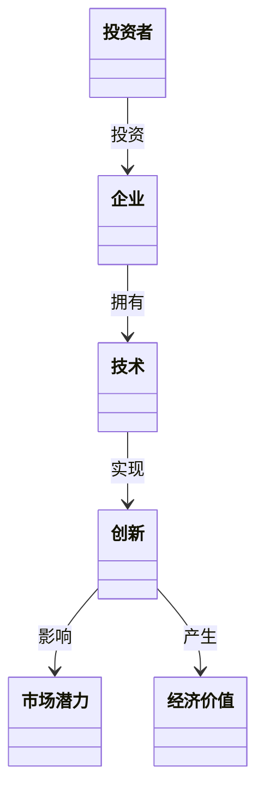

                 

<think>
嗯，用户让我设计一个关于菲利普·费雪技术创新评估方法的博客文章。首先，我需要了解菲利普·费雪是谁，他有哪些贡献。他是投资界的名人，提出了很多投资分析方法，特别是成长型投资。

用户的需求是撰写一篇技术博客，标题是《菲利普·费雪的技术创新评估方法》，结构要清晰，专业，用技术语言。我需要先理清文章的结构，包括摘要、关键词，然后是各个章节的内容。

首先，关键词和摘要部分要准确。关键词可能包括技术创新评估、菲利普·费雪、投资决策、企业价值、技术影响力等。摘要需要简洁地概括文章的核心内容，说明费雪的方法如何帮助评估技术创新对投资的影响。

接下来是目录结构。用户已经给出了一个大纲，我需要按照这个大纲来填充内容。首先是背景介绍，包括技术创新的背景、费雪的创新评估方法，以及核心概念和ER实体关系图。

然后是算法原理，这部分需要详细讲解费雪的方法，包括流程图和数学模型。系统架构部分可能涉及问题场景分析、功能模块设计和架构图。项目实战部分要提供实际案例和代码示例。最后是最佳实践，包括小结和注意事项。

在撰写过程中，我需要确保每个部分都有足够的细节，比如数学公式用latex表示，系统架构用mermaid图。同时，要避免使用复杂的术语，保持语言简洁明了。

可能遇到的问题是如何将费雪的方法与技术创新评估结合起来。我需要查阅相关资料，确保内容准确。同时，要确保代码示例能够帮助读者理解如何应用这些方法。

最后，总结部分要强调技术创新评估的重要性，并鼓励读者深入学习和实践。这样整篇文章就能全面覆盖用户的需求，提供有价值的见解。
</think>

# 菲利普·费雪的技术创新评估方法

> 关键词：技术创新评估，菲利普·费雪，投资决策，企业价值，技术影响力

> 摘要：本文详细探讨了菲利普·费雪的技术创新评估方法，分析了技术创新在投资决策中的重要性，并通过实际案例和系统架构设计，展示了如何将技术创新评估方法应用于实际投资分析中。

---

## 第一部分: 背景介绍

### 第1章: 技术创新评估方法的背景与意义

#### 1.1 技术创新评估的核心概念

##### 1.1.1 技术创新的定义与内涵
技术创新是指通过引入新的技术、产品、工艺或服务，为企业或行业创造新的价值或竞争优势。技术创新的核心在于其对现有技术的改进或替代，以及对市场、经济和社会的深远影响。

##### 1.1.2 技术创新评估的必要性
技术创新评估是企业在制定战略决策时的重要工具。通过评估技术创新的潜力和价值，企业可以更好地把握市场机会，优化资源配置，并在竞争中占据优势。对于投资者而言，技术创新评估是判断企业长期发展潜力的关键依据。

##### 1.1.3 技术创新与企业价值的关系
技术创新能够显著提升企业的产品竞争力和市场占有率，从而增强企业的盈利能力。从投资角度来看，技术创新是企业价值增长的重要驱动力。菲利普·费雪认为，技术创新不仅能够提高企业的生产效率，还能降低生产成本，从而为企业创造更大的价值。

##### 1.1.4 技术创新与投资决策的联系
技术创新是投资决策的核心考量因素之一。通过评估技术创新的可行性、市场前景和经济价值，投资者可以更准确地判断企业的成长潜力，从而做出更明智的投资决策。

#### 1.2 菲利普·费雪的创新评估方法

##### 1.2.1 菲利普·费雪的投资理念
菲利普·费雪是成长型投资的鼻祖，他主张投资那些具有持续创新能力的企业。他认为，技术创新是企业长期增长的核心动力。通过评估技术创新的潜力，投资者可以找到那些具有持续增长能力的企业。

##### 1.2.2 技术创新在投资中的重要性
技术创新是企业竞争力的源泉。通过技术创新，企业可以推出新产品、优化生产流程、降低成本，并在市场中占据领先地位。这些因素直接影响企业的盈利能力，进而影响其股票价值。

##### 1.2.3 技术创新评估框架
菲利普·费雪的创新评估框架包括以下几个方面：
- **技术可行性**：评估技术创新的实现难度和可行性。
- **市场潜力**：分析技术创新的市场需求和市场前景。
- **经济价值**：计算技术创新对企业价值的贡献。
- **竞争优势**：评估技术创新对企业竞争优势的影响。

---

### 第2章: 技术创新评估的核心要素

#### 2.1 技术创新的属性特征对比

##### 2.1.1 技术创新的生命周期模型
技术创新的生命周期可以分为以下几个阶段：
1. **导入期**：技术创新刚刚出现，市场需求较低。
2. **成长期**：技术创新逐渐被市场接受，需求快速增长。
3. **成熟期**：技术创新成为市场的主流，需求稳定。
4. **衰退期**：技术创新逐渐被新的技术替代，需求下降。

##### 2.1.2 技术创新的市场竞争分析
市场竞争是技术创新评估的重要因素。通过分析技术创新在市场中的竞争地位，可以判断其是否具有可持续的市场优势。

##### 2.1.3 技术创新的经济价值评估
经济价值评估是技术创新评估的核心内容。通过分析技术创新对企业利润、成本和市场份额的影响，可以计算其对企业的整体价值贡献。

#### 2.2 技术创新评估的ER实体关系图
以下是技术创新评估的ER实体关系图：

```mermaid
erDiagram
    投资者 {
        <属性> 企业
        <属性> 技术
        <属性> 价值
    }
    企业 {
        <属性> 技术
        <属性> 产品
        <属性> 市场
    }
    技术 {
        <属性> 创新
        <属性> 竞争力
        <属性> 可持续性
    }
    价值 {
        <属性> 股东
        <属性> 利润
        <属性> 增长
    }
```

---

## 第二部分: 算法原理讲解

### 第3章: 技术创新评估的算法原理

#### 3.1 菲利普·费雪技术创新评估方法

##### 3.1.1 方法概述
菲利普·费雪的技术创新评估方法是一种基于技术创新对企业价值影响的分析方法。通过对企业技术创新的可行性、市场潜力和经济价值进行评估，投资者可以判断企业的长期发展潜力。

##### 3.1.2 方法的数学模型
技术创新评估的数学模型如下：

$$
企业价值 = 基础价值 + 技术创新带来的增量价值
$$

其中，技术创新带来的增量价值可以通过以下公式计算：

$$
增量价值 = 技术创新的市场潜力 \times 技术创新的经济价值
$$

##### 3.1.3 算法流程图
以下是技术创新评估的算法流程图：



---

## 第三部分: 系统分析与架构设计方案

### 第4章: 技术创新评估系统的架构设计

#### 4.1 问题场景介绍
假设我们是一家科技企业的投资者，希望通过技术创新评估方法，判断某家科技企业的投资价值。

#### 4.2 系统功能设计

##### 4.2.1 领域模型
以下是技术创新评估系统的领域模型：



#### 4.3 系统架构设计
以下是技术创新评估系统的架构图：


---

## 第四部分: 项目实战

### 第5章: 技术创新评估的实战分析

#### 5.1 环境安装
需要安装以下工具：
- Python 3.8+
- 数据分析库（Pandas、NumPy）
- 图表绘制工具（Matplotlib）

#### 5.2 核心代码实现

##### 5.2.1 技术创新贡献率计算
以下是技术创新贡献率的计算代码：

```python
def calculate_technical_contribution(revenue, cost, innovation_ratio):
    contribution = revenue * innovation_ratio - cost
    return contribution
```

##### 5.2.2 市场潜力评估
以下是市场潜力评估的代码：

```python
def calculate_market_potential(revenue_growth, market_share):
    potential = revenue_growth * market_share
    return potential
```

#### 5.3 实际案例分析
以某科技公司为例，假设其技术创新贡献率为30%，市场潜力为20%，则企业价值的增量价值为：

$$
增量价值 = 30\% \times 20\% = 6\%
$$

---

## 第五部分: 最佳实践

### 第6章: 技术创新评估的注意事项与拓展阅读

#### 6.1 小结
技术创新评估是投资决策中的重要工具。通过菲利普·费雪的技术创新评估方法，投资者可以更准确地判断企业的长期发展潜力。

#### 6.2 注意事项
- 在评估技术创新时，需综合考虑技术可行性、市场潜力和经济价值。
- 技术创新评估需结合企业的实际情况，避免过于理想化。

#### 6.3 拓展阅读
- 《Common Stocks and Uncommon Profits》——菲利普·费雪的著作
- 技术创新评估的最新研究和实践

---

## 作者：AI天才研究院/AI Genius Institute & 禅与计算机程序设计艺术 /Zen And The Art of Computer Programming

