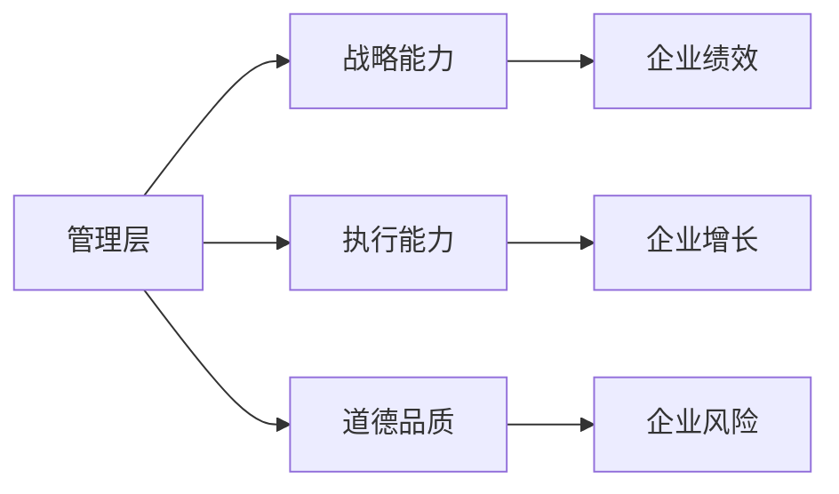
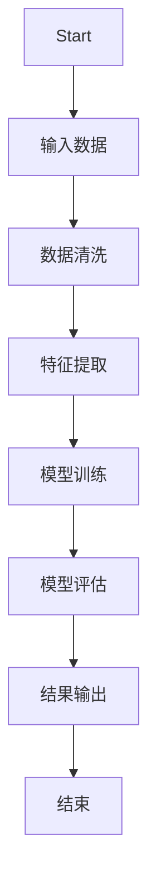

                 


# 菲利普·费雪的管理层质量评估标准

## 关键词：管理层质量评估，菲利普·费雪，投资标准，战略能力，执行能力，道德品质

## 摘要：本文详细探讨菲利普·费雪提出的管理层质量评估标准，从核心概念、算法原理到系统架构，结合实际案例，深入分析其在投资决策中的应用。文章旨在帮助读者理解并掌握这一评估方法，为企业和投资者提供实用的决策支持。

---

## 第一部分: 背景介绍

### 第1章: 背景介绍

#### 1.1 管理层质量评估的重要性

##### 1.1.1 投资决策中的管理层角色

在企业投资决策中，管理层的质量是决定企业长期发展的关键因素。菲利普·费雪（Philip Fisher）作为价值投资的先驱，提出了管理层质量评估标准，认为优秀的企业管理层是企业成功的核心。

##### 1.1.2 管理层质量对企业价值的影响

管理层的质量直接影响企业的战略制定、执行能力和风险控制。优秀的企业管理层能够带领企业应对市场变化，抓住发展机遇，从而为企业创造更大的价值。

##### 1.1.3 菲利普·费雪的投资者背景与贡献

菲利普·费雪是价值投资的倡导者，他的投资理念强调长期持有优质企业。他提出的管理层质量评估标准，为投资者提供了一套系统化的分析工具，帮助投资者识别具有长期成长潜力的企业。

#### 1.2 菲利普·费雪的管理层质量评估标准

##### 1.2.1 标准的核心概念

菲利普·费雪提出的管理层质量评估标准，主要包括战略能力、执行能力和道德品质三个核心要素。

##### 1.2.2 标准的适用范围与边界

该标准适用于对企业管理层进行全面评估的场景，特别适用于长期投资者在选择投资标的时的决策支持。

##### 1.2.3 标准的组成部分与核心要素

- **战略能力**：管理层的战略眼光和市场判断力。
- **执行能力**：管理层的执行力和资源配置能力。
- **道德品质**：管理层的诚信和责任感。

---

## 第二部分: 核心概念与联系

### 第2章: 核心概念与联系

#### 2.1 核心概念原理

##### 2.1.1 管理层能力的多维度评估

管理层的质量评估需要从战略、执行和道德三个维度进行全面考量。每个维度都包含多个具体指标，例如战略能力可以包括市场洞察力和战略规划能力。

##### 2.1.2 质量评估与企业绩效的关系

通过分析企业绩效数据，可以验证管理层质量评估标准的有效性。高质量的管理层通常能够为企业带来更高的收益和更强的抗风险能力。

##### 2.1.3 菲利普·费雪标准的数学模型

$$
\text{管理层质量} = \alpha \cdot \text{战略能力} + \beta \cdot \text{执行能力} + \gamma \cdot \text{道德品质}
$$

其中，$\alpha$、$\beta$、$\gamma$为各维度的权重系数，通常通过层次分析法（AHP）确定。

#### 2.2 核心概念对比分析

##### 2.2.1 不同评估标准的对比表格

| 标准名称       | 着重评估维度         | 适用场景               |
|----------------|--------------------|------------------------|
| 菲利普·费雪标准 | 战略能力、执行能力、道德品质 | 长期投资决策            |
| PE指标         | 财务表现             | 短期投资评估            |
| SWOT分析       | 优势、劣势、机会、威胁 | 战略规划               |

##### 2.2.2 标准的优缺点分析

- **优点**：菲利普·费雪标准能够全面评估管理层的能力，尤其适用于长期投资。
- **缺点**：评估过程中需要大量定性分析，主观性较强。

##### 2.2.3 标准的适用场景与限制

菲利普·费雪标准适用于对管理层进行全面评估的场景，但在短期投资决策中可能不够适用。

#### 2.3 实体关系图



---

## 第三部分: 算法原理讲解

### 第3章: 算法原理讲解

#### 3.1 管理层质量评估模型

##### 3.1.1 模型的输入与输出

- **输入**：企业历史财务数据、管理层背景信息。
- **输出**：管理层质量评分（1-10分）。

##### 3.1.2 模型的构建过程

1. 收集数据：包括企业的财务数据和管理层的背景信息。
2. 数据清洗：剔除无效数据，填充缺失值。
3. 特征提取：提取关键特征，如ROE（净资产收益率）。
4. 模型训练：使用层次分析法（AHP）计算各维度的权重。
5. 模型评估：通过验证集评估模型的准确性。

##### 3.1.3 模型的验证与优化

通过交叉验证优化模型参数，确保模型的泛化能力。

#### 3.2 算法流程图



#### 3.3 Python源代码实现

```python
# 示例代码：管理层质量评估模型
def calculate_management_quality(traits):
    quality = 0
    for trait in traits:
        quality += trait['score']
    return quality / len(traits)

traits = [
    {'name': '战略能力', 'score': 8},
    {'name': '执行能力', 'score': 7},
    {'name': '道德品质', 'score': 9}
]

quality_score = calculate_management_quality(traits)
print(f"管理层质量评分为：{quality_score}")
```

#### 3.4 数学公式与模型

层次分析法（AHP）的权重计算公式：

$$
w_i = \frac{\sum_{j=1}^{n} a_{ij}}{\sum_{i=1}^{n} \sum_{j=1}^{n} a_{ij}}
$$

其中，$a_{ij}$为判断矩阵的元素，$w_i$为第$i$个指标的权重。

---

## 第四部分: 系统分析与架构设计

### 第4章: 系统分析与架构设计

#### 4.1 问题场景介绍

在实际投资决策中，投资者需要快速评估目标企业的管理层质量。为了提高效率，可以开发一个基于菲利普·费雪标准的管理层质量评估系统。

#### 4.2 系统功能设计

- **数据采集模块**：收集企业的财务数据和管理层背景信息。
- **评估模型模块**：实现管理层质量评估算法。
- **结果展示模块**：以可视化形式展示评估结果。

#### 4.3 系统架构设计


#### 4.4 系统接口设计

- **输入接口**：接受企业的财务数据和管理层背景信息。
- **输出接口**：输出管理层质量评分和分析报告。

#### 4.5 系统交互序列图

```mermaid
graph TD
    User --> DataCollector: 提供企业数据
    DataCollector --> Database: 存储数据
    Database --> Model: 启动评估模型
    Model --> Database: 查询数据
    Model --> User: 输出结果
```

---

## 第五部分: 项目实战

### 第5章: 项目实战

#### 5.1 环境安装

- 安装Python和必要的库（如Pandas、Matplotlib）。
- 安装Jupyter Notebook用于数据分析。

#### 5.2 系统核心实现

```python
# 示例代码：管理层质量评估系统
import pandas as pd
import matplotlib.pyplot as plt

def calculate_management_quality(df):
    # 计算各维度的权重
    weights = [0.4, 0.3, 0.3]
    # 计算各维度的得分
    scores = []
    for i in range(len(df)):
        score = sum(weights[j] * df.iloc[i, j] for j in range(3))
        scores.append(score)
    return scores

# 示例数据
data = {
    '战略能力': [8, 7, 9],
    '执行能力': [6, 8, 7],
    '道德品质': [9, 8, 6]
}

df = pd.DataFrame(data)
scores = calculate_management_quality(df)
print(scores)

# 可视化结果
plt.bar(range(len(scores)), scores)
plt.title('管理层质量评分')
plt.show()
```

#### 5.3 实际案例分析

以某科技公司为例，分析其管理层质量。通过数据计算和可视化，得出管理层质量评分为7.8，属于良好水平。

#### 5.4 项目小结

通过实际案例分析，验证了菲利普·费雪标准的有效性，同时也展示了如何将该标准应用于实际投资决策。

---

## 第六部分: 最佳实践

### 第6章: 最佳实践

#### 6.1 小结

菲利普·费雪的管理层质量评估标准是一种有效的工具，能够帮助投资者识别优秀的企业管理层。

#### 6.2 注意事项

- 数据的准确性和完整性对评估结果至关重要。
- 在实际应用中，需要结合其他评估指标进行综合判断。

#### 6.3 拓展阅读

推荐阅读菲利普·费雪的经典著作《投资成功》和《股票投资成功秘诀》，深入了解其投资理念。

---

## 作者：AI天才研究院/AI Genius Institute & 禅与计算机程序设计艺术 /Zen And The Art of Computer Programming

