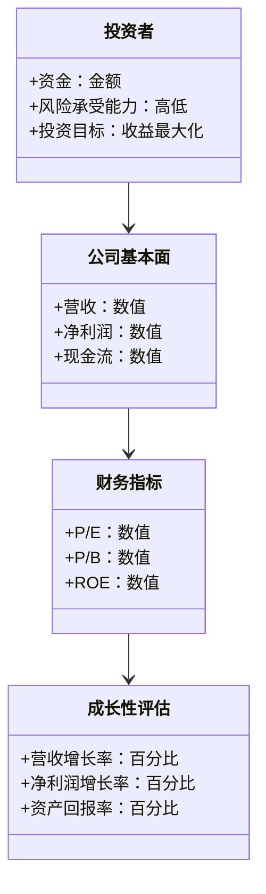

                 


# 《菲利普·费雪：成长型价值投资的先驱》

## 关键词：菲利普·费雪, 成长型投资, 价值投资, 股票投资, 股票分析, 财务指标, 投资策略

## 摘要：菲利普·费雪是成长型价值投资的先驱，他的投资理念深刻影响了现代投资策略。本文详细分析了他的成长型投资方法，包括公司基本面分析、财务指标评估和投资策略选择。通过实际案例和系统架构设计，揭示了费雪的投资模型如何帮助投资者做出明智决策。文章还探讨了如何在当前市场环境中应用这些原则，提供最佳实践和注意事项。

---

# 第一部分：投资的背景与菲利普·费雪的贡献

## 第1章：投资的定义与历史演变

### 1.1 投资的定义与核心要素
- **投资的基本概念**：资金的长期配置以获取收益。
- **核心要素**：资金、时间、风险与收益的平衡。
- **投资与投机的区别**：前者注重长期价值，后者追求短期收益。

### 1.2 股票市场的历史发展
- **股票市场的起源**：17世纪的荷兰郁金香泡沫。
- **市场的演变**：从早期的现货交易到现代多层次市场。
- **现状分析**：全球市场的互联互通与数字化转型。

## 第2章：菲利普·费雪的生平与贡献
- **生平简介**：教育背景、职业历程和投资哲学。
- **主要贡献**：提出成长型投资概念，强调公司基本面分析。
- **影响分析**：对现代投资理论和实践的深远影响。

---

# 第二部分：成长型投资的核心概念

## 第3章：成长型投资的定义与特点

### 3.1 成长型投资的定义
- **基本概念**：投资于具有高成长潜力的公司。
- **核心要素**：长期视角、成长性评估、风险控制。
- **投资目标**：资本增值，而非短期收益。

### 3.2 成长型投资的特点
- **高成长性的公司**：营收和利润持续增长。
- **长期投资视角**：注重公司长期发展，而非短期波动。
- **风险与收益的平衡**：接受波动以追求更高回报。

## 第4章：成长型投资与其他投资策略的对比

### 4.1 价值投资与成长型投资的对比
- **价值投资**：寻找价格低于内在价值的股票。
- **成长型投资**：关注具有高成长潜力的公司。
- **异同点**：价值投资注重安全边际，成长型投资注重未来增长。

### 4.2 其他投资策略的对比
- **技术分析**：基于价格和成交量预测市场走势。
- **避险投资**：通过对冲降低市场风险。
- **短期交易策略**：频繁买卖以捕捉短期价格波动。

---

# 第三部分：成长型投资的算法与数学模型

## 第5章：成长型投资的筛选标准

### 5.1 公司基本面分析
- **收入与利润分析**：营收增长、利润 margin 的稳定性。
- **财务健康状况评估**：现金流、负债水平、ROE。
- **行业地位与竞争优势**：市场领导者、技术壁垒、品牌影响力。

### 5.2 成长性评估指标
- **营收增长率**：过去几年的年均增长率。
- **净利润增长率**：净利润的年均增长情况。
- **资产回报率（ROA）**：衡量资产使用效率。

## 第6章：数学模型与公式

### 6.1 常用的财务指标公式
- **市盈率（P/E）**：股价 / 每股净利润。
- **市净率（P/B）**：股价 / 每股净资产。
- **股息率（Dividend Yield）**：每股股息 / 股价。

### 6.2 成长性评估模型
- **内部成长模型**：分析公司内部管理效率和创新能力。
- **外部成长模型**：评估行业增长潜力和市场需求。

---

# 第四部分：系统分析与架构设计

## 第7章：投资系统功能设计

### 7.1 问题场景介绍
- 投资者希望筛选高成长潜力的股票，降低投资风险。

### 7.2 领域模型设计


### 7.3 系统架构设计
```mermaid
architecturalDiagram
    architecture 系统架构 {
        component 投资者模块 {
            use case 浏览公司列表
            use case 筛选高成长公司
        }
        component 公司基本面模块 {
            use case 提供营收数据
            use case 提供净利润数据
        }
        component 财务指标模块 {
            use case 计算P/E
            use case 计算P/B
        }
        component 成长性评估模块 {
            use case 计算营收增长率
            use case 计算净利润增长率
        }
    }
```

### 7.4 系统接口设计
- API接口：获取公司基本面数据、计算财务指标、评估成长性。

### 7.5 系统交互设计
```mermaid
sequenceDiagram
    投资者模块 -> 公司基本面模块：请求公司营收数据
    公司基本面模块 -> 返回营收数据
    投资者模块 -> 财务指标模块：请求计算P/E
    财务指标模块 -> 返回P/E值
    投资者模块 -> 成长性评估模块：评估公司成长性
    成长性评估模块 -> 返回成长性评估结果
```

---

# 第五部分：项目实战与案例分析

## 第8章：环境安装与核心实现

### 8.1 环境安装
- 安装Python和必要的库（Pandas、NumPy、Matplotlib）。

### 8.2 核心代码实现
```python
import pandas as pd
import numpy as np

def calculate_growth_rate(revenue_list):
    growth_rates = []
    for i in range(1, len(revenue_list)):
        growth_rate = (revenue_list[i] - revenue_list[i-1]) / revenue_list[i-1]
        growth_rates.append(growth_rate)
    return growth_rates

def calculate_pe_ratio(stock_price, earnings_per_share):
    return stock_price / earnings_per_share

# 示例数据
revenue = [100, 150, 200, 250]
growth_rates = calculate_growth_rate(revenue)
print("营收增长率:", growth_rates)

stock_price = 50
earnings_per_share = 5
pe_ratio = calculate_pe_ratio(stock_price, earnings_per_share)
print("市盈率:", pe_ratio)
```

## 第9章：实际案例分析

### 9.1 案例介绍
- 以科技公司为例，分析其营收增长率、净利润增长率、P/E、P/B等指标。

### 9.2 应用解读
- 使用Python代码计算成长性指标，评估公司的投资价值。

---

# 第六部分：最佳实践与总结

## 第10章：最佳实践与注意事项

### 10.1 投资策略的注意事项
- 定期重新评估投资组合。
- 避免过度集中在单一行业或公司。
- 保持对市场的敏感性，及时调整策略。

### 10.2 小结与展望
- 费雪的成长型投资理念在现代仍具有重要价值。
- 结合新技术和数据分析工具，优化投资决策。

---

# 作者：AI天才研究院 & 禅与计算机程序设计艺术

---

通过以上目录结构，文章将系统地介绍菲利普·费雪的成长型价值投资理念，结合理论分析、系统设计和实际案例，帮助读者深入理解并应用这些投资策略。

