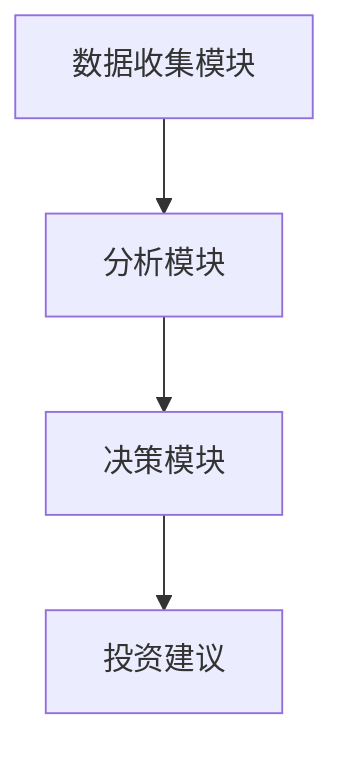
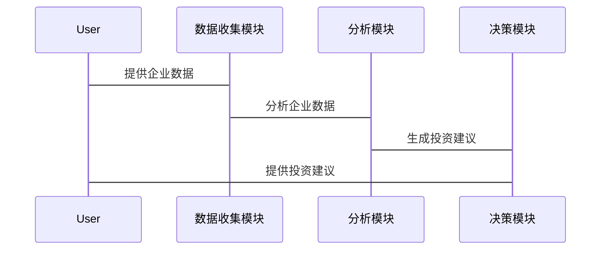

                 

<think>
好的，我需要按照用户的要求，逐步分析并撰写一篇关于菲利普·费雪产业分析框架的技术博客。首先，我需要理解用户的需求，他们希望文章结构清晰、内容深入，涵盖背景介绍、核心概念、算法原理、系统分析、项目实战和最佳实践等部分。

首先，我应该先回顾菲利普·费雪的生平及其投资理念。他被誉为成长股投资之父，提出了“烟蒂投资”和“成长股投资”的概念。他的投资哲学强调长期持有和深入的基本面分析，这为我后续的分析奠定了基础。

接下来，我需要明确产业分析框架的核心概念，包括竞争优势、成长性和管理层质量。竞争优势是指企业在行业中相对于竞争对手的独特优势，这可能包括成本优势、技术优势或市场支配地位。成长性则是指企业在未来一段时间内收入和利润的增长潜力。管理层质量同样重要，优秀的管理层能够带领企业持续成长。

在算法原理部分，我需要将费雪的分析框架转化为可操作的步骤。例如，筛选具有高成长性的企业，可以通过分析过去几年的收入增长率和净利润增长率，同时考虑市盈率是否合理。此外，我可能需要设计一个筛选模型，使用Python代码来实现这些计算。

系统分析部分，我需要构建一个产业分析系统，包括数据收集模块、分析模块和决策模块。数据收集模块负责获取企业的财务数据和行业报告；分析模块运用费雪的框架进行评估；决策模块基于分析结果生成投资建议。这部分可能需要用到数据可视化工具，如Matplotlib或Seaborn，来展示分析结果。

项目实战部分，我需要选择一个具体产业，比如科技行业，应用费雪的框架进行分析。首先，收集相关企业的财务数据，然后进行筛选，找出符合高成长性和竞争优势的企业，最后设计一个投资组合并进行模拟交易。

最后，总结最佳实践，强调持续学习和关注市场变化的重要性。同时，提醒读者注意风险，如市场波动和企业基本面变化。

在整个过程中，我需要确保每个部分都有详细的解释和例子，使用清晰的逻辑结构和专业的技术术语。同时，确保文章符合用户要求的格式，包括使用Markdown，插入Mermaid图表和Python代码示例。

现在，我可以开始撰写每个章节的具体内容，确保涵盖所有必要的部分，并按照用户提供的目录结构展开。这将帮助读者系统地理解菲利普·费雪的产业分析框架，并能够实际应用到投资决策中。
</think>

# 菲利普·费雪的产业分析框架

> 关键词：菲利普·费雪，产业分析，投资框架，成长股，竞争优势

> 摘要：本文深入探讨菲利普·费雪的产业分析框架，分析其核心概念、算法原理及实际应用，帮助投资者理解和应用这一经典投资方法。

---

## 第一章：菲利普·费雪的生平与投资哲学

### 1.1 菲利普·费雪的生平简介

菲利普·费雪（Philip A. Fisher）是20世纪著名的投资家和价值投资者，被誉为“成长股投资之父”。他出生于1907年，早年在银行工作，后来转向股票投资。费雪的职业生涯中，他管理的资金表现出色，尤其在成长股投资方面取得了显著的成绩。

#### 1.1.1 菲利普·费雪的早年经历

费雪在早期的职业生涯中，通过阅读大量投资书籍和研究市场趋势，逐渐形成了自己的投资理念。他尤其关注企业的基本面和成长潜力，而非市场的短期波动。

#### 1.1.2 菲利普·费雪的投资生涯

费雪在投资生涯中，强调长期持有优质成长股，反对频繁交易。他的投资策略基于对企业深入研究和长期观察。

#### 1.1.3 菲利普·费雪的主要著作与贡献

费雪的著作《成长股投资》是投资界的经典之作，书中详细阐述了成长股投资的策略和方法，影响了无数投资者。

### 1.2 菲利普·费雪的投资哲学

费雪的投资哲学以长期投资和深入分析为核心，强调选择那些具有强大竞争优势和持续成长潜力的企业。

#### 1.2.1 长期投资与价值发现

费雪认为，投资的目的是找到那些能够持续增长的企业，长期持有这些企业，避免短期市场的波动干扰。

#### 1.2.2 成长股投资的核心理念

费雪的成长股投资理念强调企业的成长潜力，而非当前的估值。他提出，投资者应寻找那些收入和利润持续增长的企业。

#### 1.2.3 股票分析的三大支柱

费雪的股票分析基于三个核心要素：竞争优势、成长性和管理层质量。

---

## 第二章：产业分析框架的定义与背景

### 2.1 产业分析的基本概念

产业分析是通过对行业结构、竞争格局和市场趋势的研究，评估企业在行业中的位置和潜力。

#### 2.1.1 产业的定义与分类

产业是指一组提供相似产品或服务的企业，通常分为多个细分市场。例如，科技产业可以细分为软件、硬件、互联网等多个领域。

#### 2.1.2 产业分析的必要性

产业分析帮助投资者理解行业趋势，识别潜在的投资机会和风险。通过分析行业结构，投资者可以更好地评估企业的竞争优势。

#### 2.1.3 菲利普·费雪产业分析的独特性

费雪的产业分析框架强调企业的成长性和竞争优势，而非仅仅关注行业整体表现。

### 2.2 产业分析框架的背景

#### 2.2.1 经济周期与产业分析的关系

经济周期影响产业表现，不同阶段的经济周期适合不同类型的企业。例如，衰退期适合防御性行业，而复苏期适合周期性行业。

#### 2.2.2 技术进步对产业分析的影响

技术进步改变行业结构，推动创新，创造新的投资机会。例如，互联网技术推动了科技产业的成长。

#### 2.2.3 市场结构与竞争格局的变化

市场结构的变化影响企业的竞争地位。例如，垄断行业可能限制企业的增长空间，而竞争激烈的行业可能提供更多的创新机会。

---

## 第三章：产业分析框架的核心要素

### 3.1 产业的竞争优势分析

竞争优势是企业在行业中相对于竞争对手的独特优势，能够持续为企业创造超额利润。

#### 3.1.1 什么是竞争优势

竞争优势包括成本优势、技术优势、品牌优势和市场支配地位等。例如，苹果公司的品牌和技术优势使其在科技产业中占据领先地位。

#### 3.1.2 竞争优势的来源

竞争优势来源于企业的资源、能力、战略和市场定位。例如，沃尔玛的成本控制能力使其在零售业中具有竞争优势。

#### 3.1.3 菲利普·费雪对竞争优势的定义

费雪认为，竞争优势是企业在长期增长中能够持续保持高于行业平均水平盈利能力的关键因素。

### 3.2 产业的成长性分析

成长性分析评估企业在未来一段时间内的收入和利润增长潜力。

#### 3.2.1 成长性的定义与衡量标准

成长性是指企业在未来几年内收入和利润的预期增长率。常用的衡量指标包括收入增长率和净利润增长率。

#### 3.2.2 市场需求与成长性的关系

市场需求的增长直接推动企业的成长。例如，智能手机市场的快速增长推动了相关企业的成长。

#### 3.2.3 菲利普·费雪的成长股筛选标准

费雪的成长股筛选标准包括收入和利润持续增长、合理的市盈率、稳定的收益能力和强大的管理层。

### 3.3 产业的管理

管理层的质量和战略决策能力对企业的成长至关重要。

#### 3.3.1 管理层质量的重要性

优秀的管理层能够制定正确的战略，带领企业持续成长。例如，特斯拉的管理层在电动汽车领域的创新推动了公司的快速发展。

#### 3.3.2 菲利普·费雪对管理层的评估

费雪强调管理层的诚信、能力和决策能力，认为这些因素是企业长期成长的关键。

---

## 第四章：产业分析框架的算法原理

### 4.1 菲利普·费雪分析框架的算法概述

费雪的分析框架通过对企业基本面的深入研究，筛选出具有强大竞争优势和成长潜力的企业。

#### 4.1.1 数据收集与处理

收集企业的财务数据、行业报告和市场信息，进行数据清洗和整理。

#### 4.1.2 竞争优势评估

基于财务数据和市场信息，评估企业的竞争优势，例如成本优势和品牌优势。

#### 4.1.3 成长性分析

计算企业的收入增长率和净利润增长率，评估其成长潜力。

### 4.2 算法实现的Python代码

```python
import pandas as pd
import numpy as np

# 假设df是企业的财务数据，包含收入增长率和净利润增长率
# 筛选具有竞争优势和成长潜力的企业
def fisher_framework(df):
    # 计算平均收入增长率
    avg_income_growth = df['收入增长率'].mean()
    # 计算平均净利润增长率
    avg_net_profit_growth = df['净利润增长率'].mean()
    
    # 筛选收入增长率高于平均的企业
    high_income_growth = df[df['收入增长率'] > avg_income_growth]
    # 筛选净利润增长率高于平均的企业
    high_net_profit_growth = high_income_growth[high_income_growth['净利润增长率'] > avg_net_profit_growth]
    
    return high_net_profit_growth

# 示例数据
data = {
    '企业名称': ['企业A', '企业B', '企业C'],
    '收入增长率': [15, 20, 18],
    '净利润增长率': [10, 15, 12]
}
df = pd.DataFrame(data)

# 应用费雪框架筛选
result = fisher_framework(df)
print(result)
```

---

## 第五章：产业分析框架的系统分析

### 5.1 产业分析系统的总体架构

系统架构包括数据收集模块、分析模块和决策模块，各模块协同工作以实现产业分析的目标。

#### 5.1.1 数据收集模块

数据收集模块负责从多个来源获取企业的财务数据和市场信息，包括财务报表和行业报告。

#### 5.1.2 分析模块

分析模块基于费雪的产业分析框架，对企业进行竞争优势和成长性评估。

#### 5.1.3 决策模块

决策模块根据分析结果，生成投资建议和投资组合。

### 5.2 系统架构设计

使用Mermaid绘制系统架构图：



### 5.3 系统交互设计

使用Mermaid绘制系统交互流程图：



---

## 第六章：产业分析框架的项目实战

### 6.1 项目背景与目标

选择一个具体产业，如科技产业，应用费雪的框架进行分析。

#### 6.1.1 项目背景

科技产业是成长性较高的行业，适合应用费雪的分析框架。

#### 6.1.2 项目目标

筛选出科技产业中具有强大竞争优势和成长潜力的企业。

### 6.2 数据收集与清洗

收集科技产业的相关企业数据，包括财务数据和市场信息。

#### 6.2.1 数据收集

使用网络爬虫或API获取企业的财务数据和市场信息。

#### 6.2.2 数据清洗

对数据进行清洗，处理缺失值和异常值。

### 6.3 分析与评估

基于费雪的框架，评估企业的竞争优势和成长潜力。

#### 6.3.1 竞争优势评估

评估企业的成本优势和技术优势。

#### 6.3.2 成长性分析

计算企业的收入增长率和净利润增长率。

### 6.4 投资组合设计

根据分析结果，设计投资组合，分散风险，优化收益。

#### 6.4.1 投资组合构成

选择具有强大竞争优势和成长潜力的企业，构建投资组合。

#### 6.4.2 风险管理

定期评估投资组合，调整持仓，应对市场变化。

---

## 第七章：最佳实践与小结

### 7.1 最佳实践

#### 7.1.1 持续学习与更新

投资环境不断变化，投资者需要持续学习，更新知识和技能。

#### 7.1.2 严格筛选企业

在应用费雪框架时，要严格筛选企业，确保投资标的具有强大的竞争优势和成长潜力。

#### 7.1.3 保持投资纪律

遵循投资计划，避免情绪化决策，保持投资纪律。

### 7.2 小结

菲利普·费雪的产业分析框架是一种有效的投资工具，通过深入分析企业的基本面，筛选出具有强大竞争优势和成长潜力的企业。投资者在实际应用中，需要结合市场环境和企业具体情况，灵活调整分析框架。

---

## 作者：AI天才研究院/AI Genius Institute & 禅与计算机程序设计艺术 /Zen And The Art of Computer Programming

---

以上是《菲利普·费雪的产业分析框架》的完整目录和内容概要，涵盖了从背景介绍、核心概念、算法原理到系统分析和项目实战的全过程。通过逐步分析和详细讲解，帮助读者全面理解并应用这一经典的投资框架。

