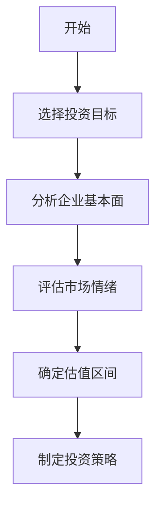
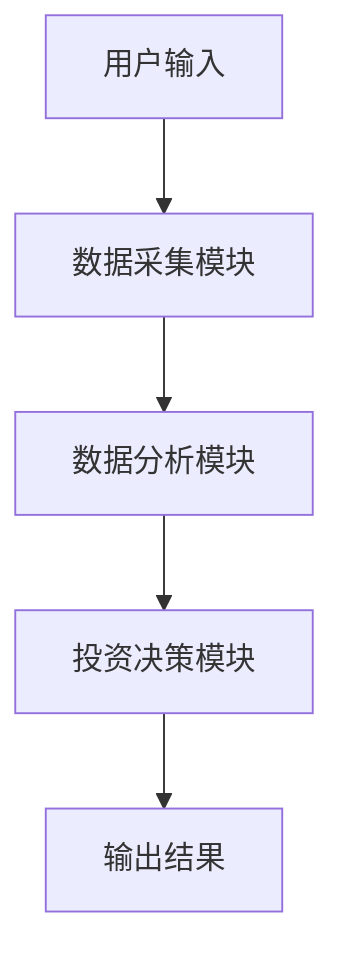
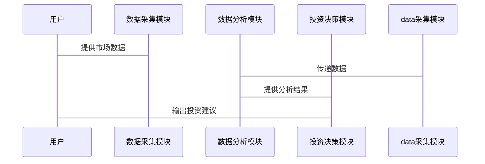

                 


# 詹姆斯·蒙蒂尔的价值投资心理学

## 关键词：价值投资心理学，投资决策，心理偏差，詹姆斯·蒙蒂尔，投资策略

## 摘要：  
价值投资心理学是投资领域的重要分支，研究投资者心理因素对投资决策的影响。本文以詹姆斯·蒙蒂尔的理论为基础，分析价值投资中的心理偏差、决策框架、数学模型，并构建投资决策支持系统。文章结合理论与实践，帮助投资者优化决策过程，提升投资效果。

---

## 第一部分: 价值投资心理学的背景与基础

### 第1章: 价值投资与心理学概述

#### 1.1 价值投资的核心概念
##### 1.1.1 价值投资的定义与内涵
价值投资是一种长期投资策略，强调以低于内在价值的价格购买优质资产。其核心在于识别市场的非理性定价，通过深入分析企业基本面，寻找具有长期竞争优势的企业。

##### 1.1.2 投资者的心理基础
投资者的心理特征和认知偏差直接影响决策过程。情绪波动、过度自信等心理因素可能导致非理性决策，影响投资结果。

##### 1.1.3 詹姆斯·蒙蒂尔的理论体系
蒙蒂尔强调安全边际和逆向思维。他提出，市场先生的情绪波动为投资者提供了以合理价格买入优质资产的机会。通过分析市场情绪和企业基本面，投资者可以在市场恐慌时寻找低估资产。

#### 1.2 投资者心理与行为分析
##### 1.2.1 投资者的心理特征
投资者通常具有风险偏好、风险厌恶和风险中立三种类型。不同心理特征影响其对风险和收益的权衡。

##### 1.2.2 常见的心理偏差
1. **过度自信**：投资者倾向于高估自己的能力，忽视不确定性。
2. **确认偏差**：倾向于寻找支持已有观点的信息，忽略反面证据。
3. **损失厌恶**：对损失的厌恶程度远超过对收益的追求，导致卖出优质资产。

##### 1.2.3 心理因素对投资决策的影响
心理偏差可能导致误判市场趋势和企业价值，引发非理性交易行为。例如，恐慌性抛售或贪婪性追涨。

---

## 第二部分: 价值投资心理学的核心概念与联系

### 第3章: 投资决策中的心理偏差与行为偏差

#### 3.1 常见心理偏差的分类与对比
| **心理偏差类型** | **描述** | **影响** |
|------------------|----------|----------|
| 认知偏差          | 对信息处理的偏差 | 导致误判企业价值 |
| 情绪偏差          | 情绪影响决策 | 造成非理性交易 |
| 社会偏差          | 受市场情绪影响 | 影响投资判断 |

#### 3.2 心理偏差对投资决策的影响
心理偏差可能导致以下行为：
- 追涨杀跌：市场上涨时买入，下跌时卖出。
- 过度交易：频繁买卖以追求短期收益，增加成本。
- 从众心理：跟随市场趋势，忽视独立分析。

### 第4章: 价值投资中的决策框架与模型

#### 4.1 决策框架的构建
##### 4.1.1 信息处理流程
1. 数据采集：收集企业财务数据、行业信息和市场情绪。
2. 信息分析：评估企业竞争优势、财务健康和估值水平。
3. 决策制定：基于分析结果制定投资策略。

##### 4.1.2 决策树模型


##### 4.1.3 投资决策矩阵
| **市场状态** | **企业基本面** | **投资决策** |
|--------------|----------------|--------------|
| 看涨          | 优秀          | 买入         |
| 看涨          | 一般          | 观望         |
| 看跌          | 优秀          | 增持         |
| 看跌          | 一般          | 卖出         |

#### 4.2 投资模型的数学分析
##### 4.2.1 投资评分模型
公式：$$S = \alpha \cdot P + \beta \cdot V + \gamma \cdot Q$$
其中，$P$为盈利能力，$V$为估值水平，$Q$为竞争优势，$\alpha$、$\beta$、$\gamma$为权重系数。

##### 4.2.2 投资组合优化模型
使用均值-方差优化模型：
$$\text{Minimize } \sigma^2 \text{ subject to } \mu \geq \text{目标收益}$$

---

## 第三部分: 价值投资心理学的算法原理与数学模型

### 第5章: 投资决策算法的原理与实现

#### 5.1 基于蒙蒂尔策略的决策树算法
##### 5.1.1 决策树的构建流程
1. 确定决策目标：最大化投资回报。
2. 选择特征：企业基本面、估值水平、市场情绪。
3. 划分数据：根据特征进行节点分裂。
4. 剪枝优化：避免过拟合，提升泛化能力。

##### 5.1.2 决策树的分类与回归
使用Python实现决策树分类：
```python
from sklearn.tree import DecisionTreeClassifier
model = DecisionTreeClassifier()
model.fit(X_train, y_train)
y_pred = model.predict(X_test)
```

#### 5.2 投资评分模型的数学公式
公式：$$S = \alpha \cdot P + \beta \cdot V + \gamma \cdot Q$$
权重系数通过历史数据训练确定，确保模型预测准确。

### 第6章: 投资组合优化的数学模型与实现

#### 6.1 投资组合优化的数学模型
##### 6.1.1 均值-方差优化模型
$$\text{Minimize } \sigma^2 \text{ subject to } \mu \geq \text{目标收益}$$

##### 6.1.2 Markowitz有效前沿模型
构建有效前沿，确定最优风险收益组合。

#### 6.2 投资组合优化的算法实现
##### 6.2.1 基于Python的优化代码示例
```python
import numpy as np
from scipy.optimize import minimize

def portfolio_optimization(returns, weights):
    n = len(weights)
    def objective(weights):
        return (weights.T @ returns @ weights) * 0.5
    constraints = [{'type': 'eq', 'fun': lambda w: sum(w) - 1}]
    result = minimize(objective, np.ones(n)/n, constraints)
    return result.x

returns = np.array([...])
weights = portfolio_optimization(returns, np.ones(len(returns)))
```

---

## 第四部分: 价值投资心理学的系统分析与架构设计

### 第7章: 投资决策支持系统的架构设计

#### 7.1 系统功能模块设计
##### 7.1.1 数据采集模块
收集企业财务数据、市场情绪等信息。

##### 7.1.2 数据分析模块
分析企业基本面、估值水平，评估市场情绪。

##### 7.1.3 投资决策模块
基于分析结果，制定投资策略。

#### 7.2 系统架构图


#### 7.3 系统交互序列图


---

## 第五部分: 项目实战

### 第8章: 投资决策支持系统的实现

#### 8.1 环境安装
安装必要的库：
```bash
pip install numpy pandas matplotlib scikit-learn
```

#### 8.2 系统核心实现源代码
##### 8.2.1 数据分析模块
```python
import pandas as pd
import numpy as np

def analyze_company(data):
    # 计算财务指标
    return data
```

##### 8.2.2 投资决策模块
```python
def make_decision(data):
    # 基于数据分析结果制定决策
    return decision
```

#### 8.3 实际案例分析
分析某公司案例，展示系统如何根据数据制定投资策略。

#### 8.4 项目小结
总结项目实现过程中的关键点和经验教训。

---

## 第五部分: 总结与展望

### 第9章: 价值投资心理学的总结与展望

#### 9.1 投资心理学的最佳实践
1. 定期复盘，分析决策偏差。
2. 建立情绪管理机制，避免非理性决策。
3. 持续学习，优化决策框架。

#### 9.2 小结
价值投资心理学帮助投资者理解心理因素对决策的影响，优化投资策略。通过理论与实践结合，投资者可以提升决策质量，实现长期收益。

#### 9.3 注意事项
- 避免过度依赖模型，保持独立思考。
- 定期审视投资组合，及时调整策略。

#### 9.4 拓展阅读
推荐相关书籍和资源，帮助读者深入学习价值投资心理学。

---

## 作者：AI天才研究院 & 禅与计算机程序设计艺术

---

这篇文章系统地分析了詹姆斯·蒙蒂尔的价值投资心理学，结合理论与实践，帮助投资者优化决策过程。通过详细分析心理偏差、构建决策模型和设计投资系统，为投资者提供了实用的工具和方法。

