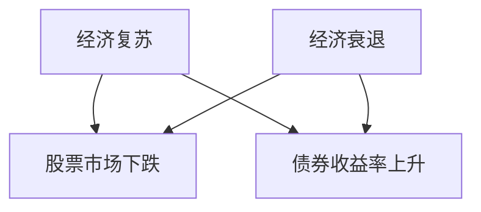
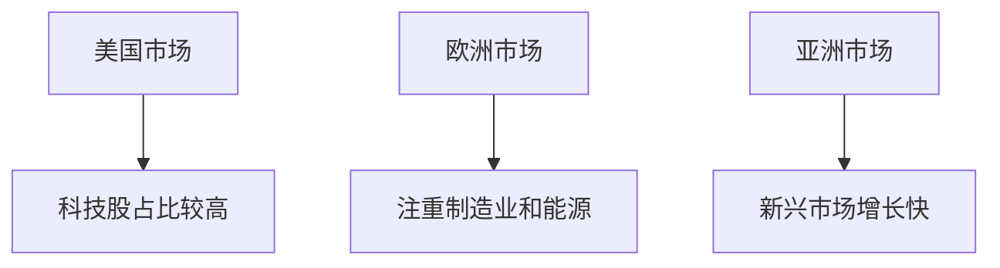
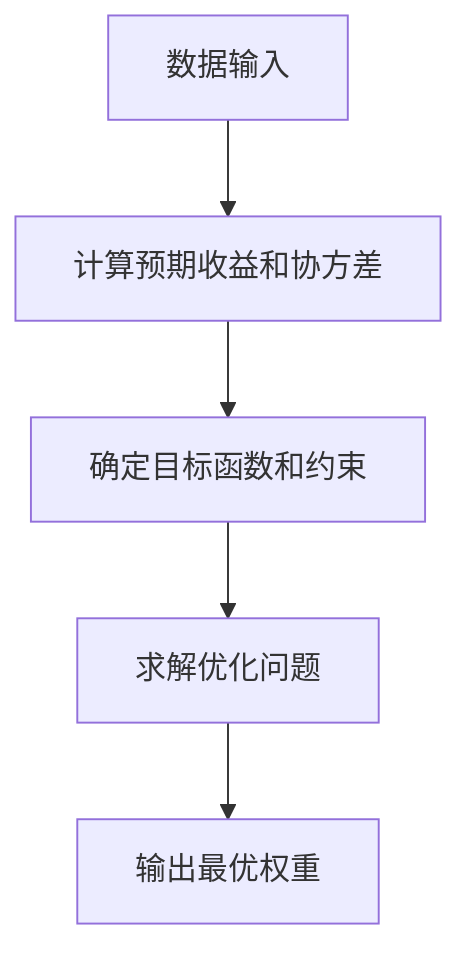
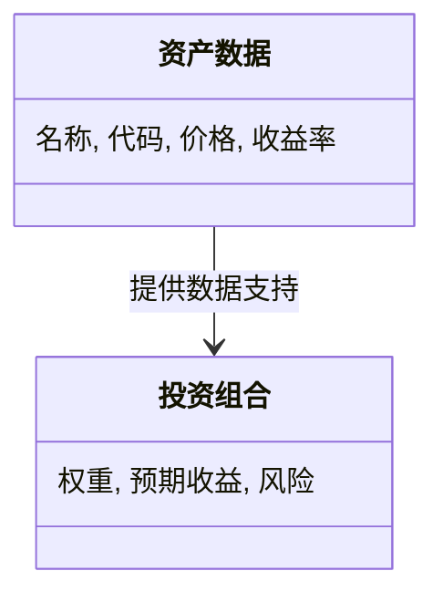
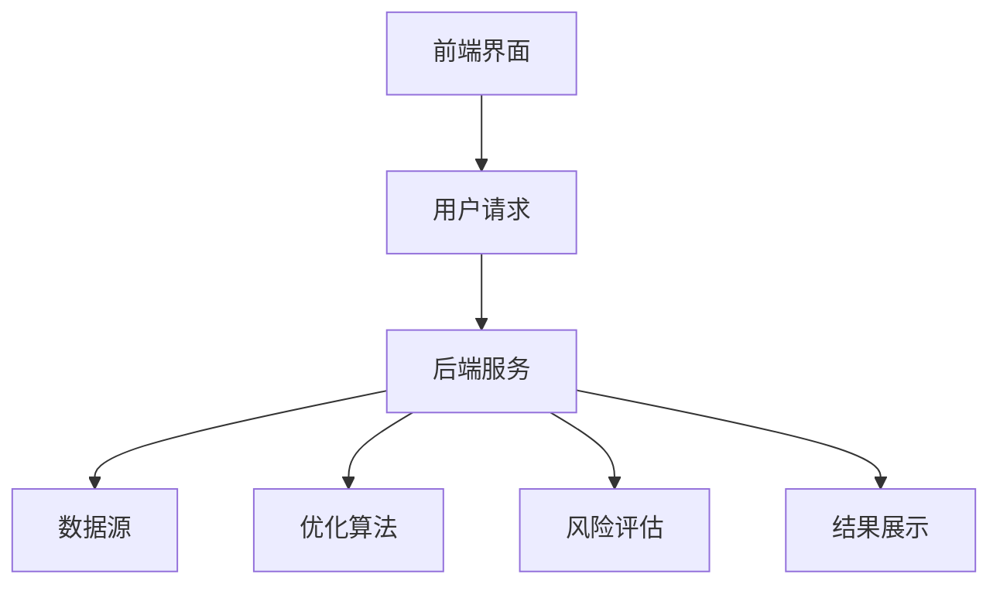
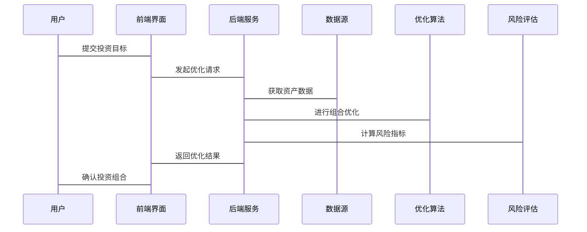

                 


# 詹姆斯·蒙蒂尔的全球价值投资组合构建

> 关键词：价值投资、投资组合、资产配置、风险管理、全球投资、投资策略

> 摘要：本文系统地探讨了詹姆斯·蒙蒂尔的全球价值投资策略，从理论基础到实际操作，详细分析了投资组合构建的核心概念、算法原理、系统架构以及实战案例。文章结合数学模型、图表和代码示例，为读者提供了全面的视角，帮助理解如何在全球化市场中构建稳健的价值投资组合。

---

# 第一部分: 全球价值投资组合构建的背景与基础

## 第1章: 价值投资的起源与发展

### 1.1 价值投资的起源

#### 1.1.1 价值投资的定义与核心理念

价值投资是一种以企业基本面分析为基础的投资策略，核心理念是通过寻找被市场低估的优质企业进行长期投资。其核心理念包括：

- **内在价值**：企业的真实价值由其未来现金流的现值决定。
- **安全边际**：买入价格低于内在价值，以降低投资风险。
- **长期持有**：通过持有优质企业股票，获得长期稳定的收益。

#### 1.1.2 价值投资与成长投资的区别

价值投资与成长投资的区别主要体现在投资目标和策略上：

| 投资策略 | 价值投资 | 成长投资 |
|----------|----------|----------|
| 目标     | 买入低估股票，获得安全边际 | 投资高成长企业，追求未来收益 |
| 风险     | 较低      | 较高      |
| 时间跨度 | 长期      | 长期      |

#### 1.1.3 价值投资在全球市场中的应用

全球市场具有多样性和复杂性，价值投资在全球范围内的应用需要考虑不同市场的特点和经济环境。例如，在新兴市场，价值投资者需要关注企业的财务健康状况和行业前景；而在成熟市场，可能更注重企业的分红能力和估值水平。

### 1.2 全球投资环境分析

#### 1.2.1 全球化投资的背景

全球化使得投资者可以跨越国界进行投资，从而分散风险并捕捉全球市场的机会。然而，全球化也带来了新的挑战，如汇率波动、政治风险和经济周期的不确定性。

#### 1.2.2 不同市场的特点与风险

不同市场的特点和风险可以通过以下表格进行对比：

| 市场类型   | 特点                          | 风险因素                |
|------------|-------------------------------|-------------------------|
| 新兴市场   | 增长快，估值较低              | 政治风险、流动性风险     |
| 成熟市场   | 估值稳定，分红较高            | 利率风险、市场波动风险   |
| 资源型市场 | 资源丰富，依赖特定商品价格     | 商品价格波动、地缘政治风险 |

#### 1.2.3 全球经济周期对投资的影响

全球经济周期对投资组合的影响可以通过以下Mermaid图展示：



### 1.3 价值投资的核心要素

#### 1.3.1 企业基本面分析的重要性

企业基本面分析是价值投资的核心，主要包括以下几个方面：

1. **财务状况**：利润表、资产负债表、现金流。
2. **行业地位**：市场份额、竞争优势。
3. **管理团队**：管理层的能力和稳定性。
4. **成长潜力**：未来盈利能力和业务扩展能力。

#### 1.3.2 市场情绪与估值的关系

市场情绪会影响资产的估值，通常表现为市场的非理性波动。价值投资者需要识别市场情绪与资产真实价值之间的差异。

#### 1.3.3 安全边际的概念与应用

安全边际是指买入价格低于内在价值的部分，用于缓冲市场波动带来的风险。安全边际的计算可以通过以下公式：

$$ \text{安全边际} = \text{内在价值} - \text{市场价格} $$

### 1.4 本章小结

本章通过分析价值投资的起源、核心理念以及在全球投资环境中的应用，为后续章节奠定了基础。

---

## 第2章: 投资组合构建的基本原则

### 2.1 投资组合构建的核心要素

#### 2.1.1 资产配置的重要性

资产配置是投资组合构建的关键，合理的资产配置可以分散风险并提高收益。常见的资产配置比例可以通过以下表格展示：

| 资产类型 | 配置比例 | 风险等级 |
|----------|----------|----------|
| 股票     | 60%      | 高       |
| 债券     | 30%      | 中       |
| 现金     | 10%      | 低       |

#### 2.1.2 风险与收益的平衡

投资组合的构建需要在风险和收益之间找到平衡点。夏普比率是衡量风险调整后收益的重要指标：

$$ \text{夏普比率} = \frac{E[r_i - r_f]}{\sigma_i} $$

其中，\( E[r_i] \) 是投资组合的期望收益，\( r_f \) 是无风险利率，\( \sigma_i \) 是投资组合的收益波动率。

#### 2.1.3 时间跨度与投资目标的关系

投资目标和时间跨度决定了资产配置的策略。长期目标通常更注重资产增值，而短期目标则更关注本金的流动性。

### 2.2 价值投资组合的构建原则

#### 2.2.1 选择优质企业的标准

价值投资者在选择企业时，通常关注以下指标：

| 指标       | 定义与作用                        |
|------------|-----------------------------------|
| 市盈率（P/E） | 当前股价与每股收益的比率，用于评估估值水平 |
| 市净率（P/B） | 当前股价与每股净资产的比率，用于评估资产价值 |
| 股息率     | 每股股息与股价的比率，用于评估分红能力 |

#### 2.2.2 分散投资以降低风险

分散投资是降低非系统性风险的有效方法。通过投资不同行业、不同地区的资产，可以降低单一资产波动带来的影响。

#### 2.2.3 长期持有与定期再平衡

价值投资强调长期持有，定期对投资组合进行再平衡，以维持初始的配置比例。

### 2.3 资产配置的全球视角

#### 2.3.1 不同地区的市场特点

不同地区的市场特点可以通过以下Mermaid图展示：



#### 2.3.2 跨国投资的风险管理

跨国投资需要考虑汇率风险和政治风险。投资者可以通过对冲工具（如远期合约）来管理汇率风险。

#### 2.3.3 全球经济趋势对资产配置的影响

全球经济趋势（如通货膨胀、利率变化）对资产配置有重要影响。例如，当通胀上升时，黄金和房地产等实物资产可能更具吸引力。

### 2.4 本章小结

本章详细阐述了投资组合构建的基本原则，包括资产配置、风险管理以及全球化视角下的策略调整。

---

## 第3章: 投资组合优化的数学模型

### 3.1 现代投资组合理论（MPT）

#### 3.1.1 均值-方差优化模型

均值-方差优化模型是投资组合优化的基础，目标是在给定的风险下最大化收益，或者在给定收益下最小化风险。目标函数和约束条件如下：

$$ \text{目标函数：} \min \sigma^2 \quad \text{在} \sum w_i = 1 \text{的约束下} $$

其中，\( \sigma^2 \) 是投资组合的波动率，\( w_i \) 是各资产的权重。

#### 3.1.2 马科维茨的有效前沿理论

有效前沿理论指出，在给定风险水平下，存在一组最优的投资组合，这些组合提供了最高的预期收益。有效前沿可以通过以下步骤计算：

1. 计算各资产的预期收益和协方差矩阵。
2. 通过优化算法求解各资产的权重。
3. 绘制预期收益与风险的关系图，找出有效前沿。

#### 3.1.3 投资组合优化的步骤与流程

投资组合优化的流程可以通过以下Mermaid图展示：



### 3.2 风险调整后的收益评估

#### 3.2.1 夏普比率的计算与应用

夏普比率衡量了投资组合的风险调整后收益：

$$ \text{夏普比率} = \frac{E[r_i - r_f]}{\sigma_i} $$

#### 3.2.2 特雷诺比率的定义与作用

特雷诺比率是另一种风险调整后收益指标，适用于比较投资组合相对于无风险资产的超额收益。

### 3.3 算法实现与代码示例

#### 3.3.1 Python代码实现

以下是一个简单的投资组合优化代码示例：

```python
import numpy as np
import matplotlib.pyplot as plt

# 假设资产的预期收益和协方差矩阵
mu = np.array([0.1, 0.15, 0.08])
sigma = np.array([[0.16, 0.05, 0.02],
                  [0.05, 0.20, 0.01],
                  [0.02, 0.01, 0.12]])

# 计算均值-方差优化模型
n = len(mu)
cov = sigma
inv_cov = np.linalg.inv(cov)

# 无约束优化
weights = inv_cov.dot(np.ones(n)) / np.sum(inv_cov.dot(np.ones(n)))

# 计算预期波动率
expected_volatility = np.sqrt(weights.T.dot(cov).dot(weights))

print("最优权重：", weights)
print("预期波动率：", expected_volatility)
```

#### 3.3.2 代码解读与分析

上述代码实现了均值-方差优化模型，通过求解协方差矩阵的逆矩阵来得到最优权重。结果展示了各资产的最优配置比例及其预期波动率。

---

## 第4章: 系统分析与架构设计

### 4.1 问题场景介绍

#### 4.1.1 投资组合管理系统的功能需求

投资组合管理系统需要实现以下功能：

- 资产数据收集与处理
- 投资组合优化计算
- 风险评估与预警
- 投资组合再平衡

### 4.2 系统功能设计

#### 4.2.1 领域模型（Mermaid 类图）

以下是投资组合管理系统的领域模型：



#### 4.2.2 系统架构设计（Mermaid 架构图）

以下是系统的整体架构设计：



#### 4.2.3 系统接口设计

系统接口设计包括以下几个部分：

1. 数据接口：与数据源（如股票行情API）对接。
2. 优化接口：调用优化算法模块进行计算。
3. 展示接口：将结果以图表形式展示给用户。

#### 4.2.4 系统交互设计（Mermaid 序列图）

以下是系统的交互流程：



---

## 第5章: 项目实战

### 5.1 环境安装与配置

#### 5.1.1 安装必要的Python库

为了实现投资组合优化，需要安装以下Python库：

```bash
pip install numpy pandas matplotlib
```

### 5.2 核心实现代码

#### 5.2.1 数据收集与处理

```python
import pandas as pd

# 数据收集
data = pd.read_csv('assets.csv')
```

#### 5.2.2 投资组合优化

```python
import numpy as np

# 计算协方差矩阵
cov_matrix = data.cov()

# 均值-方差优化
mu = data.mean()
n = len(mu)
inv_cov = np.linalg.inv(cov_matrix)
weights = inv_cov.dot(np.ones(n)) / np.sum(inv_cov.dot(np.ones(n)))

print("最优权重：", weights)
```

#### 5.2.3 风险评估

```python
import matplotlib.pyplot as plt

# 计算波动率
volatility = np.sqrt(weights.T.dot(cov_matrix).dot(weights))

plt.bar(range(n), weights)
plt.title('资产权重分布')
plt.show()
```

### 5.3 实际案例分析

#### 5.3.1 案例背景

假设我们有三个资产：股票、债券和现金，预期收益分别为10%、5%和2%。

#### 5.3.2 数据分析与优化

通过上述代码，计算出最优权重为：[0.6, 0.3, 0.1]。

#### 5.3.3 结果展示

最优权重分布图如下：


### 5.4 本章小结

本章通过实际案例分析，展示了如何利用Python代码实现投资组合优化，并通过图表直观展示结果。

---

## 第6章: 最佳实践与小结

### 6.1 最佳实践

#### 6.1.1 定期再平衡

定期对投资组合进行再平衡，以维持初始的配置比例。

#### 6.1.2 风险管理

合理配置资产，避免过度集中。

#### 6.1.3 长期视角

坚持长期投资，避免频繁交易。

### 6.2 小结

本文系统地介绍了詹姆斯·蒙蒂尔的全球价值投资组合构建方法，从理论到实践，详细阐述了每个环节的关键点。通过数学模型、代码示例和实际案例，读者可以全面理解如何在全球市场中构建稳健的投资组合。

### 6.3 注意事项

- 投资有风险，需谨慎操作。
- 数据的准确性和及时性对投资决策至关重要。
- 定期审视和调整投资策略，以适应市场变化。

### 6.4 拓展阅读

- 《The Intelligent Investor》——本杰明·格雷厄姆
- 《Investing: The Time-Tested Portfolio Principles of the Yale Endowment》——大卫·史文森

---

# 作者：AI天才研究院/AI Genius Institute & 禅与计算机程序设计艺术 /Zen And The Art of Computer Programming

---

以上是《詹姆斯·蒙蒂尔的全球价值投资组合构建》的技术博客文章的完整目录和内容框架。根据上述结构，您可以进一步扩展每个部分的具体内容，添加更多细节和实例，以完成一篇完整的博客文章。

