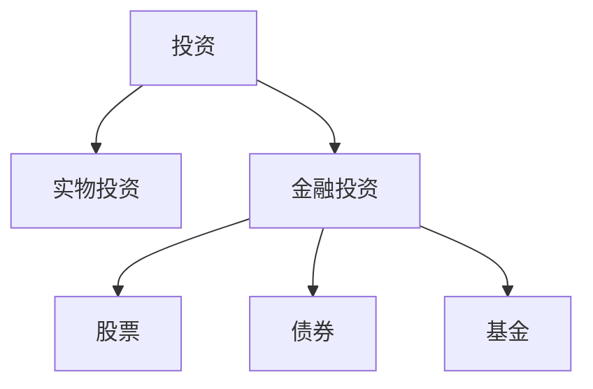
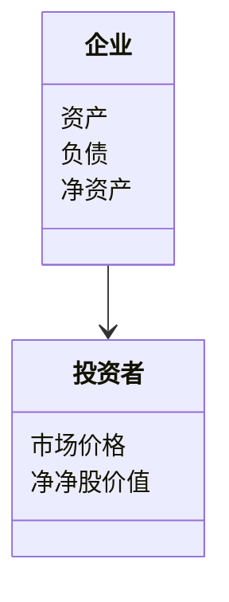
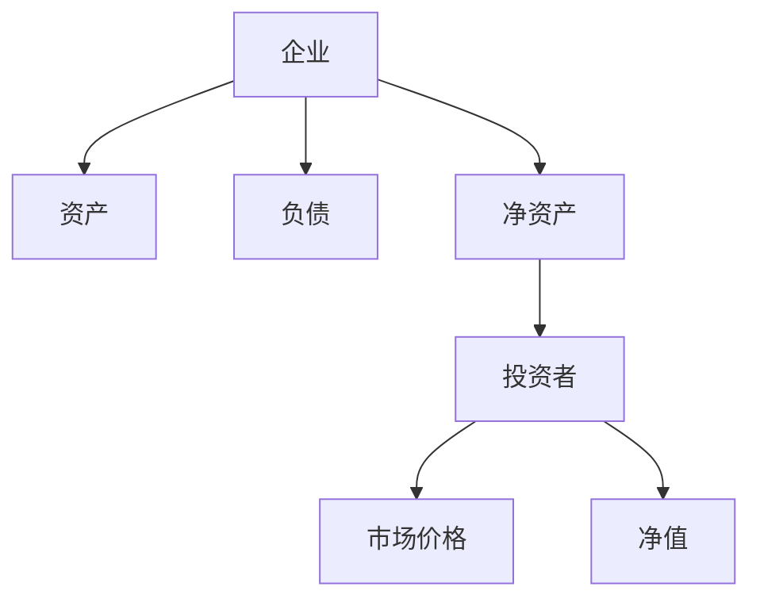
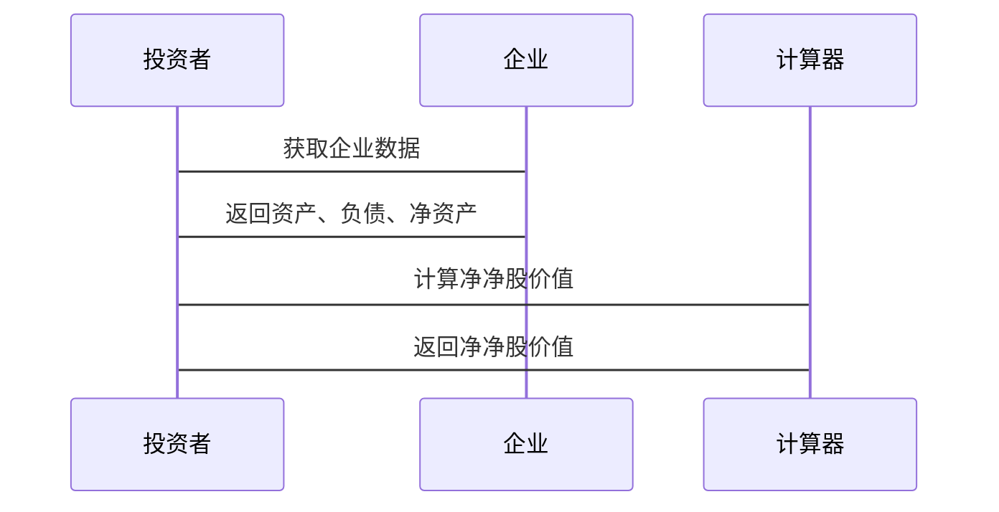

                 


# 净净股投资：回归格雷厄姆的根源

## 关键词：净净股投资，价值投资，格雷厄姆，蒙蒂尔，投资策略，企业估值

## 摘要：净净股投资是一种基于企业净资产价值的投资策略，起源于格雷厄姆和多德的价值投资理论。本文详细分析了净净股投资的核心思想，包括其定义、计算方法、投资策略，以及与现代投资理论的对比。通过系统分析和实际案例，本文揭示了如何利用净净股投资在当前市场环境中寻找被低估的投资机会，并展望了其未来的发展趋势。

---

# 第一部分：引言

# 第1章：投资的基础概念

## 1.1 投资的基本定义

### 1.1.1 投资的定义与分类

投资是指将资金投入某一标的物，以期在未来获得收益或资本增值的行为。根据投资对象的不同，可以将投资分为实物投资和金融投资。金融投资又可以进一步分为股票、债券、基金等多种形式。在本文中，我们主要关注股票投资，特别是基于企业净资产价值的净净股投资。

**图1-1：投资的主要形式**



### 1.1.2 价值投资的核心理念

价值投资是一种以企业的内在价值为基础的投资策略，强调以低于内在价值的价格买入优质资产。其核心思想是寻找市场上的“烟圈”，即那些被市场低估、具有强大护城河和可持续竞争优势的企业。

### 1.1.3 净净股投资的背景与现状

净净股投资是价值投资的一种具体实现方式，起源于格雷厄姆和多德的理论。随着市场的变化，净净股投资在实践中不断发展，逐渐形成了适合现代市场的投资策略。当前，净净股投资在全球范围内被广泛应用于机构和个人投资者的资产配置中。

---

## 1.2 价值投资的起源与发展

### 1.2.1 格雷厄姆与多德的价值投资理论

本杰明·格雷厄姆和戴维·多德是价值投资的鼻祖。他们提出了“安全边际”和“内在价值”等核心概念，强调以低于内在价值的价格买入股票。格雷厄姆在《证券分析》中详细阐述了这一理论。

### 1.2.2 净净股投资的提出与演变

净净股投资是格雷厄姆和多德理论的延伸，专注于企业的净资产价值（即每股净现金流）。通过计算企业的净资产价值与市场价格的差异，投资者可以找到被低估的投资机会。

### 1.2.3 现代价值投资的实践与应用

现代价值投资在格雷厄姆和多德的基础上，结合了新的市场环境和技术手段，发展出更加多样化的投资策略。例如，巴菲特、彼得·林奇等投资者都将格雷厄姆的理论融入自己的投资实践中。

---

## 1.3 本书的核心内容与目标

### 1.3.1 净净股投资的核心思想

本文的核心思想是通过分析企业的净资产价值，寻找那些市场价格低于净资产价值的企业，从而实现长期稳定的收益。

### 1.3.2 本书的结构与内容概述

本文将从净净股投资的定义、计算方法、投资策略等多方面展开，结合实际案例，深入分析其在现代投资环境中的应用。

### 1.3.3 读者对象与学习目标

本书适合对价值投资感兴趣的投资新手和有一定经验的投资者。通过阅读本书，读者可以掌握净净股投资的核心思想，并能够在实际投资中加以应用。

---

# 第二部分：净净股投资的理论基础

# 第2章：净净股投资的定义与计算

## 2.1 净净股的定义

### 2.1.1 净值与净净股的定义

净净股是指企业的每股净现金流，即企业扣除所有负债后的净资产。其计算公式为：

$$ 净净股 = \frac{净资产}{流通股数量} $$

### 2.1.2 净净股的计算公式

净资产的计算公式为：

$$ 净资产 = 资产总额 - 负债总额 $$

其中，资产总额包括流动资产和非流动资产，负债总额包括流动负债和非流动负债。

### 2.1.3 净净股与市场价值的对比

净净股与市场价值的对比可以通过以下公式进行：

$$ 市场价值 = 股价 \times 流通股数量 $$

如果市场价格低于净资产，则认为该股票被低估。

---

## 2.2 净净股的分类与特征

### 2.2.1 不同类型企业的净净股分析

不同行业的企业具有不同的净净股特征。例如，制造业企业的净资产可能包括大量的固定资产，而科技企业的净资产可能更多依赖于无形资产。

### 2.2.2 净净股的属性特征对比

以下是不同类型企业的净净股属性对比表：

| 企业类型 | 资产密集度 | 负债结构 | 净资产收益率 | 净净股稳定性 |
|----------|------------|-----------|--------------|--------------|
| 制造业    | 高         | 高        | 中            | 稳定          |
| 科技     | 中         | 低        | 高            | 不稳定        |

### 2.2.3 净净股与企业生命周期的关系

企业生命周期的不同阶段会影响其净净股的计算。例如，处于成长期的企业可能负债较高，而成熟期的企业可能有更多的现金流。

---

## 2.3 净净股投资的核心要素

### 2.3.1 企业资产的评估方法

资产评估是净净股投资的核心步骤。常用的资产评估方法包括成本法、市场法和收益法。

### 2.3.2 企业负债的分类与影响

负债的分类与净净股投资密切相关。流动负债和非流动负债对企业的财务状况有不同的影响。

### 2.3.3 净净股的内在价值计算

内在价值的计算公式为：

$$ 内在价值 = 净资产 \times 折现率 $$

其中，折现率通常基于企业的资本成本或行业平均水平。

---

# 第3章：净净股投资的历史发展与现状

## 3.1 净净股投资的起源

### 3.1.1 格雷厄姆与多德的理论基础

格雷厄姆和多德的价值投资理论为净净股投资奠定了基础。他们的理论强调安全边际和内在价值。

### 3.1.2 净净股投资的提出背景

净净股投资的提出是基于20世纪初的市场环境，当时许多企业由于市场波动而被低估。

### 3.1.3 净净股投资的早期实践

早期的净净股投资者主要关注企业的账面价值，寻找那些市场价格低于账面价值的企业。

---

## 3.2 净净股投资的发展演变

### 3.2.1 现代价值投资的理论发展

现代价值投资在格雷厄姆和多德的基础上，引入了更多的量化指标，如市净率、市盈率等。

### 3.2.2 净净股投资在不同经济周期的表现

净净股投资在不同经济周期中的表现有所不同。在经济衰退期，净净股投资往往表现较好。

### 3.2.3 净净股投资的国际化与多元化

随着全球化的推进，净净股投资逐渐从美国扩展到全球市场，投资者可以关注不同国家和地区的投资机会。

---

## 3.3 净净股投资的现状与挑战

### 3.3.1 当前市场环境对净净股投资的影响

当前市场环境复杂多变，净净股投资需要结合宏观经济、行业趋势等因素进行综合分析。

### 3.3.2 技术进步对净净股投资的改变

技术进步使得净净股投资的计算更加精确，同时提高了数据分析的效率。

### 3.3.3 净净股投资的未来发展趋势

未来，净净股投资将更加注重企业创新能力和竞争优势，同时结合ESG（环境、社会、治理）因素进行综合评估。

---

# 第四部分：系统分析与架构设计方案

# 第4章：净净股投资的系统分析

## 4.1 问题场景介绍

净净股投资需要解决的核心问题是：如何通过对企业净资产的分析，找到被市场低估的投资机会。

## 4.2 项目介绍

本项目旨在构建一个基于净净股投资的系统分析框架，帮助投资者快速评估企业的内在价值。

## 4.3 系统功能设计

### 4.3.1 领域模型

**图4-1：净净股投资领域模型**



### 4.3.2 系统架构设计

**图4-2：净净股投资系统架构**



### 4.3.3 系统接口设计

系统接口包括企业数据输入接口和投资者查询接口。

### 4.3.4 系统交互设计

**图4-3：净净股投资系统交互**



---

# 第五部分：项目实战

# 第5章：净净股投资的实战应用

## 5.1 环境安装

需要安装Python、Pandas、NumPy等工具。

## 5.2 核心实现源代码

以下是计算净净股的Python代码：

```python
import pandas as pd

def calculate_net_net(stock_data):
    net_assets = stock_data['资产'] - stock_data['负债']
    net_stock = net_assets / stock_data['流通股数量']
    return net_stock

# 示例数据
data = {
    '资产': [100, 200, 300],
    '负债': [50, 100, 150],
    '流通股数量': [10, 20, 30]
}
stock_data = pd.DataFrame(data)
print(calculate_net_net(stock_data))
```

## 5.3 实际案例分析

以某制造企业为例，计算其净净股价值。

## 5.4 案例分析与解读

通过案例分析，验证净净股投资的可行性。

## 5.5 项目小结

总结净净股投资的实际应用过程和经验教训。

---

# 第六部分：总结与展望

# 第6章：总结与展望

## 6.1 投资要点总结

总结净净股投资的核心要点，包括计算方法、投资策略等。

## 6.2 未来发展趋势

展望净净股投资的未来发展趋势，包括技术进步、市场变化等。

## 6.3 最佳实践 Tips

提供一些实际操作中的建议，如心态调整、持续学习、风险管理等。

---

# 结语

净净股投资是一种简单而有效的投资策略，回归格雷厄姆的根源，结合现代市场环境，投资者可以通过净净股投资实现长期稳定的收益。

---

# 作者

作者：AI天才研究院/AI Genius Institute & 禅与计算机程序设计艺术 /Zen And The Art of Computer Programming

