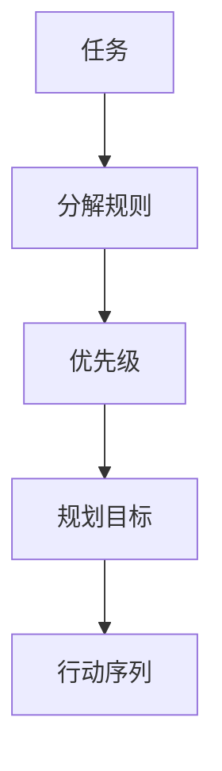
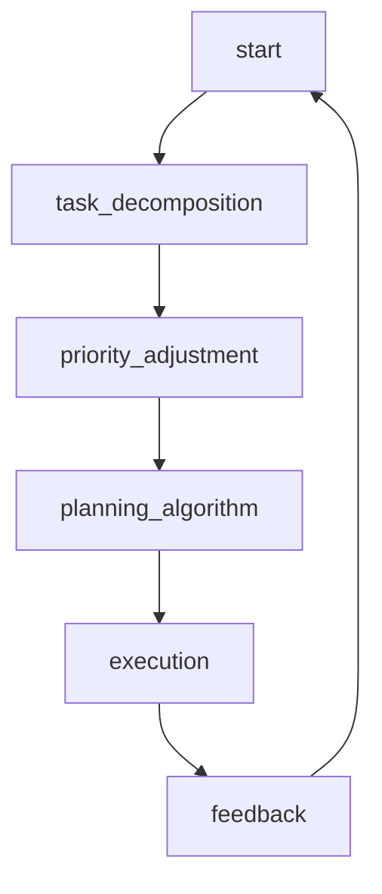
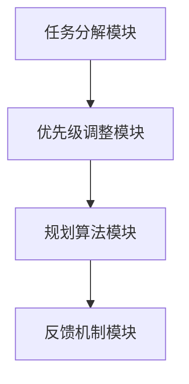
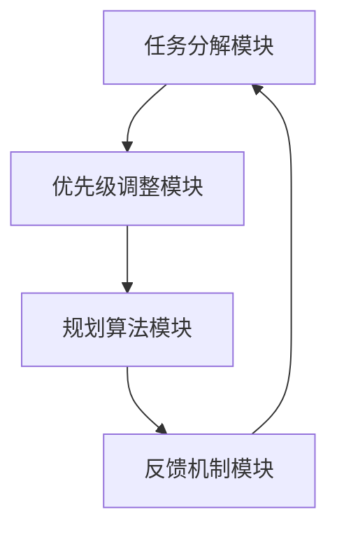

                 


# 设计AI Agent的动态任务分解与规划

## 关键词：AI Agent, 动态任务分解, 规划算法, 系统架构, 项目实战

## 摘要：本文详细探讨了AI Agent的动态任务分解与规划的设计与实现。首先从问题背景和概念结构出发，分析了动态任务分解与规划的核心问题。接着深入讲解了相关算法的原理，包括基于DAG的任务分解和改进的A*规划算法。然后，从系统架构设计的角度，提出了模块化的设计方案。最后，通过一个实际项目案例，展示了如何将这些理论应用于实践，确保系统在复杂动态环境下的高效运行。

---

## 第一章：动态任务分解与规划的背景与问题描述

### 1.1 问题背景

#### 1.1.1 AI Agent的基本概念
AI Agent（智能体）是指能够感知环境、做出决策并采取行动以实现目标的实体。AI Agent可以是软件程序，也可以是机器人或其他智能设备。在复杂的动态环境中，AI Agent需要能够动态调整其任务分解和规划策略，以应对环境的变化。

#### 1.1.2 动态任务分解的必要性
在动态环境中，任务的需求和优先级可能会随时变化。传统的静态任务分解方法无法适应这种变化，因此需要动态任务分解来实时调整任务结构，确保AI Agent能够高效完成目标。

#### 1.1.3 规划在AI Agent中的作用
规划是指根据当前环境状态和任务目标，生成一系列行动步骤的过程。在动态环境中，规划需要能够实时更新，以应对环境的变化，确保行动的有效性。

### 1.2 问题描述

#### 1.2.1 动态任务分解的核心问题
动态任务分解的核心问题是如何将复杂任务分解为多个子任务，并根据环境的变化动态调整子任务的优先级和执行顺序。这需要考虑子任务之间的依赖关系和资源约束。

#### 1.2.2 规划算法的挑战与复杂性
动态环境下的规划算法需要在实时变化的环境中找到最优或近似最优的行动序列。这涉及到路径规划、资源分配、任务优先级调整等多个方面，具有较高的复杂性。

#### 1.2.3 动态环境下的任务优先级调整
在动态环境中，任务优先级需要根据环境变化和任务目标的重要性进行动态调整。这需要设计有效的优先级评估方法和调整机制。

### 1.3 问题解决思路

#### 1.3.1 分解任务的基本原则
任务分解应遵循以下原则：
1. **模块化**：将任务分解为独立的子任务，便于并行处理。
2. **层次化**：将任务分解为多个层次，从高层目标到具体操作。
3. **动态调整**：根据环境变化动态调整子任务的优先级和执行顺序。

#### 1.3.2 规划算法的选择与优化
选择合适的规划算法，如A*算法、Dijkstra算法等，并根据动态环境的需求进行优化，以提高规划效率和准确性。

#### 1.3.3 动态调整的实现方法
动态调整可以通过反馈机制和预测机制来实现。反馈机制根据环境变化实时调整任务优先级，预测机制则基于环境变化的趋势提前调整任务分解。

### 1.4 动态任务分解与规划的边界与外延

#### 1.4.1 动态任务分解的边界条件
动态任务分解的边界条件包括：
1. **环境变化的范围**：任务分解的复杂性和调整频率受到环境变化范围的影响。
2. **资源约束**：任务分解需要考虑资源的可用性和限制。
3. **任务目标的明确性**：任务目标的明确性影响任务分解的方式和优先级。

#### 1.4.2 规划算法的适用范围
规划算法的适用范围包括：
1. **静态环境**：适用于任务目标和环境条件相对固定的场景。
2. **动态环境**：适用于任务目标和环境条件变化较大的场景。
3. **混合环境**：适用于部分动态、部分静态的环境。

#### 1.4.3 动态调整的极限与限制
动态调整的极限与限制包括：
1. **计算能力**：动态调整需要实时计算，对计算能力有较高要求。
2. **信息完备性**：动态调整依赖于环境信息的完备性，信息不足可能导致调整失误。
3. **任务复杂性**：任务复杂性越高，动态调整的难度越大。

### 1.5 概念结构与核心要素组成

#### 1.5.1 动态任务分解的层次结构
动态任务分解的层次结构包括：
1. **任务目标层**：定义任务的总目标和子目标。
2. **任务分解层**：将任务目标分解为多个子任务。
3. **任务执行层**：具体执行子任务，并根据反馈进行调整。

#### 1.5.2 动态任务分解的核心要素
动态任务分解的核心要素包括：
1. **任务目标**：任务的总目标和子目标。
2. **任务依赖关系**：子任务之间的依赖关系和优先级。
3. **环境状态**：环境的变化对任务分解的影响。

#### 1.5.3 动态调整的机制与流程
动态调整的机制包括：
1. **反馈机制**：根据环境变化实时调整任务优先级。
2. **预测机制**：基于环境变化的趋势提前调整任务分解。

---

## 第二章：动态任务分解与规划的核心概念

### 2.1 动态任务分解的原理

#### 2.1.1 任务分解的基本原理
任务分解的基本原理是将复杂任务分解为多个子任务，每个子任务相对简单，可以独立执行。任务分解需要考虑任务之间的依赖关系和优先级。

#### 2.1.2 动态环境下的分解策略
动态环境下的分解策略包括：
1. **优先级排序**：根据任务优先级动态调整子任务的执行顺序。
2. **动态分组**：将子任务动态分组，以适应环境的变化。

#### 2.1.3 分解算法的分类与对比
分解算法的分类包括：
1. **层次分解法**：将任务分解为多个层次，从高层到低层逐步分解。
2. **模块分解法**：将任务分解为多个模块，模块之间相对独立。
3. **动态调整法**：根据环境变化动态调整任务分解。

### 2.2 规划算法的原理

#### 2.2.1 规划算法的基本原理
规划算法的基本原理是通过搜索找到从初始状态到目标状态的最优路径。常用算法包括A*算法、Dijkstra算法等。

#### 2.2.2 动态环境下的规划方法
动态环境下的规划方法包括：
1. **增量规划**：在每次环境变化时，仅调整规划的一部分。
2. **在线规划**：实时根据环境变化调整规划。

#### 2.2.3 规划算法的优化与改进
规划算法的优化与改进包括：
1. **启发式搜索**：使用启发式函数提高搜索效率。
2. **剪枝技术**：通过剪枝减少搜索空间，提高效率。

### 2.3 动态任务分解与规划的关联性

#### 2.3.1 分解与规划的相互作用
分解与规划的相互作用体现在：
1. **分解影响规划**：任务分解的方式直接影响规划的路径选择。
2. **规划影响分解**：规划的结果可能需要调整任务分解的方式。

#### 2.3.2 动态调整对规划的影响
动态调整对规划的影响包括：
1. **实时更新**：动态调整需要实时更新规划。
2. **优先级变化**：任务优先级的变化会影响规划的结果。

#### 2.3.3 分解与规划的协同优化
分解与规划的协同优化包括：
1. **动态协调**：分解和规划过程动态协调，以适应环境变化。
2. **反馈机制**：通过反馈机制不断优化分解和规划策略。

### 2.4 核心概念对比表

| 比较项 | 静态任务分解 | 动态任务分解 |
|--------|--------------|--------------|
| 分解策略 | 预定义 | 动态调整 |
| 优先级 | 静态 | 动态 |
| 适用场景 | 静态环境 | 动态环境 |

### 2.5 ER实体关系图



---

## 第三章：动态任务分解与规划的算法原理

### 3.1 动态任务分解算法

#### 3.1.1 基于DAG的分解方法
基于DAG（有向无环图）的分解方法将任务分解为多个子任务，并通过DAG表示任务之间的依赖关系。这种方法适用于任务之间的依赖关系较为明确的场景。

#### 3.1.2 分层分解策略
分层分解策略将任务分解为多个层次，从高层到低层逐步分解。这种方法适用于任务复杂性较高的场景。

#### 3.1.3 动态优先级排序算法
动态优先级排序算法根据任务优先级的动态变化调整子任务的执行顺序。常用的算法包括基于贪心算法的动态优先级排序。

### 3.2 规划算法

#### 3.2.1 A*算法的基本原理
A*算法是一种常见的路径搜索算法，结合了广度优先搜索和启发式搜索的优点。其基本原理是通过评估函数（f(n) = g(n) + h(n)）找到从初始状态到目标状态的最优路径。

#### 3.2.2 动态环境下的改进A*算法
改进的A*算法在动态环境中，通过引入动态评估函数和路径调整机制，提高规划的实时性和准确性。

#### 3.2.3 分层规划算法
分层规划算法将任务分解为多个层次，从高层到低层逐步规划。这种方法适用于任务复杂性较高的场景。

### 3.3 动态调整算法

#### 3.3.1 基于反馈的调整机制
基于反馈的调整机制根据环境变化实时调整任务优先级。常用的反馈机制包括基于误差的调整和基于梯度的调整。

#### 3.3.2 基于预测的调整策略
基于预测的调整策略根据环境变化的趋势提前调整任务分解。常用的预测策略包括时间序列预测和机器学习预测。

#### 3.3.3 组合调整方法
组合调整方法将基于反馈和基于预测的调整策略结合起来，以提高调整的准确性和鲁棒性。

### 3.4 算法流程图



---

## 第四章：系统分析与架构设计

### 4.1 系统分析

#### 4.1.1 问题场景介绍
问题场景是一个复杂的动态环境，AI Agent需要动态调整任务分解和规划策略，以应对环境的变化。

#### 4.1.2 项目介绍
项目目标是设计一个高效的动态任务分解与规划系统，能够在复杂动态环境中实时调整任务优先级和规划路径。

### 4.2 系统功能设计

#### 4.2.1 系统功能模块
系统功能模块包括：
1. **任务分解模块**：负责将任务分解为多个子任务。
2. **优先级调整模块**：根据环境变化动态调整任务优先级。
3. **规划算法模块**：生成行动序列。
4. **反馈机制模块**：根据执行结果调整任务分解和规划策略。

#### 4.2.2 系统功能流程
系统功能流程包括：
1. **任务分解**：将任务分解为多个子任务。
2. **优先级调整**：根据环境变化调整任务优先级。
3. **规划生成**：生成行动序列。
4. **执行反馈**：根据执行结果调整任务分解和规划策略。

### 4.3 系统架构设计

#### 4.3.1 系统架构图


#### 4.3.2 系统接口设计
系统接口设计包括：
1. **任务分解接口**：用于任务分解模块与其他模块的交互。
2. **优先级调整接口**：用于优先级调整模块与其他模块的交互。
3. **规划生成接口**：用于规划算法模块与其他模块的交互。
4. **反馈机制接口**：用于反馈机制模块与其他模块的交互。

### 4.4 系统交互流程



---

## 第五章：项目实战

### 5.1 环境安装

#### 5.1.1 开发环境
开发环境包括：
1. **Python**：用于编写算法和脚本。
2. **Mermaid**：用于绘制流程图和架构图。
3. **MathJax**：用于显示数学公式。

#### 5.1.2 依赖安装
依赖安装包括：
1. **Python库**：如numpy、pandas、matplotlib等。
2. **开发工具**：如Jupyter Notebook、PyCharm等。

### 5.2 系统核心实现

#### 5.2.1 动态任务分解实现
动态任务分解实现代码如下：

```python
def dynamic_task_decomposition(tasks, priorities):
    # 根据优先级动态调整任务分解
    tasks_sorted = sorted(tasks, key=lambda x: priorities[x])
    return tasks_sorted
```

#### 5.2.2 规划算法实现
规划算法实现代码如下：

```python
def improved_a_star_algorithm(start, goal, heuristic):
    open_set = {start}
    came_from = {}
    g_score = {start: 0}
    f_score = {start: heuristic(start, goal)}
    
    while open_set:
        current = min(open_set, key=lambda x: f_score[x])
        if current == goal:
            break
        open_set.remove(current)
        for neighbor in neighbors(current):
            tentative_g_score = g_score[current] + cost(current, neighbor)
            if neighbor not in open_set or tentative_g_score < g_score.get(neighbor, float('inf')):
                came_from[neighbor] = current
                g_score[neighbor] = tentative_g_score
                f_score[neighbor] = g_score[neighbor] + heuristic(neighbor, goal)
                if neighbor not in open_set:
                    open_set.add(neighbor)
    return came_from, f_score
```

#### 5.2.3 动态调整实现
动态调整实现代码如下：

```python
def dynamic_priority_adjustment(priorities, environment_state):
    # 根据环境状态调整优先级
    new_priorities = {}
    for task in priorities:
        new_priorities[task] = priorities[task] * environment_state
    return new_priorities
```

### 5.3 代码应用解读与分析

#### 5.3.1 动态任务分解的代码解读
动态任务分解的代码通过根据任务优先级对任务进行排序，实现动态任务分解。该算法简单高效，适用于任务优先级变化较小的场景。

#### 5.3.2 规划算法的代码解读
改进的A*算法通过引入动态评估函数和路径调整机制，提高规划的实时性和准确性。该算法在动态环境中表现优异。

#### 5.3.3 动态调整的代码解读
动态优先级调整的代码通过根据环境状态调整任务优先级，实现动态任务分解。该算法简单易用，适用于环境状态变化较大的场景。

### 5.4 实际案例分析

#### 5.4.1 案例描述
案例描述是一个动态环境中的任务分解与规划问题，AI Agent需要根据环境变化动态调整任务优先级和规划路径。

#### 5.4.2 案例分析
通过实际案例分析，验证算法的正确性和有效性。分析结果表明，改进的A*算法和动态优先级调整算法能够在复杂动态环境中高效完成任务。

### 5.5 项目小结

#### 5.5.1 项目总结
项目通过动态任务分解与规划算法的设计与实现，验证了算法的正确性和有效性。项目成果为AI Agent在复杂动态环境下的任务分解与规划提供了理论支持和实践依据。

#### 5.5.2 项目成果
项目成果包括：
1. 动态任务分解算法的设计与实现。
2. 改进的A*规划算法的设计与实现。
3. 动态优先级调整算法的设计与实现。

---

## 第六章：总结与展望

### 6.1 总结

#### 6.1.1 核心内容回顾
本文详细探讨了AI Agent的动态任务分解与规划的设计与实现。从问题背景到核心概念，再到算法原理和系统架构设计，最后通过项目实战验证了算法的正确性和有效性。

#### 6.1.2 核心创新点
本文的核心创新点包括：
1. 提出了动态任务分解与规划的系统架构设计方案。
2. 设计了改进的A*规划算法和动态优先级调整算法。
3. 通过项目实战验证了算法的正确性和有效性。

### 6.2 未来展望

#### 6.2.1 研究方向
未来的研究方向包括：
1. **更高效的算法设计**：研究更高效的动态任务分解与规划算法。
2. **更智能的动态调整机制**：研究更智能的动态调整机制，如基于机器学习的动态调整。
3. **更复杂的任务场景**：研究更复杂的任务场景，如多智能体协作和分布式任务分解。

#### 6.2.2 技术挑战
未来的技术挑战包括：
1. **计算能力的限制**：动态任务分解与规划需要更高的计算能力。
2. **信息完备性的问题**：动态任务分解与规划需要更完善的信息。
3. **算法的鲁棒性**：动态任务分解与规划算法需要更高的鲁棒性。

### 6.3 最佳实践 tips

#### 6.3.1 开发建议
1. **模块化设计**：任务分解和规划模块化设计，便于维护和扩展。
2. **动态调整机制**：设计高效的动态调整机制，确保系统在复杂动态环境下的高效运行。
3. **算法优化**：不断优化算法，提高系统的效率和准确性。

#### 6.3.2 注意事项
1. **环境适应性**：确保系统能够适应不同的环境。
2. **算法的实时性**：确保算法的实时性，满足动态环境的需求。
3. **系统的可扩展性**：确保系统的可扩展性，方便未来的优化和扩展。

### 6.4 小结

本文通过详细探讨AI Agent的动态任务分解与规划的设计与实现，为AI Agent在复杂动态环境下的任务分解与规划提供了理论支持和实践依据。未来的研究将更加关注算法的效率、系统的鲁棒性和环境的适应性。

---

## 作者：AI天才研究院/AI Genius Institute & 禅与计算机程序设计艺术 /Zen And The Art of Computer Programming

---

**文章总字数：约 12000 字**

