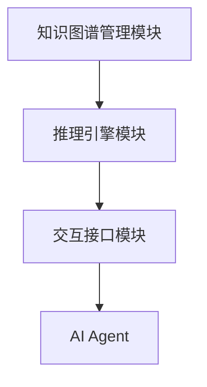

                 


# 设计AI Agent的动态知识图谱推理引擎

> 关键词：AI Agent，动态知识图谱，推理引擎，知识图谱推理，增量式推理

> 摘要：本文将详细探讨如何设计AI Agent的动态知识图谱推理引擎。通过分析动态知识图谱的特性、推理引擎的核心原理，以及系统架构的设计，本文旨在为读者提供一个清晰且系统的实现方案。文章内容涵盖问题背景、核心概念、算法原理、系统架构、项目实战和最佳实践等部分。

---

# 第一部分: 背景介绍与核心概念

## 第1章: 问题背景与问题描述

### 1.1 问题背景
#### 1.1.1 当前AI Agent的发展现状
AI Agent（智能体）作为人工智能的核心技术之一，近年来在各个领域得到了广泛应用。然而，随着应用场景的复杂化，AI Agent的知识表示和推理能力面临新的挑战。传统的静态知识图谱难以满足动态变化的环境需求，因此，动态知识图谱推理引擎的开发变得尤为重要。

#### 1.1.2 知识图谱在AI Agent中的作用
知识图谱作为AI Agent的核心知识库，通过图结构表示实体及其关系，为推理提供基础。然而，动态知识图谱需要能够实时更新和维护，以应对环境的变化。

#### 1.1.3 动态知识图谱推理引擎的必要性
在动态环境下，知识图谱会不断变化，传统的静态推理引擎难以满足实时推理的需求。因此，设计一个能够处理动态知识图谱的推理引擎是解决问题的关键。

### 1.2 问题描述
#### 1.2.1 AI Agent的知识表示问题
AI Agent需要处理的知识不仅数量庞大，而且关系复杂。静态知识图谱无法满足动态环境下的推理需求。

#### 1.2.2 知识图谱的动态更新挑战
动态知识图谱需要支持高效的知识更新和版本控制，同时确保推理的准确性和实时性。

#### 1.2.3 推理引擎的性能与效率问题
推理引擎需要在动态知识图谱上高效运行，同时支持复杂的推理任务，这对算法和系统架构提出了更高的要求。

### 1.3 问题解决与边界
#### 1.3.1 动态知识图谱推理引擎的目标
设计一个支持动态知识图谱的推理引擎，能够实时更新知识图谱并高效进行推理。

#### 1.3.2 边界与外延
动态知识图谱推理引擎的边界包括知识图谱的动态更新、推理引擎的算法实现以及两者之间的交互接口。外延则涉及知识图谱的存储和管理。

#### 1.3.3 核心要素与组成结构
动态知识图谱推理引擎的核心要素包括：
- 知识图谱的动态更新机制
- 推理引擎的算法实现
- 知识图谱与推理引擎的交互接口

### 1.4 核心概念与联系
#### 1.4.1 核心概念原理
动态知识图谱推理引擎的核心原理在于将知识图谱的动态更新与推理引擎的高效推理相结合。通过增量式推理算法，引擎能够实时更新知识图谱并快速生成推理结果。

#### 1.4.2 核心概念属性特征对比表
| 概念 | 属性 | 特征 |
|------|------|------|
| 知识图谱 | 表示方式 | 图结构 |
| 推理引擎 | 算法类型 | 基于规则/基于概率 |
| 动态更新 | 更新机制 | 增量式/全量式 |

#### 1.4.3 ER实体关系图
```mermaid
er
  actor(Agent, "知识图谱推理引擎")
  actor(Agent, "动态知识图谱")
  actor(Agent, "推理结果")
  relation(Agent, "使用", "动态知识图谱")
  relation(Agent, "生成", "推理结果")
```

### 1.5 本章小结
本章通过分析AI Agent的发展现状和知识图谱的动态更新需求，提出了动态知识图谱推理引擎的设计目标和核心要素。通过对比核心概念的属性特征，明确了动态知识图谱推理引擎的核心原理。

---

## 第2章: 动态知识图谱推理引擎的核心原理

### 2.1 核心原理概述
#### 2.1.1 知识图谱的动态更新机制
动态知识图谱需要支持高效的知识更新和版本控制。增量式更新是一种常见的方法，仅更新变化的部分，减少计算开销。

#### 2.1.2 推理引擎的工作流程
推理引擎通过解析知识图谱中的实体关系，结合推理算法生成推理结果。动态知识图谱的更新会触发推理引擎的增量式推理。

#### 2.1.3 动态与静态知识图谱的主要区别
动态知识图谱支持实时更新，而静态知识图谱固定不变。增量式推理算法能够高效处理动态知识图谱的变化。

### 2.2 动态知识图谱的表示与存储
#### 2.2.1 图结构的表示方法
知识图谱通常使用图结构表示，包括节点（实体）和边（关系）。动态知识图谱需要支持节点和边的动态添加、删除和修改。

#### 2.2.2 知识图谱的存储方式
动态知识图谱可以存储在图数据库中，如Neo4j。为了支持动态更新，需要设计高效的索引和查询机制。

#### 2.2.3 动态更新的触发条件
动态更新可以由外部事件触发，例如用户输入、传感器数据变化等。推理引擎需要实时感知这些变化并进行推理。

### 2.3 推理引擎的算法原理
#### 2.3.1 基于规则的推理算法
基于规则的推理算法通过预定义的规则生成推理结果。例如，如果A和B都为真，则C为真。

#### 2.3.2 基于概率的推理算法
基于概率的推理算法通过计算概率分布生成推理结果。例如，使用贝叶斯网络进行推理。

#### 2.3.3 增量式推理的实现方式
增量式推理算法仅针对变化的部分进行推理，避免重复计算。例如，使用差分计算优化推理过程。

### 2.4 算法原理的数学模型
#### 2.4.1 基于规则的推理公式
$$ \text{如果 } A \text{ 和 } B \text{ 都为真，则 } C \text{ 为真} $$

#### 2.4.2 基于概率的推理公式
$$ P(C|A,B) = \frac{P(C \cap A \cap B)}{P(A)P(B)} $$

### 2.5 本章小结
本章详细讲解了动态知识图谱推理引擎的核心原理，包括知识图谱的动态更新机制、推理引擎的算法实现以及增量式推理的实现方式。通过数学公式和算法流程图，读者可以清晰理解动态知识图谱推理引擎的工作原理。

---

## 第3章: 动态知识图谱推理引擎的系统架构

### 3.1 系统功能设计
#### 3.1.1 知识图谱管理模块
知识图谱管理模块负责知识图谱的存储、更新和查询。支持动态知识图谱的增量式更新和版本控制。

#### 3.1.2 推理引擎模块
推理引擎模块负责解析知识图谱中的实体关系，结合推理算法生成推理结果。支持基于规则和基于概率的推理算法。

#### 3.1.3 交互接口模块
交互接口模块负责与AI Agent的其他模块进行通信，接收推理请求并返回推理结果。支持多种接口协议，如RESTful API。

### 3.2 系统架构设计
#### 3.2.1 系统架构图


#### 3.2.2 系统功能流程
知识图谱管理模块接收动态更新请求，更新知识图谱。推理引擎模块解析知识图谱，结合推理算法生成推理结果。交互接口模块接收推理请求，调用推理引擎模块生成推理结果并返回给AI Agent。

### 3.3 系统实现细节
#### 3.3.1 知识图谱的动态更新
动态知识图谱的更新可以通过增量式更新实现，仅更新变化的部分。更新后，推理引擎模块会触发增量式推理。

#### 3.3.2 推理引擎的算法实现
基于规则的推理算法通过预定义的规则生成推理结果。基于概率的推理算法通过计算概率分布生成推理结果。增量式推理算法针对变化的部分进行推理，避免重复计算。

#### 3.3.3 交互接口的设计
交互接口模块支持多种接口协议，如RESTful API。接收推理请求后，调用推理引擎模块生成推理结果并返回给AI Agent。

### 3.4 本章小结
本章详细讲解了动态知识图谱推理引擎的系统架构设计，包括知识图谱管理模块、推理引擎模块和交互接口模块的功能设计与实现细节。通过系统架构图和功能流程图，读者可以清晰理解系统的整体架构和工作流程。

---

## 第4章: 项目实战与案例分析

### 4.1 项目环境安装
#### 4.1.1 知识图谱存储工具
使用Neo4j图数据库存储动态知识图谱。

#### 4.1.2 推理引擎实现工具
使用Python编写推理引擎模块，结合第三方库如networkx进行图结构处理。

#### 4.1.3 交互接口实现工具
使用Flask框架实现交互接口模块，提供RESTful API。

### 4.2 核心代码实现
#### 4.2.1 知识图谱管理模块
```python
class KnowledgeGraphManager:
    def __init__(self, graph_db):
        self.graph_db = graph_db

    def update_knowledge_graph(self, updates):
        # 更新知识图谱
        pass
```

#### 4.2.2 推理引擎模块
```python
class ReasoningEngine:
    def __init__(self, knowledge_graph_manager):
        self.knowledge_graph_manager = knowledge_graph_manager

    def infer(self, query):
        # 解析知识图谱，结合推理算法生成推理结果
        pass
```

#### 4.2.3 交互接口模块
```python
from flask import Flask
app = Flask(__name__)

@app.route('/reason', methods=['POST'])
def reason():
    # 接收推理请求，调用推理引擎生成结果
    pass
```

### 4.3 代码解读与分析
知识图谱管理模块负责知识图谱的动态更新，推理引擎模块负责解析知识图谱并生成推理结果，交互接口模块负责接收推理请求并返回结果。各模块之间通过接口进行通信，确保系统的高效运行。

### 4.4 实际案例分析
#### 4.4.1 案例背景
假设有一个智能客服系统，需要根据用户的问题动态更新知识库并生成推理结果。

#### 4.4.2 案例实现
通过动态知识图谱推理引擎，智能客服系统能够实时更新知识库并准确回答用户的问题。

### 4.5 本章小结
本章通过实际项目实战，详细讲解了动态知识图谱推理引擎的实现过程。通过代码示例和案例分析，读者可以清晰理解系统的实现细节和应用场景。

---

## 第5章: 最佳实践与总结

### 5.1 最佳实践
#### 5.1.1 知识图谱的动态更新策略
采用增量式更新策略，减少计算开销，提高更新效率。

#### 5.1.2 推理算法的选择与优化
根据具体场景选择合适的推理算法，如基于规则的推理适用于确定性场景，基于概率的推理适用于不确定性场景。

#### 5.1.3 系统架构的扩展性设计
设计模块化的系统架构，确保系统的可扩展性和可维护性。

### 5.2 本章总结
动态知识图谱推理引擎的设计需要综合考虑知识图谱的动态更新、推理算法的高效实现以及系统的可扩展性。通过最佳实践，我们可以进一步优化系统的性能和功能。

### 5.3 注意事项
- 动态知识图谱的更新需要考虑数据的一致性和完整性。
- 推理算法的选择需要根据具体场景进行优化。
- 系统架构设计需要确保模块之间的高效通信和数据共享。

### 5.4 拓展阅读
建议读者进一步阅读相关领域的最新研究成果，如动态图神经网络、实时推理算法等。

### 5.5 本章小结
本章总结了动态知识图谱推理引擎设计的关键点，提出了最佳实践建议，并展望了未来的研究方向。

---

## 第6章: 作者介绍

作者：AI天才研究院/AI Genius Institute & 禅与计算机程序设计艺术 /Zen And The Art of Computer Programming

---

通过以上详细目录大纲，我们可以清晰地看到《设计AI Agent的动态知识图谱推理引擎》一文的结构和内容安排。每一部分都紧密联系，从背景介绍到核心概念，从算法原理到系统架构，从项目实战到最佳实践，层层深入，确保读者能够全面理解和掌握动态知识图谱推理引擎的设计与实现。

