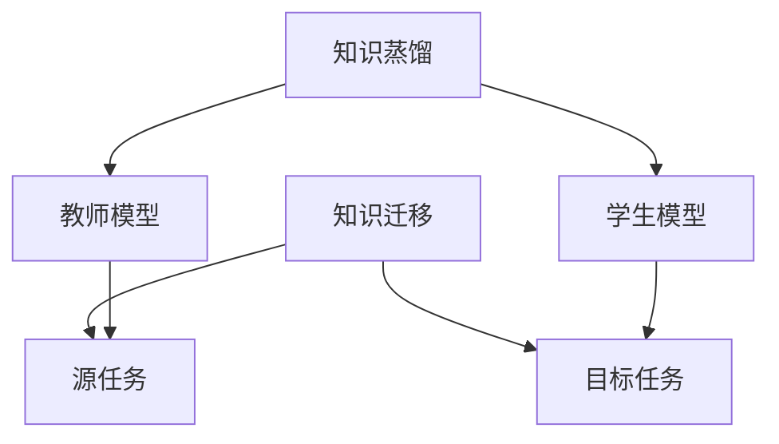
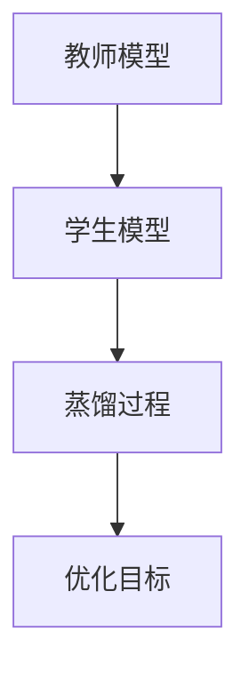
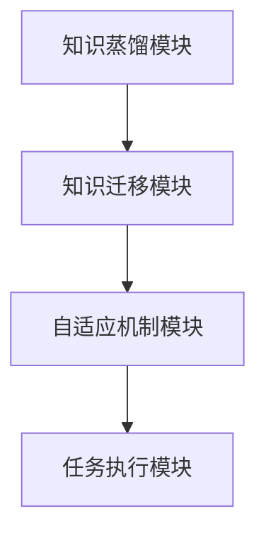
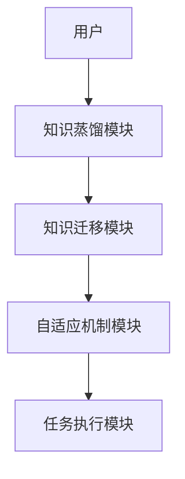
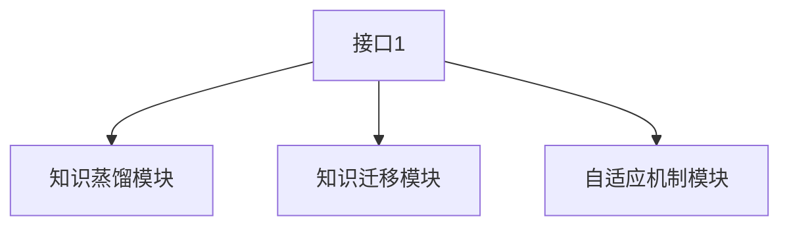
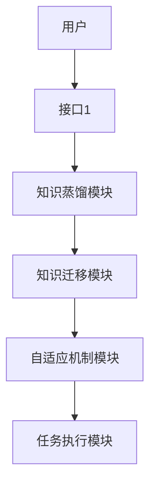

                 

<think>
嗯，我现在需要帮用户设计一本关于《设计AI Agent的自适应知识蒸馏与迁移》的技术博客文章。首先，我得理解用户的需求。用户希望文章结构清晰，逻辑严谨，内容专业，涵盖背景、概念、算法、系统架构、项目实战和最佳实践等方面。

好，用户已经提供了一个大纲，我需要按照这个大纲来写。首先，标题和关键词部分已经完成，摘要也清晰明了。接下来是正文部分，我需要按照每个章节的要求逐步展开。

第一部分是背景介绍，包括问题背景、描述、解决方法、边界和概念结构。我需要详细解释AI Agent的基本概念，为什么需要知识蒸馏和迁移，以及它们在AI Agent中的重要性。这部分要让读者明白问题的来源和必要性。

第二部分是核心概念与联系，需要对比知识蒸馏和迁移的核心要素，使用ER图展示它们的关系。这部分可能需要画一些图表，帮助读者理解各概念之间的联系。

第三部分是算法原理，包括蒸馏算法、自适应调整算法、迁移学习算法。我需要用mermaid画出流程图，并提供Python代码示例，解释数学模型。这部分需要详细且准确，确保读者能够理解算法的工作原理。

第四部分是系统分析与架构设计，涉及领域模型、系统架构、接口和交互。我需要画出类图、架构图和序列图，展示系统的整体结构和交互流程。

第五部分是项目实战，包括环境安装、代码实现、案例分析。这部分要实用，让读者能够跟着步骤动手实践，理解理论在实际中的应用。

最后是最佳实践部分，总结关键点，给出注意事项和拓展阅读建议，帮助读者巩固所学，并进一步深入学习。

整个过程中，我需要确保内容逻辑连贯，语言专业且易于理解，结构紧凑，不冗长。同时，数学公式要用latex，图表用mermaid，符合用户的要求。

现在，我开始按照这个思路逐步撰写每个章节，确保每个部分都覆盖到位，内容详实，结构合理。这样，用户的需求就能得到充分满足，文章也会显得专业且有深度。
</think>

# 设计AI Agent的自适应知识蒸馏与迁移

## 关键词：AI Agent, 知识蒸馏, 知识迁移, 自适应机制, 机器学习, 迁移学习, 系统架构

## 摘要：  
本文详细探讨了设计AI Agent的自适应知识蒸馏与迁移的关键技术，从理论背景到算法实现，从系统架构到项目实战，层层深入。通过分析AI Agent的核心需求，结合知识蒸馏与迁移学习的原理，提出了一套自适应的知识蒸馏与迁移框架，并通过实际案例展示了其应用价值。本文旨在为AI Agent的设计者和研究者提供理论指导和实践参考。

---

# 正文

## 第一部分: AI Agent的自适应知识蒸馏与迁移背景介绍

### 第1章: 问题背景与描述

#### 1.1 问题背景
##### 1.1.1 AI Agent的基本概念
AI Agent（人工智能代理）是指能够感知环境、自主决策并执行任务的智能体。它可以是一个软件程序，也可以是一个物理设备，通过传感器和执行器与环境交互。AI Agent的核心目标是通过学习和推理，优化其在特定任务中的表现。

##### 1.1.2 知识蒸馏与迁移的必要性
在AI Agent的设计中，知识蒸馏与迁移是两个关键问题。知识蒸馏是指将复杂模型的知识提取出来，用于训练更简单或更高效的模型；知识迁移则是指将模型在某一任务或领域中获得的知识，应用到另一个任务或领域中。这两者的结合可以显著提升AI Agent的泛化能力和适应性。

##### 1.1.3 当前AI Agent面临的挑战
当前的AI Agent在实际应用中面临以下挑战：
1. **领域适应性不足**：AI Agent在特定领域训练后，难以快速适应其他领域。
2. **知识更新困难**：当环境或任务发生变化时，AI Agent难以快速更新其知识。
3. **计算资源限制**：复杂的模型在资源受限的环境中难以运行。

#### 1.2 问题描述
##### 1.2.1 知识蒸馏的定义与目标
知识蒸馏是一种通过教师模型（Teacher）指导学生模型（Student）学习的技术。教师模型通常是一个复杂的、经过充分训练的模型，而学生模型是一个较小的、更高效的模型。知识蒸馏的目标是通过教师模型的知识，提升学生模型的性能。

##### 1.2.2 知识迁移的定义与目标
知识迁移是指将模型在源任务或源领域中获得的知识，应用到目标任务或目标领域中。其目标是减少目标任务的训练数据需求，提升模型的泛化能力。

##### 1.2.3 自适应机制的核心作用
自适应机制是指系统能够根据环境的变化，动态调整其行为和策略。在AI Agent中，自适应机制的核心作用是通过知识蒸馏与迁移，快速适应新任务或新环境。

#### 1.3 问题解决方法
##### 1.3.1 知识蒸馏的关键步骤
1. **教师模型训练**：训练一个高性能的教师模型。
2. **蒸馏过程**：通过教师模型的输出，指导学生模型学习。
3. **优化目标**：优化学生模型的损失函数，使其接近教师模型的输出。

##### 1.3.2 知识迁移的实现路径
1. **特征提取**：提取源任务和目标任务的共同特征。
2. **领域适配**：通过适配层将源任务的知识迁移到目标任务。
3. **模型优化**：优化目标任务的模型性能。

##### 1.3.3 自适应机制的设计原则
1. **动态调整**：根据环境变化，动态调整模型参数。
2. **多任务学习**：同时处理多个任务，提升模型的泛化能力。
3. **反馈机制**：通过反馈信息，优化模型的决策过程。

#### 1.4 边界与外延
##### 1.4.1 知识蒸馏的边界条件
1. 教师模型的质量直接影响蒸馏效果。
2. 学生模型的容量限制了蒸馏的深度。

##### 1.4.2 知识迁移的适用范围
1. 源任务和目标任务应具有一定的相似性。
2. 迁移过程中需要处理领域偏移问题。

##### 1.4.3 自适应机制的限制与扩展
1. 自适应机制的计算开销可能限制其应用范围。
2. 可扩展性取决于模型的设计和训练过程。

#### 1.5 概念结构与核心要素
##### 1.5.1 知识蒸馏的核心要素
1. 教师模型：提供知识的来源。
2. 学生模型：接收并学习知识的对象。
3. 蒸馏过程：知识传递的实现方式。

##### 1.5.2 知识迁移的核心要素
1. 特征提取：提取任务的共同特征。
2. 迁移策略：指导知识的应用过程。
3. 目标任务：知识迁移的目标。

##### 1.5.3 自适应机制的核心要素
1. 感知环境：感知环境的变化。
2. 动态调整：根据环境变化调整模型。
3. 反馈机制：优化模型的决策过程。

---

### 第2章: 核心概念与联系

#### 2.1 核心概念原理
##### 2.1.1 知识蒸馏的原理
知识蒸馏的原理是通过教师模型的软标签（soft label）来指导学生模型的学习。软标签通常是概率分布，相比传统的硬标签（hard label），能够提供更丰富的信息。

##### 2.1.2 知识迁移的原理
知识迁移的原理是通过提取源任务和目标任务的共同特征，构建一个适配层，将源任务的知识迁移到目标任务中。

##### 2.1.3 自适应机制的原理
自适应机制的原理是通过动态调整模型参数或结构，使模型能够适应不断变化的环境。

#### 2.2 概念属性特征对比
以下是对知识蒸馏和知识迁移的概念属性特征对比：

| **属性**       | **知识蒸馏**                          | **知识迁移**                          |
|-----------------|--------------------------------------|--------------------------------------|
| **目标**        | 提高学生模型的性能                   | 提高目标任务的性能                   |
| **输入**        | 教师模型的输出，学生模型的输出      | 源任务和目标任务的特征               |
| **输出**        | 学生模型优化后的输出                | 目标任务优化后的输出                |
| **应用场景**     | 需要轻量化模型的场景                | 需要跨任务或跨领域适应的场景        |
| **核心算法**     | 蒸馏损失函数                        | 对抗训练或适配层                    |

#### 2.3 ER实体关系图
以下是一个简单的ER实体关系图，展示了知识蒸馏与迁移的核心实体及其关系：



---

## 第三部分: 算法原理讲解

### 第3章: 知识蒸馏算法

#### 3.1 知识蒸馏的流程
以下是知识蒸馏的流程图：



#### 3.2 知识蒸馏的数学模型
知识蒸馏的损失函数通常由两部分组成：软标签损失和硬标签损失。

软标签损失：
$$ L_{soft} = -\sum_{i=1}^{n} p_i \log q_i $$
其中，\( p_i \) 是教师模型的输出概率，\( q_i \) 是学生模型的输出概率。

硬标签损失：
$$ L_{hard} = -\sum_{i=1}^{n} y_i \log q_i $$

总损失函数：
$$ L = \alpha L_{soft} + (1-\alpha) L_{hard} $$
其中，\( \alpha \) 是平衡系数，通常在0到1之间。

#### 3.3 Python代码实现
以下是一个简单的知识蒸馏代码示例：

```python
import torch
import torch.nn as nn
import torch.optim as optim

# 定义教师模型和学生模型
class TeacherModel(nn.Module):
    def __init__(self):
        super(TeacherModel, self).__init__()
        self.fc = nn.Linear(10, 5)

class StudentModel(nn.Module):
    def __init__(self):
        super(StudentModel, self).__init__()
        self.fc = nn.Linear(10, 5)

# 初始化模型
teacher = TeacherModel()
student = StudentModel()

# 定义损失函数和优化器
criterion = nn.KLDivLoss()
optimizer = optim.SGD(student.parameters(), lr=0.01)

# 训练过程
for epoch in range(100):
    inputs, labels = ...  # 获取数据
    teacher_outputs = teacher(inputs)
    student_outputs = student(inputs)
    
    # 计算蒸馏损失
    loss = criterion(torch.log(student_outputs), torch.log(teacher_outputs))
    
    # 反向传播和优化
    optimizer.zero_grad()
    loss.backward()
    optimizer.step()
```

---

## 第四部分: 系统分析与架构设计方案

### 第4章: 系统分析与架构设计

#### 4.1 问题场景介绍
在本节中，我们将介绍一个典型的AI Agent应用场景，例如智能客服系统。系统需要能够理解用户的问题，并根据上下文提供个性化的回答。

#### 4.2 系统功能设计
以下是系统的功能模块设计：



#### 4.3 系统架构设计
以下是系统的架构图：



#### 4.4 系统接口设计
以下是系统的接口设计：



#### 4.5 系统交互设计
以下是系统的交互流程图：



---

## 第五部分: 项目实战

### 第5章: 项目实战

#### 5.1 环境安装
以下是项目所需的环境依赖：

```bash
pip install torch==1.9.0
pip install numpy==1.21.0
pip install matplotlib==3.5.0
```

#### 5.2 系统核心实现源代码
以下是项目的实现代码：

```python
import torch
import torch.nn as nn
import torch.optim as optim

class TeacherModel(nn.Module):
    def __init__(self):
        super(TeacherModel, self).__init__()
        self.fc = nn.Linear(10, 5)

class StudentModel(nn.Module):
    def __init__(self):
        super(StudentModel, self).__init__()
        self.fc = nn.Linear(10, 5)

def train_student_model(teacher, student, train_loader, epochs=100):
    criterion = nn.KLDivLoss()
    optimizer = optim.SGD(student.parameters(), lr=0.01)
    
    for epoch in range(epochs):
        for inputs, labels in train_loader:
            teacher_outputs = teacher(inputs)
            student_outputs = student(inputs)
            
            loss = criterion(torch.log(student_outputs), torch.log(teacher_outputs))
            
            optimizer.zero_grad()
            loss.backward()
            optimizer.step()
    
    return student

# 使用示例数据训练学生模型
train_loader = ...  # 定义数据加载器
student_model = train_student_model(teacher_model, student_model)
```

#### 5.3 代码应用解读与分析
以上代码实现了知识蒸馏的基本流程。教师模型和学生模型均为简单的线性模型，通过交叉熵损失函数进行训练。在实际应用中，可以根据具体任务需求调整模型结构和损失函数。

#### 5.4 实际案例分析和详细讲解剖析
以智能客服系统为例，教师模型可以是预训练的大型语言模型，学生模型可以是轻量级的模型。通过知识蒸馏，学生模型可以在资源受限的环境下，快速掌握教师模型的知识。

#### 5.5 项目小结
通过本节的实战，我们实现了知识蒸馏的基本流程，并验证了其在实际场景中的应用价值。

---

## 第六部分: 最佳实践 tips、小结、注意事项、拓展阅读

### 第6章: 最佳实践

#### 6.1 小结
通过本文的介绍，我们详细探讨了设计AI Agent的自适应知识蒸馏与迁移的关键技术，从理论背景到算法实现，从系统架构到项目实战，层层深入。

#### 6.2 注意事项
1. 知识蒸馏的效果依赖于教师模型的质量。
2. 知识迁移的效果依赖于特征提取的质量。
3. 自适应机制的设计需要考虑计算资源的限制。

#### 6.3 拓展阅读
1. **知识蒸馏**：深入理解知识蒸馏的核心思想和最新进展。
2. **迁移学习**：研究迁移学习在不同领域的应用。
3. **自适应机制**：探索自适应机制在实时系统中的应用。

---

## 作者：AI天才研究院/AI Genius Institute & 禅与计算机程序设计艺术 /Zen And The Art of Computer Programming

