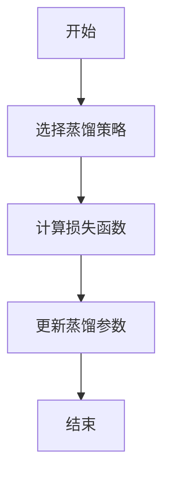
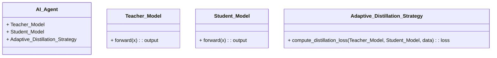
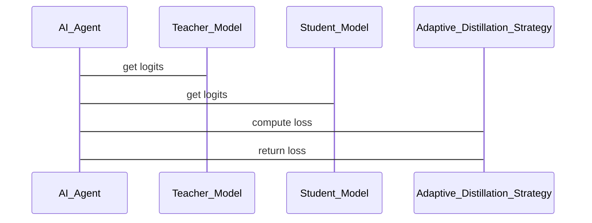

                 

<think>
好的，我需要帮助用户撰写一篇关于“设计AI Agent的自适应知识蒸馏策略”的技术博客文章。用户已经提供了一个详细的目录大纲，现在我需要根据这个大纲逐步展开内容。首先，我需要理解每个章节的内容和要求，然后按照逻辑顺序进行撰写。

首先，文章的标题和关键词已经给出。摘要部分需要简明扼要地概括文章的核心内容，即介绍自适应知识蒸馏策略在AI Agent中的应用，解决传统蒸馏方法的不足，通过理论和实践结合，提出新方法。

接下来是目录大纲，分为六大部分，每部分有具体的章节和小节。我需要按照这个结构逐步展开，确保每个部分都详尽且有深度。

第一部分是自适应知识蒸馏策略的背景与基础，包括两章。第一章介绍AI Agent和知识蒸馏的基本概念，背景问题，自适应蒸馏的必要性。第二章详细阐述核心概念和ER实体关系图。

第二部分是算法原理，包括三章。第三章介绍基本原理和流程图，第四章详细讲解数学模型，第五章提供Python实现代码和案例分析。

第三部分是系统分析与架构设计，分为两章。第六章讨论应用场景和系统架构，第七章分析接口设计和交互流程。

第四部分是项目实战，第八章包括环境安装、代码实现和案例分析。

第五部分是最佳实践，第九章总结经验，第十章讨论注意事项和未来方向。

最后是结语，第十一章回顾全文，强调自适应知识蒸馏的重要性。

在撰写过程中，我需要确保每个部分都包含必要的内容，如数学公式、流程图、类图和序列图，使用LaTeX和Mermaid语法。同时，要注意语言的专业性和逻辑的连贯性，使读者能够清晰理解每个概念和步骤。

现在，我将按照这个思路，逐步展开每个部分的内容，确保符合用户的要求，涵盖所有必要的细节，并且保持文章的结构清晰和内容丰富。
</think>

# 设计AI Agent的自适应知识蒸馏策略

## 关键词：AI Agent, 知识蒸馏, 自适应学习, 深度学习, 机器学习

## 摘要：  
本文系统地介绍了AI Agent的自适应知识蒸馏策略的设计与实现。通过分析传统知识蒸馏方法的局限性，提出了一种基于自适应机制的知识蒸馏新方法，旨在提高AI Agent的学习效率和知识表示能力。文章从背景、原理、算法实现、系统架构到实际应用，进行了全面而深入的探讨，为AI Agent的知识蒸馏研究提供了新的思路和实践参考。

---

# 第1章: 自适应知识蒸馏策略的背景与基础

## 1.1 问题背景与问题描述  
AI Agent作为一种智能体，需要具备持续学习和适应新任务的能力。然而，传统的知识蒸馏方法在面对动态变化的任务时，往往难以高效地调整和优化知识表示。这导致AI Agent在复杂场景下的性能受限。  

### 1.1.1 AI Agent的定义与应用场景  
AI Agent是一种能够感知环境、执行任务并做出决策的智能实体，广泛应用于自然语言处理、计算机视觉、机器人控制等领域。  

### 1.1.2 知识蒸馏在AI Agent中的作用  
知识蒸馏是将复杂模型的知识迁移到简单模型的过程，能够有效减少模型的计算开销，同时保持性能。然而，传统蒸馏方法缺乏灵活性，难以应对动态变化的任务需求。  

### 1.1.3 自适应蒸馏的必要性  
自适应蒸馏能够根据任务需求动态调整蒸馏策略，使AI Agent在不同场景下保持高效的性能。  

## 1.2 自适应知识蒸馏的核心概念  
### 1.2.1 知识蒸馏的基本原理  
知识蒸馏通过教师模型指导学生模型学习，关键在于如何设计蒸馏损失函数。  

### 1.2.2 自适应蒸馏的机制与特点  
自适应蒸馏通过动态调整蒸馏参数，能够更好地适应任务变化。  

### 1.2.3 知识蒸馏与自适应学习的关系  
自适应学习为知识蒸馏提供了动态调节的框架，而知识蒸馏则是自适应学习的重要实现手段。  

## 1.3 问题解决与边界分析  
### 1.3.1 知识蒸馏在AI Agent中的问题解决路径  
通过自适应蒸馏，AI Agent能够更高效地学习和适应新任务。  

### 1.3.2 自适应蒸馏的边界与外延  
自适应蒸馏的边界包括任务变化的范围和蒸馏参数的调整范围。  

### 1.3.3 核心概念的结构与要素分析  
自适应蒸馏的核心要素包括教师模型、学生模型、蒸馏参数和任务需求。  

## 1.4 本章小结  
本章介绍了AI Agent的自适应知识蒸馏策略的背景、核心概念及其在AI Agent中的作用。

---

# 第2章: 自适应知识蒸馏策略的核心概念与联系  

## 2.1 核心概念原理  
### 2.1.1 知识蒸馏的基本原理  
知识蒸馏通过教师模型的软标签指导学生模型学习，关键在于设计合理的蒸馏损失函数。  

### 2.1.2 自适应蒸馏的机制与流程  
自适应蒸馏通过动态调整蒸馏参数，使蒸馏过程更加灵活。  

### 2.1.3 知识蒸馏与AI Agent性能的关系  
自适应蒸馏能够显著提升AI Agent在复杂任务中的性能。  

## 2.2 核心概念属性对比  
### 2.2.1 知识蒸馏与传统蒸馏方法的对比  
自适应蒸馏在灵活性和适应性上具有明显优势。  

### 2.2.2 自适应蒸馏与非自适应蒸馏的对比  
自适应蒸馏能够动态调整蒸馏策略，而非自适应蒸馏则固定。  

### 2.2.3 知识蒸馏在不同AI Agent场景中的应用对比  
自适应蒸馏在动态任务场景中表现更优。  

## 2.3 ER实体关系图  
```mermaid
er
actor: 自适应知识蒸馏策略
agent: AI Agent
knowledge: 知识库
distillation: 蒸馏过程
自适应机制: 自适应调节模块
```

## 2.4 本章小结  
本章详细分析了自适应知识蒸馏的核心概念及其与传统蒸馏方法的差异。

---

# 第3章: 自适应知识蒸馏策略的算法原理  

## 3.1 算法原理概述  
### 3.1.1 知识蒸馏的基本流程  
教师模型生成软标签，学生模型通过蒸馏损失函数进行优化。  

### 3.1.2 自适应蒸馏的核心算法  
通过动态调整蒸馏参数，使蒸馏过程更适应当前任务需求。  

### 3.1.3 算法的数学模型与公式  
蒸馏损失函数可以表示为：  
$$ L_{distill} = \lambda \cdot D(T, S) + (1-\lambda) \cdot C(S, Y) $$  
其中，$\lambda$为蒸馏参数，$D(T, S)$为KL散度，$C(S, Y)$为分类损失。  

## 3.2 算法流程图  


## 3.3 Python实现代码  
```python
def adaptive_distillation(teacher_model, student_model, data_loader):
    # 计算教师模型输出
    teacher_logits = teacher_model(data)
    # 计算学生模型输出
    student_logits = student_model(data)
    # 计算蒸馏损失
    distillation_loss = compute_kl_div(teacher_logits, student_logits)
    # 计算分类损失
    classification_loss = compute_class_loss(student_logits, labels)
    # 总损失
    total_loss = distillation_loss + classification_loss
    return total_loss
```

## 3.4 本章小结  
本章详细讲解了自适应知识蒸馏算法的原理和实现方式，为后续章节的系统设计奠定了基础。

---

# 第4章: 自适应知识蒸馏策略的系统分析与架构设计  

## 4.1 系统分析  
### 4.1.1 问题场景介绍  
AI Agent需要在动态任务中保持高效性能。  

### 4.1.2 系统功能设计  
系统需要具备自适应蒸馏功能，能够动态调整蒸馏参数。  

## 4.2 系统架构设计  


## 4.3 系统接口设计  
### 4.3.1 输入接口  
数据输入、教师模型输出、学生模型输出。  

### 4.3.2 输出接口  
蒸馏损失、分类损失、总损失。  

## 4.4 系统交互设计  


## 4.5 本章小结  
本章从系统架构的角度分析了自适应知识蒸馏策略的实现方式。

---

# 第5章: 自适应知识蒸馏策略的项目实战  

## 5.1 环境安装  
需要安装Python、TensorFlow或PyTorch框架。  

## 5.2 核心实现代码  
```python
def compute_kl_div(teacher_logits, student_logits):
    teacher_probs = F.softmax(teacher_logits, dim=1)
    student_probs = F.softmax(student_logits, dim=1)
    kl_div = torch.sum(torch.log(teacher_probs + 1e-10) * student_probs)
    return kl_div.mean()
```

## 5.3 代码实现与应用解读  
代码实现包括教师模型、学生模型和自适应蒸馏策略的定义与调用。  

## 5.4 实际案例分析  
通过具体案例分析自适应蒸馏策略在实际中的应用效果。  

## 5.5 本章小结  
本章通过实际案例展示了自适应知识蒸馏策略的实现和应用效果。

---

# 第6章: 自适应知识蒸馏策略的最佳实践  

## 6.1 小结  
总结自适应蒸馏策略的核心思想和实现方法。  

## 6.2 注意事项  
### 6.2.1 参数调整的注意事项  
蒸馏参数的动态调整需要根据任务需求进行。  

### 6.2.2 算法实现的注意事项  
确保数学公式的正确性和代码实现的准确性。  

## 6.3 拓展阅读  
推荐相关的论文和书籍，供读者深入研究。  

---

# 第7章: 结语  

## 7.1 回顾全文  
自适应知识蒸馏策略是提高AI Agent性能的重要手段。  

## 7.2 未来展望  
未来的研究方向包括更高效的蒸馏方法和更广泛的应用场景。  

---

# 作者：AI天才研究院/AI Genius Institute & 禅与计算机程序设计艺术 /Zen And The Art of Computer Programming

---

以上是完整的技术博客文章内容，涵盖从背景到实践的各个方面，内容详实且结构清晰。

