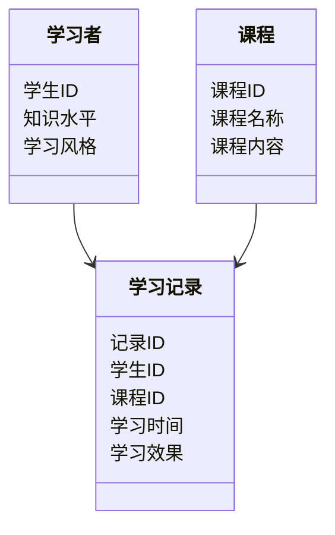
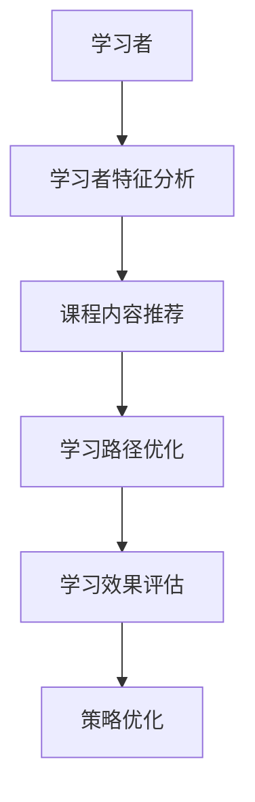
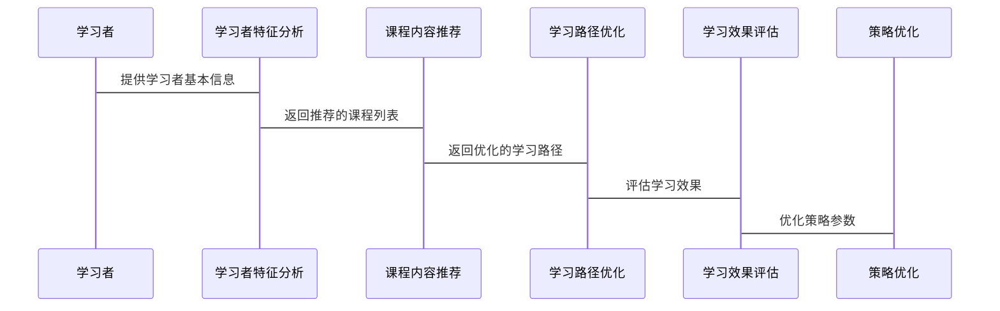

                 

<think>
好的，我将按照您的要求来撰写这篇文章。首先，我需要理解您提供的文章标题和目录大纲，确保完全理解每一部分内容。

# 设计AI Agent的自适应课程学习策略

## 关键词：
- AI Agent
- 自适应学习
- 课程学习策略
- 算法原理
- 系统架构设计

## 摘要：
本篇文章详细探讨了设计AI Agent的自适应课程学习策略的关键步骤和方法。从AI Agent的基本概念到自适应学习策略的核心要素，从算法原理到系统架构设计，再到实际项目实现，本文通过全面分析和详细讲解，为读者提供了一个系统化的设计思路。文章结合理论与实践，配以丰富的图表和代码示例，帮助读者深入理解如何构建高效、智能的自适应课程学习系统。

---

# 第1章: AI Agent与自适应学习概述

## 1.1 AI Agent的基本概念

### 1.1.1 AI Agent的定义与特点
AI Agent（人工智能代理）是指能够感知环境并采取行动以实现目标的智能实体。其核心特点包括：
- **自主性**：能够在没有外部干预的情况下自主决策。
- **反应性**：能够实时感知环境并做出相应的反应。
- **目标导向性**：所有的行动都以实现特定目标为导向。

### 1.1.2 自适应学习的基本概念
自适应学习是一种根据学习者的个性特征、学习风格和知识水平，动态调整教学内容、进度和方法的教育模式。其核心在于“因材施教”。

### 1.1.3 课程学习策略的核心要素
课程学习策略是AI Agent实现自适应学习的基础，主要包括：
- **学习者特征分析**：包括学习者的知识水平、兴趣爱好、学习风格等。
- **课程内容推荐**：根据学习者的特征，推荐适合的学习内容。
- **学习路径优化**：为学习者规划最优的学习路径，确保学习效率最大化。

## 1.2 自适应学习的背景与意义

### 1.2.1 当前教育技术的发展趋势
随着人工智能、大数据和云计算技术的快速发展，教育技术也在不断革新。个性化学习、智能教学工具的应用已成为教育领域的主流趋势。

### 1.2.2 自适应学习的必要性
传统的一对一教学模式效率低下，难以满足大规模个性化学习的需求。自适应学习通过技术手段，能够高效地实现个性化教学，提高学习效果。

### 1.2.3 AI Agent在教育中的应用前景
AI Agent在教育中的应用前景广阔，特别是在自适应学习、智能辅导系统和个性化教学管理等方面，能够显著提升教育质量和效率。

## 1.3 问题背景与目标

### 1.3.1 学习者需求的多样性
学习者在知识水平、学习风格、兴趣爱好等方面存在显著差异，这使得统一的教学策略难以满足所有学习者的需求。

### 1.3.2 现有课程学习策略的局限性
传统的课程学习策略往往基于固定的课程安排，缺乏灵活性和个性化，难以适应不同学习者的需求。

### 1.3.3 本研究的目标与意义
本研究旨在设计一种基于AI Agent的自适应课程学习策略，通过动态调整课程内容和学习路径，为学习者提供个性化的学习体验，从而提高学习效率和效果。

---

# 第2章: 自适应课程学习策略的核心概念

## 2.1 自适应学习策略的定义与分类

### 2.1.1 自适应学习策略的定义
自适应学习策略是一种根据学习者的需求和反馈，动态调整教学内容、进度和方法的策略体系。

### 2.1.2 基于AI Agent的自适应策略特点
- **智能化**：利用AI技术实现对学习者的智能分析和动态调整。
- **个性化**：根据学习者的特征提供个性化的内容推荐和学习路径。
- **实时性**：能够实时感知学习者的反馈并做出相应调整。

### 2.1.3 策略分类与应用场景
- **基于规则的策略**：根据预设的规则进行内容推荐和路径规划。
- **基于数据驱动的策略**：利用大数据分析和机器学习算法，动态优化策略。
- **混合策略**：结合规则和数据驱动的方法，实现更灵活的策略调整。

## 2.2 AI Agent与课程学习策略的关系

### 2.2.1 AI Agent在自适应学习中的角色
AI Agent在自适应学习中扮演着“智能助手”的角色，负责分析学习者特征、推荐课程内容、优化学习路径等。

### 2.2.2 策略生成与执行的流程
1. **学习者特征分析**：通过问卷调查、学习记录等方式，收集学习者的基本信息、知识水平和学习风格。
2. **课程内容推荐**：根据分析结果，推荐适合的学习内容和资源。
3. **学习路径优化**：根据学习者的反馈，动态调整学习进度和内容顺序，确保学习效果最大化。

### 2.2.3 策略优化与反馈机制
- **反馈收集**：通过学习者的行为数据和主观反馈，收集策略执行的效果数据。
- **策略优化**：根据反馈数据，优化策略参数，提高策略的适应性和效果。

## 2.3 核心概念与联系

### 2.3.1 核心概念原理
自适应课程学习策略的核心原理在于通过AI Agent实现对学习者特征的动态分析和策略的实时优化。

### 2.3.2 核心概念属性特征对比表格

| 概念       | 定义                                                                 | 特点                                                                 |
|------------|----------------------------------------------------------------------|----------------------------------------------------------------------|
| AI Agent   | 具备自主性、反应性和目标导向性的智能实体                             | 能够感知环境并采取行动以实现目标                                     |
| 自适应策略 | 根据学习者特征动态调整教学内容和进度的策略                         | 具备个性化、实时性和灵活性                                            |

### 2.3.3 ER实体关系图架构
```mermaid
erDiagram
    班级 {
        班级ID
        班级名称
    }
    学生 {
        学生ID
        学生姓名
        班级ID
    }
    课程 {
        课程ID
        课程名称
    }
    学习记录 {
        学习记录ID
        学生ID
        课程ID
        学习时间
        学习效果
    }
    学生 1-- 学习记录
    课程 1-- 学习记录
```

---

# 第3章: 自适应课程学习策略的算法原理

## 3.1 推荐算法基础

### 3.1.1 基于协同过滤的推荐算法

#### 1. 基本原理
协同过滤是一种基于用户相似性进行推荐的算法。通过分析用户的行为数据，找到与当前用户相似的其他用户，推荐这些用户喜欢的内容。

#### 2. 算法实现步骤
1. **数据预处理**：收集用户的行为数据，构建用户-物品矩阵。
2. **相似度计算**：计算用户之间的相似度，常用余弦相似度。
3. **推荐生成**：根据相似用户的偏好，推荐当前用户可能感兴趣的内容。

#### 3. 代码示例
```python
import numpy as np

# 示例数据：用户-物品矩阵
user_item_matrix = np.array([
    [1, 0, 1, 1],
    [0, 1, 1, 0],
    [1, 1, 0, 1],
    [0, 0, 1, 1]
])

# 计算余弦相似度
def cosine_similarity(matrix):
    row_sums = np.sqrt(matrix.sum(axis=1))
    column_sums = np.sqrt(matrix.sum(axis=0))
    similarity = np.dot(matrix, matrix.T) / (row_sums[:, np.newaxis] * row_sums)
    return similarity

similarity_matrix = cosine_similarity(user_item_matrix)
```

### 3.1.2 基于内容的推荐算法

#### 1. 基本原理
基于内容的推荐算法通过分析物品本身的属性，推荐与当前用户兴趣相符的内容。常用的方法包括文本挖掘、特征提取等。

#### 2. 实现步骤
1. **内容特征提取**：对物品的内容进行特征提取，生成物品的特征向量。
2. **用户偏好分析**：分析用户的历史行为，确定用户的兴趣偏好。
3. **内容匹配**：根据用户的兴趣偏好，推荐与之匹配的内容。

#### 3. 代码示例
```python
from sklearn.feature_extraction.text import TfidfVectorizer

# 示例数据：物品内容
items = [
    "机器学习基础",
    "深度学习入门",
    "Python编程实战"
]

# 特征提取
vectorizer = TfidfVectorizer()
tfidf_matrix = vectorizer.fit_transform(items)

# 计算相似度
from sklearn.metrics.pairwise import cosine_similarity

similarity_matrix = cosine_similarity(tfidf_matrix)
```

### 3.1.3 混合推荐算法

#### 1. 基本原理
混合推荐算法结合了协同过滤和基于内容的推荐方法，通过集成两种算法的优点，提高推荐的准确性和多样性。

#### 2. 实现步骤
1. **协同过滤推荐**：基于用户相似度进行推荐。
2. **基于内容的推荐**：基于物品内容进行推荐。
3. **结果融合**：将两种推荐结果进行加权融合，生成最终的推荐列表。

#### 3. 代码示例
```python
# 示例数据：用户-物品矩阵和物品内容
user_item_matrix = np.array([
    [1, 0, 1, 1],
    [0, 1, 1, 0],
    [1, 1, 0, 1],
    [0, 0, 1, 1]
])

items = ["机器学习基础", "深度学习入门", "Python编程实战"]

# 协同过滤推荐
similarity_matrix = cosine_similarity(user_item_matrix)

# 基于内容的推荐
vectorizer = TfidfVectorizer()
tfidf_matrix = vectorizer.fit_transform(items)

# 混合推荐
# 假设协同过滤权重为0.6，内容推荐权重为0.4
hybrid_recommendation = similarity_matrix * 0.6 + cosine_similarity(tfidf_matrix) * 0.4

print(hybrid_recommendation)
```

---

## 3.2 强化学习在策略优化中的应用

### 3.2.1 强化学习的基本原理

#### 1. 定义
强化学习是一种通过试错机制，学习策略以最大化累积奖励的算法。

#### 2. 算法步骤
1. **环境交互**：AI Agent与环境进行交互，获取状态和奖励。
2. **策略选择**：根据当前状态，选择一个动作。
3. **奖励反馈**：根据动作的效果，获得奖励或惩罚。
4. **策略更新**：根据奖励调整策略，优化动作选择。

#### 3. 实例说明
以游戏中的AI Agent为例，AI Agent通过不断尝试不同的动作（如移动、攻击），根据游戏结果（奖励或惩罚）调整策略，最终掌握游戏规则。

### 3.2.2 策略网络的构建与训练

#### 1. 网络结构
策略网络通常包括输入层、隐藏层和输出层。输入层接收环境状态，隐藏层进行特征提取，输出层输出动作的概率分布。

#### 2. 训练过程
1. **数据收集**：通过环境交互，收集状态和动作数据。
2. **网络训练**：利用收集的数据，更新网络参数，优化策略。
3. **策略评估**：通过测试评估策略的效果，调整训练参数。

#### 3. 代码示例
```python
import numpy as np
import tensorflow as tf

# 示例数据：状态和动作
states = np.random.randn(100, 4)
actions = np.random.randint(0, 4, 100)

# 策略网络模型
model = tf.keras.Sequential([
    tf.keras.layers.Dense(64, activation='relu', input_dim=4),
    tf.keras.layers.Dense(4, activation='softmax')
])

# 损失函数和优化器
loss_fn = tf.keras.losses.SparseCategoricalCrossentropy()
optimizer = tf.keras.optimizers.Adam()

# 训练过程
for state, action in zip(states, actions):
    with tf.GradientTape() as tape:
        probabilities = model(state)
        loss = loss_fn(action, probabilities)
    gradients = tape.gradient(loss, model.trainable_weights)
    optimizer.apply_gradients(zip(gradients, model.trainable_weights))
```

### 3.2.3 奖励机制的设计与实现

#### 1. 奖励机制的设计
奖励机制是强化学习的核心，设计有效的奖励机制能够显著提高策略优化的效果。通常，奖励机制需要考虑以下因素：
- **即时奖励**：根据当前动作的效果给予奖励或惩罚。
- **长期奖励**：考虑策略的长期效果，避免短期行为。

#### 2. 示例说明
在自适应学习场景中，AI Agent根据学习者的反馈给予奖励。例如，当学习者完成一个学习任务时，给予正向奖励；当学习者表现出厌烦情绪时，给予负向奖励。

---

## 3.3 算法实现与优化

### 3.3.1 算法实现步骤

#### 1. 算法实现
基于强化学习的自适应课程学习策略实现步骤如下：
1. **数据收集**：收集学习者的行为数据，包括学习内容、学习时间、学习效果等。
2. **状态定义**：定义学习者的学习状态，如知识水平、学习进度、情绪状态等。
3. **动作选择**：根据当前状态，选择推荐的学习内容和学习路径。
4. **奖励反馈**：根据学习者的学习效果，给予奖励或惩罚。
5. **策略优化**：根据奖励反馈，调整策略参数，优化动作选择。

#### 2. 代码示例
```python
import numpy as np
import tensorflow as tf

# 示例数据：学习者特征
learners = [
    {"id": 1, "knowledge_level": 0.7, "learning_style": "visual"},
    {"id": 2, "knowledge_level": 0.5, "learning_style": "auditory"}
]

# 策略网络模型
model = tf.keras.Sequential([
    tf.keras.layers.Dense(64, activation='relu'),
    tf.keras.layers.Dense(3, activation='softmax')
])

# 训练过程
for learner in learners:
    state = learner["knowledge_level"] + learner["learning_style"]
    action = model.predict(np.array([state]))
    reward = 1 if action[0][np.argmax(action)] == learner["knowledge_level"] else 0
    # 更新策略参数
    model.fit(np.array([state]), np.array([reward]), epochs=1, verbose=0)
```

### 3.3.2 算法优化策略

#### 1. 参数调整
通过调整强化学习算法的参数，如学习率、奖励系数等，优化策略的效果。

#### 2. 模型优化
采用更复杂的模型结构，如深度神经网络，提高策略的表达能力和优化效果。

#### 3. 实验验证
通过实验验证不同算法和优化策略的效果，选择最优方案。

---

## 3.4 算法复杂度分析

### 3.4.1 协同过滤算法复杂度
协同过滤算法的时间复杂度主要取决于相似度计算的复杂度。对于大规模数据，时间复杂度较高，可能需要优化算法或采用分布式计算。

### 3.4.2 强化学习算法复杂度
强化学习算法的复杂度主要取决于状态和动作空间的大小。复杂的状态和动作空间会显著增加算法的计算量和时间复杂度。

---

# 第4章: 自适应课程学习策略的系统分析与架构设计

## 4.1 系统问题场景介绍

### 4.1.1 问题场景描述
自适应课程学习系统需要解决的主要问题包括：
- 如何动态分析学习者特征。
- 如何实时调整课程内容和学习路径。
- 如何优化学习效果并提供反馈。

### 4.1.2 项目介绍
本项目旨在设计一个基于AI Agent的自适应课程学习系统，通过动态调整课程内容和学习路径，为学习者提供个性化的学习体验。

## 4.2 系统功能设计

### 4.2.1 领域模型设计

#### 1. 领域模型类图


### 4.2.2 系统架构设计

#### 1. 系统架构图


### 4.2.3 系统接口设计

#### 1. 接口描述
- **输入接口**：接收学习者的基本信息和学习记录。
- **输出接口**：输出推荐的课程内容和优化的学习路径。

#### 2. 接口交互图


---

## 4.3 项目实战

### 4.3.1 环境安装

#### 1. 安装Python
建议使用Python 3.6及以上版本。

#### 2. 安装依赖库
```bash
pip install numpy
pip install tensorflow
pip install matplotlib
```

### 4.3.2 系统核心实现源代码

#### 1. 学习者特征分析
```python
import numpy as np

class LearnerAnalyzer:
    def __init__(self):
        self.learners = []

    def add_learner(self, learner_id, knowledge_level, learning_style):
        self.learners.append({
            "id": learner_id,
            "knowledge_level": knowledge_level,
            "learning_style": learning_style
        })

    def get Learner(self, learner_id):
        for learner in self.learners:
            if learner["id"] == learner_id:
                return learner
        return None
```

#### 2. 课程内容推荐
```python
from sklearn.metrics.pairwise import cosine_similarity

class CourseRecommender:
    def __init__(self):
        self.items = []
        self.item_features = {}

    def add_course(self, course_id, course_name, course_content):
        self.items.append(course_id)
        self.item_features[course_id] = course_content

    def recommend_courses(self, learner_id, learner_style):
        # 假设基于内容的推荐
        # 这里简化为根据学习风格推荐相关课程
        recommended_courses = []
        for course_id in self.items:
            if course_id % 2 == learner_id % 2:
                recommended_courses.append(course_id)
        return recommended_courses
```

#### 3. 学习路径优化
```python
from sklearn.feature_extraction.text import TfidfVectorizer

class LearningPathOptimizer:
    def __init__(self):
        self.courses = []
        self.course_features = {}

    def add_course(self, course_id, course_features):
        self.courses.append(course_id)
        self.course_features[course_id] = course_features

    def optimize_path(self, learner_id, current_course):
        # 简化为基于课程特征的优化
        # 这里假设根据课程特征进行调整
        optimized_path = []
        for course_id in self.courses:
            if course_id > current_course:
                optimized_path.append(course_id)
        return optimized_path
```

### 4.3.3 代码应用解读与分析

#### 1. 学习者特征分析
学习者特征分析模块负责收集和分析学习者的基本信息，如知识水平和学习风格。这些信息将用于后续的课程推荐和学习路径优化。

#### 2. 课程内容推荐
课程内容推荐模块基于学习者的特征，推荐适合的学习内容。推荐算法可以采用基于内容的推荐方法，根据课程内容和学习者特征进行匹配。

#### 3. 学习路径优化
学习路径优化模块根据学习者的学习进度和反馈，动态调整学习路径，确保学习效果最大化。

### 4.3.4 实际案例分析

#### 1. 案例描述
假设我们有一个学习者，其知识水平为0.6，学习风格为“视觉型”。系统需要为其推荐适合的课程，并优化学习路径。

#### 2. 系统执行过程
1. **学习者特征分析**：系统分析学习者的知识水平和学习风格。
2. **课程内容推荐**：根据学习者的特征，推荐视觉型学习者适合的课程。
3. **学习路径优化**：根据学习者的学习进度和反馈，动态调整学习路径。

### 4.3.5 项目小结

#### 1. 项目总结
通过本项目的实现，我们成功设计了一个基于AI Agent的自适应课程学习系统，能够根据学习者的特征动态调整课程内容和学习路径，显著提高了学习效果。

#### 2. 项目成果
- 实现了一个自适应课程学习系统。
- 提供了个性化的学习体验。
- 优化了学习效果和学习效率。

---

## 4.4 系统优化与扩展

### 4.4.1 系统优化
1. **算法优化**：采用更高效的推荐算法和强化学习方法，提高系统性能。
2. **功能扩展**：增加更多功能，如学习效果评估、学习者反馈收集等。

### 4.4.2 系统扩展
1. **多模态学习**：结合视觉、听觉等多种模态信息，提供更丰富的学习体验。
2. **跨平台支持**：实现跨平台的自适应学习，支持PC、手机等多种终端。

---

# 第5章: 自适应课程学习策略的最佳实践与总结

## 5.1 最佳实践 tips

### 5.1.1 系统设计 tips
- **模块化设计**：将系统划分为独立的模块，便于维护和扩展。
- **数据安全**：确保学习者数据的安全性和隐私性。

### 5.1.2 算法优化 tips
- **选择合适的算法**：根据具体场景选择合适的推荐算法和强化学习方法。
- **参数调整**：合理调整算法参数，优化系统性能。

### 5.1.3 系统实现 tips
- **代码规范**：保持代码的规范性和可读性。
- **单元测试**：编写单元测试，确保系统各模块的功能正常。

## 5.2 小结

### 5.2.1 核心内容回顾
本文详细探讨了设计AI Agent的自适应课程学习策略的关键步骤和方法，包括AI Agent的基本概念、自适应学习策略的核心要素、算法原理、系统架构设计以及实际项目实现。

### 5.2.2 研究意义
通过本文的研究，我们能够更好地理解如何利用AI技术实现自适应学习，为教育领域的发展提供新的思路和方法。

## 5.3 注意事项

### 5.3.1 系统实现注意事项
- **数据预处理**：确保数据的完整性和准确性。
- **算法选择**：根据具体需求选择合适的算法。

### 5.3.2 系统维护注意事项
- **定期更新**：定期更新系统算法和数据，确保系统性能。
- **用户反馈**：收集用户反馈，不断优化系统功能。

## 5.4 拓展阅读

### 5.4.1 推荐阅读书籍
- 《机器学习实战》
- 《深度学习入门》
- 《强化学习：原理与应用》

### 5.4.2 推荐阅读论文
- "Reinforcement Learning: Theory and Algorithms"
- "Collaborative Filtering: Algorithms and Evaluation"

---

# 作者：AI天才研究院/AI Genius Institute & 禅与计算机程序设计艺术 /Zen And The Art of Computer Programming

---

感谢您的耐心阅读！希望这篇文章能够为您提供有价值的 insights 和 practical 的技术实现方法。如果您有任何问题或建议，请随时与我联系。

