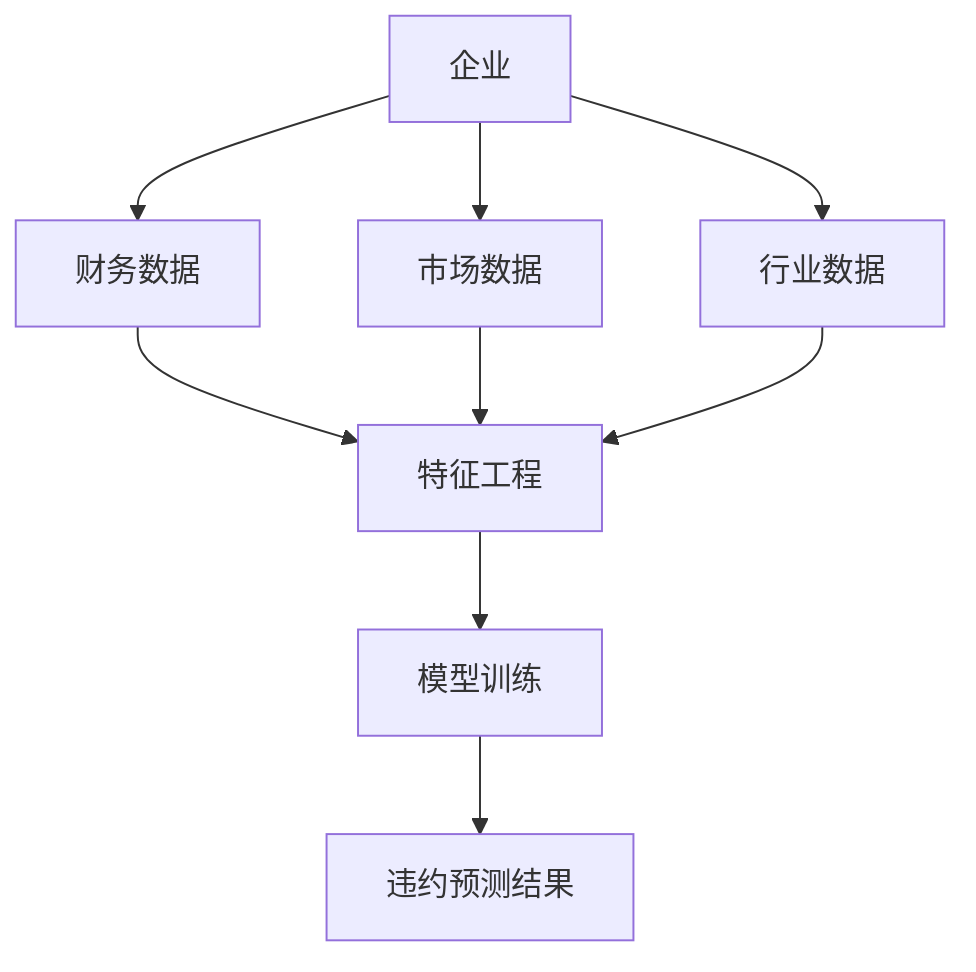
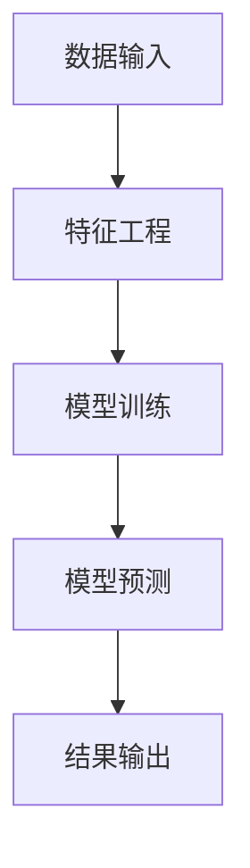
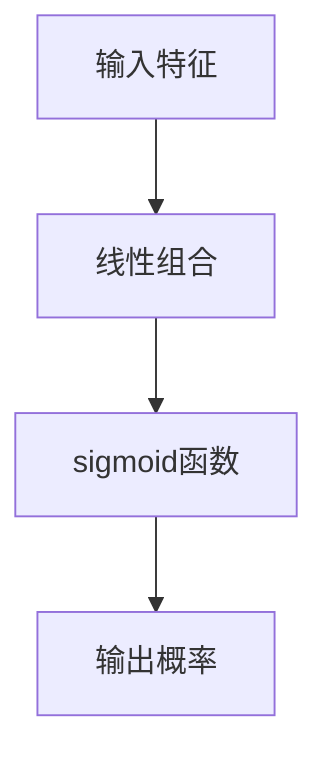
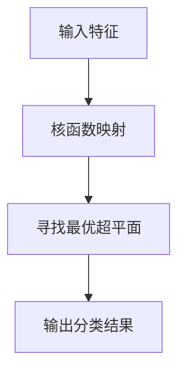
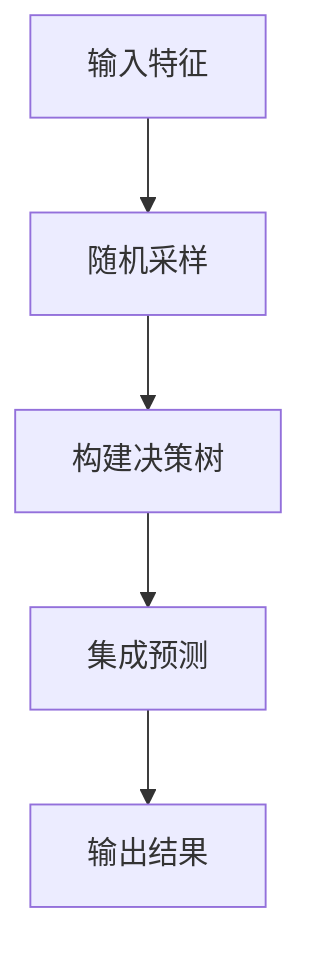
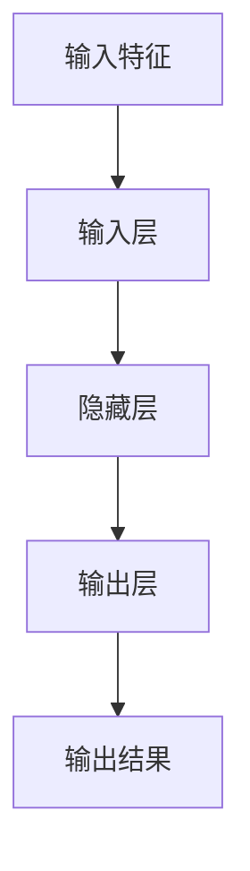
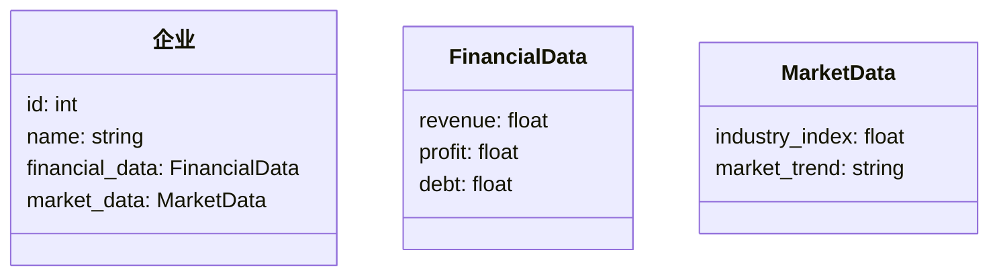
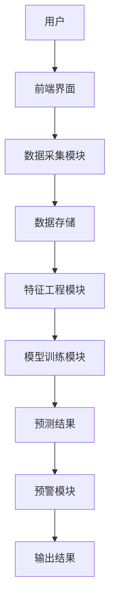
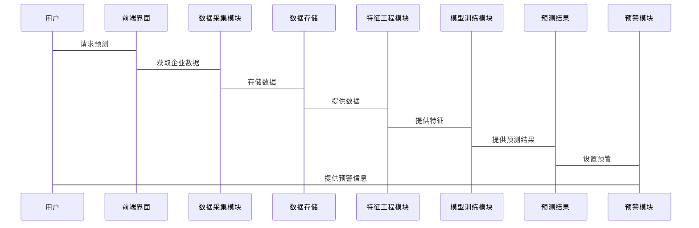

                 

<think>
嗯，我现在需要帮助用户撰写一篇关于《设计智能化的企业信用违约预测模型》的技术博客文章。用户已经给出了详细的要求，包括结构、内容、格式等，我需要一步步来思考如何满足这些要求。

首先，我需要明确用户的需求。用户希望这篇文章结构清晰，内容专业，涵盖从背景到算法、系统设计、实战再到最佳实践的各个方面。文章需要使用Markdown格式，包含关键词、摘要，然后按照目录大纲展开，每个部分都要详细讲解，包括数学公式、流程图、类图等。

接下来，我需要分析用户的使用场景。用户可能是一位技术专家、CTO或软件架构师，他们需要深入了解企业信用违约预测模型的设计和实现。因此，文章需要既有理论深度，又有实际应用，帮助读者理解如何将理论应用于实践。

然后，我思考如何组织文章结构。用户已经提供了一个大纲，我需要按照这个大纲来填充内容。每个章节都需要详细展开，确保涵盖所有必要的部分，比如背景介绍、核心概念、算法原理、系统架构、项目实战和最佳实践。

在背景介绍部分，我需要解释信用违约的定义、特征和分类，然后讨论智能化预测的重要性。这部分需要简洁明了，让读者明白为什么企业信用违约预测是必要的，以及智能化带来的好处。

核心概念部分，我需要详细讲解模型的基本原理，包括输入输出、特征工程和评估指标。此外，还要进行传统模型与现代模型的对比分析，使用表格和Mermaid图来展示对比结果和实体关系。

算法原理部分，我需要选择几种主流的机器学习算法，如逻辑回归、支持向量机和随机森林，并用Mermaid流程图展示每个算法的工作流程。同时，给出相应的数学公式，确保准确性。

系统分析与架构设计部分，我需要描述问题场景，设计系统功能，可能用领域模型类图来展示。系统架构图和接口设计也很重要，确保模块化和高效性。

项目实战部分，需要指导读者如何安装环境，编写核心代码，并通过案例分析展示模型的应用。这部分要具体，让读者能够实际操作。

最后，最佳实践部分包括小结、注意事项和拓展阅读，帮助读者巩固知识，避免常见错误，并引导他们进一步学习。

我还需要确保每个部分都有足够的细节，同时结构紧凑，逻辑清晰。数学公式要用LaTeX表示，流程图和类图用Mermaid绘制，确保可读性和美观性。

在撰写过程中，我可能会遇到一些挑战，比如如何将复杂的算法简化，同时保持内容的完整性。我需要多次检查，确保每个部分都涵盖必要的知识点，同时语言通俗易懂。

总之，我需要按照用户的指示，一步一步地构建这篇文章，确保每个部分都符合要求，最终为读者提供一篇高质量的技术博客。
</think>

# 设计智能化的企业信用违约预测模型

> 关键词：信用违约预测、机器学习、风险管理、智能模型设计、企业信用评估

> 摘要：本文详细探讨了设计智能化企业信用违约预测模型的关键步骤，从背景分析到算法实现，再到系统架构设计和项目实战，全面解析了如何利用机器学习技术构建高效可靠的信用评估系统。

---

## 第一部分: 企业信用违约预测模型的背景与核心概念

### 第1章: 信用违约预测模型的定义与背景

#### 1.1 信用违约的定义与特征
##### 1.1.1 信用违约的定义
信用违约是指借款人在约定的还款期限内未能履行还款义务，导致债权人遭受损失的事件。企业信用违约是企业无法按时偿还债务，影响金融市场稳定的重要风险。

##### 1.1.2 信用违约的核心特征
- **违约概率**：企业在一定期限内发生违约的可能性。
- **违约损失率**：违约发生后，债权人实际损失的比例。
- **信用风险**：企业因财务状况恶化或经营失败导致的违约风险。

##### 1.1.3 信用违约的分类与场景
- **短期违约**：企业因流动性不足无法按时偿还债务。
- **长期违约**：企业因持续经营不善或市场环境恶化导致的违约。
- **系统性违约**：多个企业因行业或经济周期影响同时发生违约。

#### 1.2 企业信用违约预测的背景
##### 1.2.1 企业信用风险的重要性
信用风险是金融市场中最主要的风险之一，企业违约直接影响金融机构的资产质量和收益稳定性。

##### 1.2.2 传统信用评估方法的局限性
- **依赖人工经验**：传统方法主要依赖信贷经理的主观判断，存在人为误差。
- **数据维度有限**：传统模型通常只考虑财务数据，忽视了市场、行业等多维度信息。
- **模型静态性**：传统模型难以实时更新，无法适应快速变化的市场环境。

##### 1.2.3 智能化信用评估的需求与趋势
随着大数据和人工智能技术的发展，智能化信用评估成为必然趋势。智能化模型能够实时更新、多维度分析，并具备自适应能力，显著提升预测准确性。

#### 1.3 智能化信用违约预测的核心要素
##### 1.3.1 数据驱动的信用评估
通过收集企业多维度数据（财务数据、市场数据、行业数据等），利用机器学习算法进行建模和预测。

##### 1.3.2 机器学习在信用评估中的应用
- **监督学习**：使用违约标签数据进行分类任务。
- **特征工程**：提取和处理数据特征，提升模型性能。
- **模型评估**：通过AUC、F1分数等指标评估模型效果。

##### 1.3.3 多维度特征分析与建模
智能化模型需要综合分析企业的财务状况、市场环境、行业趋势等多维度因素，构建全面的信用评估体系。

### 第2章: 企业信用违约预测模型的核心概念

#### 2.1 模型的基本原理
##### 2.1.1 模型的输入与输出
- **输入**：企业的多维度特征数据，包括财务数据、市场数据等。
- **输出**：违约概率或违约标签（0/1）。

##### 2.1.2 模型的特征工程
- **特征选择**：通过统计分析或模型解释性方法筛选重要特征。
- **特征变换**：对特征进行标准化、归一化处理，或进行特征组合。

##### 2.1.3 模型的训练与评估
- **训练**：使用训练数据拟合模型，调整模型参数。
- **评估**：通过验证集或测试集评估模型的预测性能。

#### 2.2 核心概念对比分析
##### 2.2.1 传统模型与现代模型的对比
| 对比维度 | 传统模型 | 现代模型（智能化模型） |
|----------|----------|------------------------|
| 数据来源 | 单一维度 | 多维度数据             |
| 方法论 | 经验判断 | 数据驱动，机器学习     |
| 精度 | 较低 | 较高                   |
| 适应性 | 静态 | 动态                   |

##### 2.2.2 不同算法的优劣势对比
| 算法 | 优势 | 劣势 |
|------|------|------|
| 逻辑回归 | 解释性强 | 非线性拟合能力有限 |
| 支持向量机 | 高精度 | 计算复杂度高         |
| 随机森林 | 高精度，无过拟合 | 解释性较差           |

##### 2.2.3 模型性能的关键指标对比
| 指标 | 公式 | 解释 |
|------|------|------|
| AUC | $\text{AUC} = \frac{1}{2} \left(1 + \frac{\sum (x_{i} - 0.5)}{n}\right)$ | 区分能力，越接近1越好 |
| F1分数 | $F1 = 2 \cdot \frac{\text{Precision} \cdot \text{Recall}}{\text{Precision} + \text{Recall}}$ | 平衡Precision和Recall |

#### 2.3 实体关系图与流程图
##### 2.3.1 实体关系图（ER图）


##### 2.3.2 模型流程图（Mermaid）


---

## 第三部分: 信用违约预测模型的算法原理

### 第3章: 常见算法原理与流程图

#### 3.1 逻辑回归算法
##### 3.1.1 算法原理与流程图
逻辑回归是一种经典的分类算法，常用于二分类问题。其核心思想是通过sigmoid函数将线性回归的输出映射到概率空间。

##### 3.1.2 逻辑回归的数学公式
$$ P(y=1|x) = \frac{1}{1 + e^{-\beta x}} $$

##### 3.1.3 逻辑回归的流程图


#### 3.2 支持向量机算法
##### 3.2.1 算法原理与流程图
支持向量机（SVM）通过寻找最优超平面，将数据点分为两类。对于非线性可分数据，使用核函数进行映射。

##### 3.2.2 SVM的数学公式
$$ \text{max} \left( \frac{1}{2} \omega^T \omega \right) $$
$$ \text{subject to } y_i (\omega \cdot x_i + b) \geq 1 - \xi_i $$
$$ \xi_i \geq 0 $$

##### 3.2.3 SVM的流程图


#### 3.3 随机森林算法
##### 3.3.1 算法原理与流程图
随机森林是一种基于决策树的集成算法，通过随机采样和特征选择构建多棵决策树，最终通过投票或加权平均得到结果。

##### 3.3.2 随机森林的数学公式
$$ y = \sum_{i=1}^n \frac{1}{n} \text{Tree}_i(x) $$

##### 3.3.3 随机森林的流程图


### 第4章: 神经网络与深度学习算法

#### 4.1 神经网络的基本原理
##### 4.1.1 神经网络的结构
神经网络由输入层、隐藏层和输出层组成，通过激活函数和权重调整实现非线性分类。

##### 4.1.2 神经网络的数学公式
$$ y = \sigma(\omega x + b) $$
其中，$\sigma$ 是激活函数，常用ReLU、sigmoid等。

##### 4.1.3 神经网络的流程图


#### 4.2 深度学习算法的应用
##### 4.2.1 长短期记忆网络（LSTM）
LSTM用于时间序列数据的分析，能够捕捉长期依赖关系。

##### 4.2.2 循序神经网络（RNN）
RNN适用于序列数据的处理，但存在梯度消失问题。

##### 4.2.3 卷积神经网络（CNN）
CNN常用于图像数据的处理，但在信用评估中的应用较少。

---

## 第四部分: 系统分析与架构设计

### 第5章: 系统分析与架构设计

#### 5.1 问题场景介绍
企业信用违约预测系统需要处理海量数据，包括财务数据、市场数据、行业数据等，实时预测企业的违约概率。

#### 5.2 系统功能设计
- **数据采集**：实时采集企业数据。
- **特征工程**：构建特征库，进行数据清洗和特征提取。
- **模型训练**：训练机器学习模型，优化模型参数。
- **预测与预警**：输出违约概率，设置预警阈值。

#### 5.3 系统架构设计
##### 5.3.1 领域模型类图


##### 5.3.2 系统架构图


#### 5.4 系统接口设计
- **数据接口**：与数据源对接，获取企业数据。
- **模型接口**：与训练模块对接，提供特征数据。
- **预警接口**：与预警系统对接，输出违约概率。

#### 5.5 系统交互序列图


---

## 第五部分: 项目实战

### 第6章: 项目实战

#### 6.1 环境安装
- **Python环境**：安装Python 3.8以上版本。
- **依赖库安装**：使用pip安装numpy、pandas、scikit-learn、xgboost等库。

#### 6.2 核心代码实现
##### 6.2.1 数据预处理代码
```python
import pandas as pd
from sklearn.preprocessing import StandardScaler

# 加载数据
data = pd.read_csv('enterprise_data.csv')

# 数据清洗
data.dropna(inplace=True)

# 特征提取
features = data[['revenue', 'profit', 'debt', 'industry_index']]
labels = data['default']  # 0表示正常，1表示违约

# 特征标准化
scaler = StandardScaler()
features_scaled = scaler.fit_transform(features)
```

##### 6.2.2 模型训练代码
```python
from sklearn.ensemble import RandomForestClassifier
from sklearn.metrics import accuracy_score, precision_score, recall_score, f1_score

# 模型训练
model = RandomForestClassifier(n_estimators=100, max_depth=5)
model.fit(features_scaled, labels)

# 模型预测
importances = model.feature_importances_
threshold = np.percentile(importances, 90)
selected_features = features.columns[importances > threshold]

# 模型评估
y_pred = model.predict(features_scaled)
print(f"Accuracy: {accuracy_score(labels, y_pred)}")
print(f"Precision: {precision_score(labels, y_pred)}")
print(f"Recall: {recall_score(labels, y_pred)}")
print(f"F1 Score: {f1_score(labels, y_pred)}")
```

#### 6.3 案例分析与详细解读
通过实际案例分析，展示如何利用训练好的模型预测企业的违约概率，并根据结果制定相应的风险管理策略。

---

## 第六部分: 最佳实践与小结

### 第7章: 最佳实践

#### 7.1 小结
智能化企业信用违约预测模型通过机器学习技术，显著提升了信用评估的准确性和效率，为企业风险管理提供了有力支持。

#### 7.2 注意事项
- **数据质量**：确保数据的完整性和准确性。
- **模型解释性**：选择易于解释的模型，便于业务人员理解。
- **实时更新**：定期更新模型，确保预测结果的时效性。

#### 7.3 拓展阅读
- 《机器学习实战》
- 《信用风险分析与管理》
- 《深度学习在金融领域的应用》

---

## 作者：AI天才研究院/AI Genius Institute & 禅与计算机程序设计艺术 /Zen And The Art of Computer Programming

---

**全文完**

