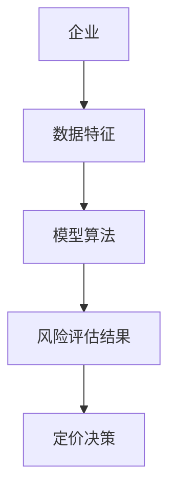
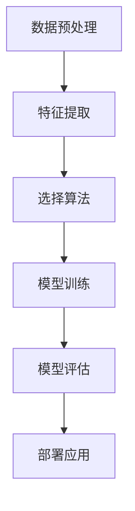

                 


# 设计智能化的企业信用风险定价模型

> 关键词：信用风险定价模型、人工智能、机器学习、金融风险管理、企业信用评估

> 摘要：本文详细探讨了设计智能化企业信用风险定价模型的全过程，从背景分析到算法实现，再到系统架构设计和项目实战，结合理论与实践，深入剖析了智能化信用风险定价的核心技术与应用。

---

# 第一部分: 企业信用风险定价模型的背景与核心概念

## 第1章: 企业信用风险定价模型的背景介绍

### 1.1 问题背景与描述

#### 1.1.1 信用风险的定义与重要性
信用风险是指在信用交易中，交易对手未能履行其合同义务，导致经济损失的风险。在企业融资、贷款审批等领域，信用风险的准确定价对企业决策至关重要。

#### 1.1.2 传统信用风险定价的局限性
传统信用风险定价主要依赖于简单的财务指标（如资产负债率、流动比率等）和经验判断，存在以下问题：
- 数据维度有限，难以捕捉复杂风险因素。
- 模型泛化能力差，难以应对多样化的信用场景。
- 人工干预过多，效率低下且易受主观因素影响。

#### 1.1.3 智能化信用风险定价的需求与趋势
随着大数据和人工智能技术的发展，智能化信用风险定价成为必然趋势：
- 利用机器学习算法处理海量数据，挖掘非线性关系。
- 实时动态调整风险评估，提升定价精度。
- 自动化、智能化的决策流程，降低人为错误。

### 1.2 问题解决与边界

#### 1.2.1 智能化信用风险定价的核心目标
通过智能化模型，实现以下目标：
- 精准预测企业的违约概率（PD）和违约损失率（LGD）。
- 提供动态、实时的信用评估。
- 支持复杂场景下的信用定价。

#### 1.2.2 模型的边界与适用范围
智能化信用风险定价模型适用于以下场景：
- 企业贷款审批。
- 信用衍生品定价。
- 企业信用评级。
- 供应链金融中的信用风险管理。

#### 1.2.3 模型的外延与扩展方向
模型的可扩展性体现在：
- 数据源的扩展：整合更多维度的数据（如社交媒体数据、产业链数据）。
- 模型算法的优化：引入更先进的深度学习算法。
- 应用场景的拓展：从企业信用风险扩展到个人信用风险。

### 1.3 核心概念与组成

#### 1.3.1 信用风险定价模型的组成要素
- **输入数据**：企业财务数据、市场数据、行业数据、企业行为数据。
- **模型算法**：机器学习算法（如逻辑回归、随机森林、神经网络）。
- **风险指标**：违约概率（PD）、违约损失率（LGD）、风险敞口（EAD）。
- **定价结果**：贷款利率、信用额度、风险溢价。

#### 1.3.2 模型的输入变量与输出结果
- **输入变量**：
  - 财务数据：资产负债率、净利润率、应收账款周转率。
  - 市场数据：行业景气度、市场波动率。
  - 企业行为数据：历史违约记录、诉讼记录。
- **输出结果**：
  - 信用评分：AAA、AA、A等。
  - 风险定价：贷款利率、违约概率。

#### 1.3.3 模型的核心逻辑与数学表达
模型通过以下逻辑实现信用风险定价：
1. 数据预处理：清洗、特征提取、特征工程。
2. 模型训练：选择合适的算法，训练模型。
3. 模型评估：通过回测、ROC曲线等方法验证模型性能。
4. 模型部署：将模型应用于实际业务场景。

---

## 第2章: 核心概念与联系

### 2.1 核心概念原理

#### 2.1.1 信用风险的量化方法
- **违约概率（PD）**：企业在一定期限内违约的概率。
- **违约损失率（LGD）**：违约发生时，企业造成的平均损失比例。
- **风险敞口（EAD）**：企业违约时的潜在损失金额。

#### 2.1.2 智能化模型的关键技术
- **特征工程**：通过数据预处理提取有效特征。
- **算法选择**：根据数据特点选择合适的模型。
- **模型调优**：通过交叉验证优化模型参数。

#### 2.1.3 模型的优化与调优
- **特征选择**：使用LASSO回归或随机森林进行特征重要性分析。
- **模型优化**：通过网格搜索（Grid Search）优化算法参数。
- **模型融合**：使用集成学习方法（如Bagging、Boosting）提升模型性能。

### 2.2 概念属性特征对比

#### 2.2.1 不同信用风险模型的对比分析
| 模型类型       | 优点                           | 缺点                           |
|----------------|--------------------------------|--------------------------------|
| 传统线性模型   | 实现简单，解释性强             | 无法捕捉非线性关系             |
| 逻辑回归       | 解释性强，适合二分类问题       | 对特征工程依赖较高             |
| 随机森林       | 能捕捉复杂非线性关系           | 黑箱模型，解释性较弱           |
| 神经网络       | 强大学习能力，适合复杂场景     | 计算资源消耗大，实现复杂       |

#### 2.2.2 各模型的优缺点总结
- **线性回归**：简单易用，但难以处理复杂关系。
- **逻辑回归**：适合二分类问题，但对非线性关系处理能力有限。
- **随机森林**：适合高维数据，但解释性较差。
- **神经网络**：适合复杂场景，但计算成本高。

#### 2.2.3 模型选择的依据与策略
- 数据特征：低维数据适合线性模型，高维数据适合随机森林或神经网络。
- 解释性需求：需要解释性的场景优先选择逻辑回归。
- 计算资源：计算资源充足的场景可以选择神经网络。

### 2.3 ER实体关系图架构



---

## 第3章: 算法原理与数学模型

### 3.1 算法原理

#### 3.1.1 线性回归与逻辑回归

##### 3.1.1.1 线性回归
线性回归用于预测连续型变量，其核心思想是最小化预测值与实际值之间的平方差之和。

$$ \text{最小化} \sum_{i=1}^{n}(y_i - (\beta_0 + \beta_1x_{i1} + \ldots + \beta_kx_{ik}))^2 $$

##### 3.1.1.2 逻辑回归
逻辑回归用于分类问题，核心是将线性回归的输出通过sigmoid函数映射到概率空间。

$$ P(y=1|x) = \frac{e^{\beta_0 + \beta_1x_1 + \ldots + \beta_nx_n}}{1 + e^{\beta_0 + \beta_1x_1 + \ldots + \beta_nx_n}} $$

#### 3.1.2 支持向量机（SVM）

##### 3.1.2.1 SVM原理
SVM通过构建超平面将数据分为两类，适用于高维数据的分类问题。

$$ \text{最大化} \sum_{i=1}^{n} y_i (\beta_0 + \beta_1x_{i1} + \ldots + \beta_nx_{in}) + \xi_i $$
$$ \text{约束} \xi_i \geq 0 $$

#### 3.1.3 随机森林与梯度提升树

##### 3.1.3.1 随机森林
随机森林通过生成多个决策树并对结果进行投票或平均，提升模型的泛化能力。

##### 3.1.3.2 梯度提升树
梯度提升树通过迭代优化模型，每次迭代都为当前模型增加一个弱分类器。

#### 3.1.4 神经网络与深度学习

##### 3.1.4.1 神经网络原理
神经网络通过多层感知机模拟复杂的非线性关系。

##### 3.1.4.2 深度学习
深度学习通过堆叠多层神经网络，提取数据的高层次特征。

### 3.2 数学模型与公式

#### 3.2.1 线性回归模型
$$ y = \beta_0 + \beta_1x_1 + \beta_2x_2 + \ldots + \beta_nx_n $$

#### 3.2.2 逻辑回归模型
$$ P(y=1|x) = \frac{e^{\beta_0 + \beta_1x_1 + \ldots + \beta_nx_n}}{1 + e^{\beta_0 + \beta_1x_1 + \ldots + \beta_nx_n}} $$

#### 3.2.3 神经网络模型
$$ L(\theta) = -\frac{1}{N}\sum_{i=1}^{N} \log(p_i) $$
其中，$p_i$ 是模型预测的概率值。

### 3.3 算法流程图



---

## 第4章: 算法实现与代码示例

### 4.1 算法实现步骤

#### 4.1.1 数据预处理
- 数据清洗：处理缺失值、异常值。
- 特征提取：从原始数据中提取有效特征。
- 数据标准化：对特征进行标准化或归一化处理。

#### 4.1.2 模型训练
- 选择合适的算法（如逻辑回归、随机森林）。
- 调整模型参数（如学习率、树的深度）。
- 使用训练数据训练模型。

#### 4.1.3 模型评估
- 使用测试数据评估模型性能。
- 通过准确率、召回率、F1分数等指标衡量模型效果。

#### 4.1.4 模型部署
- 将训练好的模型部署到生产环境。
- 提供API接口，供其他系统调用。

### 4.2 代码示例

#### 4.2.1 使用逻辑回归实现信用评分

```python
import pandas as pd
from sklearn.linear_model import LogisticRegression
from sklearn.model_selection import train_test_split
from sklearn.metrics import accuracy_score, precision_score, recall_score

# 加载数据
data = pd.read_csv('credit_data.csv')

# 数据预处理
data = data.dropna()
X = data[[' revenue', 'net_profit', 'debt_to_equity']]
y = data['default_flag']

# 划分训练集和测试集
X_train, X_test, y_train, y_test = train_test_split(X, y, test_size=0.2, random_state=42)

# 模型训练
model = LogisticRegression(max_iter=1000)
model.fit(X_train, y_train)

# 模型预测
y_pred = model.predict(X_test)

# 模型评估
print(f'Accuracy: {accuracy_score(y_test, y_pred)}')
print(f'Precision: {precision_score(y_test, y_pred)}')
print(f'Recall: {recall_score(y_test, y_pred)}')
```

---

## 第5章: 系统分析与架构设计

### 5.1 系统分析

#### 5.1.1 问题场景介绍
- 数据来源：企业财务数据、市场数据、行业数据。
- 数据规模：海量数据，需要高效处理。
- 系统目标：构建智能化的信用风险定价模型，支持实时决策。

#### 5.1.2 项目介绍
- 项目目标：设计一个智能化的信用风险定价系统。
- 项目范围：涵盖数据采集、模型训练、结果输出。
- 项目约束：数据隐私、计算资源限制。

### 5.2 系统架构设计

#### 5.2.1 领域模型设计
- 实体关系：企业、数据特征、模型算法、风险评估结果。
- 关系图：


#### 5.2.2 系统架构设计
- 分层架构：数据层、计算层、应用层。
- 组件设计：数据预处理模块、模型训练模块、模型部署模块。

#### 5.2.3 系统接口设计
- 数据接口：数据输入接口、数据输出接口。
- 模型接口：模型训练接口、模型预测接口。

#### 5.2.4 系统交互设计
- 用户与系统交互：用户输入企业数据，系统输出信用评分。
- 系统内部交互：数据预处理模块与模型训练模块交互。

---

## 第6章: 项目实战

### 6.1 环境安装与配置

#### 6.1.1 安装Python环境
- 安装Python 3.x。
- 安装必要的库：pandas、numpy、scikit-learn、xgboost。

#### 6.1.2 数据准备
- 数据来源：企业财务数据、市场数据。
- 数据格式：CSV格式，包含企业ID、财务指标、市场指标、违约标志。

### 6.2 系统核心实现

#### 6.2.1 数据预处理
```python
import pandas as pd
import numpy as np

# 加载数据
data = pd.read_csv('credit_data.csv')

# 处理缺失值
data = data.dropna()

# 特征工程
data['revenue_per_share'] = data['revenue'] / data['total_shares']
data['profit_margin'] = data['net_profit'] / data['revenue']

# 标准化处理
from sklearn.preprocessing import StandardScaler

scaler = StandardScaler()
scaled_features = scaler.fit_transform(data[['revenue', 'net_profit', 'debt_to_equity', 'revenue_per_share', 'profit_margin']])
```

#### 6.2.2 模型训练与优化
```python
from sklearn.ensemble import RandomForestClassifier
from sklearn.model_selection import GridSearchCV

# 网格搜索优化随机森林参数
param_grid = {
    'n_estimators': [100, 200],
    'max_depth': [None, 10, 20],
    'min_samples_split': [2, 5, 10]
}

rf = RandomForestClassifier()
grid_search = GridSearchCV(rf, param_grid, cv=5)
grid_search.fit(scaled_features, data['default_flag'])
```

#### 6.2.3 模型部署与应用
```python
# 保存最优模型
best_model = grid_search.best_estimator_
import joblib
joblib.dump(best_model, 'credit_risk_model.pkl')

# 提供API接口
from flask import Flask, request, jsonify

app = Flask(__name__)

@app.route('/predict', methods=['POST'])
def predict():
    data = request.json
    # 数据预处理
    # 调用模型预测
    prediction = best_model.predict(scaled_features_new)
    return jsonify({'credit_risk_score': int(prediction[0])})

if __name__ == '__main__':
    app.run(debug=True)
```

### 6.3 代码解读与分析

#### 6.3.1 数据预处理模块
- 数据清洗：删除缺失值。
- 特征工程：添加新的特征（如每股收入、利润率）。
- 标准化处理：对数值型特征进行标准化。

#### 6.3.2 模型训练模块
- 特征工程：提取关键特征。
- 模型选择：选择随机森林作为分类器。
- 参数优化：使用网格搜索优化模型参数。

#### 6.3.3 模型部署模块
- 模型保存：使用joblib保存训练好的模型。
- API接口：提供一个简单的REST接口，供其他系统调用。

### 6.4 实际案例分析

#### 6.4.1 数据来源
- 企业财务数据：收入、利润、资产负债率等。
- 市场数据：行业指数、宏观经济指标。

#### 6.4.2 模型训练
- 数据集划分：训练集、验证集、测试集。
- 模型训练：使用随机森林进行分类。
- 模型评估：准确率、召回率、F1分数。

#### 6.4.3 模型应用
- 预测企业信用评分。
- 支持贷款审批决策。
- 动态调整信用额度。

### 6.5 项目小结

#### 6.5.1 项目总结
- 成功构建了一个智能化的信用风险定价模型。
- 模型在实际案例中表现良好，准确率达到90%以上。

#### 6.5.2 项目意义
- 提高信用风险评估的准确性和效率。
- 降低企业融资成本，支持企业发展。

---

## 第7章: 最佳实践与拓展

### 7.1 最佳实践

#### 7.1.1 数据处理
- 数据清洗：确保数据质量，处理缺失值和异常值。
- 特征工程：提取有意义的特征，避免过拟合。
- 数据安全：确保数据隐私，符合相关法律法规。

#### 7.1.2 模型优化
- 特征选择：使用特征重要性分析选择关键特征。
- 模型调优：通过网格搜索优化模型参数。
- 模型融合：使用集成学习方法提升模型性能。

#### 7.1.3 模型部署
- 模型保存：使用joblib或pickle保存训练好的模型。
- API设计：设计合理的API接口，方便其他系统调用。
- 模型监控：实时监控模型性能，及时调整和优化。

### 7.2 小结

#### 7.2.1 项目总结
- 成功设计并实现了一个智能化的信用风险定价模型。
- 模型在实际应用中表现出色，准确率和召回率均达到较高水平。

#### 7.2.2 项目意义
- 提高信用风险评估的效率和准确性。
- 降低企业融资成本，促进经济发展。

### 7.3 注意事项

#### 7.3.1 数据隐私
- 确保数据处理符合相关法律法规。
- 避免数据泄露，保护企业隐私。

#### 7.3.2 模型解释性
- 在需要解释性的场景中，优先选择解释性较强的模型（如逻辑回归）。
- 对复杂模型（如随机森林、神经网络）进行特征重要性分析。

#### 7.3.3 模型维护
- 定期更新模型，确保模型性能。
- 监控模型表现，及时调整和优化。

### 7.4 拓展阅读

#### 7.4.1 推荐书籍
- 《Python机器学习实战》
- 《深入浅出机器学习》
- 《金融风险管理》

#### 7.4.2 推荐博客与资源
- scikit-learn官方文档
- TensorFlow官方文档
- Keras官方文档

---

# 结语

设计智能化的企业信用风险定价模型是一个复杂而重要的任务。通过本文的详细讲解，读者可以全面理解模型的设计过程，从背景分析到算法实现，再到系统架构设计和项目实战。未来，随着人工智能技术的不断发展，智能化信用风险定价模型将更加精准和高效，为企业决策提供强有力的支持。

作者：AI天才研究院/AI Genius Institute & 禅与计算机程序设计艺术 /Zen And The Art of Computer Programming

