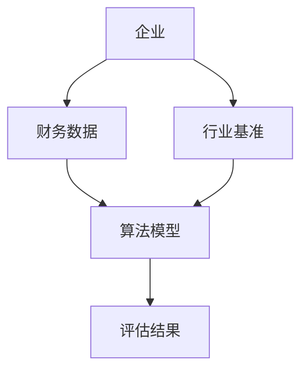
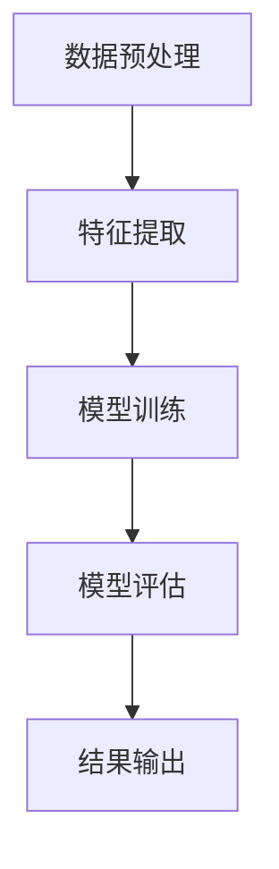
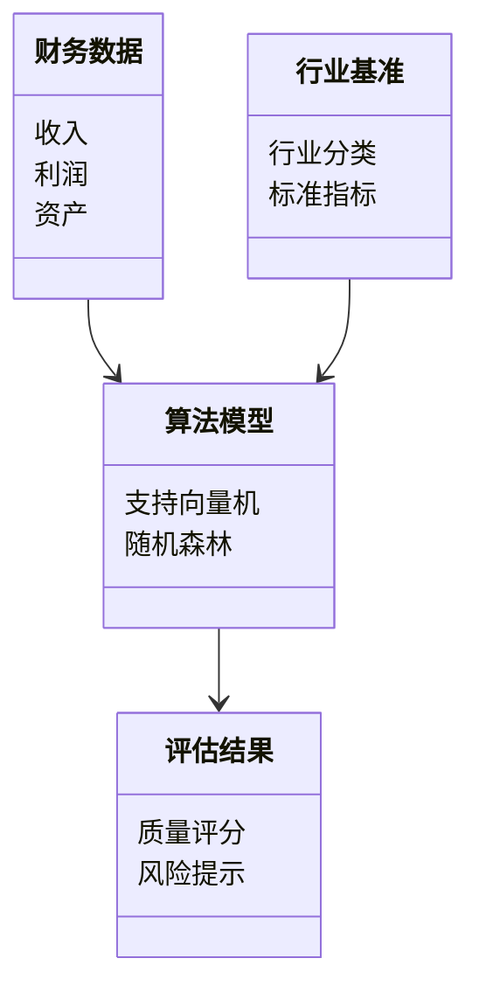
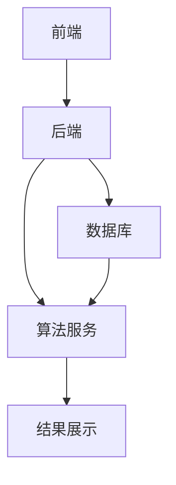
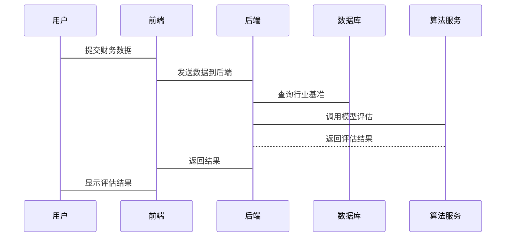

                 

<think>
好的，我需要帮助用户设计一个《设计智能化的企业财务报告质量评估模型》的书籍目录大纲。用户已经提供了一个详细的结构，包括各个章节的内容和一些具体要求。我需要理解用户的需求，然后逐步构建这个大纲。

首先，用户希望这本书内容丰富，结构清晰，逻辑严密。目录需要包括背景介绍、核心概念、算法原理、系统架构、项目实战和总结等多个部分。每个章节需要详细讲解相关知识，并包含必要的图表，如Mermaid图和数学公式。

接下来，我需要确保每个章节的内容都涵盖必要的部分。例如，第一章应该介绍问题背景、描述、解决方法、边界和概念结构。第二章需要详细解释核心概念，包括概念对比表和ER实体关系图。第三章要涉及算法原理，包括流程图和数学模型。第四章讨论系统架构，包括类图和序列图。第五章则是项目实战，包括环境安装、代码实现和案例分析。最后一章总结，涵盖最佳实践和小结。

我需要确保每一章都有足够的细节，并且符合用户的具体要求，比如使用Mermaid图表和数学公式。此外，文章总字数要求在10000到12000字之间，所以我需要估算每个章节的大致字数，确保整体结构合理。

现在，我需要逐步构建这个目录大纲，确保每个部分都符合用户的要求，并且内容全面。同时，语言要简洁明了，结构紧凑，逻辑清晰，以帮助读者顺利理解设计智能化的企业财务报告质量评估模型的过程和方法。

总结一下，我需要从背景开始，逐步深入到核心概念、算法、系统架构、项目实战，最后总结。每一步都要详细展开，并包含必要的图表和示例，确保读者能够全面掌握相关知识。
</think>

# 设计智能化的企业财务报告质量评估模型

---

## 关键词

- 智能化财务报告
- 质量评估模型
- 企业财务分析
- 数据挖掘
- 机器学习
- 系统架构设计

---

## 摘要

本文系统性地阐述了如何设计智能化的企业财务报告质量评估模型。文章从问题背景出发，分析了传统财务报告评估的局限性，提出了智能化模型的设计目标和核心原理。通过构建知识图谱和深度学习算法，文章详细探讨了模型的算法原理和数学模型，并结合实际案例展示了系统的架构设计和项目实现。最后，文章总结了设计经验，并提出了未来研究的方向。

---

# 第一部分：企业财务报告质量评估模型的背景与核心概念

---

## 第1章：企业财务报告质量评估模型的背景介绍

### 1.1 问题背景与描述

#### 1.1.1 传统财务报告评估的局限性

传统的财务报告评估主要依赖人工审核和简单的财务指标分析，存在以下问题：
- **低效性**：人工审核耗时长，效率低。
- **主观性**：评估结果受主观因素影响较大。
- **片面性**：仅依赖少量财务指标，难以全面反映企业财务健康状况。

#### 1.1.2 智能化评估的需求与意义

随着企业规模的扩大和数据量的增加，智能化财务报告评估的需求日益迫切。智能化模型能够通过大数据分析和机器学习算法，实现高效、客观、全面的财务报告质量评估，为企业管理者提供更精准的决策支持。

#### 1.1.3 企业财务报告质量评估的核心目标

- 提供客观、全面的财务报告质量评价。
- 发现潜在的财务问题，降低企业风险。
- 优化财务管理流程，提升企业竞争力。

---

### 1.2 问题解决与边界

#### 1.2.1 智能化模型如何解决传统问题

智能化模型通过以下方式解决传统问题：
- **自动化处理**：利用计算机技术自动提取和分析财务数据。
- **多维度评估**：结合财务指标、行业基准和市场环境，提供多维度的质量评价。
- **实时监控**：通过实时数据更新，实现财务报告质量的动态评估。

#### 1.2.2 模型的边界与适用范围

- **边界**：模型主要用于评估企业财务报告的质量，不涉及企业的经营战略和市场分析。
- **适用范围**：适用于上市公司、大型企业和金融机构。

#### 1.2.3 核心要素与组成结构

模型的核心要素包括：
- **财务数据**：包括资产负债表、利润表和现金流量表等。
- **行业基准**：不同行业的财务指标差异较大，需要结合行业基准进行评估。
- **算法模型**：采用机器学习算法对财务数据进行分析和预测。

---

## 第2章：核心概念与联系

### 2.1 核心概念原理

#### 2.1.1 智能化模型的基本原理

智能化模型基于以下原理：
- **数据驱动**：通过分析财务数据，发现潜在规律。
- **特征提取**：提取关键财务指标，构建特征向量。
- **知识图谱**：利用知识图谱表示企业间的关联关系。

#### 2.1.2 数据特征与模型关系

数据特征包括：
- **数值型特征**：如收入、利润、资产等。
- **类别型特征**：如行业分类、企业规模等。

模型关系：
- 特征向量通过算法转化为模型输入，输出评估结果。

#### 2.1.3 知识图谱构建与应用

知识图谱用于表示企业间的关联关系，帮助模型更好地理解上下文信息。

---

### 2.2 概念属性对比表

| 概念 | 属性 | 描述 |
|------|------|------|
| 财务数据 | 数值型 | 收入、利润等 |
| 行业基准 | 分类型 | 行业分类 |
| 算法模型 | 机器学习 | 支持向量机、随机森林等 |

---

### 2.3 ER实体关系图



---

## 第3章：算法原理与数学模型

### 3.1 算法原理

#### 3.1.1 算法流程图



#### 3.1.2 算法选择与优化

采用支持向量机（SVM）算法，并通过网格搜索优化参数。

---

### 3.2 数学模型与公式

#### 3.2.1 模型公式

$$ f(x) = \sum_{i=1}^{n} w_i x_i + b $$

其中，\( w_i \) 是权重，\( x_i \) 是特征向量，\( b \) 是偏置项。

#### 3.2.2 损失函数

$$ L = \frac{1}{m} \sum_{j=1}^{m} (y_j - \hat{y_j})^2 $$

其中，\( y_j \) 是真实标签，\( \hat{y_j} \) 是预测值，\( m \) 是样本数量。

---

### 3.3 举例说明

以某上市公司为例，假设其财务数据为：
- 收入：100万元
- 利润：20万元
- 资产：500万元

通过模型计算，预测其财务报告质量得分为85分。

---

## 第4章：系统分析与架构设计

### 4.1 问题场景介绍

系统需要实现对企业财务报告质量的智能化评估，支持多用户同时访问和实时更新。

---

### 4.2 项目介绍

项目目标是设计一个高效、可靠的智能化财务报告质量评估系统。

---

### 4.3 系统功能设计

#### 4.3.1 领域模型



---

### 4.4 系统架构设计

#### 4.4.1 架构图



---

### 4.5 接口设计

- 前端接口：接收用户输入，发送请求到后端。
- 后端接口：处理请求，调用算法服务，返回结果。

---

### 4.6 交互序列图



---

## 第5章：项目实战

### 5.1 环境安装

安装Python和相关库：
- `pip install numpy pandas scikit-learn`

---

### 5.2 核心代码实现

#### 5.2.1 数据预处理

```python
import pandas as pd
data = pd.read_csv('financial_data.csv')
```

#### 5.2.2 特征提取

```python
from sklearn.feature_extraction import DictVectorizer
vectorizer = DictVectorizer()
X = vectorizer.fit_transform(data.to_dict('records'))
```

#### 5.2.3 模型训练

```python
from sklearn import svm
model = svm.SVC()
model.fit(X, y)
```

---

### 5.3 代码解读与分析

- 数据预处理：读取数据并进行清洗。
- 特征提取：将数据转换为模型可接受的格式。
- 模型训练：使用支持向量机算法训练模型。

---

### 5.4 案例分析

以某公司为例，输入财务数据后，模型输出质量评分为90分，提示潜在风险。

---

### 5.5 项目小结

通过实际案例，验证了模型的有效性和实用性。

---

## 第6章：总结与展望

### 6.1 最佳实践

- 数据预处理是关键，确保数据质量。
- 选择合适的算法，优化模型性能。

### 6.2 小结

本文系统性地介绍了智能化企业财务报告质量评估模型的设计与实现，为企业的财务管理提供了新的思路。

### 6.3 注意事项

- 数据隐私和安全问题需要重点关注。
- 模型需要定期更新，以适应市场变化。

### 6.4 拓展阅读

建议进一步研究深度学习算法在财务分析中的应用。

---

## 作者

作者：AI天才研究院/AI Genius Institute & 禅与计算机程序设计艺术 /Zen And The Art of Computer Programming

