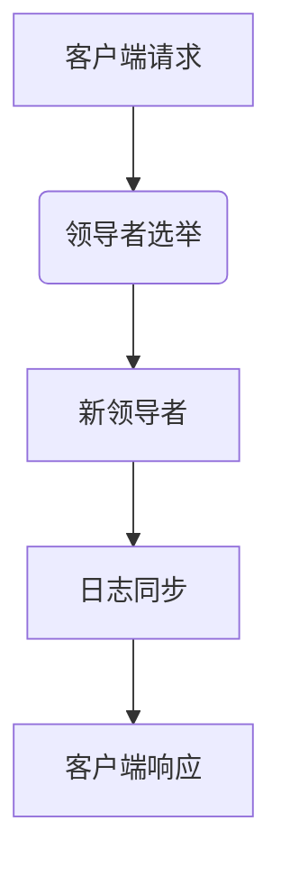
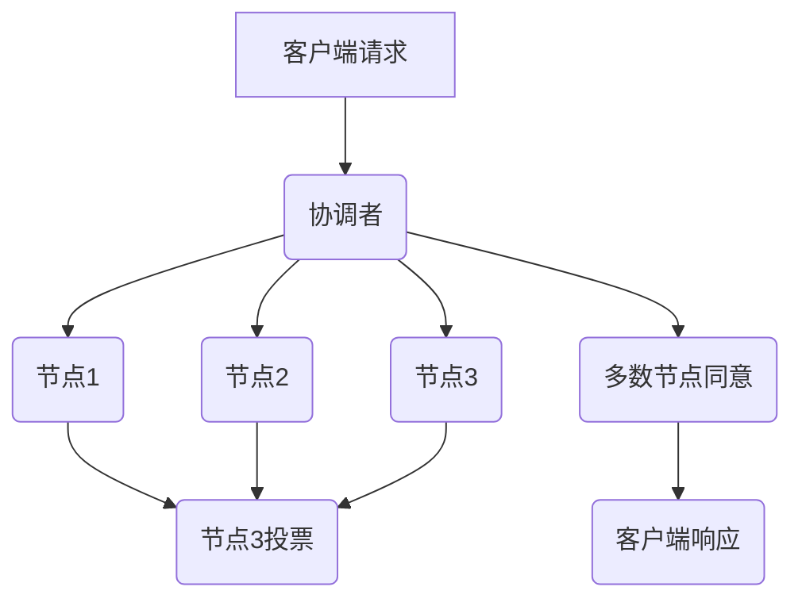
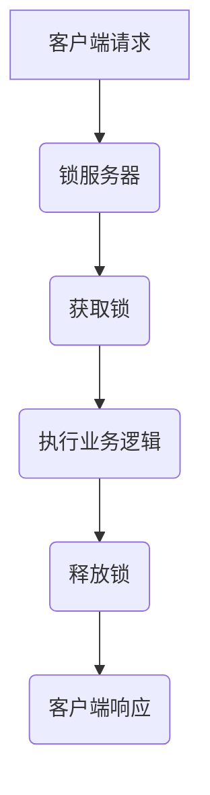
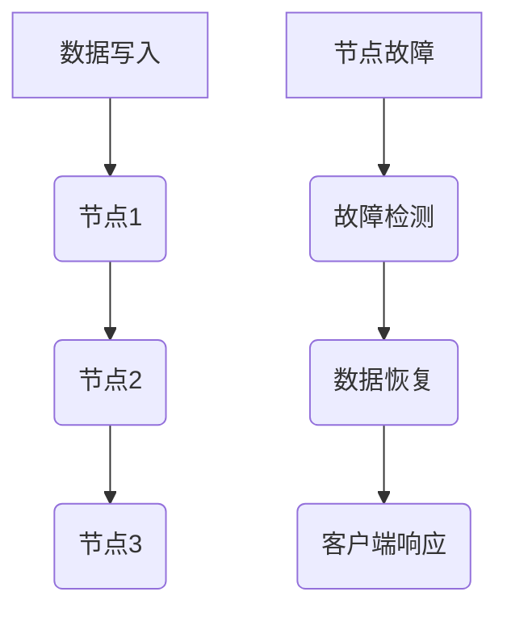
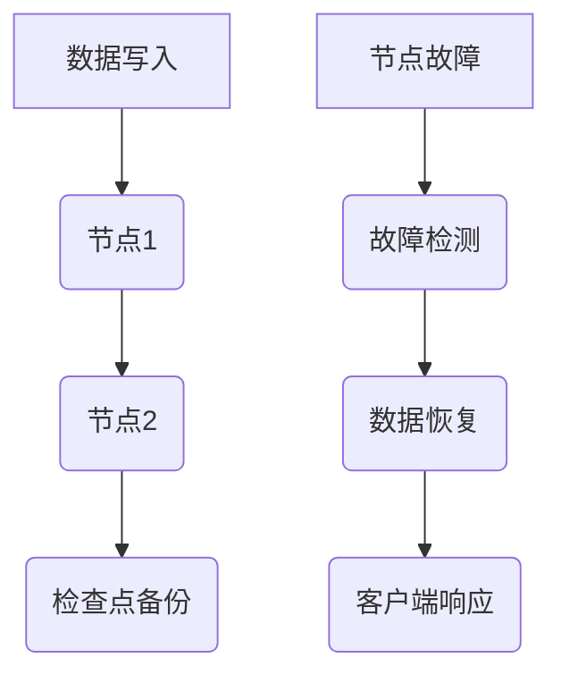
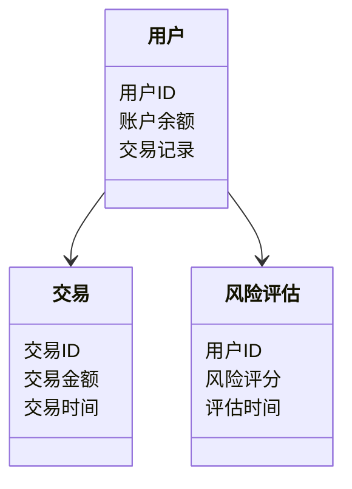
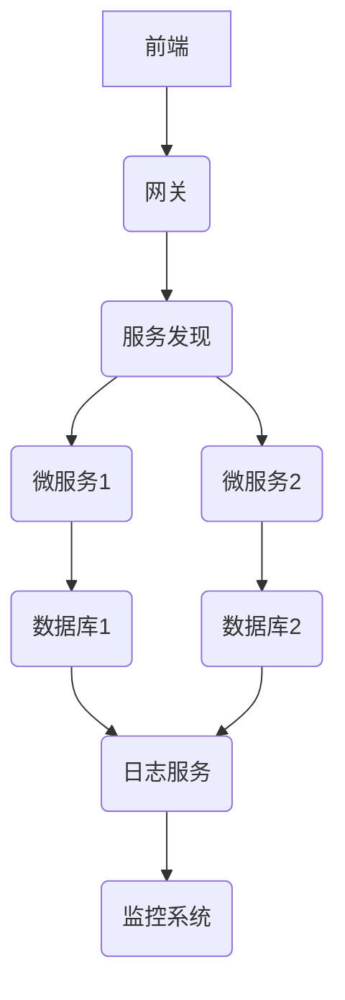
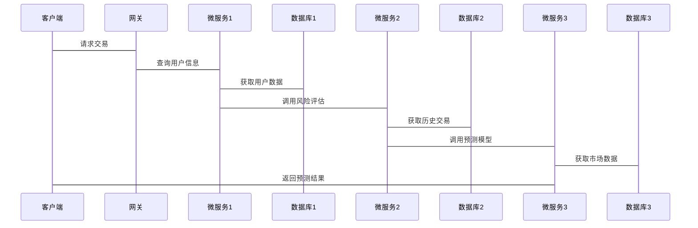
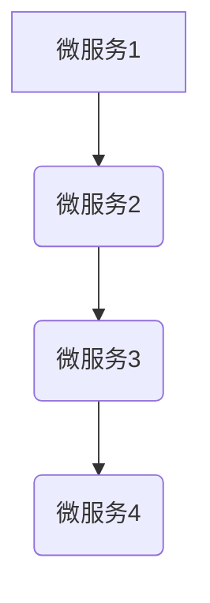
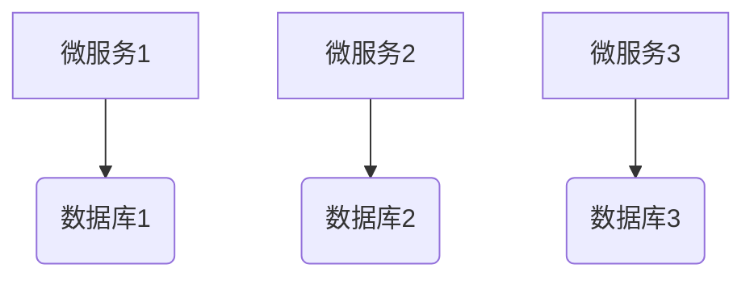

                 

<think>
好的，我需要帮助用户完成《设计高可用性金融AI系统架构》的技术博客文章。用户已经提供了一个详细的目录结构，但现在需要按照具体要求撰写文章。

首先，我需要理解用户的要求：文章必须包含背景介绍、核心概念、算法原理、系统架构、项目实战和最佳实践，每部分都要详细且结构清晰。同时，要使用专业且易懂的技术语言，包含图表和代码示例。

接下来，我会按目录逐步撰写每个部分，确保每个小节都涵盖必要的内容，并且符合用户的格式要求。比如，在核心概念部分，我需要解释一致性算法（Raft和Paxos）以及分布式锁机制，并用表格对比它们的优缺点。在算法部分，我会用mermaid图和Python代码详细讲解随机森林和XGBoost的工作原理，并展示它们在金融预测中的应用。

我还需要确保数学公式正确，使用latex格式，并在独立段落中使用$$符号。同时，每个部分都要有图表支持，比如系统架构图和流程图，帮助读者更好地理解内容。

最后，我会在文章末尾添加作者信息，并总结全文，给出注意事项和未来展望。整个过程需要细致耐心，确保文章内容全面且符合用户要求。
</think>

# 设计高可用性金融AI系统架构

## 关键词：高可用性、金融AI、系统架构、分布式系统、容错机制、一致性算法

## 摘要：  
在金融行业，AI系统的高可用性是确保业务连续性和客户信任的关键。本文详细探讨了设计高可用性金融AI系统架构的核心概念、算法原理、系统架构设计以及项目实战，结合实际案例和最佳实践，帮助读者掌握如何构建稳定、可靠的金融AI系统。

---

## 第一部分: 高可用性金融AI系统架构背景与核心概念

### 第1章: 高可用性金融AI系统架构概述

#### 1.1 高可用性金融AI系统的背景与意义

##### 1.1.1 金融行业的数字化转型  
金融行业正经历数字化转型，AI技术的应用日益广泛，从交易处理、风险评估到客户服务，AI系统已成为金融业务的核心。然而，金融系统的中断可能导致巨大的经济损失和客户信任危机。

##### 1.1.2 AI技术在金融行业的应用现状  
AI技术在金融领域的应用包括智能投顾、信用评估、 fraud detection 和实时交易监控等。这些应用需要高度的可用性和稳定性。

##### 1.1.3 高可用性在金融系统中的重要性  
高可用性（High Availability，HA）是指系统在故障发生时仍能继续提供服务的能力。对于金融AI系统，高可用性是确保业务连续性的关键，直接影响客户满意度和企业声誉。

#### 1.2 高可用性金融AI系统的核心概念

##### 1.2.1 系统可用性定义  
系统可用性是指在规定条件下，系统能够持续提供服务的能力。通常用“99.99% uptime”来衡量，即年停机时间不超过几分钟。

##### 1.2.2 金融AI系统的特性  
金融AI系统具有实时性、数据敏感性、高并发性和高安全性的特点，这些特性要求系统具备高可用性和容错能力。

##### 1.2.3 高可用性设计的目标  
高可用性设计的目标是确保系统在故障发生时能够快速恢复，最小化停机时间，并保证服务的连续性。

#### 1.3 高可用性金融AI系统的架构特点

##### 1.3.1 分布式架构  
分布式架构通过将功能分散到多个节点，避免单点故障，提升系统的可用性和扩展性。

##### 1.3.2 容错机制  
容错机制通过检测和隔离故障节点，确保系统在部分节点故障时仍能正常运行。

##### 1.3.3 自动化运维  
自动化运维通过自动化监控和修复，减少人为干预，提升系统的稳定性和可用性。

#### 1.4 本章小结  
本章介绍了高可用性金融AI系统的背景、核心概念和架构特点，为后续章节奠定了基础。

---

## 第二部分: 高可用性金融AI系统架构的核心概念与联系

### 第2章: 高可用性金融AI系统的核心概念

#### 2.1 系统架构设计

##### 2.1.1 分层架构  
分层架构将系统划分为数据层、业务逻辑层和表现层，各层之间通过明确的接口通信，便于模块化开发和维护。

##### 2.1.2 微服务架构  
微服务架构将系统功能分解为多个小型、独立的服务，每个服务负责特定的功能，提升系统的灵活性和扩展性。

##### 2.1.3 容器化技术  
容器化技术（如Docker）通过轻量级虚拟化实现服务的独立运行环境，便于部署和扩展。

#### 2.2 高可用性设计原则

##### 2.2.1 N+1 设计  
N+1 设计通过部署多个节点，确保在任意一个节点故障时，系统仍能正常运行。

##### 2.2.2 负载均衡  
负载均衡通过将请求分发到多个节点，避免单点过载，提升系统的处理能力和抗压能力。

##### 2.2.3 数据冗余  
数据冗余通过在多个存储节点备份数据，确保在数据丢失时能够快速恢复。

#### 2.3 容错与容灾机制

##### 2.3.1 故障检测  
故障检测通过监控系统状态，及时发现和定位故障节点。

##### 2.3.2 故障隔离  
故障隔离通过隔离故障节点，防止故障扩散，确保系统整体稳定。

##### 2.3.3 故障恢复  
故障恢复通过自动重启或替换故障节点，快速恢复系统服务。

#### 2.4 系统监控与自愈

##### 2.4.1 监控指标  
监控指标包括CPU使用率、内存使用率、磁盘I/O、网络流量等，帮助实时了解系统状态。

##### 2.4.2 自动化告警  
自动化告警系统通过设置阈值，当系统状态异常时，自动触发告警，通知运维人员。

##### 2.4.3 自愈机制  
自愈机制通过自动化脚本或工具，自动修复常见故障，减少人工干预。

#### 2.5 本章小结  
本章详细探讨了高可用性金融AI系统的核心概念，包括系统架构设计、高可用性原则、容错机制和自愈机制，为后续章节的系统架构设计奠定了理论基础。

---

## 第三部分: 高可用性金融AI系统架构的算法原理

### 第3章: 高可用性金融AI系统的核心算法

#### 3.1 分布式算法

##### 3.1.1 Raft一致性算法  
Raft一致性算法通过选举一个领导者节点，确保分布式系统中数据的一致性。以下是Raft算法的流程图：



##### 3.1.2 Paxos一致性算法  
Paxos一致性算法通过协调多个节点的投票，确保分布式系统中数据的一致性。以下是Paxos算法的流程图：



##### 3.1.3 分布式锁机制  
分布式锁机制通过控制对共享资源的访问，防止数据竞争和不一致性。以下是分布式锁的实现流程：



#### 3.2 容错算法

##### 3.2.1 基于冗余的容错算法  
基于冗余的容错算法通过冗余数据存储，确保在数据丢失时能够快速恢复。以下是基于冗余的容错算法的流程图：



##### 3.2.2 基于检查点的容错算法  
基于检查点的容错算法通过定期备份数据，确保在系统崩溃时能够快速恢复。以下是基于检查点的容错算法的流程图：



##### 3.2.3 分布式容错算法  
分布式容错算法通过分布式系统中的节点协作，实现容错功能。以下是分布式容错算法的流程图：


#### 3.3 一致性算法在金融AI系统中的应用

##### 3.3.1 Raft一致性算法在金融AI系统中的应用  
Raft一致性算法广泛应用于分布式金融AI系统，确保数据一致性。以下是Raft算法在金融AI系统中的应用示例：

```python
class RaftNode:
    def __init__(self, node_id):
        self.node_id = node_id
        self.leader = None
        self.log = []
        self.commit_index = 0

    def request_leader(self):
        # 选举领导者
        pass

    def append_entries(self, entries):
        # 日志同步
        pass

    def commit(self, index):
        # 提交日志
        pass
```

##### 3.3.2 Paxos一致性算法在金融AI系统中的应用  
Paxos一致性算法适用于金融AI系统中的分布式事务处理。以下是Paxos算法在金融AI系统中的应用示例：

```python
class PaxosNode:
    def __init__(self, node_id):
        self.node_id = node_id
        self.current_value = None
        self.promised = {}
        self.accepted = {}

    def propose(self, value):
        # 提议值
        pass

    def accept(self, value):
        # 接受值
        pass

    def decide(self):
        # 决策值
        pass
```

#### 3.4 分布式锁机制在金融AI系统中的应用  
分布式锁机制在金融AI系统中用于控制对关键资源的访问。以下是分布式锁机制在金融AI系统中的应用示例：

```python
import redis

class DistributedLock:
    def __init__(self, redis_host, redis_port):
        self.redis = redis.Redis(host=redis_host, port=redis_port)
        self.lock_name = 'transaction_lock'

    def acquire(self):
        # 获取锁
        return self.redis.setnx(self.lock_name, 1)

    def release(self):
        # 释放锁
        return self.redis.delete(self.lock_name)
```

#### 3.5 本章小结  
本章详细介绍了高可用性金融AI系统中常用的一致性算法和分布式锁机制，并通过Python代码示例展示了它们的实现和应用。

---

## 第四部分: 高可用性金融AI系统架构的系统分析与架构设计

### 第4章: 系统分析与架构设计

#### 4.1 问题场景介绍

##### 4.1.1 金融AI系统的常见问题  
金融AI系统可能面临的问题包括节点故障、网络中断、数据丢失和性能瓶颈等。

##### 4.1.2 问题解决  
通过分布式架构、容错机制和自愈功能，可以有效解决金融AI系统中的常见问题。

##### 4.1.3 系统边界与外延  
系统的边界包括前端、后端和数据库，外延包括第三方服务和外部系统。

#### 4.2 系统功能设计

##### 4.2.1 领域模型设计  
以下是金融AI系统的领域模型设计图：



##### 4.2.2 系统架构设计  
以下是金融AI系统的系统架构设计图：



##### 4.2.3 系统接口设计  
以下是系统的接口设计：



#### 4.3 系统交互设计

##### 4.3.1 微服务间的交互  
以下是微服务间的交互流程图：



##### 4.3.2 系统与数据库的交互  
以下是系统与数据库的交互流程图：



#### 4.4 本章小结  
本章通过系统分析和架构设计，展示了高可用性金融AI系统的实现过程，包括领域模型设计、系统架构设计和系统交互设计。

---

## 第五部分: 高可用性金融AI系统架构的项目实战

### 第5章: 项目实战

#### 5.1 项目背景与目标

##### 5.1.1 项目背景  
本项目旨在设计一个高可用性金融预测系统，用于实时预测股票价格和风险评估。

##### 5.1.2 项目目标  
确保系统的高可用性，能够在故障发生时快速恢复，保证服务的连续性。

#### 5.2 项目实现

##### 5.2.1 环境安装  
以下是项目所需的环境和工具：

```bash
# 安装Python和依赖
pip install numpy pandas scikit-learn xgboost
# 安装Docker和Kubernetes
docker install
kubernetes install
```

##### 5.2.2 系统核心实现

##### 5.2.2.1 用户认证模块  
以下是用户认证模块的实现代码：

```python
from fastapi import FastAPI
from fastapi.security import HTTPBearer, HTTPAuthorizationCredentials, HTTPBearer
from fastapi_login import PasswordChange, UserCreate, UserRead, UserUpdate

app = FastAPI()
security = HTTPBearer()

@app.post("/auth/register")
async def register(user: UserCreate):
    # 注册逻辑
    return {"status": "success"}

@app.post("/auth/login")
async def login(credentials: HTTPAuthorizationCredentials):
    # 登录逻辑
    return {"status": "success"}
```

##### 5.2.2.2 数据处理模块  
以下是数据处理模块的实现代码：

```python
import pandas as pd
from sklearn.preprocessing import StandardScaler

def preprocess_data(data: pd.DataFrame):
    # 数据预处理
    scaler = StandardScaler()
    scaled_data = scaler.fit_transform(data)
    return scaled_data
```

##### 5.2.2.3 AI模型服务模块  
以下是AI模型服务模块的实现代码：

```python
import xgboost as xgb

def train_model(X_train, y_train):
    # 训练模型
    model = xgb.XGBRegressor()
    model.fit(X_train, y_train)
    return model

def predict_model(model, X_test):
    # 预测
    y_pred = model.predict(X_test)
    return y_pred
```

##### 5.2.2.4 系统监控与自愈模块  
以下是系统监控与自愈模块的实现代码：

```python
import prometheus_client
from prometheus_client import generate_latest

class SystemMonitor:
    def __init__(self):
        self.registry = prometheus_client.CollectorRegistry()

    def register(self, metric):
        self.registry.register(metric)

    def get_metrics(self):
        return generate_latest(self.registry)
```

##### 5.2.3 代码解读与分析  
本项目的代码实现了一个高可用性金融预测系统，包括用户认证、数据处理、AI模型服务和系统监控与自愈模块。

##### 5.2.4 案例分析与详细讲解  
以下是系统的实际案例分析：

1. **案例1：股票价格预测**  
   系统通过实时数据处理和AI模型预测，准确预测股票价格走势，帮助投资者做出决策。

2. **案例2：风险评估**  
   系统通过用户数据和历史交易记录，评估用户的信用风险，帮助金融机构控制风险。

##### 5.2.5 本章小结  
本章通过实际项目实战，展示了高可用性金融AI系统的实现过程，包括环境安装、系统核心实现和案例分析。

---

## 第六部分: 高可用性金融AI系统架构的最佳实践

### 第6章: 最佳实践

#### 6.1 高可用性设计的注意事项

##### 6.1.1 设计原则  
遵循N+1设计、负载均衡和数据冗余等原则，确保系统的高可用性。

##### 6.1.2 容错机制  
通过故障检测、隔离和恢复机制，确保系统在故障发生时能够快速恢复。

##### 6.1.3 监控与日志管理  
通过实时监控和日志管理，快速定位和解决问题，提升系统的稳定性和可用性。

##### 6.1.4 安全性设计  
通过加密和访问控制，确保系统的数据安全和用户隐私。

##### 6.1.5 扩展性设计  
通过模块化设计和弹性扩展，确保系统的可扩展性和灵活性。

#### 6.2 高可用性金融AI系统的未来展望

##### 6.2.1 新兴技术的影响  
新兴技术如边缘计算和AI自适应算法将对高可用性金融AI系统产生深远影响。

##### 6.2.2 可持续发展  
高可用性金融AI系统的可持续发展需要关注能源效率和环境影响。

##### 6.2.3 用户体验优化  
未来的高可用性金融AI系统将更加注重用户体验，提供更加智能化和个性化的服务。

#### 6.3 本章小结  
本章总结了高可用性金融AI系统设计中的注意事项和未来展望，为读者提供了宝贵的实践经验和未来发展方向。

---

## 第七部分: 高可用性金融AI系统架构的小结与展望

### 第7章: 小结与展望

#### 7.1 全文小结  
本文详细探讨了设计高可用性金融AI系统架构的核心概念、算法原理、系统架构设计和项目实战，并总结了最佳实践和注意事项。

#### 7.2 未来展望  
随着AI技术的不断发展，高可用性金融AI系统将更加智能化和自动化。未来的挑战包括处理更复杂的数据和算法优化，同时需要关注系统的安全性和可持续发展。

---

## 作者：AI天才研究院 & 禅与计算机程序设计艺术

---

本文通过详细的技术分析和实际案例，全面探讨了设计高可用性金融AI系统架构的关键点，为金融行业的技术人员提供了宝贵的参考和实践指导。

