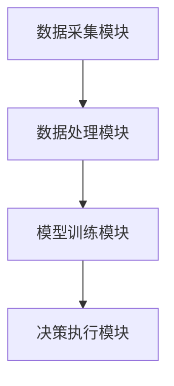
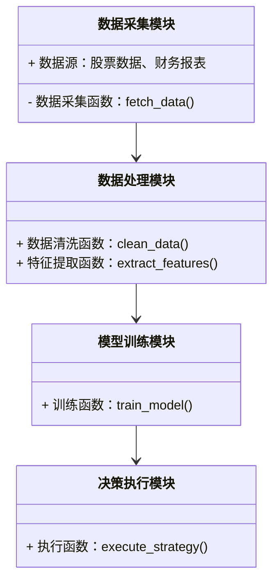

                 


# 费雪成长股选择的AI革新：多智能体系统的角色

## 关键词：  
- 费雪成长股、AI投资、多智能体系统、强化学习、系统架构

## 摘要：  
本文探讨了如何利用人工智能（AI）技术，特别是多智能体系统，来革新传统的费雪成长股选择方法。文章首先介绍了费雪成长股的基本概念和传统投资分析的局限性，然后详细讲解了多智能体系统在投资中的应用，包括强化学习和协作算法。通过系统架构设计和项目实战，展示了如何构建一个多智能体AI选股系统，并通过实例分析验证了该系统的有效性。最后，总结了当前研究的成果与未来的研究方向。

---

# 第一部分：费雪成长股选择的AI革新背景

## 第1章：AI在投资领域的应用与发展

### 1.1 AI在投资中的角色演变

#### 1.1.1 传统投资分析的局限性
传统投资分析依赖于人工筛选和基本面分析，存在以下问题：
- 数据量大，难以处理。
- 人工判断存在主观性和情绪影响。
- 市场变化快，传统方法难以及时调整。

#### 1.1.2 AI技术如何革新投资决策
人工智能技术的应用带来了以下优势：
- 自动化处理海量数据，提高效率。
- 利用机器学习算法发现潜在模式。
- 实时分析市场动态，优化投资决策。

#### 1.1.3 多智能体系统在投资中的潜力
多智能体系统通过协作和分工，提升了投资决策的智能化水平，例如：
- 分散任务处理，降低单点故障风险。
- 实现复杂投资策略的动态调整。
- 提高系统的鲁棒性和适应性。

### 1.2 费雪成长股理论的核心要素

#### 1.2.1 成长股的定义与特征
- 成长股是指收入和利润持续增长的公司股票。
- 关注公司基本面，如ROE（净资产收益率）和收入增长率。

#### 1.2.2 费雪投资策略的核心原则
- 长期持有优质成长股。
- 避免短期波动，注重长期价值。

#### 1.2.3 成长股选择的关键指标
- 营业收入增长率。
- 净利润增长率。
- 净资产收益率（ROE）。

---

## 第2章：费雪成长股与AI的结合

### 2.1 AI如何提升成长股筛选效率
- 自动化数据收集与处理。
- 利用机器学习模型预测股票潜在价值。

### 2.2 多智能体系统在成长股分析中的应用
- 分布式计算：多个智能体分别处理不同数据源。
- 协作决策：通过多智能体协作优化选股策略。

---

# 第二部分：多智能体系统的核心原理

## 第3章：多智能体系统的基本概念

### 3.1 多智能体系统概述

#### 3.1.1 多智能体系统的定义
- 由多个智能体组成的系统，通过协作完成复杂任务。

#### 3.1.2 多智能体系统的组成要素
- 智能体：具备感知、决策、执行能力的个体。
- 通信机制：智能体之间的信息交互方式。
- 协作任务：系统需要完成的共同目标。

---

## 第4章：多智能体系统在投资中的应用

### 4.1 多智能体系统的投资决策模型

#### 4.1.1 数据处理与特征提取
- 利用自然语言处理技术分析财务报告。
- 通过时间序列分析预测股价走势。

#### 4.1.2 智能体协作机制
- 分工合作：每个智能体负责不同的数据源或分析任务。
- 信息共享：智能体之间共享分析结果，优化整体决策。

---

## 第5章：AI驱动的多智能体系统算法

### 5.1 强化学习算法

#### 5.1.1 强化学习的基本原理
- 智能体通过与环境互动，学习最优策略。
- 通过奖励机制优化决策。

#### 5.1.2 多智能体强化学习的挑战
- 协作与竞争的平衡。
- �代理人之间的信息共享与隐私保护。

---

## 第6章：系统架构与设计

### 6.1 系统架构概述

#### 6.1.1 系统功能模块划分
- 数据采集模块：从多个来源获取数据。
- 数据处理模块：清洗、转换和特征提取。
- 模型训练模块：训练AI模型。
- 决策执行模块：生成投资建议。

#### 6.1.2 系统架构的Mermaid图


#### 6.1.3 系统组件间的交互关系
- 数据采集模块向数据处理模块提供原始数据。
- 数据处理模块将处理后的数据传递给模型训练模块。
- 模型训练模块生成投资策略并传递给决策执行模块。

---

## 第7章：项目实战

### 7.1 环境安装与配置

#### 7.1.1 安装Python环境
- 使用Anaconda或虚拟环境。

#### 7.1.2 安装依赖库
- `pandas`：数据处理。
- `numpy`：数值计算。
- `scikit-learn`：机器学习模型。
- `matplotlib`：可视化。

### 7.2 核心实现源代码

#### 7.2.1 数据预处理
```python
import pandas as pd
import numpy as np

# 加载数据
df = pd.read_csv('stock_data.csv')

# 数据清洗
df = df.dropna()
df = df.replace({np.nan: 0})

# 特征提取
features = df[['revenue_growth', 'net_profit_growth', 'roe']]
```

#### 7.2.2 模型训练
```python
from sklearn.ensemble import RandomForestClassifier
from sklearn.metrics import accuracy_score

# 训练模型
model = RandomForestClassifier(n_estimators=100)
model.fit(features, df['is_growth_stock'])

# 预测结果
predictions = model.predict(features)
print("准确率:", accuracy_score(df['is_growth_stock'], predictions))
```

#### 7.2.3 系统架构设计


---

## 第8章：最佳实践与注意事项

### 8.1 最佳实践
- 定期更新模型，适应市场变化。
- 结合多智能体系统的优势，提升选股效率。

### 8.2 小结
本文通过多智能体系统的应用，展示了如何革新传统的费雪成长股选择方法，为投资领域提供了新的思路。

---

## 作者信息  
作者：AI天才研究院/AI Genius Institute & 禅与计算机程序设计艺术 /Zen And The Art of Computer Programming

