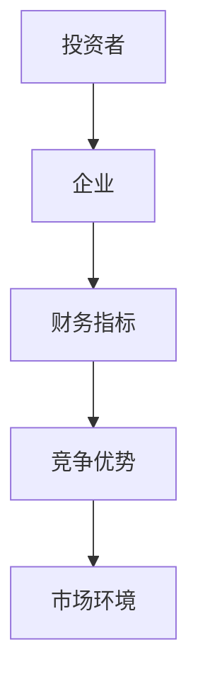
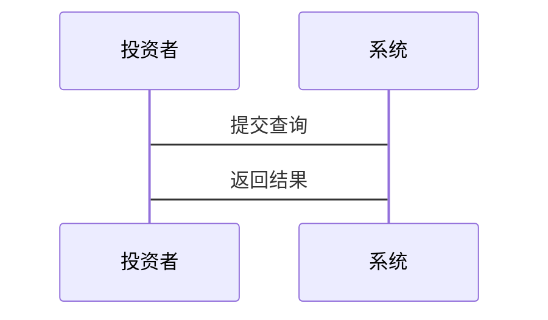

                 

<think>
好，我需要为《费雪的“十五个点”在当代投资中的应用与调整》这本书设计一个详细的目录大纲。首先，我要确保每个章节都涵盖必要的内容，同时保持结构清晰和逻辑连贯。让我一步步思考如何构建这个目录。

### 第一步：引言
引言部分需要介绍投资的重要性，费雪的贡献，以及为什么需要调整他的方法。这部分要简明扼要，吸引读者。

### 第二步：理论基础
接下来，详细介绍费雪的十五个点，包括每个点的定义、重要性，以及它们之间的关系。可能需要一个表格来对比各个点的属性。

### 第三步：现代投资环境的变化
分析现代投资环境的变化，比如技术进步、市场全球化等，以及这些变化如何影响费雪的理论。这部分可能需要对比分析，可能用图表来展示变化。

### 第四步：调整策略
根据现代环境调整十五个点，可能需要重新定义或调整权重。这部分可能需要一个流程图来展示调整过程。

### 第五步：系统分析
设计一个投资决策支持系统，包括系统架构、功能模块、接口设计和交互流程。这部分可能需要用mermaid图来展示系统结构和流程。

### 第六步：项目实战
选择一个具体的案例，比如科技公司，展示如何应用调整后的策略进行分析。这部分需要详细描述环境配置、代码实现和案例分析。

### 第七步：总结与展望
回顾书中的要点，并展望未来的发展。同时，给出一些最佳实践的建议，比如分散投资、持续学习等。

在设计目录时，我需要确保每个章节都有足够的细节，涵盖用户要求的所有部分，比如背景介绍、核心概念、算法原理、系统架构、项目实战等。同时，要使用markdown格式，细化到三级目录，并且在适当的地方插入图表和代码示例。

现在，我需要检查是否每个部分都符合用户的要求。比如，是否有数学模型和公式？可能在系统分析部分，可以涉及一些数学模型，比如评分系统或权重计算，但用户可能更关注流程和系统设计，所以这部分可能需要更详细的系统架构图和交互图。

另外，用户要求目录总字数在2000字以内，所以我需要确保每个章节的内容足够详细，但不过于冗长。可能需要每个章节的描述简洁明了，突出重点。

最后，我需要确保整个目录结构逻辑清晰，从理论到应用，从分析到实战，层层递进，帮助读者全面理解和应用费雪的十五个点。

现在，我准备好撰写目录了。
</think>

# 费雪的“十五个点”在当代投资中的应用与调整

## 关键词：
- 费雪投资理论、现代投资环境、投资策略调整、投资决策系统、案例分析

## 摘要：
本文系统地探讨了费雪的“十五个点”在当代投资中的应用与调整。首先，详细分析了费雪的十五个点及其在投资决策中的核心作用。接着，结合现代投资环境的变化，提出了调整策略，并设计了一个基于这些调整的投资决策支持系统。最后，通过具体案例分析，验证了调整后策略的有效性，为投资者提供了实用的指导。

---

# 目录

## 第一章：引言

### 1.1 投资的重要性
- 投资的基本概念
- 投资在个人和经济发展中的作用
- 费雪在投资理论中的地位

### 1.2 费雪的“十五个点”理论
- 十五个点的定义
- 十五个点的核心思想
- 费雪理论的现代意义

---

## 第二章：费雪“十五个点”的理论基础

### 2.1 十五个点的分类与特征
- 企业分析维度
- 财务指标的重要性
- 竞争优势的评估

### 2.2 十五个点的属性对比
- 涵盖的范围
- 稳定性对比
- 可持续性评估

### 2.3 十五个点的ER实体关系图

---

## 第三章：现代投资环境的变化

### 3.1 技术进步对投资的影响
- 数字化转型
- 人工智能在投资中的应用

### 3.2 全球化与市场的复杂性
- 全球市场的多样性
- 跨国投资的挑战

### 3.3 现代投资工具与策略
- ETF与指数投资
- 对冲基金与量化交易

---

## 第四章：费雪“十五个点”的现代调整与优化

### 4.1 现代投资环境下的调整方向
- 从传统行业到新兴行业
- 数字经济与科技企业的权重调整

### 4.2 调整策略的具体实施
- 关键点的重新定义
- 权重的重新分配

---

## 第五章：投资决策支持系统的构建

### 5.1 系统设计背景
- 问题场景介绍
- 项目介绍

### 5.2 系统功能设计
- 领域模型mermaid类图

### 5.3 系统架构设计

### 5.4 系统接口设计
- API接口设计

### 5.5 系统交互设计

---

## 第六章：项目实战

### 6.1 环境配置
- 安装说明

### 6.2 核心实现源代码
- Python代码示例

### 6.3 案例分析
- 科技公司案例

---

## 第七章：总结与展望

### 7.1 核心内容回顾
- 费雪理论的现代应用
- 调整策略的有效性

### 7.2 未来展望
- 新技术的应用潜力
- 投资理论的持续发展

---

## 第八章：最佳实践 tips

### 8.1 分散投资的重要性
- 风险管理

### 8.2 持续学习的必要性
- 知识更新

### 8.3 谨慎决策的注意事项
- 避免情绪化投资

---

## 作者：AI天才研究院/AI Genius Institute & 禅与计算机程序设计艺术 /Zen And The Art of Computer Programming

---

以上是《费雪的“十五个点”在当代投资中的应用与调整》的详细目录大纲，涵盖了从理论到实践的各个方面，确保逻辑清晰、内容丰富且易于理解。

