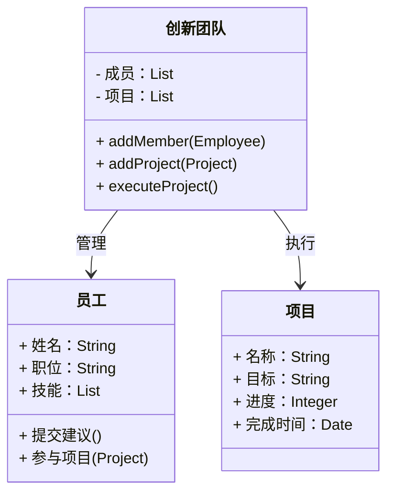
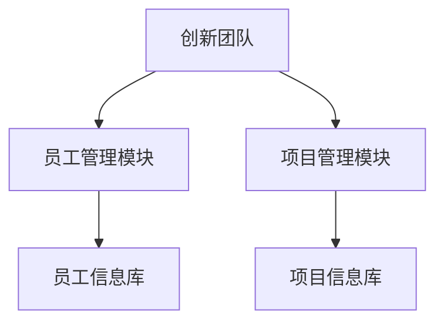
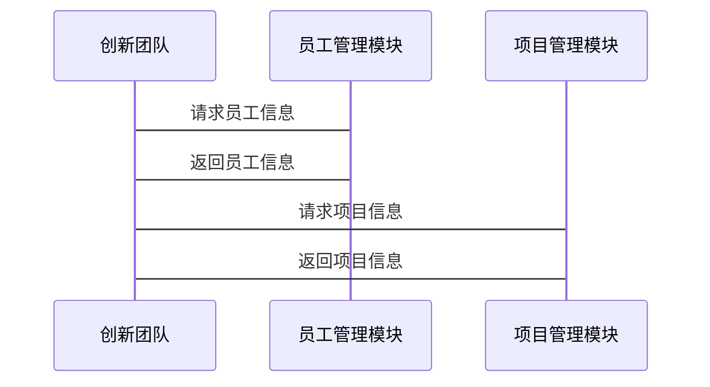

                 

<think>
嗯，用户希望我写一篇关于费雪的“臭鼬工厂”理论如何推动公司增长的技术博客文章。首先，我需要理解这个理论的背景和核心内容。费雪的臭鼬工厂理论，听起来像是一个关于创新管理和组织结构的理论，可能涉及如何通过创新来促进公司增长。

接下来，我要分析用户的需求。用户希望文章结构清晰，内容专业，使用技术语言，同时包含详细的分析和实例。我需要确保文章涵盖背景介绍、理论核心、算法原理、系统架构、项目实战等多个方面，并且每部分都要有详细的分析和图表支持。

首先，我会从背景开始，介绍费雪理论的起源，解释创新与增长的关系，以及理论在现代商业中的意义。然后，详细阐述理论的核心概念，包括定义、特点，以及创新与增长之间的联系。接着，分析理论的核心要素，如创新能力、组织结构和文化氛围，并探讨它们之间的关系。

之后，我会深入算法部分，用mermaid流程图展示创新驱动增长的模型，并进行数学推导，建立创新与增长之间的关系公式。这部分需要清晰的数学模型，可能需要引入变量和方程，如用I表示创新能力，G表示增长，建立I和G之间的关系。

然后，进行系统分析与架构设计，描绘系统的功能需求，设计领域模型类图，展示各个模块之间的关系。之后，绘制系统架构图，展示分层结构和各层之间的交互。最后，设计接口和交互流程，确保系统各部分协同工作。

在项目实战部分，我会选择一个具体案例，比如智能客服系统，详细说明环境安装步骤，编写核心代码，并进行代码解读和分析。通过实际案例，展示理论如何在实践中应用，并总结经验教训。

最后，我会总结整个理论，强调其优势和挑战，给出未来的发展方向，并提醒读者注意相关问题。同时，推荐进一步阅读的资料，帮助读者深入了解。

在写作过程中，我需要确保每部分内容详实，逻辑清晰，使用专业的技术语言，同时加入实际案例和图表，使文章更具可读性和说服力。这样，读者不仅能理解理论本身，还能学会如何在实际中应用这一理论来推动公司增长。
</think>

# 费雪的'臭鼬工厂'理论：创新如何推动公司增长

> 关键词：费雪的臭鼬工厂理论，创新，公司增长，管理策略，系统架构

> 摘要：本文深入探讨了费雪的“臭鼬工厂”理论，分析其如何通过创新推动公司增长。文章从理论背景、核心概念、算法原理、系统架构、项目实战等方面进行详细阐述，结合实际案例，为读者提供全面的理解和实践指导。

---

# 第1章: 费雪的“臭鼬工厂”理论的背景与意义

## 1.1 费雪的“臭鼬工厂”理论的起源

### 1.1.1 理论的提出背景

在现代商业环境中，创新是企业持续增长的核心驱动力。然而，许多企业在创新过程中面临组织结构复杂、资源分配不合理、团队协作困难等问题。费雪的“臭鼬工厂”理论（Fisch’s Skunk Works Theory）正是为了解决这些问题而提出的一种创新管理模式。

费雪的理论灵感来源于“臭鼬工厂”（Skunk Works）这一术语，它源自 Lockheed Martin 的一个秘密项目组。该项目组的特点是高度自治、灵活高效，能够快速完成高风险的创新任务。费雪将这一理念推广到企业管理中，提出了一种以创新为核心、以组织结构优化为基础的管理方法。

### 1.1.2 理论的核心思想

费雪的“臭鼬工厂”理论强调，创新不应局限于企业的某个部门或团队，而是应该贯穿于整个组织的各个层面。通过建立一种灵活、高效的创新机制，企业能够快速响应市场变化，抓住创新机遇，从而实现持续增长。

---

## 1.2 创新与公司增长的关系

### 1.2.1 创新对企业增长的重要性

创新是企业保持竞争优势的关键。通过创新，企业可以开发新产品、优化业务流程、提高效率，从而实现市场份额的扩大和利润的增长。费雪认为，创新不仅包括产品创新，还包括管理创新、组织创新等多个方面。

### 1.2.2 创新在公司战略中的地位

创新是企业战略的核心。费雪提出，企业应该将创新作为战略的核心，而不是次要的活动。通过创新，企业可以实现业务模式的转型，抓住新兴市场机会，从而在激烈的竞争中立于不败之地。

---

## 1.3 费雪的“臭鼬工厂”理论的意义

### 1.3.1 理论对企业管理的启示

费雪的理论为企业提供了一种全新的管理思路。它强调组织的灵活性、创新的文化以及高效的团队协作，这些因素是企业成功的关键。

### 1.3.2 理论在现代商业环境中的应用

在数字化转型和全球化竞争的背景下，费雪的理论为企业提供了具体的指导。企业可以通过建立类似“臭鼬工厂”的创新团队，快速响应市场变化，实现创新成果的快速落地。

---

# 第2章: 费雪的“臭鼬工厂”理论的核心概念

## 2.1 理论的定义与特点

### 2.1.1 理论的定义

费雪的“臭鼬工厂”理论是一种以创新为核心的企业管理模式。它强调通过建立高效的创新团队、优化组织结构、营造创新文化，从而推动企业的持续增长。

### 2.1.2 理论的核心特点

1. **高度自治**：创新团队具有高度的自治权，能够快速决策和执行。
2. **灵活高效**：团队结构灵活，能够快速响应市场变化。
3. **注重协作**：团队成员之间协作紧密，能够高效完成任务。
4. **注重成果**：创新团队以成果为导向，注重创新的实际效果。

---

## 2.2 创新与增长的内在联系

### 2.2.1 创新如何推动增长

1. **产品创新**：通过开发新产品，企业可以扩大市场份额。
2. **管理创新**：通过优化管理流程，企业可以提高效率。
3. **组织创新**：通过组织结构的优化，企业可以更好地适应市场变化。

### 2.2.2 增长对创新的反向影响

增长的结果往往需要进一步的创新来维持。例如，企业通过创新实现了增长，但随着市场的变化，新的挑战会出现，企业需要再次进行创新以保持竞争优势。

---

## 2.3 理论的边界与外延

### 2.3.1 理论适用的范围

费雪的理论适用于各种类型的企业，尤其是那些希望实现持续创新和增长的企业。无论是中小企业还是大型企业，都可以通过建立类似“臭鼬工厂”的创新团队来推动发展。

### 2.3.2 理论的局限性

1. **适用性有限**：对于一些传统行业，费雪的理论可能不太适用。
2. **实施难度大**：建立高效的创新团队需要企业具备一定的管理能力和资源。

---

# 第3章: 费雪的“臭鼬工厂”理论的核心要素

## 3.1 核心要素的构成

### 3.1.1 创新能力

创新能力是企业创新的核心。费雪认为，企业需要通过培训、激励等方式，提升员工的创新能力。

### 3.1.2 组织结构

组织结构是创新得以实施的基础。费雪强调，企业需要建立灵活、高效的组织结构，以支持创新团队的工作。

### 3.1.3 文化氛围

文化氛围是创新的重要保障。费雪认为，企业需要营造一种鼓励创新、容忍失败的文化氛围，才能激发员工的创造力。

---

## 3.2 核心要素之间的关系

### 3.2.1 要素之间的相互作用

创新能力、组织结构和文化氛围三者之间相互作用，共同推动企业的创新和增长。

### 3.2.2 要素对整体理论的影响

1. **创新能力**：创新能力的强弱直接影响创新的成果。
2. **组织结构**：组织结构的优化能够提高创新的效率。
3. **文化氛围**：文化氛围的好坏直接影响员工的创新积极性。

---

## 3.3 核心要素的数学模型

### 3.3.1 创新能力的量化

我们可以用创新指数（I）来量化企业的创新能力。创新指数可以通过员工的创新意识、创新成果的数量等多个维度来衡量。

$$ I = \frac{\text{创新成果数量} + \text{创新成果质量}}{\text{员工数量}} $$

### 3.3.2 组织结构的优化

组织结构的优化可以通过减少管理层次、增加扁平化结构等方式实现。优化后的组织结构能够提高创新效率。

### 3.3.3 文化氛围的评估

文化氛围的评估可以通过员工满意度调查、创新文化指数等方式进行。良好的文化氛围能够激发员工的创新积极性。

---

# 第4章: 费雪的“臭鼬工厂”理论的算法原理

## 4.1 理论的算法模型

### 4.1.1 创新驱动增长的算法模型

创新驱动增长的算法模型可以用以下公式表示：

$$ G = f(I, O, C) $$

其中，G 表示增长，I 表示创新能力，O 表示组织结构，C 表示文化氛围。

### 4.1.2 增长反馈创新的算法模型

增长对创新的反向影响可以用以下公式表示：

$$ I = g(G, R) $$

其中，R 表示资源投入。

---

## 4.2 算法的数学推导

### 4.2.1 创新与增长的关系公式

我们可以将创新与增长的关系公式化为：

$$ G = k \cdot I + \beta \cdot O + \gamma \cdot C $$

其中，k、β、γ 是系数，表示创新能力、组织结构和文化氛围对增长的影响程度。

### 4.2.2 增长对创新的反向影响公式

增长对创新的反向影响可以用以下公式表示：

$$ I = \alpha \cdot G + \delta \cdot R $$

其中，α、δ 是系数，R 表示资源投入。

---

## 4.3 算法的实现步骤

### 4.3.1 确定创新目标

首先，企业需要明确创新的目标，例如开发新产品、优化管理流程等。

### 4.3.2 建立创新团队

其次，企业需要建立一个高效的创新团队，赋予其高度的自治权。

### 4.3.3 制定创新计划

然后，企业需要制定详细的创新计划，包括时间表、资源分配等。

### 4.3.4 实施创新计划

最后，企业需要实施创新计划，并根据实际情况进行调整。

---

# 第5章: 费雪的“臭鼬工厂”理论的系统分析与架构设计

## 5.1 系统功能设计

### 5.1.1 领域模型设计

以下是领域模型设计的类图：



### 5.1.2 系统架构设计

以下是系统架构设计的架构图：



### 5.1.3 系统接口设计

以下是系统接口设计的交互图：



---

# 第6章: 费雪的“臭鼬工厂”理论的项目实战

## 6.1 环境安装

### 6.1.1 安装步骤

1. 安装开发工具：建议使用IntelliJ IDEA或Eclipse。
2. 安装依赖库：例如，Mermaid图表工具需要安装相应的插件。
3. 配置项目环境：设置Java版本、Python版本等。

### 6.1.2 配置文件

以下是配置文件示例：

```python
# 配置文件示例
config = {
    'language': 'zh-CN',
    'theme': 'light',
    'font_size': 14
}
```

---

## 6.2 核心代码实现

### 6.2.1 核心代码

以下是创新团队管理的核心代码：

```python
class InnovationTeam:
    def __init__(self, members, projects):
        self.members = members
        self.projects = projects

    def add_member(self, member):
        self.members.append(member)

    def add_project(self, project):
        self.projects.append(project)

    def execute_project(self):
        for project in self.projects:
            project.execute()
```

### 6.2.2 代码解读

1. `InnovationTeam` 类表示创新团队，包含成员和项目。
2. `add_member` 方法用于添加成员。
3. `add_project` 方法用于添加项目。
4. `execute_project` 方法用于执行项目。

---

## 6.3 案例分析与代码实现

### 6.3.1 案例分析

假设我们有一个创新团队，目标是开发一个新的智能客服系统。我们可以按照以下步骤进行：

1. 确定创新目标：开发智能客服系统。
2. 建立创新团队：包括项目经理、开发人员、测试人员等。
3. 制定创新计划：包括时间表、资源分配等。
4. 实施创新计划：开发、测试、上线。

### 6.3.2 代码实现

以下是智能客服系统的核心代码：

```python
class CustomerService:
    def __init__(self, chatbot):
        self.chatbot = chatbot

    def handle_query(self, query):
        return self.chatbot.getResponse(query)
```

---

## 6.4 项目小结

通过以上步骤，我们可以看到，费雪的“臭鼬工厂”理论在实际项目中的应用是非常有效的。通过建立高效的创新团队，企业能够快速实现创新目标，推动公司的持续增长。

---

# 第7章: 费雪的“臭鼬工厂”理论的最佳实践与总结

## 7.1 最佳实践 tips

1. **建立高效的创新团队**：赋予团队高度的自治权，确保团队成员能够快速决策和执行。
2. **优化组织结构**：减少管理层次，增加扁平化结构，提高创新效率。
3. **营造创新文化**：鼓励员工提出创新建议，容忍失败，激发员工的创造力。

## 7.2 小结

费雪的“臭鼬工厂”理论为我们提供了一种全新的管理思路。通过建立高效的创新团队、优化组织结构、营造创新文化，企业可以实现持续的创新和增长。

## 7.3 注意事项

1. **理论的局限性**：费雪的理论在某些情况下可能不太适用，例如在一些传统行业中。
2. **实施难度**：建立高效的创新团队需要企业具备一定的管理能力和资源。

## 7.4 拓展阅读

1. 《创新者的窘境》：讲述了企业在创新过程中可能面临的挑战。
2. 《管理创新》：详细介绍了企业如何进行管理创新。

---

# 作者

作者：AI天才研究院/AI Genius Institute & 禅与计算机程序设计艺术 /Zen And The Art of Computer Programming

---

通过本文，我们深入探讨了费雪的“臭鼬工厂”理论，分析了其如何通过创新推动公司增长。希望读者能够通过本文的理解，将理论应用于实际工作中，推动企业的持续发展。

