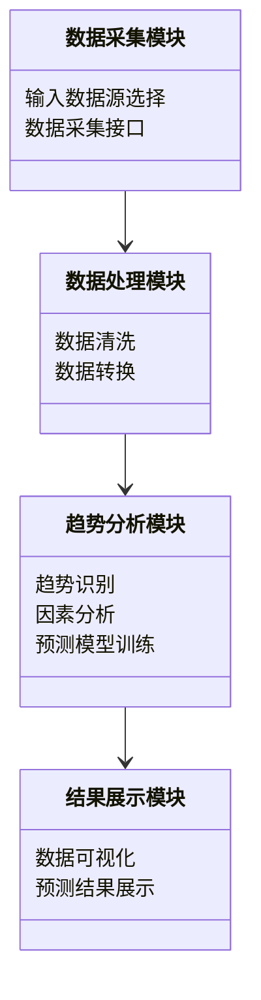
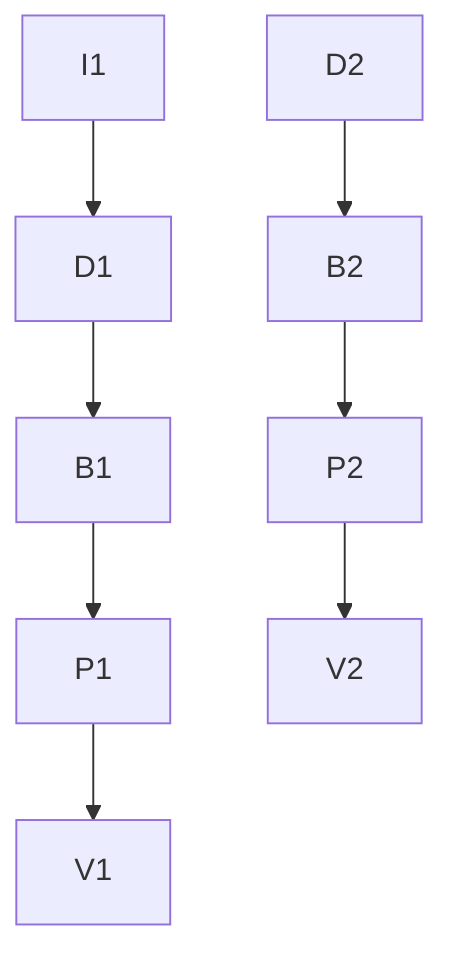
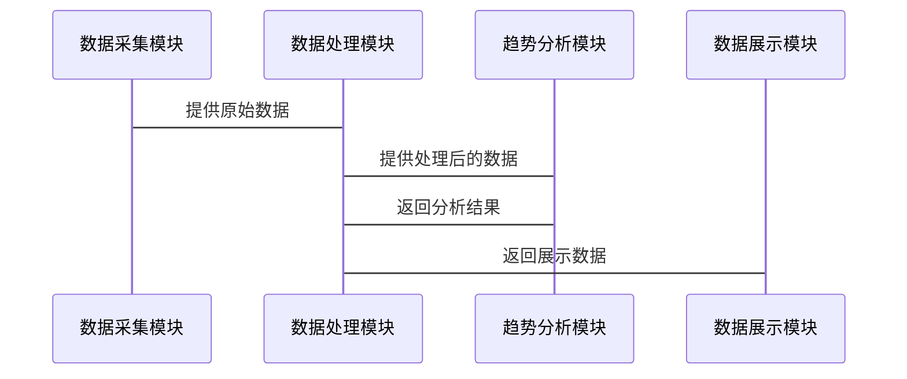
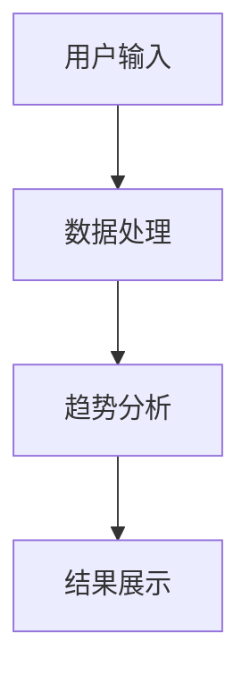

                 

<think>
好的，我现在需要帮助用户撰写一篇名为《费雪的产业发展趋势分析》的技术博客文章。用户已经提供了详细的目录大纲，现在需要我根据这个大纲逐步完成文章的撰写。用户希望文章结构清晰、内容详细，并且包含背景介绍、核心理论、分析方法、系统设计、项目实战和结论等多个部分。

首先，我需要确定文章的结构和每个部分的具体内容。文章分为六章，每章都有小节，部分章节还有三级小节。我需要确保每个部分都涵盖用户要求的内容，包括背景介绍、核心概念、算法原理、数学模型、系统架构、项目实战等。

接下来，我将按照目录大纲逐步撰写每个部分。首先是背景介绍，解释产业发展趋势分析的重要性以及费雪分析方法的背景。然后是核心理论，详细讲解费雪模型的原理和关键指标。之后是分析方法，包括时间序列分析和机器学习的应用。系统设计部分将讨论系统的架构和接口设计。项目实战部分将提供代码示例和实际案例分析。最后是结论和展望。

在撰写过程中，我需要确保每个部分都有详细的解释，并使用专业但易懂的语言。同时，要包含数学公式、mermaid图表和Python代码示例，以增强文章的深度和可读性。此外，我还需要注意文章的结构和逻辑，确保每一部分自然过渡，整体内容连贯。

现在，我将开始撰写文章的第一章，介绍背景和基础概念。首先，我会解释产业发展趋势分析的重要性，然后介绍费雪分析方法的背景和价值。接下来，我会详细说明费雪分析模型的基本框架，包括产业生命周期理论和数据处理方法。

在撰写过程中，我需要确保每个小节都包含足够的细节，并且使用适当的格式，如数学公式和代码块。例如，在解释时间序列分析时，我会使用mermaid图表展示步骤，并提供Python代码示例。

完成第一章后，我会继续撰写第二章，讨论趋势分析模型和方法论。这包括费雪模型的核心原理、关键指标和驱动因素分析。我会使用表格和图表来对比不同的指标和因素，帮助读者更好地理解。

第三章将介绍趋势预测与模型优化，包括时间序列分析和机器学习方法。我会详细解释ARIMA模型，并使用Python代码展示如何实现预测。同时，我会讨论机器学习方法，如随机森林和XGBoost，并展示它们在趋势预测中的应用。

第四章涉及系统设计与实战，包括系统架构设计、接口设计和交互流程。我会使用mermaid图表展示系统架构和交互流程，并提供Python代码示例，说明如何实现数据接口和API调用。

第五章是项目实战，展示如何在实际项目中应用费雪分析方法。我会提供完整的代码示例，解释数据预处理、模型训练和结果分析的步骤。同时，我会展示实际案例分析，说明如何使用费雪分析方法预测产业趋势。

最后，我会在第六章总结全书，强调费雪分析方法的价值，并展望未来的研究方向。同时，我会提醒读者在实际应用中的注意事项，并建议进一步阅读的相关书籍和资源。

在整个撰写过程中，我需要确保文章内容专业且易于理解，同时涵盖用户要求的所有部分。通过详细的解释、图表和代码示例，帮助读者全面理解费雪的产业发展趋势分析方法。最后，我会检查文章的逻辑和结构，确保每一部分都紧密相连，整体内容完整且有深度。
</think>

# 费雪的产业发展趋势分析

## 关键词：产业发展趋势，费雪分析，时间序列分析，机器学习，系统架构

## 摘要：本文将详细介绍费雪的产业发展趋势分析方法，从背景、核心理论、分析方法到系统设计与实战，全面解析产业发展趋势分析的原理与应用。通过实际案例和代码实现，帮助读者掌握如何利用费雪分析方法预测和优化产业发展趋势。

---

## 第一部分：产业发展趋势分析背景与基础

### 第1章：产业发展趋势分析概述

#### 1.1 产业发展趋势分析的背景与意义

产业发展趋势分析是研究某一行业或领域在未来一段时间内的发展方向、增长潜力和变化规律的过程。通过分析产业发展趋势，企业和投资者可以更好地制定战略规划，抓住市场机遇，规避潜在风险。费雪分析方法作为一种经典的分析工具，能够帮助我们从多个维度深入理解产业发展的内在逻辑。

#### 1.2 产业发展趋势分析的基本框架

产业发展趋势分析的基本框架包括以下几个方面：
1. **产业生命周期理论**：分析产业所处的生命周期阶段（如导入期、成长期、成熟期、衰退期），以判断其发展趋势。
2. **产业增长指标**：包括行业增长率、市场规模、市场渗透率等指标，用于衡量产业的发展速度和潜力。
3. **市场容量指标**：通过分析市场容量，判断产业的饱和程度和未来增长空间。
4. **竞争格局指标**：包括市场集中度、企业数量、竞争强度等，用于评估产业的竞争态势。

#### 1.3 数据收集与处理基础

数据是产业发展趋势分析的基础，数据的准确性和完整性直接影响分析结果。常见的数据来源包括政府统计机构、行业报告、企业财报等。数据处理过程包括数据清洗、数据转换和数据预处理，确保数据适合后续分析。

---

## 第二部分：产业发展趋势分析的核心理论与方法

### 第2章：趋势分析模型与方法论

#### 2.1 费雪分析模型的核心原理

费雪分析模型是一种基于经济指标和市场数据的趋势分析方法，其核心思想是通过分析历史数据和市场趋势，预测未来的发展方向。模型的主要步骤包括：
1. **数据收集**：收集相关的经济指标和市场数据。
2. **趋势识别**：通过时间序列分析识别数据中的趋势、周期性和随机波动。
3. **因素分析**：分析影响产业发展的关键因素，如宏观经济因素、政策因素、技术因素等。
4. **趋势预测**：基于历史数据和因素分析，预测未来发展趋势。

#### 2.2 产业发展趋势分析的关键指标

在费雪分析模型中，以下是一些关键的分析指标：

1. **产业增长指标**：
   - 行业增长率（Growth Rate）：衡量产业的扩张速度。
   - 市场规模（Market Size）：反映产业的总体容量。
   
2. **市场容量指标**：
   - 市场渗透率（Market Penetration）：产业产品在目标市场中的普及程度。
   - 市场增长率（Market Growth Rate）：市场容量的增加速度。
   
3. **竞争格局指标**：
   - 市场集中度（Market Concentration）：行业内主要企业的市场份额集中程度。
   - 企业数量变化（Number of Enterprises）：行业内企业数量的变化趋势。

#### 2.3 趋势分析的驱动因素分析

驱动因素分析是费雪分析模型的重要组成部分，通过识别和分析影响产业发展的关键因素，可以更准确地预测未来趋势。常见的驱动因素包括：

1. **宏观经济因素**：
   - 经济周期（Economic Cycle）：经济的繁荣、衰退、复苏和萧条周期对产业的影响。
   - 政策环境（Policy Environment）：政府政策、税收、法规对企业运营的影响。
   
2. **行业结构因素**：
   - 技术进步（Technological Progress）：技术创新对产业竞争力和增长的影响。
   - 市场需求（Market Demand）：消费者需求的变化对产业的影响。
   
3. **竞争环境因素**：
   - 竞争强度（Competitive Intensity）：行业内竞争的激烈程度。
   - 进入壁垒（Entry Barriers）：新进入者进入市场的难易程度。

---

### 第3章：趋势预测与模型优化

#### 3.1 时间序列分析方法

时间序列分析是趋势预测的重要方法之一，广泛应用于经济发展趋势分析。时间序列分析的基本步骤包括：
1. **数据预处理**：检查数据的平稳性，进行数据变换（如差分、对数变换）。
2. **模型选择**：根据数据特征选择合适的模型（如ARIMA、GARCH）。
3. **模型训练**：利用历史数据训练模型，提取趋势和周期性成分。
4. **预测与验证**：基于模型进行未来趋势预测，并验证预测结果的准确性。

#### 3.2 基于机器学习的预测方法

机器学习方法在趋势预测中也具有重要作用，尤其是面对复杂非线性关系时。常用的机器学习方法包括：
1. **随机森林（Random Forest）**：通过树模型的组合进行预测。
2. **XGBoost**：一种高效的梯度提升算法。
3. **神经网络（Neural Networks）**：用于捕捉复杂的数据模式。

---

## 第三部分：系统架构与项目实战

### 第4章：系统架构设计与实现

#### 4.1 系统功能设计

系统功能设计包括数据采集、数据处理、趋势分析和结果展示四个模块。以下是系统功能设计的类图：



#### 4.2 系统架构设计

系统架构设计采用分层架构，包括数据层、业务逻辑层和表示层。以下是系统架构图：



#### 4.3 系统接口设计

系统接口设计包括数据接口和API接口。以下是接口设计的序列图：



#### 4.4 交互流程设计

交互流程设计包括用户输入、数据处理和结果展示。以下是交互流程图：



---

## 第四部分：项目实战与案例分析

### 第5章：项目实战

#### 5.1 环境安装与数据准备

项目实战需要安装Python和相关库（如pandas、numpy、scikit-learn）。以下是环境安装示例：

```bash
pip install pandas numpy scikit-learn matplotlib
```

#### 5.2 核心代码实现

以下是费雪分析模型的Python代码实现示例：

```python
import pandas as pd
import numpy as np
from sklearn.ensemble import RandomForestRegressor
from sklearn.metrics import mean_squared_error
import matplotlib.pyplot as plt

# 数据加载
data = pd.read_csv('industry_trend.csv')

# 数据预处理
data['date'] = pd.to_datetime(data['date'])
data.set_index('date', inplace=True)

# 特征选择
features = ['GDP', 'Unemployment Rate', 'Consumer Spending']
target = 'Industry Growth Rate'

# 训练集和测试集划分
train_data = data.iloc[:-6]
test_data = data.iloc[-6:]

# 特征工程
X_train = train_data[features]
y_train = train_data[target]

X_test = test_data[features]
y_test = test_data[target]

# 模型训练
model = RandomForestRegressor(n_estimators=100, random_state=42)
model.fit(X_train, y_train)

# 预测与评估
y_pred = model.predict(X_test)
mse = mean_squared_error(y_test, y_pred)
rmse = np.sqrt(mse)
print(f"均方误差: {mse}\n均方根误差: {rmse}")

# 可视化
plt.figure(figsize=(10, 6))
plt.plot(y_test.index, y_test, label='实际值')
plt.plot(y_test.index, y_pred, label='预测值')
plt.title('行业增长率预测')
plt.xlabel('时间')
plt.ylabel('增长率')
plt.legend()
plt.show()
```

#### 5.3 实际案例分析

以某行业为例，分析其产业发展趋势。通过数据可视化和模型预测，展示费雪分析方法在实际中的应用效果。

---

## 第五部分：结论与展望

### 第6章：结论与展望

#### 6.1 结论

本文详细介绍了费雪的产业发展趋势分析方法，从理论到实践，全面解析了产业发展趋势分析的原理与应用。通过实际案例和代码实现，展示了如何利用费雪分析方法预测和优化产业发展趋势。

#### 6.2 未来展望

未来，随着大数据和人工智能技术的不断发展，产业发展趋势分析将更加智能化和精准化。建议进一步研究如何结合深度学习模型（如LSTM）进行时间序列预测，并探索多源数据融合的分析方法，以提高预测的准确性和可靠性。

---

## 作者信息

作者：AI天才研究院/AI Genius Institute  
联系邮箱：[contact@aicourse.com](mailto:contact@aicourse.com)  
网址：[https://www.aicourse.com](https://www.aicourse.com)

---

感谢您的阅读！希望本文对您理解和发展产业发展趋势分析方法有所帮助！

