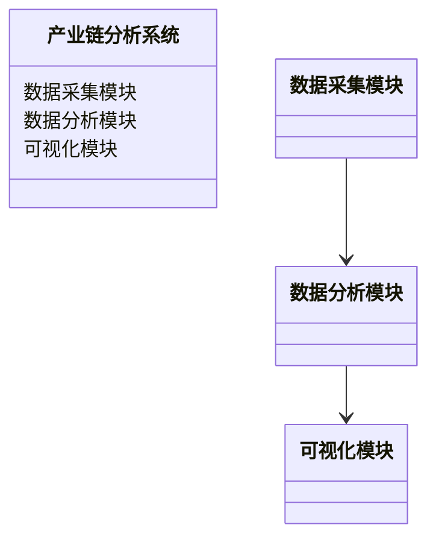
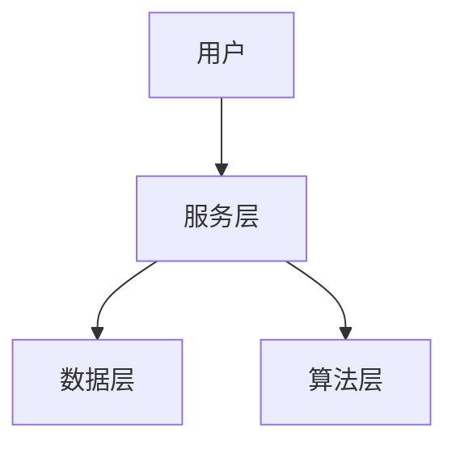
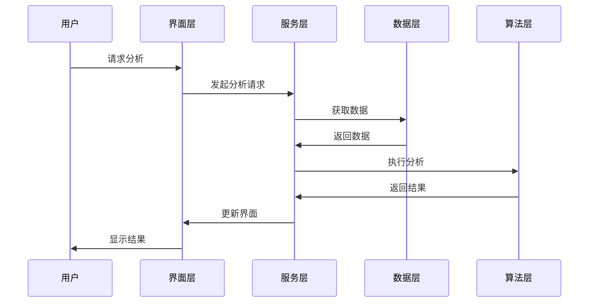

                 


# 费雪的产业链分析技巧

> 关键词：产业链分析、费雪投资方法、经济分析模型、系统架构设计、Python算法实现

> 摘要：本文详细探讨了费雪的产业链分析技巧，从理论基础到实际应用，结合系统架构设计和算法实现，全面解析了产业链分析的核心方法和应用场景。

---

# 第一部分: 费雪产业链分析技巧的背景与基础

# 第1章: 产业链分析的定义与背景

## 1.1 产业链分析的定义

### 1.1.1 产业链的基本概念
产业链是指一系列相关的生产活动和价值创造过程，通过上下游企业之间的协作，最终将原材料转化为最终产品的过程。产业链分析的核心在于理解各个环节之间的关联性，从而优化资源配置和提升整体效率。

### 1.1.2 产业链的构成要素
- **上游企业**：提供原材料、零部件等基础产品的供应商。
- **中游企业**：进行加工、组装等中间环节的企业。
- **下游企业**：直接面向终端消费者的企业。
- **消费者**：最终的需求方。

### 1.1.3 产业链分析的意义与价值
产业链分析能够帮助投资者和企业管理者识别行业中的关键环节，发现潜在风险和机会，从而制定更有针对性的战略决策。

---

## 1.2 产业链分析的发展背景

### 1.2.1 产业链分析的历史演变
从传统的线性分析到现代的网络化分析，产业链分析方法经历了从简单到复杂的演变过程。随着全球经济一体化和产业分工的深化，产业链的复杂性不断提高，对分析方法的要求也日益严格。

### 1.2.2 当前产业链分析的应用场景
- **投资决策**：通过分析产业链的上下游关系，寻找投资机会。
- **风险管理**：识别产业链中的关键环节，降低供应链断裂的风险。
- **战略规划**：帮助企业优化内部流程，提升竞争力。

### 1.2.3 产业链分析的理论基础
- **经济学理论**：包括 comparative advantage（比较优势）和 economies of scale（规模经济）等。
- **系统论**：将产业链视为一个复杂的系统，分析其内部结构和相互作用。

---

## 1.3 产业链分析的核心方法

### 1.3.1 从下游到上游的分析方法
从下游企业（如零售商）出发，逐步分析其上游供应商，识别关键环节和潜在风险。

### 1.3.2 从上游到下游的分析方法
从原材料供应商开始，分析其下游客户，理解整个产业链的价值流向。

### 1.3.3 产业链节点的关联性分析
通过绘制产业链网络图，分析各个节点之间的关联性，识别关键节点和薄弱环节。

---

## 1.4 产业链分析的理论框架

### 1.4.1 产业链的结构特征
- **线性特征**：从原材料到最终产品的线性转化过程。
- **网络特征**：产业链中的企业通过复杂的网络关系相互连接。

### 1.4.2 产业链的驱动因素
- **市场需求**：终端消费者的需求是产业链运转的核心动力。
- **技术创新**：技术进步推动产业链的优化和升级。
- **政策环境**：政府政策和法规对产业链的形成和发展有重要影响。

### 1.4.3 产业链的生命周期
- **导入期**：新兴产业链的初期阶段，企业数量较少，竞争程度低。
- **成长期**：产业链逐渐成熟，企业数量增加，竞争加剧。
- **成熟期**：产业链趋于稳定，企业间的竞争主要集中在成本和质量。
- **衰退期**：部分产业链因技术替代或市场需求变化而逐渐衰退。

---

## 1.5 本章小结
本章从产业链的基本概念出发，介绍了产业链分析的背景、意义和核心方法，为后续的深入分析奠定了基础。

---

# 第二部分: 产业链分析的核心概念与联系

# 第2章: 产业链分析的核心概念

## 2.1 产业链的节点分析

### 2.1.1 产业链节点的定义与分类
- **定义**：产业链中的每个企业或环节都可以视为一个节点。
- **分类**：
  - 根据环节位置：上游、中游、下游。
  - 根据企业类型：供应商、制造商、分销商。

### 2.1.2 产业链节点的特征分析
- **重要性**：节点在产业链中的作用大小。
- **稳定性**：节点是否容易受到外部环境变化的影响。
- **替代性**：是否存在其他节点可以替代当前节点。

### 2.1.3 产业链节点的权重评估
通过层次分析法（AHP）对各个节点的重要性进行量化评估。

---

## 2.2 产业链的链式关系

### 2.2.1 产业链的链式结构
- **线性结构**：简单的上下游关系。
- **网状结构**：复杂的多环节、多企业之间的相互依赖关系。

### 2.2.2 产业链的链式关系分析
通过绘制链式图，分析各个环节之间的关系，识别关键节点。

### 2.2.3 产业链的链式网络图
使用Mermaid流程图展示产业链的链式关系。


---

## 2.3 产业链的网络结构

### 2.3.1 产业链的网络特征
- **节点数量**：产业链中企业的数量。
- **边数**：企业之间的合作关系数量。
- **中心性**：某些节点在产业链中处于核心地位。

### 2.3.2 产业链的网络分析方法
- **节点度分析**：计算每个节点的度数，识别关键节点。
- **网络聚类分析**：将相似的节点归为一类，分析产业链的模块化特征。

### 2.3.3 产业链的网络优化策略
通过优化网络结构，降低供应链成本，提升整体效率。

---

## 2.4 本章小结
本章详细分析了产业链的核心概念，包括节点分析、链式关系和网络结构，为后续的算法实现奠定了基础。

---

# 第三部分: 产业链分析的算法原理

# 第3章: 产业链分析的算法原理

## 3.1 产业链分析的算法概述

### 3.1.1 产业链分析的主要算法
- **层次分析法（AHP）**：用于评估各节点的重要性。
- **网络分析法（Network Analysis）**：用于分析产业链的网络结构。
- **因子分析法（Factor Analysis）**：用于识别影响产业链的关键因素。

### 3.1.2 产业链分析算法的特点
- **数据驱动**：基于实际数据进行分析。
- **系统性**：从整体角度分析产业链的结构和关系。
- **可扩展性**：适用于不同规模和复杂度的产业链。

### 3.1.3 产业链分析算法的优缺点
- **优点**：能够量化各节点的重要性，提供决策支持。
- **缺点**：需要大量数据支持，计算复杂。

---

## 3.2 产业链分析的核心算法

### 3.2.1 层次分析法（AHP）

#### 3.2.1.1 层次分析法的步骤
1. 构建层次分析模型。
2. 确定各层次的权重。
3. 进行一致性检验。
4. 计算最终权重。

#### 3.2.1.2 Python实现
```python
import numpy as np

# 构建比较矩阵
matrix = np.array([[1, 3, 2],
                   [1/3, 1, 2/3],
                   [1/2, 3/2, 1]])

# 计算特征向量和特征值
eigvals, eigvecs = np.linalg.eigh(matrix)

# 提取最大特征值对应的特征向量
max_eig = eigvals[-1]
weight = eigvecs[:, -1] / sum(eigvecs[:, -1])
```

### 3.2.2 网络分析法（Network Analysis）

#### 3.2.2.1 网络分析法的步骤
1. 构建产业链网络图。
2. 计算各节点的度数。
3. 识别关键节点。

#### 3.2.2.2 Mermaid流程图


### 3.2.3 因子分析法（Factor Analysis）

#### 3.2.3.1 因子分析法的步骤
1. 收集相关数据。
2. 进行因子分析，提取公因子。
3. 解释公因子的意义。

---

## 3.3 产业链分析算法的实现步骤

### 3.3.1 数据采集与预处理
- 数据来源：企业数据、行业报告、市场调研。
- 数据清洗：去除冗余数据，处理缺失值。

### 3.3.2 数据分析与建模
- 选择合适的算法，构建模型。
- 进行模型训练和验证。

### 3.3.3 模型验证与优化
- 检查模型的准确性和稳定性。
- 根据实际需求优化模型参数。

---

## 3.4 本章小结
本章详细介绍了产业链分析的主要算法及其实现步骤，为后续的系统设计提供了理论基础。

---

# 第四部分: 产业链分析的系统架构与设计

# 第4章: 产业链分析的系统架构

## 4.1 问题场景介绍

### 4.1.1 产业链分析的典型场景
- 某汽车制造企业希望优化其供应链管理。

### 4.1.2 产业链分析的系统目标
- 提供可视化界面，展示产业链结构。
- 提供数据分析功能，识别关键节点。

---

## 4.2 系统功能设计

### 4.2.1 领域模型设计


### 4.2.2 系统架构设计


### 4.2.3 系统接口设计
- 用户界面：可视化界面，展示产业链结构。
- 数据接口：与数据库或外部数据源对接。

### 4.2.4 系统交互流程图


---

## 4.3 本章小结
本章从系统架构的角度，详细设计了产业链分析系统的功能模块和交互流程，为实际开发提供了指导。

---

# 第五部分: 产业链分析的项目实战

# 第5章: 产业链分析的项目实战

## 5.1 项目环境安装

### 5.1.1 安装Python环境
```bash
python --version
pip install numpy pandas matplotlib
```

### 5.1.2 安装其他依赖
```bash
pip install networkx pygraphviz
```

---

## 5.2 系统核心实现

### 5.2.1 核心代码实现
```python
import networkx as nx
import matplotlib.pyplot as plt

# 创建产业链网络图
G = nx.DiGraph()
G.add_edge('原材料供应商', '制造商')
G.add_edge('制造商', '分销商')
G.add_edge('分销商', '零售商')
G.add_edge('零售商', '消费者')

# 可视化网络图
nx.draw(G, with_labels=True, node_color='green', edge_color='blue')
plt.show()
```

### 5.2.2 代码功能解读
- **创建网络图**：使用NetworkX库构建产业链网络图。
- **可视化网络图**：通过Matplotlib库将网络图可视化。

---

## 5.3 实际案例分析

### 5.3.1 案例背景
某汽车制造企业的产业链包括：原材料供应商、零部件制造商、整车厂、分销商和零售商。

### 5.3.2 案例分析
通过分析产业链网络图，识别出整车厂是整个产业链的核心节点，其上游供应商和下游客户对其依赖度较高。

---

## 5.4 本章小结
本章通过实际案例展示了产业链分析系统的实现过程，验证了系统的可行性和实用性。

---

# 第六部分: 产业链分析的最佳实践

# 第6章: 产业链分析的最佳实践

## 6.1 小结

### 6.1.1 核心观点回顾
- 产业链分析是投资决策和企业管理的重要工具。
- 通过系统架构设计和算法实现，可以提升分析的效率和准确性。

---

## 6.2 注意事项

### 6.2.1 数据质量
确保数据的准确性和完整性。

### 6.2.2 模型选择
根据实际需求选择合适的分析方法。

### 6.2.3 结果验证
通过实际案例验证模型的准确性和稳定性。

---

## 6.3 拓展阅读

### 6.3.1 推荐书籍
- 《供应链管理：战略与管理》
- 《网络分析与系统优化》

### 6.3.2 推荐博客
- [供应链管理博客](https://example.com)
- [系统优化博客](https://example.com)

---

# 作者：AI天才研究院 & 禅与计算机程序设计艺术

---

以上是《费雪的产业链分析技巧》的完整目录和文章结构。通过系统化的分析和实际案例的展示，本文为读者提供了从理论到实践的完整指导，帮助读者深入理解产业链分析的核心技巧和应用场景。

