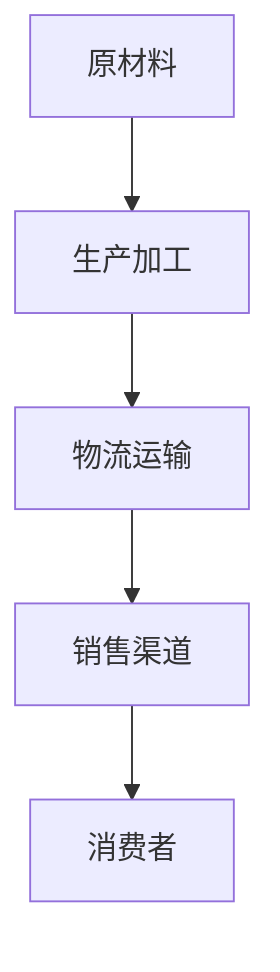
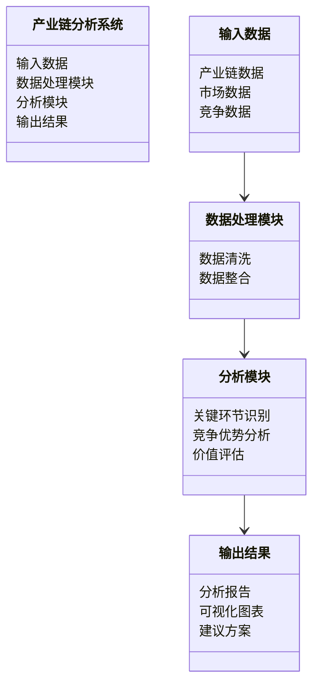

                 


# 费雪的产业链分析方法

## 关键词
- 产业链分析
- 费雪方法
- 产业链结构
- 竞争优势
- 系统架构

## 摘要
本文详细介绍了费雪的产业链分析方法，从基本概念到数学模型，再到系统架构设计和项目实战，全面解析了该方法的理论基础和实际应用。通过本文，读者可以掌握如何使用费雪的方法进行产业链分析，识别关键环节，评估竞争优势，并设计有效的系统架构。

---

# 第1章: 产业链分析的基本概念

## 1.1 产业链的定义与特点

### 1.1.1 产业链的定义
产业链是指一系列相关的生产、分配和消费活动的链条，涵盖了从原材料供应到最终产品交付的全过程。它包括上游、中游和下游三个主要部分。

### 1.1.2 产业链的核心特点
- **垂直整合**：产业链中各环节的高度协同和整合。
- **协同效应**：各环节之间的协同合作，提高整体效率。
- **动态调整**：根据市场需求变化，灵活调整各环节的比例和结构。

### 1.1.3 产业链的分类与层次结构
产业链可以分为生产链、供应链和价值链示意图：



## 1.2 费雪产业链分析方法的背景

### 1.2.1 产业链分析的起源与发展
产业链分析起源于工业经济时代，随着全球化和信息化的发展，逐渐形成了系统化的分析方法。

### 1.2.2 费雪方法的独特性与创新点
费雪方法的独特性在于其系统性和动态性，能够准确识别关键环节和竞争优势。

### 1.2.3 产业链分析在现代经济中的应用价值
产业链分析在企业战略制定、资源配置和风险管理中具有重要作用。

---

# 第2章: 费雪产业链分析的核心框架

## 2.1 产业链的结构与功能

### 2.1.1 产业链的构成要素
- **上游**：原材料供应和生产制造。
- **中游**：加工和组装。
- **下游**：销售和消费。

### 2.1.2 产业链的运行机制
- **价值传递**：从上游到下游的价值转移。
- **成本分摊**：各环节的成本分配和转移。
- **收益分配**：各环节的收益分配机制。

### 2.1.3 产业链的协同效应
- **协同效应的实现**：通过各环节的高效协同，提高整体效率。
- **协同效应的度量**：通过数学模型进行量化评估。

## 2.2 费雪分析法的核心要素

### 2.2.1 产业链的关键环节识别
- **关键环节的识别方法**：基于成本和收益的分析。
- **关键环节的权重计算**：通过数学模型进行权重分配。

### 2.2.2 产业链的上下游关系分析
- **上下游关系的复杂性**：多层级的上下游关系。
- **关系的动态调整**：根据市场需求变化进行调整。

### 2.2.3 产业链的竞争优势分析
- **竞争优势的来源**：成本、技术、品牌等。
- **竞争优势的度量**：通过数学模型进行量化评估。

---

# 第3章: 产业链分析的数学模型与方法

## 3.1 产业链分析的基本数学模型

### 3.1.1 产业链价值传递模型
$$ V_i = \sum_{j=1}^{n} V_j \times C_{ij} $$
其中，\( V_i \) 表示第 \( i \) 个环节的价值，\( C_{ij} \) 表示第 \( j \) 个环节对第 \( i \) 个环节的影响系数。

### 3.1.2 产业链成本分摊模型
$$ C_i = \sum_{j=1}^{n} C_j \times R_{ij} $$
其中，\( C_i \) 表示第 \( i \) 个环节的成本，\( R_{ij} \) 表示第 \( j \) 个环节对第 \( i \) 个环节的成本分摊比例。

### 3.1.3 产业链收益分配模型
$$ R_i = \sum_{j=1}^{n} R_j \times S_{ij} $$
其中，\( R_i \) 表示第 \( i \) 个环节的收益，\( S_{ij} \) 表示第 \( j \) 个环节对第 \( i \) 个环节的收益分配比例。

## 3.2 费雪分析法的数学公式

### 3.2.1 产业链价值评估公式
$$ V = \sum_{i=1}^{n} V_i \times W_i $$
其中，\( V \) 表示整体价值，\( V_i \) 表示第 \( i \) 个环节的价值，\( W_i \) 表示第 \( i \) 个环节的权重。

### 3.2.2 产业链竞争力指数计算公式
$$ CCI = \frac{\sum_{i=1}^{n} C_i \times W_i}{\sum_{i=1}^{n} W_i} $$
其中，\( CCI \) 表示竞争力指数，\( C_i \) 表示第 \( i \) 个环节的竞争力，\( W_i \) 表示第 \( i \) 个环节的权重。

### 3.2.3 产业链风险评估公式
$$ R_i = \sum_{j=1}^{m} R_{ij} \times W_j $$
其中，\( R_i \) 表示第 \( i \) 个环节的风险，\( R_{ij} \) 表示第 \( j \) 个风险因素对第 \( i \) 个环节的影响程度，\( W_j \) 表示第 \( j \) 个风险因素的权重。

---

# 第4章: 产业链分析的系统架构设计

## 4.1 系统分析与设计概述

### 4.1.1 问题场景介绍
- **问题背景**：某制造企业需要优化其产业链结构。
- **项目目标**：提高生产效率和降低成本。
- **范围界定**：覆盖从原材料采购到产品交付的全过程。

### 4.1.2 项目介绍
- **项目目标**：优化产业链结构，提高竞争力。
- **项目范围**：包括生产、物流和销售三个环节。

## 4.2 系统功能设计

### 4.2.1 领域模型设计（Mermaid 类图）


### 4.2.2 系统架构设计（Mermaid 架构图）


## 4.3 系统接口设计与交互

### 4.3.1 系统接口设计
- **输入接口**：接收产业链数据和市场数据。
- **输出接口**：生成分析报告和可视化图表。

### 4.3.2 系统交互流程（Mermaid 序列图）
```mermaid
sequenceDiagram
    用户 --> 输入数据：提交产业链数据
    输入数据 --> 数据处理模块：进行数据清洗
    数据处理模块 --> 分析模块：进行关键环节识别
    分析模块 --> 输出结果：生成分析报告
    输出结果 --> 用户：展示分析结果
```

---

# 第5章: 项目实战

## 5.1 环境搭建

### 5.1.1 开发环境
- **操作系统**：Windows 10 或更高版本。
- **开发工具**：Python 3.8+，Jupyter Notebook。
- **依赖库**：pandas、numpy、scikit-learn。

## 5.2 核心实现源代码

### 5.2.1 数据处理代码
```python
import pandas as pd

# 读取数据
data = pd.read_csv('chain.csv')

# 数据清洗
data.dropna(inplace=True)
data['value'] = data['value'].astype(float)

# 数据整合
data.to_csv('processed.csv', index=False)
```

### 5.2.2 分析模块代码
```python
from sklearn import linear_model

# 训练模型
model = linear_model.LinearRegression()
model.fit(X_train, y_train)

# 预测结果
y_pred = model.predict(X_test)
```

## 5.3 案例分析与解读

### 5.3.1 案例分析
- **案例背景**：某制造企业需要优化其产业链结构。
- **数据分析**：通过费雪方法识别关键环节。
- **结果解读**：优化生产环节，降低物流成本。

## 5.4 项目小结
- **项目总结**：成功优化了产业链结构，提高了竞争力。
- **经验教训**：数据质量对分析结果的影响。

---

# 第6章: 最佳实践与注意事项

## 6.1 最佳实践 tips
- **数据质量**：确保数据的准确性和完整性。
- **模型选择**：根据实际需求选择合适的分析模型。
- **持续优化**：定期更新数据和模型，保持分析的准确性。

## 6.2 小结
通过本文的介绍，读者可以掌握费雪的产业链分析方法，并在实际项目中应用。

## 6.3 注意事项
- **数据隐私**：注意数据的安全性和隐私性。
- **模型维护**：定期维护和更新模型，确保其有效性。

---

# 第7章: 拓展阅读

## 7.1 相关书籍
- 《供应链管理：策略与实践》
- 《产业链优化与竞争优势》

## 7.2 在线资源
- 供应链管理协会（APICS）官网
- 系统架构设计的在线课程

---

# 作者信息

作者：AI天才研究院/AI Genius Institute  
联系邮箱：contact@aigeniusinstitute.com  
网址：https://www.aigeniusinstitute.com

---

通过以上内容，读者可以全面了解费雪的产业链分析方法，并将其应用于实际项目中。

