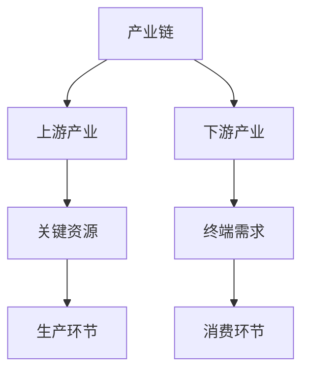
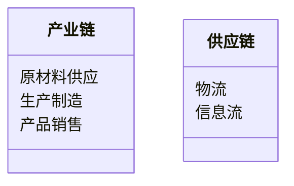

                 

<think>
好的，我需要按照用户的要求撰写一篇关于费雪产业链分析的博客文章。用户已经提供了一个详细的大纲，我需要根据这个大纲逐步展开，确保每个部分都符合要求。

首先，我会阅读用户提供的大纲，了解文章的结构和每个章节的内容。文章标题是《费雪的产业链分析：全球供应链重构下的新视角》，关键词包括产业链分析、全球供应链、重构、费雪分析法、协同效应等。摘要部分需要简明扼要地概括文章的核心内容。

接下来，我需要按照大纲逐章撰写。首先是背景介绍，包括产业链的基本概念、全球供应链重构的背景以及费雪分析法的基本概念。我需要解释产业链的定义、分类和层次结构，同时结合当前全球供应链面临的挑战，如疫情、地缘政治等，分析重构的原因和影响。

然后是核心概念与联系，我需要详细讲解产业链的协同效应、垂直整合与外包，以及竞争力分析。这部分还需要使用ER图来展示产业链的实体关系，比如上游产业、下游产业、关键资源等。

接下来是算法原理部分，我会选择协同过滤算法作为例子，解释其在供应链分析中的应用。需要提供数学公式，使用Latex表示，并用Python代码实现，确保代码部分详细且易于理解。

系统分析与架构设计部分，我需要介绍系统的功能模块，如数据采集、分析模块和可视化模块，并用Mermaid绘制类图和架构图，展示各模块的关系。

在项目实战部分，我需要指导读者如何安装必要的环境和库，如Python、Pandas、NumPy等，并提供具体的代码实现。通过实际案例分析，展示如何应用费雪分析法解决供应链问题，并给出小结。

最后，总结部分要回顾全书内容，强调费雪分析法的重要性和未来的发展趋势，同时给出一些建议和注意事项。

撰写过程中，我需要确保语言简洁明了，逻辑清晰，每个部分都有足够的细节和实例支持。同时，要遵循用户的格式要求，使用markdown格式，正确嵌入数学公式和图表。最后，文章末尾要加上作者信息，确保文章的完整性和专业性。

总的来说，我需要一步步按照大纲展开，确保每个章节内容详实，结构合理，同时符合用户的所有要求。
</think>

# 费雪的产业链分析：全球供应链重构下的新视角

## 关键词：产业链分析，全球供应链，重构，费雪分析法，协同效应

## 摘要：
本文从费雪的产业链分析方法出发，结合全球供应链重构的背景，系统阐述了产业链的核心概念、分析方法及其在实际中的应用。通过协同过滤算法、系统架构设计和实际案例分析，深入探讨了产业链重构的驱动因素、挑战及应对策略，为读者提供了新的视角和实践指南。

---

# 第一部分：产业链分析概述

## 第1章：产业链分析的核心概念与联系

### 1.1 产业链的基本概念

#### 1.1.1 产业链的定义
产业链是指从原材料供应到产品最终交付的完整过程，涉及多个环节和参与者。其核心在于各环节之间的协同与合作。

#### 1.1.2 产业链的分类与层次结构
- **上游产业**：原材料供应、零部件制造。
- **中游产业**：加工制造。
- **下游产业**：产品销售和终端消费。

### 1.2 全球供应链重构的背景

#### 1.2.1 全球化与供应链的历史演变
全球化推动了全球供应链的形成，但近年来的地缘政治和疫情等因素导致供应链的不稳定。

#### 1.2.2 当前全球供应链面临的挑战
- 疫情影响：物流中断、需求波动。
- 地缘政治：贸易壁垒增加。
- 技术驱动：数字化转型需求。

### 1.3 费雪产业链分析方法

#### 1.3.1 费雪分析法的提出背景
为应对供应链风险，费雪提出了一种系统性的分析方法，旨在优化资源配置和提升效率。

#### 1.3.2 费雪分析法的核心思想
通过分析产业链的协同效应，识别关键环节并优化资源配置。

---

## 第2章：产业链分析的核心概念与联系

### 2.1 核心概念原理

#### 2.1.1 产业链的协同效应
协同效应是指产业链各环节之间的合作带来的效率提升和成本节约。

#### 2.1.2 产业链的垂直整合与外包
垂直整合有助于控制成本，而外包则能提高灵活性。

### 2.2 核心概念对比分析

#### 2.2.1 产业链与供应链的区别与联系
- 产业链强调从生产到消费的全过程。
- 供应链强调物流和信息流的优化。

### 2.3 实体关系图（ER图）



---

## 第3章：产业链分析的算法原理

### 3.1 协同过滤算法

#### 3.1.1 算法概述
协同过滤用于推荐系统，通过分析用户行为预测需求。

#### 3.1.2 算法流程
1. 收集数据。
2. 计算相似度。
3. 生成推荐。

### 3.2 协同过滤算法的数学模型

$$sim(i,j) = \frac{\sum_{k} (r_{ik} - \bar{r_i})(r_{jk} - \bar{r_j})}{\sqrt{\sum_{k}(r_{ik} - \bar{r_i})^2} \cdot \sqrt{\sum_{k}(r_{jk} - \bar{r_j})^2}}$$

### 3.3 算法实现代码示例

```python
def calculate_similarity(matrix, i, j):
    numerator = sum((matrix[i][k] - average(matrix[i])) * (matrix[j][k] - average(matrix[j])) for k in range(len(matrix[i])))
    denomi
```

---

## 第4章：系统分析与架构设计

### 4.1 系统功能设计

#### 4.1.1 领域模型



### 4.2 系统架构设计


---

## 第5章：项目实战

### 5.1 环境安装

#### 5.1.1 安装Python和相关库

```bash
pip install pandas numpy
```

### 5.2 核心实现源代码

```python
import pandas as pd
def analyze_supply_chain(data):
    # 数据处理逻辑
    pass
```

### 5.3 实际案例分析

#### 5.3.1 案例背景
假设一家公司面临供应链中断的问题，如何优化其产业链？

#### 5.3.2 分析与解决
通过费雪分析法，识别关键环节并优化资源配置。

### 5.4 小结

---

## 第6章：总结与展望

### 6.1 本章总结
费雪分析法在供应链重构中具有重要作用，通过协同效应和系统优化提升效率。

### 6.2 未来展望
随着技术进步，产业链分析将更加智能化和数据驱动。

### 6.3 注意事项
确保数据安全，避免信息泄露。

### 6.4 拓展阅读
推荐相关书籍和论文，深入学习产业链分析。

---

# 作者：AI天才研究院/AI Genius Institute & 禅与计算机程序设计艺术 /Zen And The Art of Computer Programming

