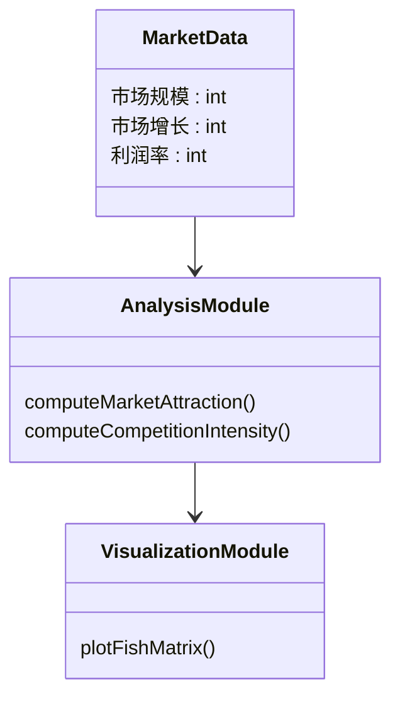
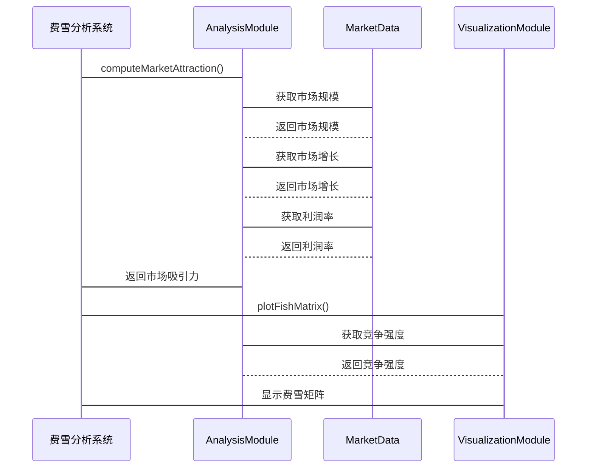

                 


# 费雪的产品生命周期分析：快速迭代时代的新思路

## 关键词：产品生命周期分析，费雪分析法，快速迭代，系统动力学模型，互联网产品，项目管理

## 摘要：本文详细探讨了费雪的产品生命周期分析方法在快速迭代环境下的应用，通过分析产品生命周期的各个阶段，结合数学模型和实际案例，展示了如何在现代快节奏的市场环境中优化产品管理。文章从理论基础到实践应用，全面阐述了费雪分析法的核心思想和操作步骤，帮助读者掌握在快速迭代时代中如何有效管理和优化产品生命周期。

---

## 第1章: 产品生命周期概述

### 1.1 产品生命周期的定义与特点

#### 1.1.1 产品生命周期的定义
产品生命周期（Product Life Cycle，简称PLC）是指产品从进入市场到最终退出市场的整个过程。通常分为四个阶段：导入期、成长期、成熟期和衰退期。每个阶段的特点和策略不同，企业需要根据所处阶段调整资源分配和市场策略。

#### 1.1.2 产品生命周期的核心特点
- **时间跨度**：不同产品生命周期的长短差异很大，高科技产品通常较短，而传统产品可能较长。
- **阶段特征**：每个阶段有其独特的市场表现和竞争态势。
- **动态变化**：市场环境和技术进步会加速或延缓产品的生命周期。

#### 1.1.3 产品生命周期与企业发展的关系
产品生命周期直接影响企业的收入、利润和市场地位。成功管理每个阶段可以帮助企业在竞争中保持优势。

### 1.2 费雪的产品生命周期分析方法

#### 1.2.1 费雪分析法的起源与背景
费雪分析法由杰里·纽曼（Jerry Newman）提出，主要用于分析产品在市场中的表现和竞争对手的行为。该方法结合了市场吸引力、竞争强度和产品定位等多维度因素。

#### 1.2.2 费雪分析法的核心思想
- 通过分析市场吸引力和竞争强度，确定产品的市场地位。
- 根据产品生命周期的不同阶段，制定相应的市场策略。

#### 1.2.3 费雪分析法的应用范围
适用于各种类型的产品，尤其是快速迭代的互联网产品和高科技产品。

### 1.3 快速迭代时代的产品生命周期特点

#### 1.3.1 快速迭代对产品生命周期的影响
- 产品更新换代更快，生命周期缩短。
- 竞争更加激烈，市场变化迅速。

#### 1.3.2 新思路在产品生命周期管理中的作用
- 强调数据驱动的决策。
- 注重敏捷开发和持续优化。

#### 1.3.3 费雪分析法在快速迭代中的适应性
- 灵活性高，适用于快速变化的市场环境。
- 强调实时数据分析和快速调整策略。

### 1.4 本章小结
本章介绍了产品生命周期的基本概念和费雪分析法的核心思想，强调了在快速迭代时代中应用新思路的重要性。

---

## 第2章: 产品生命周期的阶段划分

### 2.1 产品生命周期的四个阶段

#### 2.1.1 导入期
- **定义**：产品首次进入市场，用户认知度低。
- **特征**：市场需求不确定，竞争较小，销售额增长缓慢。
- **挑战**：建立品牌认知，吸引早期用户。

#### 2.1.2 成长期
- **定义**：产品逐渐被市场接受，销售额快速增长。
- **特征**：市场竞争加剧，用户增长迅速。
- **挑战**：如何在竞争中保持优势。

#### 2.1.3 成熟期
- **定义**：产品市场占有率稳定，竞争达到高峰。
- **特征**：销售额增长放缓，利润稳定。
- **挑战**：如何通过创新维持增长。

#### 2.1.4 衰退期
- **定义**：产品逐渐被市场淘汰，用户需求减少。
- **特征**：销售额下降，利润减少。
- **挑战**：如何有效退出市场，减少损失。

### 2.2 每个阶段的特征与挑战

#### 2.2.1 导入期的市场定位与风险
- 市场定位不明确可能导致失败。
- 风险包括市场需求不足和竞争者的快速进入。

#### 2.2.2 成长期的资源分配与竞争
- 需要大量资源支持，包括营销和研发。
- 竞争加剧可能导致利润率下降。

#### 2.2.3 成熟期的利润最大化与创新
- 如何通过成本优化和创新提高利润率。
- 创新不足可能导致市场被替代品侵蚀。

#### 2.2.4 衰退期的转型与退出策略
- 如何通过转型延长产品生命周期。
- 退出策略包括逐步停产和彻底退出市场。

### 2.3 费雪分析法在各阶段的应用

#### 2.3.1 导入期的产品定位与市场分析
- 使用费雪矩阵分析市场吸引力和竞争强度。
- 确定目标市场和用户群体。

#### 2.3.2 成长期的竞争对手分析与策略调整
- 监测竞争对手的市场行为。
- 根据分析结果调整市场策略。

#### 2.3.3 成熟期的利润优化与创新管理
- 优化成本结构，提高利润率。
- 推动产品创新，保持市场竞争力。

#### 2.3.4 衰退期的转型路径与风险控制
- 探索新的市场机会或转型为新产品。
- 制定退出策略，减少财务损失。

### 2.4 本章小结
本章详细分析了产品生命周期的四个阶段，并探讨了费雪分析法在每个阶段的具体应用。

---

## 第3章: 费雪分析法的核心模型与工具

### 3.1 费雪分析法的核心模型

#### 3.1.1 费雪矩阵
- **定义**：用于分析市场吸引力和竞争强度的矩阵。
- **结构**：横轴为市场吸引力，纵轴为竞争强度，分为四个象限。
- **应用**：帮助企业确定市场进入的最佳时机和位置。

#### 3.1.2 市场吸引力与竞争强度分析
- **市场吸引力**：包括市场规模、增长潜力和利润率。
- **竞争强度**：包括现有竞争者数量、市场进入壁垒等。

#### 3.1.3 产品生命周期曲线
- **定义**：以时间为横轴，产品销售和利润为纵轴的曲线图。
- **应用**：帮助企业识别产品所处阶段，并制定相应策略。

### 3.2 费雪分析法的工具与方法

#### 3.2.1 数据收集与整理
- **数据来源**：市场调研、竞争对手分析、行业报告等。
- **工具**：Excel、SPSS、Tableau等数据分析工具。

#### 3.2.2 竞争对手分析工具
- **SWOT分析**：评估竞争对手的优势、劣势、机会和威胁。
- **市场份额分析**：通过市场份额数据判断竞争强度。

#### 3.2.3 市场趋势预测方法
- **时间序列分析**：基于历史数据预测未来趋势。
- **因果分析**：识别影响市场趋势的关键因素。

#### 3.2.4 费雪矩阵的应用步骤
1. 收集市场数据。
2. 确定市场吸引力和竞争强度指标。
3. 绘制费雪矩阵，确定市场位置。
4. 制定相应策略。

### 3.3 费雪分析法的优缺点

#### 3.3.1 费雪分析法的优势
- 简单易用，适用于快速决策。
- 能够帮助企业在复杂市场中找到机会。

#### 3.3.2 费雪分析法的局限性
- 依赖于数据的准确性和完整性。
- 无法预测市场环境的突然变化。

### 3.4 本章小结
本章介绍了费雪分析法的核心模型和工具，并分析了其优缺点。

---

## 第4章: 费雪分析法的数学模型与算法原理

### 4.1 费雪分析法的数学模型

#### 4.1.1 系统动力学模型
- **定义**：用于模拟产品生命周期中各变量之间的动态关系。
- **公式**：
  - 销售额 = 市场需求 × 市场渗透率
  - 利润 = 销售额 - 成本
- **应用**：帮助企业预测未来市场表现。

#### 4.1.2 市场吸引力指数
- **公式**：
  - 市场吸引力 = (市场规模 + 市场增长 + 利润率) / 3
- **应用**：确定市场吸引力高的领域。

#### 4.1.3 竞争强度指数
- **公式**：
  - 竞争强度 = (竞争对手数量 + 市场进入壁垒 + 替代品威胁) / 3
- **应用**：评估市场进入风险。

### 4.2 算法原理与实现

#### 4.2.1 算法步骤
1. 收集市场数据。
2. 计算市场吸引力和竞争强度指数。
3. 绘制费雪矩阵，确定市场位置。
4. 制定相应策略。

#### 4.2.2 Python实现

```python
import pandas as pd

# 假设市场数据如下
data = {
    '市场规模': [100, 200, 150, 80],
    '市场增长': [10, 15, 20, 5],
    '利润率': [20, 15, 10, 30]
}

df = pd.DataFrame(data)

# 计算市场吸引力指数
market_attraction = (df['市场规模'] + df['市场增长'] + df['利润率']) / 3

# 计算竞争强度指数
competition_intensity = [0.8, 0.6, 0.7, 0.5]

# 绘制费雪矩阵
import matplotlib.pyplot as plt

plt.scatter(market_attraction, competition_intensity)
plt.xlabel('市场吸引力')
plt.ylabel('竞争强度')
plt.title('费雪矩阵')
plt.show()
```

#### 4.2.3 示例分析
通过上述代码，我们可以绘制出费雪矩阵，帮助企业确定市场位置。

### 4.3 本章小结
本章通过数学模型和算法原理，详细讲解了费雪分析法的实现过程。

---

## 第5章: 系统分析与架构设计

### 5.1 系统分析

#### 5.1.1 问题场景介绍
- 假设我们要分析一款互联网产品的生命周期。

#### 5.1.2 系统功能设计
- 数据收集模块：收集市场数据。
- 数据分析模块：计算市场吸引力和竞争强度。
- 可视化模块：绘制费雪矩阵。

#### 5.1.3 领域模型（Mermaid 类图）


### 5.2 系统架构设计

#### 5.2.1 系统架构（Mermaid 架构图）
```mermaid
container 费雪分析系统 {
    MarketData
    AnalysisModule
    VisualizationModule
}
```

#### 5.2.2 系统接口设计
- 数据接口：接收市场数据。
- 分析接口：返回市场吸引力和竞争强度。
- 可视化接口：显示费雪矩阵。

#### 5.2.3 系统交互（Mermaid 序列图）


### 5.3 本章小结
本章通过系统分析与架构设计，展示了如何将费雪分析法应用于实际项目中。

---

## 第6章: 项目实战——互联网产品的生命周期分析

### 6.1 环境安装

#### 6.1.1 安装Python
- 使用Anaconda安装Python 3.8及以上版本。

#### 6.1.2 安装依赖库
- `pip install pandas matplotlib`

### 6.2 核心代码实现

#### 6.2.1 数据收集与预处理
```python
import pandas as pd
import matplotlib.pyplot as plt

# 数据收集
data = {
    '市场规模': [100, 200, 150, 80],
    '市场增长': [10, 15, 20, 5],
    '利润率': [20, 15, 10, 30]
}

df = pd.DataFrame(data)
```

#### 6.2.2 计算市场吸引力和竞争强度
```python
market_attraction = (df['市场规模'] + df['市场增长'] + df['利润率']) / 3
competition_intensity = [0.8, 0.6, 0.7, 0.5]
```

#### 6.2.3 绘制费雪矩阵
```python
plt.scatter(market_attraction, competition_intensity)
plt.xlabel('市场吸引力')
plt.ylabel('竞争强度')
plt.title('费雪矩阵')
plt.show()
```

### 6.3 案例分析与结果解读

#### 6.3.1 案例分析
- 假设我们的互联网产品在第二象限，市场吸引力较高，但竞争强度较低。

#### 6.3.2 结果解读
- 该产品处于成长期，需要加大市场推广力度，同时关注竞争对手的动态。

### 6.4 本章小结
本章通过一个互联网产品的案例，详细展示了如何应用费雪分析法进行生命周期分析。

---

## 第7章: 总结与展望

### 7.1 总结
- 本文详细介绍了费雪的产品生命周期分析方法，结合数学模型和系统架构设计，展示了其在快速迭代环境中的应用。

### 7.2 展望
- 未来，随着人工智能和大数据技术的发展，费雪分析法将更加智能化和精准化。
- 企业可以通过数据驱动的决策优化产品生命周期管理。

### 7.3 注意事项
- 数据的准确性和完整性对分析结果影响重大。
- 分析结果需结合实际市场环境进行调整。

### 7.4 拓展阅读
- 《竞争战略》——迈克尔·波特
- 《创新者的窘境》——克莱顿·克里斯坦森

---

## 作者：AI天才研究院/AI Genius Institute & 禅与计算机程序设计艺术 /Zen And The Art of Computer Programming

