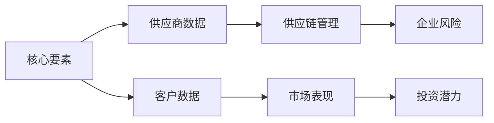
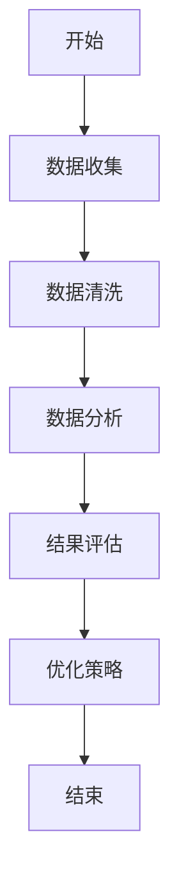
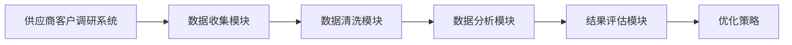

                 


# 费雪的供应商客户调研：360度了解公司

> 关键词：供应商客户调研、费雪投资理念、企业价值评估、供应链管理、客户反馈分析、投资策略优化

> 摘要：本文深入探讨了费雪的投资理念及其在供应商客户调研中的应用，通过详细分析供应商和客户的反馈，帮助企业全面了解自身状况，优化供应链管理，并提升企业价值。文章结合技术原理和实际案例，为企业提供了一套系统化的调研方法，帮助投资者做出更明智的决策。

---

# 第一部分: 费雪的供应商客户调研概述

## 第1章: 供应商客户调研的核心概念

### 1.1 供应商客户调研的背景与意义

#### 1.1.1 供应商与客户调研的背景
在现代商业环境中，供应商和客户是企业供应链和市场扩展的核心。供应商提供了企业运营所需的产品或服务，而客户则是企业收入的主要来源。通过调研供应商和客户，企业可以深入了解自身的供应链稳定性、市场表现及客户满意度，从而优化运营策略。

#### 1.1.2 费雪投资理念与供应商客户调研的关系
费雪的投资理念强调长期价值创造和企业基本面分析。他认为，企业的核心竞争力在于其产品、市场和管理团队。供应商客户调研作为基本面分析的重要组成部分，能够揭示企业的供应链健康状况和市场反馈，帮助投资者评估企业的长期发展潜力。

#### 1.1.3 供应商客户调研对企业价值的提升作用
通过调研供应商，企业可以识别供应链中的潜在风险，如供应商的可靠性、交货时间及成本变化。同时，了解客户反馈有助于企业发现市场需求的变化，优化产品和服务，提升客户满意度和忠诚度，从而增强企业的市场竞争力和品牌价值。

### 1.2 供应商客户调研的核心概念

#### 1.2.1 费雪投资策略的简介
费雪的投资策略强调选择那些具有持续增长潜力的企业，重点关注企业的收入增长率、利润率和市场地位。他认为，投资那些能够持续创造价值的企业，能够带来长期稳定的回报。

#### 1.2.2 供应商客户调研的定义与特点
供应商客户调研是指通过收集和分析供应商和客户的反馈数据，评估企业的供应链管理和市场表现。其特点是数据来源广泛、分析维度多样，并能够提供企业内部和外部的多维度信息。

#### 1.2.3 调研的边界与外延
供应商客户调研的边界在于专注于供应链和客户需求，而不涉及企业的内部管理和财务数据。其外延则扩展到企业战略、市场趋势和竞争对手分析，为企业提供更全面的市场洞察。

### 1.3 核心要素与概念结构

#### 1.3.1 费雪调研的核心要素分析
费雪调研的核心要素包括企业的收入增长、利润率、市场地位和管理团队。这些要素通过供应商和客户的反馈数据得以体现，帮助投资者全面评估企业的基本面。

#### 1.3.2 调研的逻辑框架与模型
供应商客户调研的逻辑框架包括数据收集、分析和评估三个阶段。数据收集涵盖供应商的交货周期、质量反馈和客户满意度等指标，分析阶段则通过统计方法和数据可视化工具进行深度分析，评估阶段则根据分析结果制定优化策略。

#### 1.3.3 概念结构图与核心要素组成


## 第2章: 费雪投资理念与供应商客户调研的联系

### 2.1 费雪投资理念的核心原理

#### 2.1.1 费雪投资策略概述
费雪的投资策略强调长期价值投资，关注企业的收入增长率和利润率。他认为，投资那些能够持续增长的企业，能够在长期获得超额回报。

#### 2.1.2 费雪调研方法的核心原理
费雪的调研方法注重分析企业的市场地位和管理团队。通过供应商和客户的反馈，评估企业的供应链稳定性和客户满意度，从而判断企业的长期发展潜力。

#### 2.1.3 费雪理念与供应商客户调研的结合
将费雪的投资理念与供应商客户调研相结合，能够帮助企业全面评估自身的市场地位和供应链管理。通过供应商的数据，了解企业的生产成本和供应稳定性；通过客户的反馈，掌握市场对产品或服务的满意度，从而优化企业运营策略。

### 2.2 供应商与客户调研的联系

#### 2.2.1 供应商调研的关键维度
供应商调研的关键维度包括交货周期、产品质量、价格竞争力和供应商可靠性。这些指标能够反映企业的供应链效率和成本控制能力。

#### 2.2.2 客户调研的关键维度
客户调研的关键维度包括客户满意度、客户忠诚度和客户反馈。这些指标能够反映企业的市场表现和客户对产品或服务的接受程度。

#### 2.2.3 供应商与客户调研的协同效应
供应商和客户的调研能够相互补充，帮助企业全面评估自身的供应链和市场表现。供应商的调研能够揭示生产成本和供应风险，而客户的调研则能够揭示市场需求和客户满意度。通过两者结合，企业能够制定更全面的优化策略。

## 第3章: 供应商客户调研的核心概念与联系

### 3.1 核心概念的原理分析

#### 3.1.1 费雪调研的核心原理
费雪调研的核心原理在于通过分析企业的市场地位和管理团队，评估其长期发展潜力。供应商和客户的调研能够提供企业供应链和市场表现的关键数据，帮助投资者全面评估企业的基本面。

#### 3.1.2 供应商客户调研的逻辑模型
供应商客户调研的逻辑模型包括数据收集、分析和评估三个阶段。数据收集涵盖供应商和客户反馈的多维度指标，分析阶段通过统计方法和数据可视化工具进行深度分析，评估阶段则根据分析结果制定优化策略。

#### 3.1.3 调研方法的数学模型
供应商客户调研的数学模型可以通过加权评分法来评估企业的综合表现。例如，可以通过以下公式计算企业的综合评分：

$$
\text{综合评分} = \sum (\text{指标权重} \times \text{指标评分})
$$

其中，指标权重是根据调研的重要性和影响程度确定的，指标评分是根据供应商和客户的反馈数据进行评分的结果。

### 3.2 核心概念的属性特征对比

#### 3.2.1 供应商调研的属性特征
| 指标 | 描述 |
|------|------|
| 交货周期 | 供应商交付产品的平均时间 |
| 产品质量 | 供应商提供的产品的质量水平 |
| 价格竞争力 | 供应商产品的价格相对于市场平均水平的竞争力 |
| 供应商可靠性 | 供应商在交付产品和服务上的可靠性 |

#### 3.2.2 客户调研的属性特征
| 指标 | 描述 |
|------|------|
| 客户满意度 | 客户对产品或服务的满意程度 |
| 客户忠诚度 | 客户对企业产品或服务的忠诚度 |
| 客户反馈 | 客户对产品或服务的具体反馈意见 |
| 市场反馈 | 市场对产品或服务的整体反馈 |

#### 3.2.3 对比分析与总结
供应商调研和客户调研各有侧重，供应商调研关注企业的供应链效率和成本控制，客户调研关注企业的市场表现和客户满意度。两者的结合能够帮助企业全面评估自身的供应链和市场表现，从而制定更有效的优化策略。

### 3.3 ER实体关系图架构

```mermaid
er
 供应商
   + 供应商ID
   + 公司名称
   + 联系方式
   + 产品/服务类型
 客户
   + 客户ID
   + 客户名称
   + 联系方式
   + 行业领域
 供应商-客户关系
   + 供应商ID
   + 客户ID
   + 关系类型
   + 关系强度
```

---

# 第二部分: 费雪供应商客户调研的算法原理

## 第4章: 费雪供应商客户调研的算法原理

### 4.1 算法原理概述

#### 4.1.1 费雪调研方法的算法流程
供应商客户调研的算法流程包括数据收集、数据清洗、数据分析和结果评估四个阶段。数据收集涵盖供应商和客户的反馈数据，数据清洗通过去除异常值和填补缺失值，数据分析通过统计方法和数据可视化工具进行深度分析，结果评估则根据分析结果制定优化策略。

#### 4.1.2 数据收集与处理的算法步骤
数据收集与处理的算法步骤如下：
1. 确定调研目标和范围。
2. 设计调研问卷，收集供应商和客户的反馈数据。
3. 对数据进行清洗，去除异常值和填补缺失值。
4. 对数据进行标准化处理，确保数据的一致性。
5. 使用数据分析工具进行数据可视化和统计分析。

#### 4.1.3 调研结果的评估与优化
调研结果的评估与优化包括以下几个步骤：
1. 根据分析结果，评估企业的供应链效率和市场表现。
2. 根据评估结果，制定优化策略，如优化供应链管理或提升客户满意度。
3. 实施优化策略，并通过后续调研评估优化效果。

### 4.2 算法流程图



### 4.3 数据分析与评估

#### 4.3.1 数据分析的数学模型
数据分析的数学模型可以通过加权评分法来评估企业的综合表现。例如，可以通过以下公式计算企业的综合评分：

$$
\text{综合评分} = \sum (\text{指标权重} \times \text{指标评分})
$$

其中，指标权重是根据调研的重要性和影响程度确定的，指标评分是根据供应商和客户的反馈数据进行评分的结果。

#### 4.3.2 数据分析的Python实现
以下是数据分析的Python代码示例：

```python
import pandas as pd
import numpy as np
import matplotlib.pyplot as plt

# 数据收集
data = {
    '供应商ID': [1, 2, 3, 4, 5],
    '供应商名称': ['A', 'B', 'C', 'D', 'E'],
    '客户ID': [101, 102, 103, 104, 105],
    '客户名称': ['X', 'Y', 'Z', 'W', 'V'],
    '交货周期': [5, 7, 3, 6, 4],
    '产品质量': [9, 8, 7, 6, 5],
    '客户满意度': [85, 90, 75, 88, 95]
}

df = pd.DataFrame(data)

# 数据清洗
# 假设需要填补缺失值
df.fillna(df.mean(), inplace=True)

# 数据分析
# 计算供应商和客户的综合评分
weights = {'交货周期': 0.3, '产品质量': 0.3, '客户满意度': 0.4}
scores = df[['交货周期', '产品质量', '客户满意度']].apply(lambda x: sum([w * x[i] for i, w in enumerate(weights.values())]), axis=1)
df['综合评分'] = scores

# 绘制评分分布图
plt.hist(scores, bins=5, alpha=0.5)
plt.xlabel('综合评分')
plt.ylabel('频数')
plt.title('供应商客户调研综合评分分布')
plt.show()
```

### 4.4 系统分析与架构设计

#### 4.4.1 系统功能设计
系统功能设计包括以下几个模块：
1. 数据收集模块：负责收集供应商和客户的反馈数据。
2. 数据清洗模块：负责对数据进行清洗和预处理。
3. 数据分析模块：负责对数据进行分析和可视化。
4. 结果评估模块：负责根据分析结果制定优化策略。

#### 4.4.2 系统架构设计



### 4.5 项目实战

#### 4.5.1 项目背景与目标
项目背景：某企业希望通过供应商客户调研，优化其供应链管理和市场表现。
项目目标：通过供应商和客户的反馈数据，评估企业的综合表现，并制定优化策略。

#### 4.5.2 数据收集与处理
数据收集：通过问卷调查收集供应商和客户的反馈数据。
数据处理：使用Python进行数据清洗和预处理。

#### 4.5.3 数据分析与评估
数据分析：使用Python进行数据分析和可视化。
评估结果：根据分析结果，评估企业的供应链效率和客户满意度。

#### 4.5.4 优化策略
优化策略：根据评估结果，优化供应链管理和提升客户满意度。

### 4.6 总结与展望

#### 4.6.1 总结
通过供应商客户调研，企业可以全面评估自身的供应链效率和市场表现，从而制定更有效的优化策略。费雪的投资理念与供应商客户调研的结合，能够帮助企业发现潜在的风险和机会，提升企业的长期发展潜力。

#### 4.6.2 展望
未来，随着大数据和人工智能技术的发展，供应商客户调研将更加智能化和自动化。企业可以通过先进的数据分析工具和技术，进一步提升调研的效率和准确性，为企业决策提供更有力的支持。

---

# 第三部分: 费雪供应商客户调研的系统架构与项目实战

## 第5章: 系统分析与架构设计方案

### 5.1 系统功能设计

#### 5.1.1 功能模块设计
功能模块设计包括以下几个模块：
1. 数据收集模块：负责收集供应商和客户的反馈数据。
2. 数据清洗模块：负责对数据进行清洗和预处理。
3. 数据分析模块：负责对数据进行分析和可视化。
4. 结果评估模块：负责根据分析结果制定优化策略。

#### 5.1.2 系统功能流程
系统功能流程包括数据收集、数据清洗、数据分析和结果评估四个阶段。

#### 5.1.3 系统功能的实现方式
系统功能的实现方式包括使用Python进行数据处理和分析，使用数据库进行数据存储和管理。

### 5.2 系统架构设计

#### 5.2.1 系统架构图


#### 5.2.2 系统架构的实现方式
系统架构的实现方式包括使用Python进行数据分析，使用数据库进行数据存储和管理。

### 5.3 系统接口设计

#### 5.3.1 数据接口设计
数据接口设计包括数据输入接口和数据输出接口。

#### 5.3.2 接口实现方式
接口实现方式包括使用API进行数据传输和处理。

### 5.4 系统交互设计

#### 5.4.1 交互流程设计
交互流程设计包括用户输入数据、系统处理数据和用户查看结果。

#### 5.4.2 交互流程的实现方式
交互流程的实现方式包括使用Python进行数据处理和分析，使用可视化工具进行结果展示。

## 第6章: 项目实战

### 6.1 项目背景与目标

#### 6.1.1 项目背景
项目背景：某企业希望通过供应商客户调研，优化其供应链管理和市场表现。
项目目标：通过供应商和客户的反馈数据，评估企业的综合表现，并制定优化策略。

### 6.2 项目环境与工具

#### 6.2.1 环境配置
环境配置包括安装Python、Pandas、NumPy和Matplotlib。

#### 6.2.2 工具选择
工具选择包括使用Python进行数据分析，使用数据库进行数据存储和管理。

### 6.3 项目核心实现

#### 6.3.1 数据收集与处理
数据收集：通过问卷调查收集供应商和客户的反馈数据。
数据处理：使用Python进行数据清洗和预处理。

#### 6.3.2 数据分析与可视化
数据分析：使用Python进行数据分析和可视化。
数据可视化：使用Matplotlib绘制图表，展示数据分布和趋势。

### 6.4 项目小结

#### 6.4.1 项目成果
项目成果包括企业的综合评分和优化策略。

#### 6.4.2 经验总结
经验总结包括数据处理和分析的关键步骤，以及优化策略的制定和实施。

---

# 第四部分: 总结与展望

## 第7章: 总结与展望

### 7.1 最佳实践

#### 7.1.1 调研方法
调研方法包括数据收集、数据清洗、数据分析和结果评估。

#### 7.1.2 系统设计
系统设计包括功能模块设计、系统架构设计和接口设计。

### 7.2 小结

#### 7.2.1 核心内容回顾
核心内容回顾包括供应商客户调研的背景、核心概念和算法原理。

#### 7.2.2 费雪投资理念的应用
费雪投资理念的应用包括通过供应商和客户的调研，评估企业的市场地位和长期发展潜力。

### 7.3 注意事项

#### 7.3.1 数据处理
数据处理需要注意数据的准确性和完整性。

#### 7.3.2 系统设计
系统设计需要注意模块的合理性和可扩展性。

### 7.4 拓展阅读

#### 7.4.1 相关书籍
推荐阅读《股票作手回忆录》和《投资之道》。

#### 7.4.2 相关文章
推荐阅读关于供应链管理和客户满意度的深入分析文章。

---

# 作者信息

作者：AI天才研究院/AI Genius Institute & 禅与计算机程序设计艺术 /Zen And The Art of Computer Programming

---

通过以上目录结构，我们可以看到，供应商客户调研在帮助企业全面了解自身供应链和市场表现方面具有重要的作用。结合费雪的投资理念，企业可以更好地评估自身的长期发展潜力，制定更有效的优化策略。希望本文能够为读者提供有价值的信息和方法，帮助他们在实际工作中取得更好的效果。

