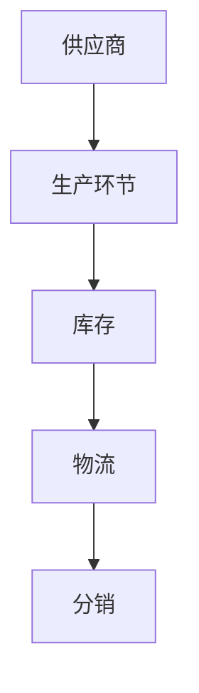
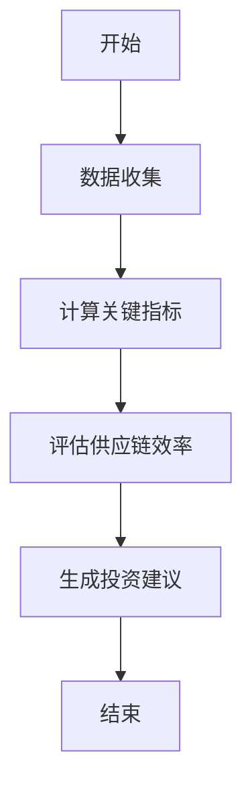

                 


# 费雪的供应链分析在投资中的应用

---

## 关键词：
- 供应链分析
- 投资评估
- 费雪分析方法
- 供应链优化
- 供应链风险管理

---

## 摘要：
费雪的供应链分析是一种基于供应链管理的投资分析方法，通过评估企业供应链的效率、稳定性和成本，识别投资机会和风险。本文从供应链分析的基本概念、理论基础、数学模型、系统架构设计到实际项目实战，全面解析费雪分析方法在投资中的应用，帮助投资者通过供应链视角优化投资决策。

---

## 正文：

---

### 第1章：供应链分析的背景与核心概念

#### 1.1 背景介绍
供应链分析是通过对企业的供应链各环节（供应商、生产、物流、分销）的评估，识别其在市场中的竞争力和潜在风险。费雪分析方法强调从供应链角度评估企业的运营效率和成本控制能力，从而为投资决策提供依据。

#### 1.2 核心概念与联系
供应链分析的核心要素包括供应商稳定性、生产效率、库存周转率和物流成本。以下是关键概念的对比表格和实体关系图：

#### 1.2.1 核心概念对比

| **要素**     | **属性**                | **重要性**       |
|--------------|-------------------------|------------------|
| 供应商        | 供应稳定性、成本       | 高               |
| 生产环节      | 生产效率、成本         | 高               |
| 库存          | 库存周转率、存储成本     | 中               |
| 物流          | 运输成本、交货时间       | 中               |

#### 1.2.2 实体关系图


---

### 第2章：费雪分析方法的算法原理

#### 2.1 算法原理
费雪分析方法通过量化供应链各环节的效率和成本，评估企业的运营能力。以下是核心步骤：

#### 2.1.1 算法流程图


#### 2.1.2 关键指标公式
供应链效率计算公式：
$$
\text{供应链效率} = \frac{\text{总成本}}{\text{供应链总价值}}
$$

总成本计算公式：
$$
\text{总成本} = \text{采购成本} + \text{生产成本} + \text{物流成本}
$$

#### 2.1.3 通俗解释
通过计算供应链各环节的成本和效率，投资者可以识别企业是否存在成本浪费或效率瓶颈，从而评估其投资价值。

---

### 第3章：供应链分析的系统架构设计

#### 3.1 系统功能设计
系统功能模块包括：
1. 数据采集模块
2. 指标计算模块
3. 风险评估模块
4. 投资建议模块

#### 3.2 系统架构图


#### 3.3 系统接口设计
- 数据输入接口：接收企业供应链数据
- 数据处理接口：计算关键指标
- 结果输出接口：生成投资建议报告

---

### 第4章：项目实战

#### 4.1 实战背景
以一家科技制造企业为例，分析其供应链效率。

#### 4.2 数据收集与处理
数据来源包括企业的财务报表和供应链管理报告。

#### 4.3 核心实现代码
```python
import pandas as pd

def calculate_supply_chain_efficiency(data):
    # 计算总成本
    total_cost = data['采购成本'] + data['生产成本'] + data['物流成本']
    # 计算供应链总价值
    supply_chain_value = data['收入'] * 0.7  # 假设70%收入来自供应链
    # 计算供应链效率
    efficiency = total_cost / supply_chain_value
    return efficiency

# 示例数据
data = {
    '采购成本': 100,
    '生产成本': 150,
    '物流成本': 50,
    '收入': 500
}

efficiency = calculate_supply_chain_efficiency(data)
print(f"供应链效率为：{efficiency}")
```

#### 4.4 分析结果解读
通过计算，供应链效率为0.4，表明企业供应链成本较高，存在优化空间。

---

### 第5章：数学模型与公式

#### 5.1 数学模型
供应链效率优化模型：
$$
\text{目标} = \min \left( \frac{\text{总成本}}{\text{供应链总价值}} \right)
$$

约束条件：
$$
\begin{cases}
\text{总成本} \leq C_{\text{max}} \\
\text{供应链总价值} \geq V_{\text{min}}
\end{cases}
$$

---

### 第6章：最佳实践与小结

#### 6.1 最佳实践
1. 定期更新数据，保持分析的准确性。
2. 结合行业特点，调整分析模型。
3. 多维度分析，避免单一指标误导。

#### 6.2 小结
费雪分析方法通过量化供应链各环节的效率和成本，为投资者提供了评估企业投资价值的重要工具。通过系统架构设计和项目实战，投资者可以更好地应用这种方法，优化投资决策。

---

## 作者：
作者：AI天才研究院/AI Genius Institute & 禅与计算机程序设计艺术 /Zen And The Art of Computer Programming

