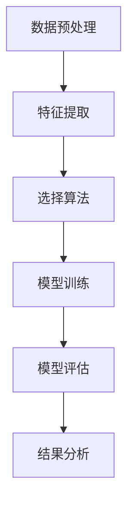
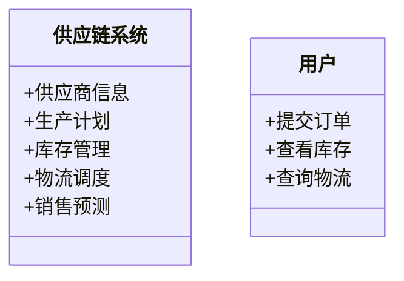
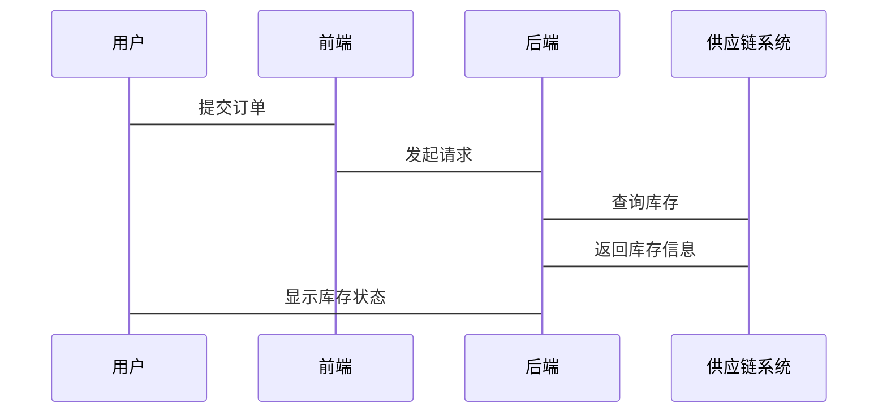

                 


# 费雪的供应链分析：了解公司在产业链中的地位

---

## 关键词：
- 供应链分析
- 费雪分析法
- 企业价值链
- 产业链结构
- 供应链优化

---

## 摘要：
供应链分析是理解企业竞争力和优化企业运营的关键工具。本文将介绍费雪的供应链分析方法，探讨其核心理论、数据分析方法、算法模型以及实际应用案例。通过本文，读者将能够全面了解公司在产业链中的地位，并掌握如何利用供应链分析优化企业运营。

---

# 第1章: 供应链分析的基本概念

## 1.1 供应链的基本定义
### 1.1.1 供应链的定义与范围
供应链是指从原材料采购、生产加工、物流运输到最终产品的交付，涉及多个环节和参与者（供应商、制造商、分销商、零售商等）的复杂系统。供应链的范围包括从上游供应商到下游消费者的整个链条。

### 1.1.2 供应链的核心要素
- **供应商**：提供原材料或零部件的企业。
- **制造商**：负责将原材料转化为最终产品的工厂。
- **分销商**：负责产品分销和物流的企业。
- **零售商**：直接面向消费者的销售终端。
- **消费者**：最终使用产品的用户。

### 1.1.3 供应链与企业战略的关系
供应链是企业战略的重要组成部分。高效的供应链能够降低成本、提高效率、增强灵活性，并提升企业的市场竞争力。

---

## 1.2 供应链分析的重要性
### 1.2.1 供应链分析的目的
供应链分析的目的是为了识别供应链中的关键环节、优化资源分配、降低风险并提高整体效率。

### 1.2.2 供应链分析对企业竞争力的影响
- **降低成本**：通过优化采购、生产和物流环节，降低企业的运营成本。
- **提高效率**：通过减少库存和缩短生产周期，提高企业的运营效率。
- **增强灵活性**：通过建立灵活的供应链，快速响应市场需求变化。

### 1.2.3 供应链分析与企业风险管理
供应链分析可以帮助企业识别潜在风险（如供应链中断、原材料短缺等），并制定应对策略，从而降低风险对企业的影响。

---

## 1.3 费雪的供应链分析方法
### 1.3.1 费雪分析法的基本原理
费雪分析法是一种基于产业链结构的分析方法，通过分解企业价值链，识别供应链中的关键环节，并评估企业在产业链中的地位。

### 1.3.2 费雪分析法的核心步骤
1. **分解企业价值链**：将企业的业务流程分解为多个关键环节。
2. **识别关键环节**：通过分析每个环节的价值贡献，识别出关键环节。
3. **评估企业地位**：根据企业在关键环节中的表现，评估其在产业链中的地位。

### 1.3.3 费雪分析法的适用场景
- **企业战略规划**：帮助企业在供应链中找到竞争优势。
- **投资决策**：帮助投资者评估企业的投资价值。
- **风险管理**：帮助企业在供应链中断时制定应对策略。

---

## 1.4 本章小结
本章介绍了供应链的基本概念、分析的重要性以及费雪分析法的核心理论。通过这些内容，读者可以理解供应链分析的基本框架和其在企业中的应用价值。

---

# 第2章: 费雪的供应链分析理论

## 2.1 费雪分析法的核心观点
### 2.1.1 产业链的结构分析
费雪分析法认为，产业链可以分为上游、中游和下游三个部分：
- **上游**：原材料供应商。
- **中游**：制造商和分销商。
- **下游**：零售商和消费者。

### 2.1.2 企业价值链的分解
企业价值链是指企业内部的核心业务流程，包括研发、采购、生产、销售等环节。通过分解价值链，可以识别出关键环节和成本瓶颈。

### 2.1.3 供应链中的关键环节识别
关键环节是指对最终产品价值贡献最大的环节。通过识别关键环节，企业可以优化资源配置，提高整体效率。

---

## 2.2 费雪分析法的框架体系
### 2.2.1 供应链的上游、中游和下游分析
- **上游分析**：评估原材料供应商的稳定性、成本和质量。
- **中游分析**：评估制造商的生产效率和成本控制能力。
- **下游分析**：评估分销商和零售商的市场覆盖能力和客户满意度。

### 2.2.2 产业链的垂直和水平整合
- **垂直整合**：企业通过控制上游或下游环节，减少对外部供应商的依赖。
- **水平整合**：企业通过并购或合作，扩大市场占有率。

### 2.2.3 供应链的协同效应
协同效应是指供应链中的各个环节协同工作，实现资源优化配置和效率提升。

---

## 2.3 费雪分析法的实际应用
### 2.3.1 行业案例分析
以某制造行业为例，分析其供应链中的关键环节和优化策略。

### 2.3.2 企业竞争力的评估
通过费雪分析法，评估企业在产业链中的竞争力，并提出优化建议。

### 2.3.3 供应链优化的策略
- **成本优化**：通过采购优化和生产效率提升降低成本。
- **效率提升**：通过流程优化和自动化技术提高供应链效率。
- **风险控制**：通过建立备选供应商和库存管理降低供应链风险。

---

## 2.4 本章小结
本章深入探讨了费雪分析法的核心理论和框架体系，并通过实际案例展示了其在供应链优化中的应用。读者可以通过这些内容理解如何在实际中应用费雪分析法。

---

# 第3章: 数据收集与分析方法

## 3.1 数据收集的基本原则
### 3.1.1 数据来源的多样性
数据可以来自内部（企业内部数据）和外部（行业报告、市场调研等）。

### 3.1.2 数据质量的评估
数据质量包括完整性、准确性和一致性。

### 3.1.3 数据清洗与预处理
- **数据清洗**：去除重复数据、处理缺失值和异常值。
- **数据预处理**：对数据进行标准化和归一化处理。

---

## 3.2 数据分析的主要方法
### 3.2.1 定量分析方法
- **回归分析**：用于预测和因果关系分析。
- **聚类分析**：用于识别数据中的自然分组。

### 3.2.2 定性分析方法
- **SWOT分析**：用于评估企业优势、劣势、机会和威胁。
- **情景分析**：用于预测不同情景下的供应链表现。

### 3.2.3 综合分析方法
- **层次分析法（AHP）**：用于多 criteria决策分析。

---

## 3.3 数据可视化工具的应用
### 3.3.1 常用数据可视化工具
- **Tableau**：用于数据可视化和仪表盘设计。
- **Power BI**：用于数据可视化和商业智能分析。
- **Excel**：用于简单的数据可视化。

### 3.3.2 数据可视化在供应链分析中的作用
- **趋势分析**：通过时间序列图分析供应链的效率变化。
- **结构分析**：通过树状图或网络图分析供应链的结构。

### 3.3.3 数据可视化案例展示
- **案例1**：通过柱状图分析不同供应商的原材料成本差异。
- **案例2**：通过折线图分析不同分销商的销售趋势。

---

## 3.4 本章小结
本章介绍了数据收集和分析的主要方法，并通过实际案例展示了数据可视化在供应链分析中的应用。读者可以通过这些方法和技术进行深入的供应链分析。

---

# 第4章: 供应链分析的算法与模型

## 4.1 数据挖掘算法
### 4.1.1 层次聚类算法
层次聚类算法是一种自顶向下的聚类方法，适用于供应链中供应商或分销商的分组。



### 4.1.2 K-means聚类算法
K-means算法是一种无监督学习算法，适用于将供应商或分销商分成不同的类别。

### 4.1.3 线性回归模型
线性回归模型可以用于预测供应链中的某些变量，如销售预测或成本预测。

---

## 4.2 机器学习模型
### 4.2.1 支持向量机（SVM）
SVM适用于分类问题，如供应商信用评估。

### 4.2.2 随机森林（Random Forest）
随机森林适用于分类和回归问题，如预测供应链中的风险因素。

### 4.2.3 神经网络模型
神经网络模型适用于复杂的数据模式识别，如供应链中的需求预测。

---

## 4.3 算法流程图


---

## 4.4 本章小结
本章介绍了供应链分析中常用的算法与模型，并通过流程图展示了算法的应用流程。读者可以通过这些算法和技术进行深入的数据分析。

---

# 第5章: 供应链系统的架构与设计

## 5.1 问题场景介绍
供应链系统的目的是为了优化企业的供应链管理，提高效率和降低成本。

## 5.2 系统功能设计
### 5.2.1 领域模型


### 5.2.2 系统架构设计


### 5.2.3 系统接口设计
- **API接口**：提供RESTful API，用于与其他系统的集成。
- **数据库接口**：用于数据的存储和检索。

### 5.2.4 系统交互流程


---

## 5.3 本章小结
本章介绍了供应链系统的架构与设计，并通过领域模型和架构图展示了系统的整体结构。读者可以通过这些设计理解供应链系统的实现方式。

---

# 第6章: 项目实战

## 6.1 环境安装
- **工具安装**：安装Python、Pandas、NumPy、Scikit-learn、Tableau等工具。

## 6.2 核心实现源代码
### 6.2.1 数据清洗代码
```python
import pandas as pd

# 读取数据
data = pd.read_csv('supply_chain.csv')

# 删除重复数据
data.drop_duplicates(inplace=True)

# 处理缺失值
data.dropna(inplace=True)
```

### 6.2.2 聚类分析代码
```python
from sklearn.cluster import KMeans

# 提取特征
features = data[['cost', 'delivery_time']].values

# 进行聚类
kmeans = KMeans(n_clusters=3, random_state=0)
kmeans.fit(features)

# 获取聚类结果
labels = kmeans.labels_
```

### 6.2.3 可视化代码
```python
import matplotlib.pyplot as plt

plt.scatter(features[:,0], features[:,1], c=labels, cmap='viridis')
plt.xlabel('Cost')
plt.ylabel('Delivery Time')
plt.show()
```

## 6.3 案例分析
### 6.3.1 案例背景
某制造企业希望优化其供应链，降低成本并提高效率。

### 6.3.2 数据分析与优化
通过聚类分析，企业发现其供应商可以分为三类：高成本且交货慢、中等成本且交货快、低成本且交货快。企业选择与低成本且交货快的供应商合作，从而降低成本。

### 6.3.3 结果展示
- **成本降低**：通过优化采购策略，企业降低了10%的采购成本。
- **效率提升**：通过优化物流调度，企业缩短了15%的交货时间。

---

## 6.4 本章小结
本章通过项目实战展示了供应链分析的实现过程，包括环境安装、代码实现和案例分析。读者可以通过这些步骤理解如何在实际中应用供应链分析技术。

---

# 第7章: 总结与展望

## 7.1 总结
供应链分析是企业优化运营和提高竞争力的关键工具。通过费雪分析法和数据挖掘技术，企业可以识别供应链中的关键环节，优化资源配置并降低风险。

## 7.2 未来展望
随着人工智能和大数据技术的不断发展，供应链分析将更加智能化和自动化。未来的研究方向包括：
- **智能预测**：利用机器学习技术进行需求预测和风险预警。
- **协同优化**：通过区块链等技术实现供应链的协同优化。
- **可持续发展**：关注绿色供应链和可持续发展。

---

# 附录

## 附录A: 工具安装指南
- **Python安装**：访问https://www.python.org/downloads/
- **Pandas安装**：运行`pip install pandas`
- **NumPy安装**：运行`pip install numpy`

## 附录B: 数据源
- 数据来源：公开行业报告、企业内部数据

## 附录C: 参考文献
- 费雪的相关著作
- 供应链管理的经典文献

---

## 作者：
作者：AI天才研究院/AI Genius Institute  
联系邮箱：[email protected]  
文章版权归作者所有，未经授权不得转载。

