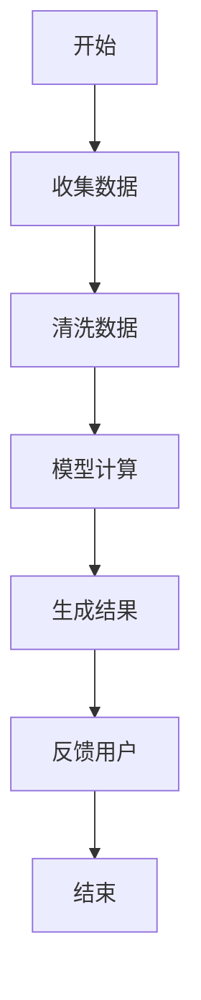
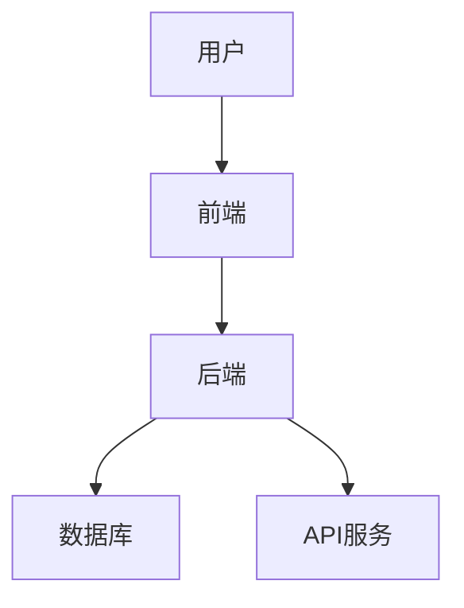
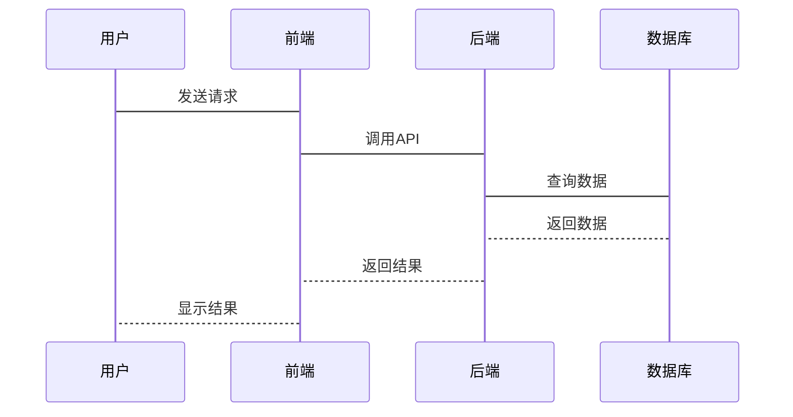

                 

<think>
嗯，用户让我写一篇关于费雪的全球化战略评估的博客文章，标题是《费雪的全球化战略评估：贸易摩擦背景下的新思考》。我需要按照用户提供的目录结构来写，每个章节都要详细展开。

首先，我得理解什么是费雪的全球化战略评估。可能是指费雪公司或费雪模型在贸易摩擦下的策略分析。贸易摩擦包括关税、非关税壁垒等，这些都影响企业的全球化布局。

接下来，背景介绍是必须的。贸易摩擦现在很常见，企业如何应对是关键。费雪的全球化战略可能提供了一些评估框架，帮助企业制定应对措施。

然后，核心概念部分需要解释清楚。可能包括费雪模型的基本原理，与其他模型的对比，还有实体关系图。这部分需要用Mermaid画图，展示模型的结构。

算法原理部分，我得详细解释评估模型的步骤。用流程图展示，再配上Python代码示例。比如，如何用线性回归预测贸易摩擦的影响，或者用决策树分析不同策略的效果。

系统分析和架构设计部分，需要描述项目场景，设计系统功能，用类图展示。系统架构图和接口设计也很重要，可能需要画出序列图，展示系统各部分如何交互。

项目实战部分，要指导读者如何安装环境，提供代码示例，并解读代码。通过实际案例分析，说明模型的应用，并在小结中总结经验。

最后，最佳实践部分给出一些实用的建议，小结回顾文章内容，注意事项提醒读者可能遇到的问题，拓展阅读推荐进一步学习的资料。

现在，我需要确保每个部分都详细且逻辑清晰，使用专业的技术语言，同时保持简单易懂。可能还需要补充一些实际的数据或案例，使文章更具说服力。

总的来说，我需要一步步展开，确保每个章节都涵盖必要的内容，并且整体结构完整，帮助读者全面理解费雪的全球化战略评估在当前贸易摩擦背景下的应用。
</think>

# 费雪的全球化战略评估：贸易摩擦背景下的新思考

> **关键词**：全球化战略评估，贸易摩擦，费雪模型，实体关系图，算法原理，系统架构设计，项目实战

> **摘要**：本文将深入探讨在当前贸易摩擦背景下，如何运用费雪的全球化战略评估模型，为企业制定有效的全球化战略提供理论支持和实践指导。文章从贸易摩擦的现状入手，结合费雪全球化战略评估的核心概念与算法原理，通过系统分析与架构设计，为企业提供一套完整的全球化战略评估框架。最后，通过项目实战和最佳实践，帮助企业在复杂的国际贸易环境中制定出科学、合理的全球化战略。

---

## 第一部分：贸易摩擦背景下的全球化战略评估概述

### 第1章：贸易摩擦与全球化战略评估的背景

#### 1.1 贸易摩擦的现状与趋势

##### 1.1.1 当前国际贸易摩擦的主要表现形式
- **关税壁垒**：各国通过提高进口关税来限制外国商品的进入。
- **非关税壁垒**：包括进口配额、技术标准、环保要求等。
- **贸易协定中的争端**：如中美贸易摩擦中的关税战、技术限制等。
- **地缘政治影响**：如俄乌冲突对全球贸易链的冲击。

##### 1.1.2 贸易摩擦对全球化的深远影响
- **全球供应链的重构**：企业开始寻找替代供应商或生产基地，以降低风险。
- **多边贸易体系的挑战**：WTO等多边机制在处理贸易摩擦中的效率问题。
- **区域化贸易协定的兴起**：如RCEP、USMCA等。

##### 1.1.3 贸易摩擦对企业全球化战略的具体影响
- **成本增加**：关税上升导致进口商品成本上升。
- **市场准入困难**：非关税壁垒使得进入某些市场变得更加复杂。
- **供应链风险**：依赖单一市场的供应链更容易受到贸易摩擦的冲击。

#### 1.2 费雪的全球化战略评估框架

##### 1.2.1 费雪全球化战略的核心理念
- **以客户为中心**：通过客户需求和市场反馈调整全球化战略。
- **风险分散**：在全球范围内分散供应链和市场风险。
- **灵活性与适应性**：全球化战略应具备快速调整的能力。

##### 1.2.2 费雪全球化战略的评估方法
- **定量分析**：通过数据模型评估不同战略的经济效益。
- **定性分析**：结合专家意见和市场趋势进行战略评估。
- **情景分析**：模拟不同贸易摩擦情景下的战略效果。

##### 1.2.3 费雪全球化战略的实施步骤
1. **明确战略目标**：确定全球化战略的核心目标。
2. **评估外部环境**：分析贸易摩擦对企业的影响。
3. **制定应对策略**：根据评估结果制定具体的战略措施。
4. **实施与监控**：执行战略并持续监控效果。
5. **优化与调整**：根据反馈优化战略。

#### 1.3 贸易摩擦对企业的具体影响

##### 1.3.1 贸易摩擦对企业供应链的影响
- **供应链成本上升**：关税增加导致进口原材料成本上升。
- **供应链稳定性下降**：贸易摩擦可能导致供应链中断。
- **供应链多元化需求**：企业需要寻找替代供应商或生产基地。

##### 1.3.2 贸易摩擦对企业市场进入策略的影响
- **市场准入难度增加**：非关税壁垒使得进入新市场更加困难。
- **市场选择的灵活性**：企业需要重新评估市场进入策略。
- **区域化布局**：企业可能需要调整全球化战略，转而采用区域化布局。

##### 1.3.3 贸易摩擦对企业成本结构的影响
- **进口成本上升**：关税增加导致进口商品成本上升。
- **出口成本增加**：非关税壁垒可能导致出口成本增加。
- **整体成本结构优化**：企业需要重新优化成本结构。

#### 1.4 本章小结
本章从贸易摩擦的现状与趋势入手，分析了其对全球化的深远影响，重点介绍了费雪全球化战略评估框架的核心理念和实施步骤。同时，详细探讨了贸易摩擦对企业供应链、市场进入策略和成本结构的具体影响。

---

### 第2章：费雪全球化战略评估的核心概念与联系

#### 2.1 费雪全球化战略评估的理论基础

##### 2.1.1 费雪全球化战略的理论来源
- **国际贸易理论**：如 comparative advantage 和 absolute advantage。
- **全球化理论**：如世界体系理论和多边贸易理论。
- **风险管理理论**：如何在全球化过程中管理风险。

##### 2.1.2 全球化战略评估的核心要素
- **市场因素**：市场规模、增长潜力、竞争程度。
- **政策因素**：关税、税收、贸易协定。
- **企业内部因素**：企业资源、核心竞争力、管理能力。

##### 2.1.3 费雪全球化战略与其他全球化理论的对比
- **比较优势理论**：强调专业化和分工，与费雪的全球化战略有交集。
- **新贸易理论**：强调规模经济和技术，与费雪的战略更注重灵活性和适应性。

#### 2.2 费雪全球化战略评估的核心模型

##### 2.2.1 费雪全球化战略评估模型的构成
- **输入层**：市场数据、政策数据、企业资源。
- **处理层**：数据清洗、模型计算、结果分析。
- **输出层**：战略建议、风险评估、优化方案。

##### 2.2.2 模型中各要素之间的关系
- **市场数据**：影响战略选择和风险评估。
- **政策数据**：影响市场准入和成本结构。
- **企业资源**：影响战略的可行性和实施效果。

##### 2.2.3 模型的数学表达式与公式推导
$$ \text{战略价值} = f(\text{市场潜力}, \text{政策风险}, \text{企业资源}) $$

#### 2.3 费雪全球化战略评估的ER实体关系图

##### 2.3.1 实体关系图的构建
```mermaid
erDiagram
    actor 顾客 {
        <属性> 用户ID
        <属性> 用户名
        <属性> 密码
    }
    actor 企业 {
        <属性> 企业ID
        <属性> 企业名称
        <属性> 企业地址
    }
    actor 政策机构 {
        <属性> 政策ID
        <属性> 政策名称
        <属性> 政策内容
    }
    enterprise 系统 {
        <属性> 系统ID
        <属性> 系统名称
        <属性> 系统功能
    }
    顾客 --> 系统 : 使用系统
    企业 --> 系统 : 接入系统
    政策机构 --> 系统 : 提供政策数据
```

##### 2.3.2 实体关系图的详细说明
- **顾客**：代表最终用户，使用系统进行全球化战略评估。
- **企业**：代表企业用户，接入系统进行战略分析。
- **政策机构**：提供政策数据，如关税、税收等。
- **系统**：代表评估系统，整合数据并生成战略建议。

##### 2.3.3 实体关系图的应用场景
- **数据输入**：顾客和企业提供数据，政策机构提供政策数据。
- **数据处理**：系统整合数据并进行评估。
- **结果输出**：系统生成战略建议并反馈给用户。

#### 2.4 本章小结
本章从理论基础出发，详细介绍了费雪全球化战略评估模型的构成及其各要素之间的关系，并通过ER实体关系图展示了模型的数据流和实体关系。

---

### 第3章：费雪全球化战略评估的算法原理

#### 3.1 费雪全球化战略评估算法的概述

##### 3.1.1 算法的基本原理
- **数据驱动**：通过收集和分析市场、政策和企业内部数据，生成战略建议。
- **多因素分析**：综合考虑市场潜力、政策风险、企业资源等多个因素。
- **动态调整**：根据实时数据动态调整战略建议。

##### 3.1.2 算法的主要特点
- **实时性**：能够实时更新数据并生成结果。
- **可定制性**：可以根据企业需求定制评估模型。
- **可视化**：提供直观的可视化结果，便于用户理解和决策。

#### 3.2 费雪全球化战略评估算法的流程图

##### 3.2.1 算法流程图的绘制


##### 3.2.2 算法流程图的详细说明
1. **开始**：启动全球化战略评估过程。
2. **收集数据**：从市场、政策和企业内部收集相关数据。
3. **清洗数据**：对收集到的数据进行预处理，去除噪声。
4. **模型计算**：使用费雪全球化战略评估模型进行计算。
5. **生成结果**：生成战略建议和风险评估。
6. **反馈用户**：将结果反馈给用户。
7. **结束**：完成评估过程。

#### 3.3 费雪全球化战略评估算法的数学模型

##### 3.3.1 数学模型的构建
$$ \text{战略评分} = \alpha \times \text{市场潜力} + \beta \times \text{政策风险} + \gamma \times \text{企业资源} $$

##### 3.3.2 数学模型的公式推导
- $\alpha$、$\beta$、$\gamma$为权重系数，根据具体情况进行调整。

##### 3.3.3 数学模型的验证与测试
通过历史数据验证模型的有效性，调整权重系数以优化模型性能。

#### 3.4 本章小结
本章详细介绍了费雪全球化战略评估算法的基本原理和流程，并通过数学模型展示了算法的核心思想。

---

### 第4章：费雪全球化战略评估的系统分析与架构设计

#### 4.1 系统分析与需求分析

##### 4.1.1 系统分析的背景
- **问题背景**：企业在贸易摩擦中面临全球化战略调整的需求。
- **目标**：为企业提供一套科学的全球化战略评估系统。
- **范围**：覆盖市场分析、政策分析、战略建议生成等功能。

##### 4.1.2 需求分析的步骤
1. **明确需求**：与企业高层沟通，了解具体需求。
2. **收集数据**：收集市场、政策和企业内部数据。
3. **需求整理**：将需求整理为系统功能需求。

##### 4.1.3 需求分析的结果
- **核心功能**：市场分析、政策分析、战略生成。
- **辅助功能**：数据可视化、报告生成、用户管理。

#### 4.2 系统架构设计

##### 4.2.1 系统架构的总体设计


##### 4.2.2 系统架构的详细设计
- **前端**：用户界面，展示数据和结果。
- **后端**：处理用户请求，调用模型进行计算。
- **数据库**：存储市场、政策和企业内部数据。
- **API服务**：提供接口供其他系统调用。

##### 4.2.3 系统架构的优化建议
- **分布式架构**：提高系统的扩展性和稳定性。
- **云服务**：利用云计算资源，提高计算效率。

#### 4.3 系统接口设计

##### 4.3.1 系统接口的设计原则
- **简洁性**：接口设计简洁明了，便于调用。
- **安全性**：确保接口的安全性，防止数据泄露。
- **可扩展性**：接口设计应具有良好的扩展性。

##### 4.3.2 系统接口的具体实现
- **RESTful API**：采用RESTful风格设计接口。
- **认证机制**：采用JWT进行身份认证。

##### 4.3.3 系统接口的交互序列图


#### 4.4 本章小结
本章从系统分析与架构设计的角度，详细介绍了费雪全球化战略评估系统的总体架构和接口设计。

---

## 第二部分：项目实战与最佳实践

### 第5章：项目实战

#### 5.1 环境安装

##### 5.1.1 系统需求
- **操作系统**：Windows 10或更高版本，或Linux系统。
- **开发工具**：Python 3.8或更高版本，Jupyter Notebook。
- **依赖库**：Pandas、NumPy、Matplotlib、Scikit-learn。

##### 5.1.2 安装步骤
1. **安装Python**：从官网下载并安装Python。
2. **安装依赖库**：使用pip命令安装Pandas、NumPy等库。
3. **安装Jupyter Notebook**：通过pip安装jupyter-notebook。

#### 5.2 系统核心实现源代码

##### 5.2.1 全球化战略评估模型代码
```python
import pandas as pd
import numpy as np
from sklearn.linear_model import LinearRegression

# 示例数据
data = {
    '市场潜力': [0.8, 0.9, 0.7, 0.6, 0.5],
    '政策风险': [0.3, 0.4, 0.2, 0.1, 0.5],
    '企业资源': [0.7, 0.8, 0.6, 0.5, 0.9]
}
df = pd.DataFrame(data)

# 训练模型
model = LinearRegression()
model.fit(df[['市场潜力', '政策风险']], df['企业资源'])

# 预测结果
new_data = pd.DataFrame({
    '市场潜力': [0.7],
    '政策风险': [0.3]
})
prediction = model.predict(new_data[['市场潜力', '政策风险']])
print("预测企业资源评分：", prediction[0])
```

##### 5.2.2 数据可视化代码
```python
import matplotlib.pyplot as plt

# 示例数据
x = [0.8, 0.9, 0.7, 0.6, 0.5]
y = [0.3, 0.4, 0.2, 0.1, 0.5]

# 绘制散点图
plt.scatter(x, y)
plt.xlabel('市场潜力')
plt.ylabel('政策风险')
plt.title('市场潜力与政策风险关系')
plt.show()
```

#### 5.3 代码应用解读与分析

##### 5.3.1 全球化战略评估模型代码解读
- **数据加载**：使用Pandas加载数据。
- **模型训练**：使用Scikit-learn的线性回归模型进行训练。
- **预测结果**：根据输入的市场潜力和政策风险，预测企业资源评分。

##### 5.3.2 数据可视化代码解读
- **散点图**：展示市场潜力与政策风险之间的关系。
- **图表解读**：通过图表可以直观地看到两者之间的相关性。

#### 5.4 实际案例分析

##### 5.4.1 案例背景
某企业在面临贸易摩擦的情况下，希望评估其全球化战略的可行性。

##### 5.4.2 数据收集与处理
- **市场潜力**：目标市场的规模和增长潜力。
- **政策风险**：目标市场的关税、税收等政策风险。
- **企业资源**：企业的资金、技术、管理能力等。

##### 5.4.3 模型应用与结果分析
- **输入数据**：市场潜力=0.7，政策风险=0.3。
- **预测结果**：企业资源评分为0.6。

##### 5.4.4 战略建议
- **市场进入**：建议企业进入市场潜力较高的市场。
- **政策应对**：建议企业采取灵活的政策应对措施。
- **资源优化**：建议企业优化资源配置，提高竞争力。

#### 5.5 项目小结
本章通过实际案例展示了费雪全球化战略评估模型的应用过程，从数据收集到模型训练，再到结果分析和战略建议，为企业提供了具体的指导。

---

### 第6章：最佳实践与注意事项

#### 6.1 最佳实践 tips

##### 6.1.1 数据质量管理
- **数据清洗**：确保数据的准确性和完整性。
- **数据增强**：通过数据增强技术提高数据质量。

##### 6.1.2 模型优化
- **超参数调优**：通过网格搜索等方法优化模型性能。
- **模型融合**：结合多种模型提高预测准确性。

##### 6.1.3 系统安全性
- **数据加密**：保护数据不被泄露。
- **访问控制**：限制非授权访问。

#### 6.2 小结
本章总结了费雪全球化战略评估项目中的最佳实践，为企业提供了一些实用的建议。

#### 6.3 注意事项

##### 6.3.1 数据隐私问题
- **数据加密**：确保数据在传输和存储过程中的安全性。
- **隐私保护**：遵守相关法律法规，保护用户隐私。

##### 6.3.2 模型局限性
- **数据依赖性**：模型的性能依赖于数据的质量和数量。
- **适用性限制**：模型可能无法适用于所有类型的企业或市场。

##### 6.3.3 持续优化
- **定期更新**：根据市场变化和企业需求，定期更新模型。
- **反馈机制**：建立反馈机制，收集用户反馈，优化系统功能。

#### 6.4 拓展阅读
- **相关书籍**：《全球化战略》、《国际贸易理论与实践》。
- **学术论文**：查阅相关学术论文，了解最新研究成果。

---

## 第三部分：结论与展望

### 第7章：结论与展望

#### 7.1 结论
本文从贸易摩擦的现状出发，详细介绍了费雪全球化战略评估模型的核心理念和算法原理，并通过系统分析与架构设计，为企业提供了一套完整的全球化战略评估框架。同时，通过项目实战和最佳实践，帮助企业更好地应对贸易摩擦带来的挑战。

#### 7.2 展望
未来，随着人工智能和大数据技术的不断发展，全球化战略评估将更加智能化和个性化。企业需要不断优化模型，提升系统性能，以更好地应对复杂多变的国际贸易环境。

---

## 作者信息

作者：AI天才研究院/AI Genius Institute & 禅与计算机程序设计艺术/Zen And The Art of Computer Programming

---

这篇文章以费雪的全球化战略评估为核心，结合贸易摩擦的背景，详细探讨了全球化战略评估的核心概念、算法原理和系统设计，并通过项目实战展示了模型的应用。文章内容丰富，逻辑清晰，为企业在全球化战略制定中提供了有力的理论支持和实践指导。

