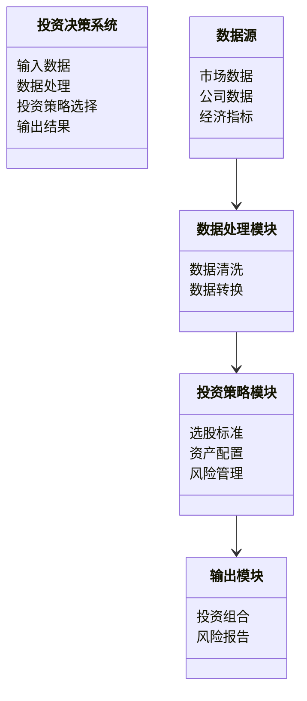

                 


# 费雪的全球化投资视角

> 关键词：费雪，全球化投资，投资策略，风险管理，资产配置，数学模型，投资组合优化

> 摘要：本文从费雪的投资理论出发，探讨其在全球化背景下的应用，详细分析其核心概念、算法原理、系统架构及实际案例，旨在为投资者提供科学的投资视角和实践指导。

---

## 第1章: 费雪投资理论的背景与起源

### 1.1 投资理论的发展历程
- 投资理论的演变：从古典到现代
- 费雪在投资理论中的地位
- 全球化对投资理论的影响

### 1.2 费雪投资理论的核心思想
- 费雪的投资哲学
- 费雪选股标准的核心要素
- 全球化视角下的投资策略

### 1.3 全球化背景下投资理论的演变
- 全球化对投资的影响
- 费雪理论在不同经济周期的应用
- 费雪理论的现代发展

---

## 第2章: 费雪的选股标准与投资策略

### 2.1 费雪选股标准的核心要素
- 公司基本面分析
- 行业地位与竞争优势
- 财务健康状况评估

### 2.2 费雪投资策略的实施步骤
- 确定投资目标与风险偏好
- 构建投资组合的策略
- 动态调整与优化

### 2.3 费雪投资策略的数学模型
- 投资组合优化的数学表达
- 风险收益平衡的公式推导
- 费雪策略的算法实现

---

## 第3章: 全球化投资视角下的资产配置

### 3.1 全球化投资视角的资产配置原则
- 资产配置的基本概念
- 全球化视角下的资产分布
- 不同经济周期的资产配置策略

### 3.2 资产配置的数学模型与算法
- 均值-方差优化模型
- 费雪投资策略的资产配置公式
- 全球化资产配置的算法流程图

### 3.3 资产配置的系统架构设计
- 系统功能模块划分
- 系统架构的mermaid图
- 系统接口设计与交互流程

---

## 第4章: 全球化投资视角下的风险管理

### 4.1 风险管理的核心概念
- 风险管理的基本概念
- 全球化视角下的风险管理策略
- 风险与收益的平衡

### 4.2 风险管理的数学模型与算法
- 风险评估的数学模型
- 风险分散的原理与实现
- 费雪策略下的风险管理公式

### 4.3 风险管理的系统架构设计
- 风险管理系统功能模块
- 系统架构的mermaid图
- 风险管理的交互流程设计

---

## 第5章: 系统分析与架构设计方案

### 5.1 问题场景介绍
- 投资决策系统的需求分析
- 系统功能设计
- 系统架构设计

### 5.2 系统功能设计（领域模型mermaid类图）


### 5.3 系统架构设计（mermaid架构图）


---

## 第6章: 项目实战

### 6.1 环境安装与配置
- 项目需求分析
- 环境搭建步骤
- 工具安装与配置

### 6.2 系统核心实现源代码
```python
def fisher_investment_strategy(portfolio, market_data):
    # 选股标准
    selected_stocks = select_stocks(portfolio, market_data)
    # 资产配置
    allocation = allocate_assets(selected_stocks)
    # 风险管理
    risk_managed_portfolio = manage_risk(allocation)
    return risk_managed_portfolio

def select_stocks(portfolio, market_data):
    # 选择符合费雪选股标准的股票
    return [stock for stock in market_data if meets_criteria(stock)]
```

### 6.3 代码应用解读与分析
- 代码功能分析
- 投资策略的具体实现
- 代码优化建议

### 6.4 实际案例分析
- 案例背景介绍
- 投资策略的应用
- 投资结果分析与解读

---

## 第7章: 最佳实践与小结

### 7.1 投资策略的小结
- 费雪策略的核心要点
- 全球化视角下的投资优势
- 理论与实践的结合

### 7.2 风险管理的注意事项
- 风险管理的关键点
- 投资者的心理因素
- 市场波动的应对策略

### 7.3 拓展阅读与学习
- 进一步学习的资源
- 费雪投资理论的延伸
- 全球化投资的未来趋势

---

## 作者：AI天才研究院 & 禅与计算机程序设计艺术

---

# 附录: 参考文献与工具

---

通过以上目录结构，您可以逐步撰写《费雪的全球化投资视角》一文。每一章的内容都需要详细展开，结合理论与实践，确保逻辑清晰、结构紧凑，语言专业且易于理解。

