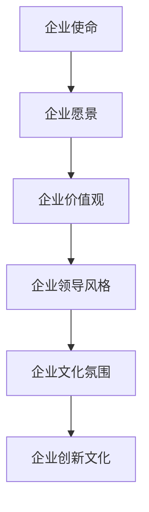
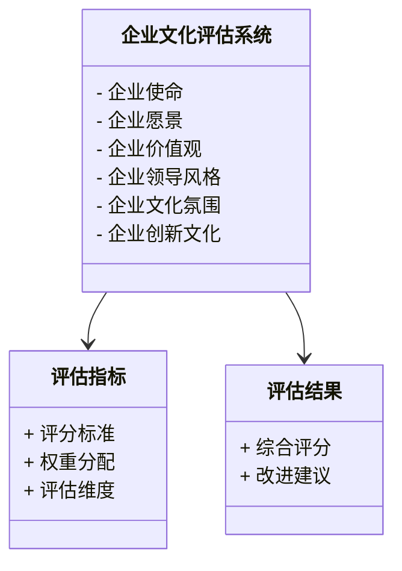

                 


# 《费雪的公司文化评估：优秀企业的隐形资产》

## 关键词：
- 公司文化
- 文化评估
- 企业价值
- 投资分析
- 费雪模型

## 摘要：
本文深入探讨了费雪的公司文化评估方法，分析了文化作为企业隐形资产的重要性。通过详细讲解文化评估的核心维度、算法原理和系统设计，结合实际案例，展示了如何将文化评估应用于投资决策和企业管理。文章还提供了代码实现和数学模型，帮助读者理解文化评估的实际应用和潜在价值。

---

# 正文

## 第一部分: 公司文化评估的背景与核心概念

### 第1章: 公司文化评估的背景与重要性

#### 1.1 公司文化评估的背景

##### 1.1.1 企业文化管理的演进历程
企业的文化管理从早期的关注制度和流程，逐渐转向对员工价值观、领导风格和组织氛围的关注。随着市场竞争的加剧，企业文化的软实力在决定企业绩效方面的重要性日益凸显。

##### 1.1.2 费雪文化评估理论的提出背景
菲利普·费雪（Philip Fisher）作为投资大师，提出了通过评估企业文化来判断企业长期发展潜力的方法。他认为，优秀的企业文化能够提升员工的凝聚力和创造力，从而为企业创造持续的价值。

##### 1.1.3 企业文化对企业价值的影响
企业文化通过影响员工的工作态度、创新能力和团队协作，进而影响企业的生产效率、产品质量和市场竞争力。良好的企业文化能够增强企业的抗风险能力，为企业创造长期的价值。

#### 1.2 公司文化评估的核心概念

##### 1.2.1 公司文化的定义与特征
公司文化是企业在长期经营中形成的价值观、信念、行为准则和习惯的总和。其特征包括独特性、动态性、渗透性和一致性。

##### 1.2.2 企业文化评估的定义
企业文化评估是对企业文化的各个维度进行测量和分析，以确定其对企业绩效的影响程度。评估过程包括数据收集、分析和反馈。

##### 1.2.3 企业文化评估的边界与外延
企业文化评估不仅关注企业的内部文化，还包括企业与外部环境的互动。外延包括企业品牌、社会责任和行业影响力等方面。

#### 1.3 企业文化评估的重要性

##### 1.3.1 企业文化对企业绩效的影响
企业文化通过影响员工的行为和决策，进而影响企业的生产效率、产品质量和客户满意度。

##### 1.3.2 企业文化评估在投资决策中的作用
投资者通过评估企业文化，可以识别企业的潜在价值和风险，从而做出更明智的投资决策。

##### 1.3.3 企业文化评估的实践意义
企业文化评估能够帮助企业识别文化中的问题和优势，从而制定有效的改进措施，提升企业的竞争力。

#### 1.4 企业文化与其他企业资产的对比

##### 1.4.1 企业文化与物质资产的对比
物质资产是企业的硬件资源，而企业文化是企业的软件资源。两者相辅相成，共同推动企业的发展。

##### 1.4.2 企业文化与金融资产的对比
企业文化影响企业的市场价值，但不同于金融资产，它更注重企业的长期发展潜力。

##### 1.4.3 企业文化与人力资本的对比
企业文化通过提升员工的凝聚力和创造力，增强人力资本的价值。

---

### 第2章: 公司文化评估的核心维度

#### 2.1 公司文化评估的主要维度

##### 2.1.1 企业使命与愿景
企业使命是企业的存在意义，愿景是企业追求的长期目标。清晰的使命和愿景能够指引企业的方向，增强员工的使命感。

##### 2.1.2 企业价值观
企业价值观是企业在经营活动中遵循的基本信念和价值准则。它决定了企业的决策方式和行为准则。

##### 2.1.3 企业领导风格
领导风格影响企业的文化氛围和员工的工作态度。不同领导风格下，企业文化的形成和发展方式有所不同。

##### 2.1.4 企业文化氛围
企业文化氛围是企业内部的总体文化环境，包括员工之间的关系、工作氛围和组织氛围。

##### 2.1.5 企业创新文化
创新文化是企业鼓励创新、容忍失败、追求进步的文化氛围。它能够激发员工的创造力，推动企业的持续发展。

#### 2.2 各维度的特征对比

##### 2.2.1 维度对比表格
以下表格展示了各个维度的主要特征对比：

| 维度         | 特征描述                     |
|--------------|------------------------------|
| 企业使命     | 长期目标与发展方向           |
| 企业愿景     | 远景蓝图与理想状态           |
| 企业价值观     | 核心信念与价值准则           |
| 企业领导风格   | 指导思想与管理方式           |
| 企业文化氛围   | 员工关系与工作环境           |
| 企业创新文化   | 创新意识与容忍失败          |

#### 2.3 文化评估维度的Mermaid流程图



---

## 第二部分: 文化评估的算法与系统设计

### 第3章: 文化评估的算法原理

#### 3.1 费雪文化评估模型

##### 3.1.1 模型概述
费雪文化评估模型通过对企业文化的多个维度进行评分，计算综合文化评分，以评估企业文化的优劣。

##### 3.1.2 评分系统
每个文化维度均采用0-10分的评分标准，10分为最优。

##### 3.1.3 权重计算
不同维度的权重根据其对企业发展的影响程度确定，例如企业使命和愿景的权重较高。

#### 3.2 评分计算的Python代码实现

```python
def calculate_cultural_score(dimensions, weights):
    score = 0
    for dim, weight in zip(dimensions, weights):
        score += dim * weight
    return score

# 示例数据
dimensions = [8, 9, 7, 6, 8]
weights = [0.2, 0.2, 0.3, 0.15, 0.15]
score = calculate_cultural_score(dimensions, weights)
print(f"综合文化评分为: {score}")
```

#### 3.3 数学模型

综合文化评分公式：
$$ \text{文化评分} = \sum (\text{维度评分}_i \times \text{权重}_i) $$

---

### 第4章: 系统分析与架构设计

#### 4.1 系统功能设计

##### 4.1.1 领域模型设计
以下为领域模型的Mermaid类图：



#### 4.2 系统架构设计

##### 4.2.1 系统架构图
以下为系统架构的Mermaid图：


---

### 第5章: 项目实战与案例分析

#### 5.1 项目背景

##### 5.1.1 项目目标
通过文化评估帮助一家科技公司优化企业文化，提升企业绩效。

##### 5.1.2 数据收集
收集企业文化各维度的数据，包括员工满意度调查、领导风格分析和创新文化评估。

#### 5.2 代码实现

##### 5.2.1 数据处理代码

```python
import pandas as pd

# 数据读取
data = pd.read_csv('culture_survey.csv')

# 数据清洗
data.dropna(inplace=True)
data['评分'] = data['评分'].astype(int)
```

##### 5.2.2 评分计算

```python
dimensions = data[['使命', '愿景', '价值观', '领导风格', '创新文化']].mean().round(2)
weights = [0.2, 0.2, 0.3, 0.15, 0.15]
score = sum(dim * weight for dim, weight in zip(dimensions, weights))
print(f"综合文化评分为: {score}")
```

---

## 第三部分: 最佳实践与小结

### 第6章: 最佳实践与总结

#### 6.1 小结

##### 6.1.1 文化评估的价值
企业文化评估是识别优秀企业的重要工具，能够帮助企业优化文化，提升绩效。

##### 6.1.2 投资者的视角
投资者通过评估企业文化，可以识别企业的长期发展潜力，做出更明智的投资决策。

#### 6.2 注意事项

##### 6.2.1 数据准确性
确保数据收集的准确性和代表性，避免偏见影响评估结果。

##### 6.2.2 方法适用性
根据企业的具体情况调整评估方法，确保评估的有效性。

#### 6.3 拓展阅读

##### 6.3.1 推荐书籍
- 《企业文化：企业生存的软实力》
- 《费雪投资哲学》

##### 6.3.2 相关研究
研究企业文化评估在不同行业中的应用，探索其对企业发展的影响。

---

## 作者信息

作者：AI天才研究院/AI Genius Institute & 禅与计算机程序设计艺术 /Zen And The Art of Computer Programming

---

通过以上结构，文章详细探讨了费雪的公司文化评估方法，结合理论分析、算法实现和实际案例，帮助读者全面理解企业文化评估的重要性和应用价值。

