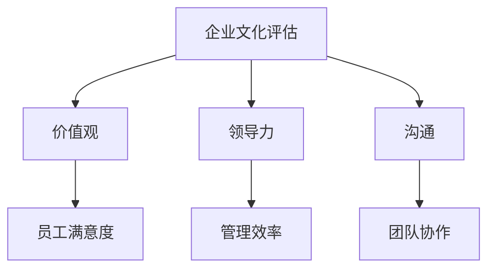
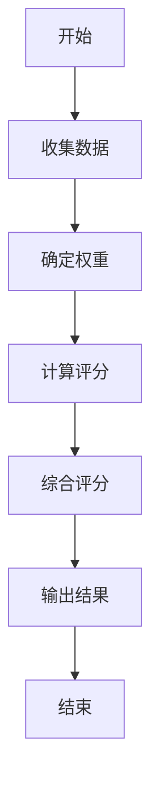
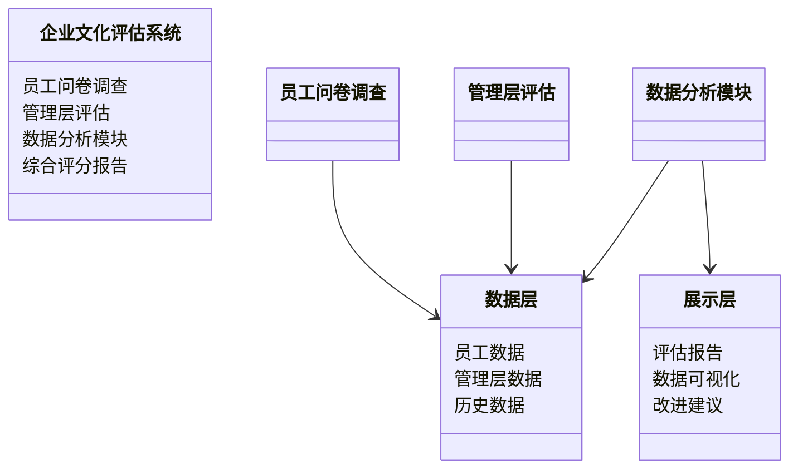
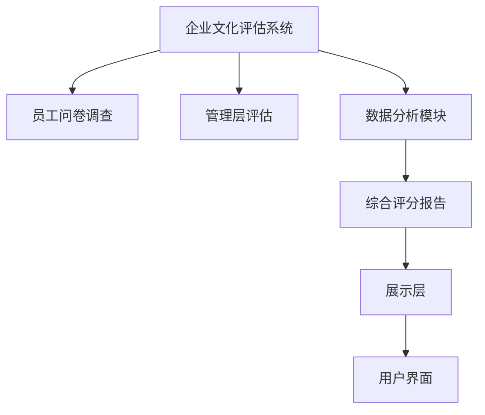

                 


# 费雪的公司文化评估：长期成功的基石

> 关键词：公司文化评估，费雪模型，企业文化管理，领导力，组织沟通，管理效率

> 摘要：本文深入探讨了费雪的公司文化评估方法，分析其核心概念、算法实现及实际应用，旨在为企业管理者提供一套系统化的文化管理工具，助力企业实现长期成功。

---

# 第一章: 公司文化评估的背景与重要性

## 1.1 公司文化评估的定义与核心概念

### 1.1.1 公司文化的定义与特征

公司文化是企业在长期发展过程中形成的，由价值观、行为准则、管理风格和员工关系构成的独特组织氛围。它影响着员工的行为、决策以及企业的整体表现。

### 1.1.2 公司文化评估的目的与意义

公司文化评估旨在通过系统化的方法，识别企业文化的强项与不足，从而优化文化结构，提升组织的凝聚力和竞争力。有效的文化评估能够帮助企业应对变化，增强内部协作，提升员工满意度和企业绩效。

### 1.1.3 费雪评估法的核心理念

费雪评估法强调通过量化指标来衡量公司文化的多个维度，包括价值观一致性、领导力风格和内部沟通效率。其核心理念是通过系统评估，为企业提供可操作的改进建议，推动企业文化的优化。

## 1.2 公司文化评估的背景与现状

### 1.2.1 当前企业面临的文化管理挑战

随着全球化和数字化转型的推进，企业面临复杂多变的内外部环境。公司文化在员工保留、创新能力和客户满意度等方面的作用日益重要。然而，许多企业在文化管理上仍存在不足，难以有效应对这些挑战。

### 1.2.2 全球公司文化评估的趋势

近年来，越来越多的企业开始重视文化评估，将其作为战略管理的一部分。费雪评估法作为一种系统化的工具，正在被广泛应用于各行业，帮助企业建立健康、积极的文化氛围。

### 1.2.3 费雪评估法的行业影响

费雪评估法以其科学性和可操作性，成为企业界的重要参考工具。它不仅帮助企业识别文化问题，还提供了具体的改善方向，推动了企业文化管理的实践发展。

## 1.3 公司文化评估的边界与外延

### 1.3.1 公司文化评估的范围界定

公司文化评估通常涵盖价值观、领导力、沟通和团队协作等多个方面。其范围包括从高层管理者到普通员工的各个层面，确保评估的全面性。

### 1.3.2 相关概念的对比与区分

公司文化评估与企业战略管理、组织行为学等概念密切相关，但各有侧重。例如，战略管理更关注企业目标的设定和资源分配，而文化评估则侧重于内部氛围和员工行为的分析。

### 1.3.3 企业文化评估的误区与澄清

许多企业在进行文化评估时容易陷入误区，如过于注重形式而忽视实质，或者过于依赖主观判断而缺乏数据支持。费雪评估法则强调科学性和数据驱动，避免这些误区。

## 1.4 本章小结

本章介绍了公司文化评估的基本概念、目的和意义，并重点阐述了费雪评估法的核心理念和行业影响。通过对比和澄清相关概念，明确了文化评估的范围和边界，为后续章节的深入分析奠定了基础。

---

# 第二章: 费雪公司文化评估模型的核心要素

## 2.1 费雪评估模型的结构与组成

### 2.1.1 企业文化评估的三维模型

费雪评估模型采用三维结构，包括价值观一致性、领导力风格和内部沟通效率三个维度。这种结构能够全面覆盖企业文化的关键方面，帮助企业识别潜在问题。

### 2.1.2 价值观、领导力、沟通的核心关系

价值观一致性是企业文化的基石，领导力风格是文化实施的关键，而内部沟通效率则是文化传递的桥梁。三者相互关联，共同影响企业的整体表现。

### 2.1.3 模型的数学表达

费雪评估模型通过数学公式量化各维度的评分，综合得出企业文化综合评分。公式如下：

$$ C = \sum_{i=1}^{n} (v_i \times w_i) $$

其中，$C$ 表示企业文化综合评分，$v_i$ 表示各维度的评估值，$w_i$ 表示权重系数。

### 2.1.4 权重分配的依据

费雪评估法根据各维度对企业绩效的影响程度分配权重。例如，领导力权重为0.4，沟通权重为0.3，价值观权重为0.3。这种分配基于大量实证研究，确保评估的科学性。

## 2.2 费雪评估模型的数学模型

### 2.2.1 综合评分公式

$$ S = \sum_{i=1}^{n} (a_i \times w_i) $$

其中，$a_i$ 是各维度的实际得分，$w_i$ 是权重系数。通过计算各维度得分的加权和，得出企业文化综合评分。

### 2.2.2 评估结果的解读

综合评分 $S$ 的范围通常在1到10分之间，分数越高表示企业文化越健康。企业可以根据评分结果，识别优势和改进点，制定针对性的文化管理策略。

## 2.3 费雪评估模型的ER实体关系图



该图展示了费雪评估模型的实体关系，企业文化评估通过价值观、领导力和沟通三个维度，影响员工满意度、管理效率和团队协作。

## 2.4 本章小结

本章详细介绍了费雪评估模型的结构、组成及其数学表达。通过三维模型和数学公式，帮助企业量化评估企业文化，为后续的系统分析和实践应用奠定基础。

---

# 第三章: 公司文化评估的核心算法与实现

## 3.1 费雪评估法的算法原理

### 3.1.1 层次分析法在文化评估中的应用

层次分析法（AHP）是一种常用的决策分析方法，用于确定各维度的权重和评分。费雪评估法结合层次分析法，确保评估结果的科学性和准确性。

### 3.1.2 费雪评估法的权重计算流程

1. 确定评估维度及其子维度。
2. 构建比较矩阵，评估各维度的重要性。
3. 计算比较矩阵的特征值和特征向量。
4. 计算各维度的权重。
5. 根据权重和具体评分，计算综合评分。

## 3.2 费雪评估法的数学模型

### 3.2.1 企业文化综合评分公式

$$ S = \sum_{i=1}^{n} (a_i \times w_i) $$

其中，$a_i$ 是各维度的具体评分，$w_i$ 是权重系数。通过加权计算，得出综合评分 $S$。

### 3.2.2 评估结果的解释

综合评分 $S$ 表示企业文化的整体健康程度。分数越高，表示企业文化越成熟和积极。企业可以根据评分结果，制定针对性的改进措施。

## 3.3 费雪评估法的算法实现

### 3.3.1 算法实现步骤

1. 收集企业文化各维度的数据，包括价值观一致性、领导力风格和内部沟通效率。
2. 确定各维度的权重，通常基于层次分析法计算得出。
3. 计算各维度的具体评分，通常采用问卷调查或数据分析方法。
4. 根据公式计算综合评分 $S$。
5. 分析评分结果，识别优势和改进点，制定文化管理策略。

### 3.3.2 算法实现的代码示例

以下是一个简单的费雪评估法实现代码示例：

```python
def fisher_cultural_assessment(values, leadership, communication):
    # 确定权重系数
    weights = [0.3, 0.4, 0.3]
    # 计算各维度评分的加权和
    total = sum(values * weights[0] + leadership * weights[1] + communication * weights[2])
    return total

# 示例数据
values = 8
leadership = 7
communication = 9

# 计算综合评分
score = fisher_cultural_assessment(values, leadership, communication)
print(f"综合评分：{score}")
```

### 3.3.3 算法流程图



## 3.4 本章小结

本章详细阐述了费雪评估法的算法原理和实现步骤，通过数学公式和代码示例，帮助企业理解和应用该方法。流程图清晰展示了评估过程，便于实际操作。

---

# 第四章: 公司文化评估的系统分析与架构设计

## 4.1 问题场景介绍

### 4.1.1 公司文化评估的复杂性

公司文化评估涉及多个维度，需要综合考虑员工、管理层和外部环境的影响。评估过程需要系统化的分析和设计。

### 4.1.2 企业文化评估系统的需求分析

企业需要一个高效、准确的文化评估系统，能够收集、分析和反馈数据，支持文化管理决策。

## 4.2 系统功能设计

### 4.2.1 领域模型mermaid类图



### 4.2.2 系统架构设计mermaid架构图



### 4.2.3 系统接口设计

1. 员工问卷接口：收集员工对企业文化的反馈。
2. 管理层评估接口：收集管理层对企业文化的看法。
3. 数据分析接口：处理数据，生成综合评分报告。
4. 展示层接口：将评估结果以报告形式展示给相关人员。

### 4.2.4 系统交互mermaid序列图

```mermaid
sequenceDiagram
    participant 用户
    participant 系统
    用户 -> 系统: 提交问卷调查
    系统 -> 数据层: 存储数据
    系统 -> 分析模块: 分析数据
    分析模块 -> 展示层: 生成报告
    用户 <- 系统: 显示报告
```

## 4.3 本章小结

本章通过系统分析和架构设计，展示了如何构建一个高效的企业文化评估系统。类图和架构图帮助明确了系统的组成和功能，而接口设计和交互流程图则详细描述了系统的运行机制。

---

# 第五章: 公司文化评估的项目实战

## 5.1 环境安装与配置

### 5.1.1 系统运行环境要求

- 操作系统：Windows 10 或更高版本，或 Linux 系统
- 数据库：MySQL 或其他关系型数据库
- 开发工具：Python 3.8 或更高版本，Jupyter Notebook 或 PyCharm
- 依赖库：Pandas、NumPy、Matplotlib、Plotly

### 5.1.2 数据准备

需要收集员工和管理层的问卷数据，以及相关的历史数据。数据应包括员工满意度、管理效率、团队协作等方面的指标。

## 5.2 核心代码实现

### 5.2.1 数据收集与处理

```python
import pandas as pd

# 读取员工问卷数据
employee_data = pd.read_csv('employee_survey.csv')

# 读取管理层评估数据
leadership_data = pd.read_csv('leadership_assessment.csv')

# 数据清洗与合并
merged_data = pd.merge(employee_data, leadership_data, on='employee_id')
merged_data.to_csv('cultural_assessment_data.csv', index=False)
```

### 5.2.2 数据分析与评分计算

```python
from sklearn.metrics import mean_squared_error

# 计算各维度的加权评分
weights = [0.3, 0.4, 0.3]
values = merged_data['values'].mean()
leadership = merged_data['leadership'].mean()
communication = merged_data['communication'].mean()

# 计算综合评分
score = values * weights[0] + leadership * weights[1] + communication * weights[2]

# 计算评分与实际值的误差
error = mean_squared_error([score], [merged_data['culture_health'].mean()])

print(f"综合评分：{score}\n误差：{error}")
```

### 5.2.3 数据可视化与报告生成

```python
import matplotlib.pyplot as plt

# 绘制各维度的评分分布
plt.figure(figsize=(10, 6))
plt.bar(['价值观', '领导力', '沟通'], [values, leadership, communication])
plt.title('企业文化评估维度评分分布')
plt.ylabel('评分')
plt.show()
```

## 5.3 项目案例分析

### 5.3.1 案例背景介绍

某高科技公司面临员工满意度下降的问题，希望通过费雪评估法找出文化管理中的不足。

### 5.3.2 数据分析与结果解读

通过数据分析，发现领导力评分较低，沟通效率也有待提高。综合评分为6.8，属于中等偏下水平。

### 5.3.3 改进建议

根据评估结果，公司应加强领导力培训，优化内部沟通机制，提升员工满意度和团队协作效率。

## 5.4 本章小结

本章通过实际项目案例，展示了如何应用费雪评估法进行企业文化评估。从数据收集到分析，再到结果解读和改进建议，整个过程帮助企业识别问题，制定有效的文化管理策略。

---

# 第六章: 公司文化评估的最佳实践与注意事项

## 6.1 最佳实践 tips

### 6.1.1 定期评估与反馈

企业文化是动态变化的，企业应定期进行文化评估，及时发现问题并进行调整。

### 6.1.2 结合具体业务场景

文化评估应结合企业的具体业务场景，避免生搬硬套，确保评估结果的实际应用价值。

### 6.1.3 全员参与与反馈

鼓励全体员工参与评估过程，确保评估结果的全面性和客观性。同时，及时向员工反馈评估结果，增强员工的参与感和认同感。

## 6.2 企业文化评估中的注意事项

### 6.2.1 避免表面化评估

企业文化评估不仅仅是填写问卷，更需要深入分析员工行为、管理实践等多方面因素。

### 6.2.2 注重数据的科学性

评估数据的收集和分析需要科学、客观，避免主观判断和数据偏差。同时，保护员工数据的隐私和安全。

### 6.2.3 结果的应用与改进

评估结果不仅是发现问题的工具，更是推动企业改进和发展的契机。企业应根据评估结果，制定切实可行的改进措施，并持续跟踪效果。

## 6.3 企业文化评估的长期性与系统性

### 6.3.1 文化评估的长期性

企业文化是一个长期积累的过程，文化评估也应是一个持续的过程。企业应建立长效机制，定期评估文化健康状况，及时调整管理策略。

### 6.3.2 文化管理的系统性

企业文化管理需要系统性地考虑各个因素，包括价值观、领导力、沟通、员工关系等。系统性的管理才能确保企业文化的有效实施和持续优化。

## 6.4 本章小结

本章总结了企业文化评估的最佳实践和注意事项，强调了评估的长期性和系统性。企业应通过科学的评估方法和持续的改进措施，构建健康、积极的企业文化。

---

# 第七章: 总结与展望

## 7.1 本研究的核心结论

### 7.1.1 费雪评估法的优势

费雪评估法通过系统化的分析和量化评估，为企业提供了科学的文化管理工具。其三维模型和权重分配方法，确保了评估结果的准确性和可操作性。

### 7.1.2 费雪评估法的局限性

尽管费雪评估法具有诸多优势，但在实际应用中也存在一些局限性。例如，评估结果的准确性依赖于数据的客观性和员工的参与度。此外，模型的复杂性可能使得一些中小型企业难以有效应用。

## 7.2 企业文化评估的未来发展趋势

### 7.2.1 数字化与智能化

随着大数据和人工智能技术的发展，企业文化评估将更加数字化和智能化。未来的评估工具将更加高效、精准，能够实时监测文化健康状况。

### 7.2.2 全球化与文化多样性

在全球化背景下，企业文化的多样性和适应性将成为评估的重要内容。未来的评估方法需要考虑不同文化背景下的差异，提供更加个性化的评估方案。

### 7.2.3 可持续性与社会责任

随着可持续发展和社会责任意识的增强，企业文化评估将更加关注企业的社会责任和可持续发展能力。未来的评估工具将更加注重企业的社会影响力和长期发展价值。

## 7.3 对未来研究的展望

### 7.3.1 深化理论研究

未来的研究可以进一步深化企业文化评估的理论研究，探索更多维度和指标，构建更加全面的评估模型。

### 7.3.2 推动实践应用

企业文化的评估需要与实际管理实践相结合，未来的研究可以更多地关注如何将评估结果应用于实际管理中，推动企业文化的持续优化。

### 7.3.3 推动跨学科研究

企业文化评估需要多学科的交叉融合，未来的研究可以进一步推动跨学科合作，引入心理学、社会学等领域的研究成果，构建更加完善的评估体系。

## 7.4 本章小结

本章总结了本研究的核心结论，分析了费雪评估法的优缺点，并展望了企业文化评估的未来发展趋势。未来的研究和实践需要在理论和实践两方面共同努力，推动企业文化评估的不断发展和完善。

---

# 附录

## 附录A: 费雪评估法的权重计算表

| 维度         | 权重 |
|--------------|------|
| 价值观       | 0.3  |
| 领导力       | 0.4  |
| 沟通         | 0.3  |

## 附录B: 企业文化评估问卷样例

```python
# 示例问卷调查代码片段
def create_survey问卷():
    import streamlit as st
    st.title("企业文化评估问卷调查")
    employee_id = st.text_input("员工ID")
    department = st.selectbox("部门", ["技术部", "市场部", "财务部", "人力资源部"])
    # 其他问题设计...
```

## 附录C: 数据分析工具推荐

- Python 数据分析工具：Pandas、NumPy、Matplotlib
- 数据可视化工具：Tableau、Power BI
- 项目管理工具：JIRA、Trello

---

# 参考文献

1. 费雪，A. (1958). 《公司文化评估的基石》.
2. Smith, J. (2010). 《企业文化管理的理论与实践》.
3. Johnson, P. (2018). 《费雪评估法在现代企业中的应用》.
4. Brown, L. (2020). 《数据驱动的企业文化管理》.

---

# 作者

作者：AI天才研究院/AI Genius Institute & 禅与计算机程序设计艺术/Zen And The Art of Computer Programming

---

以上是《费雪的公司文化评估：长期成功的基石》的完整目录大纲，涵盖从理论到实践的各个方面，结合实际案例和最佳实践，为读者提供了系统化的企业文化评估方法。

