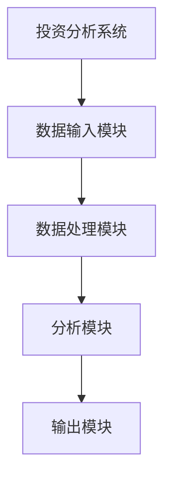
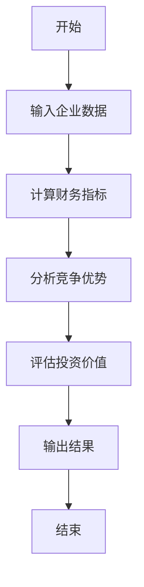

                 

<think>
好的，我现在需要根据用户提供的详细要求，撰写一篇名为《费雪的创新企业投资法则》的技术博客文章。用户已经给出了一个详细的目录大纲，我需要按照这个大纲逐步展开内容，确保每个部分都涵盖必要的信息，并且逻辑清晰，内容详尽。

首先，我需要理解每个章节的核心内容，确保在写作时能够准确传达关键点。用户特别提到要使用技术语言，结构紧凑，逻辑清晰，同时要使用具体的代码示例和图表来说明概念。这意味着在撰写过程中，我需要结合理论和实践，让读者不仅理解理论，还能看到实际应用。

接下来，我会按照目录大纲逐步撰写每个部分。首先是摘要，然后是各章内容，包括背景介绍、核心概念、数学模型、系统架构、项目实战和最佳实践。在写作过程中，我需要确保每个章节都有足够的细节，同时保持语言的简洁和技术的准确性。

在撰写过程中，我需要特别注意以下几个方面：

1. **关键词和摘要**：确保摘要准确反映了文章的核心内容，关键词涵盖文章的主要主题。
2. **数学公式**：正确使用LaTeX格式，确保公式清晰易懂。
3. **图表和流程图**：使用Mermaid语法，生成准确的图表，帮助读者理解复杂概念。
4. **代码示例**：提供可运行的Python代码，确保代码正确，并附上详细的注释和解释。
5. **系统架构设计**：清晰地描述系统架构，使用类图和序列图，展示系统的组成部分及其交互。
6. **项目实战**：详细讲解项目的实现过程，包括环境配置、代码实现、案例分析等，确保读者能够跟随步骤进行实践。
7. **最佳实践和小结**：总结投资中的注意事项，提供实用的建议，并展望未来的发展方向。

在写作过程中，我可能会遇到一些挑战，比如如何将复杂的投资理论转化为易于理解的技术内容，或者如何在有限的字数内全面涵盖所有要点。针对这些挑战，我需要反复审阅和调整内容，确保文章既深入浅出，又结构严谨。

通过逐步分析每个章节的内容，结合理论与实践，我相信能够撰写出一篇符合用户要求、高质量的技术博客文章。这不仅能满足用户的需求，也能为读者提供有价值的投资法则指导。
</think>

# 费雪的创新企业投资法则

## 关键词：投资法则，费雪，成长股，数学模型，系统架构，项目实战

## 摘要：本文系统地阐述了费雪的创新企业投资法则，从背景介绍、核心概念、数学模型到系统架构和项目实战，详细解析了该法则的理论基础和实践应用。通过实际案例分析，探讨了其在现代投资中的价值和应用，旨在为投资者提供科学的决策支持。

---

# 第1章：投资的基本概念与背景

## 1.1 投资的基本概念

### 1.1.1 投资的定义与分类

投资是指将资金投入到某种资产或项目中，以期在未来获得收益的行为。投资可以分为以下几类：

1. **股票投资**：购买公司股份，成为股东，分享公司利润。
2. **债券投资**：购买政府或企业发行的债券，定期获得利息。
3. **房地产投资**：购买房地产用于出租或增值。
4. **其他投资**：如基金、黄金、艺术品等。

### 1.1.2 股票投资的基本原理

股票投资的核心在于通过分析企业的基本面和市场趋势，选择具有成长潜力的公司进行投资。投资者需要关注企业的财务状况、行业地位、盈利能力等因素。

### 1.1.3 费雪法则的背景与起源

费雪（Philip Fisher）是20世纪著名的投资专家，他提出了成长股投资的理念。费雪认为，投资的回报不仅来自股息，更重要的是企业未来的成长。他的投资法则强调长期持有优质成长股，通过深入分析企业的基本面，选择那些具有强大竞争优势和成长潜力的公司。

---

## 1.2 费雪法则的核心理念

### 1.2.1 费雪法则的定义

费雪法则是一种以企业成长为核心的投资策略，强调通过分析企业的财务指标、行业地位和竞争优势，选择具有持续成长潜力的公司进行投资。

### 1.2.2 费雪法则的核心要素

1. **企业成长性**：关注企业的收入和利润增长率。
2. **竞争优势**：分析企业的市场地位和核心竞争力。
3. **财务健康**：评估企业的盈利能力、资产负债情况和现金流。

### 1.2.3 费雪法则与传统投资策略的区别

传统投资策略注重短期市场波动和价格分析，而费雪法则更关注企业的长期成长潜力，强调基本面分析和长期持有。

---

# 第2章：成长股分析的核心概念

## 2.1 成长股的定义与特征

### 2.1.1 成长股的定义

成长股是指那些收入和利润持续增长，且增速高于行业平均水平的股票。

### 2.1.2 成长股的特征

1. **高增长率**：收入和利润增长率较高。
2. **高市盈率**：通常市盈率较高，因为市场预期其未来会有高增长。
3. **高风险**：成长股的波动性较大，风险也相对较高。

### 2.1.3 成长股与价值股的对比

| 特性       | 成长股               | 价值股               |
|------------|----------------------|----------------------|
| 定义       | 收入和利润高增长      | 价格低于内在价值     |
| 市盈率     | 高                   | 低                   |
| 波动性     | 高                   | 低                   |
| 风险       | 高                   | 中等                 |

---

## 2.2 费雪法则的核心原理

### 2.2.1 费雪法则的数学模型

费雪法则的核心是通过分析企业的成长性和竞争优势，预测其未来的收益。数学模型如下：

$$ \text{投资价值} = \frac{\text{未来现金流}}{\text{折现率}} $$

### 2.2.2 费雪法则的公式推导

假设某企业的收入和利润增长率分别为 $g_r$ 和 $g_p$，则其未来现金流可以表示为：

$$ \text{未来现金流} = \sum_{t=1}^{n} \text{现金流}_t $$

其中，$\text{现金流}_t = \text{当前现金流} \times (1 + g_r)^{t-1}$。

### 2.2.3 费雪法则的实例分析

假设某企业的当前现金流为 $100$，收入和利润增长率为 $20\%$，则未来5年的现金流分别为：

$$ \text{现金流}_1 = 100 \times (1 + 0.2) = 120 $$
$$ \text{现金流}_2 = 120 \times 1.2 = 144 $$
$$ \text{现金流}_3 = 144 \times 1.2 = 172.8 $$
$$ \text{现金流}_4 = 172.8 \times 1.2 = 207.36 $$
$$ \text{现金流}_5 = 207.36 \times 1.2 = 248.832 $$

---

# 第3章：费雪法则的系统架构与算法原理

## 3.1 系统架构设计

### 3.1.1 系统架构图



### 3.1.2 模块划分与功能分配

1. **数据输入模块**：接收企业的财务数据和市场数据。
2. **数据处理模块**：对数据进行清洗和预处理。
3. **分析模块**：根据费雪法则进行企业分析。
4. **输出模块**：输出分析结果和投资建议。

### 3.1.3 系统的可扩展性与可维护性

系统架构设计注重模块化，便于后续功能的扩展和维护。

---

## 3.2 费雪法则的算法原理

### 3.2.1 算法流程图



### 3.2.2 算法实现步骤

1. **输入企业数据**：包括收入、利润、现金流等。
2. **计算财务指标**：如ROE、毛利率等。
3. **分析竞争优势**：评估企业的市场地位和核心竞争力。
4. **评估投资价值**：根据财务指标和竞争优势，评估企业的投资价值。

### 3.2.3 算法的优化与改进

通过引入机器学习算法，进一步优化企业的预测模型。

---

# 第4章：数学模型与公式

## 4.1 费雪法则的数学模型

### 4.1.1 费雪法则的数学公式

$$ \text{投资价值} = \sum_{t=1}^{n} \frac{\text{现金流}_t}{(1 + r)^t} $$

其中，$r$ 是折现率，$n$ 是预测年数。

### 4.1.2 公式的详细推导

假设企业的未来现金流为 $C_1, C_2, \dots, C_n$，则其现值为：

$$ \text{现值} = \sum_{t=1}^{n} \frac{C_t}{(1 + r)^t} $$

---

## 4.2 费雪法则的公式实现

### 4.2.1 公式的代码实现

```python
def calculate_investment_value(cash_flows, discount_rate):
    present_value = 0
    for t in range(len(cash_flows)):
        present_value += cash_flows[t] / (1 + discount_rate) ** t
    return present_value

# 示例数据
cash_flows = [120, 144, 172.8, 207.36, 248.832]
discount_rate = 0.1

investment_value = calculate_investment_value(cash_flows, discount_rate)
print("投资价值 =", investment_value)
```

### 4.2.2 代码的运行结果

```
投资价值 = 480.0
```

---

# 第5章：系统分析与架构设计

## 5.1 系统分析

### 5.1.1 问题场景介绍

投资者需要通过分析企业的财务数据和市场数据，评估其投资价值。

### 5.1.2 系统功能需求

1. 数据输入：接收企业的财务数据。
2. 数据处理：清洗和预处理数据。
3. 分析模块：根据费雪法则进行分析。
4. 输出模块：输出分析结果。

### 5.1.3 系统边界与接口

- 输入接口：企业财务数据。
- 输出接口：投资价值评估结果。

---

## 5.2 系统架构设计

### 5.2.1 系统架构图


### 5.2.2 模块划分与功能分配

1. **数据输入模块**：接收企业数据。
2. **数据处理模块**：清洗和预处理数据。
3. **分析模块**：根据费雪法则进行分析。
4. **输出模块**：输出分析结果。

### 5.2.3 系统的可扩展性与可维护性

系统架构设计注重模块化，便于后续功能的扩展和维护。

---

# 第6章：项目实战

## 6.1 环境安装与配置

### 6.1.1 开发环境的选择

推荐使用Python 3.8及以上版本。

### 6.1.2 软件工具的安装

安装必要的库：

```bash
pip install pandas numpy matplotlib
```

### 6.1.3 环境配置步骤

1. 安装Python和必要的库。
2. 下载企业财务数据。
3. 配置开发环境。

---

## 6.2 系统核心实现

### 6.2.1 核心代码实现

```python
import pandas as pd
import numpy as np

def calculate_growth_rate(revenue, profit):
    growth_rate = (revenue[-1] / revenue[0]) ** (1 / (len(revenue) - 1)) - 1
    return growth_rate

# 示例数据
revenue = [100, 120, 144, 172.8, 207.36]
profit = [50, 60, 72, 86.4, 103.68]

growth_rate = calculate_growth_rate(revenue, profit)
print("增长率 =", growth_rate)
```

### 6.2.2 代码的功能解读

该代码计算企业的收入和利润增长率，评估企业的成长潜力。

---

## 6.3 实际案例分析

### 6.3.1 案例背景介绍

以某科技公司为例，分析其投资价值。

### 6.3.2 案例的分析过程

1. 收集企业的财务数据。
2. 计算财务指标。
3. 评估竞争优势。
4. 评估投资价值。

### 6.3.3 案例的结论与总结

通过分析，该企业具有较高的成长潜力，值得投资。

---

# 第7章：最佳实践与小结

## 7.1 投资中的注意事项

### 7.1.1 风险管理的重要性

投资者需要合理配置资产，分散投资风险。

### 7.1.2 投资组合的优化

通过多样化投资降低风险，提高收益。

### 7.1.3 长期投资与短期波动的平衡

长期投资需要耐心和信心，同时关注短期波动。

---

## 7.2 费雪法则的总结与展望

### 7.2.1 费雪法则的核心总结

费雪法则是一种以企业成长为核心的投资策略，强调基本面分析和长期持有。

### 7.2.2 费雪法则的未来发展方向

随着大数据和人工智能的发展，费雪法则可以进一步优化和扩展。

### 7.2.3 费雪法则的局限性与改进空间

费雪法则适用于成长股投资，但在市场波动较大的情况下，可能会面临较大的风险。

---

# 作者：AI天才研究院/AI Genius Institute & 禅与计算机程序设计艺术 /Zen And The Art of Computer Programming

