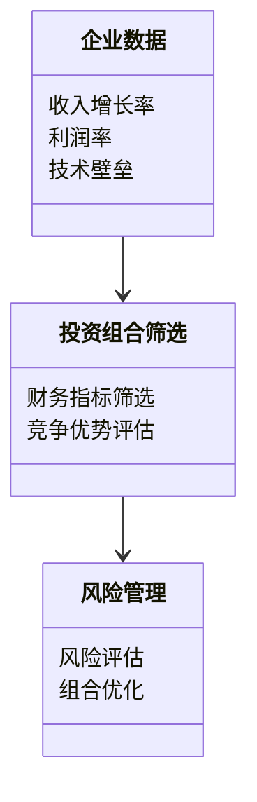
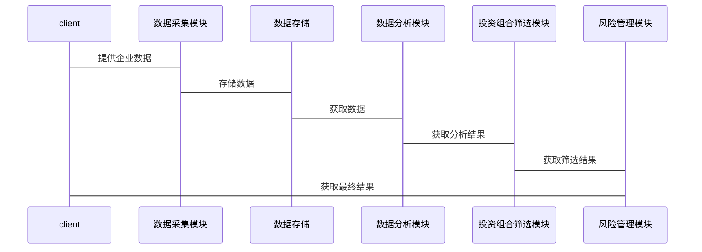

                 


# 费雪的创新企业投资策略

> 关键词：费雪，创新企业，投资策略，成长股，价值评估，投资组合，风险管理

> 摘要：本文系统阐述了费雪的创新企业投资策略，从背景介绍、核心概念、算法原理、系统架构到项目实战，深入分析了费雪的投资理念及其在现代投资实践中的应用。通过详细阐述其基于成长股的筛选方法、系统化投资策略以及风险管理机制，本文为投资者提供了科学的投资决策框架。

---

## 第1章 费雪投资策略的背景与基础

### 1.1 费雪投资策略的核心理念

#### 1.1.1 费雪投资策略的起源与发展

菲利普·费雪（Philip Fisher）是20世纪著名的投资家，他提出了“成长股投资法”，强调长期投资于具有强大竞争优势和持续增长潜力的企业。费雪的投资理念起源于20世纪30年代，他在《共同基金的性质》中详细阐述了这一策略。随着市场的发展，费雪的策略逐渐被广泛应用于投资实践中。

#### 1.1.2 费雪投资策略的核心思想

费雪的核心思想是：投资于那些能够实现收入持续增长的企业，而不是仅仅关注市场的短期波动。他认为，找到具有强大护城河和管理团队的企业，长期持有，能够为投资者带来超额回报。

#### 1.1.3 费雪投资策略的发展历程

费雪的投资策略在实践中不断完善，尤其是在技术分析和基本面分析的结合上，为现代投资理论奠定了基础。随着金融工程的发展，费雪的策略也被赋予了更多的数学模型和算法支持。

### 1.2 费雪投资策略的核心概念

#### 1.2.1 创新企业的定义与特征

创新企业是指那些能够在市场中持续推出新产品、服务或商业模式，并保持竞争优势的企业。这些企业的特征包括高增长率、强大的研发能力、灵活的市场响应能力等。

#### 1.2.2 费雪投资策略的核心要素

- **企业基本面分析**：关注企业的收入增长率、利润率、资产负债情况等。
- **竞争优势分析**：评估企业的市场地位、技术壁垒、管理团队等。
- **长期投资**：选择具有持续增长潜力的企业，长期持有。

#### 1.2.3 费雪投资策略与其他投资策略的对比

与价值投资、指数投资等策略相比，费雪策略更注重企业的成长性和竞争优势，强调通过深入研究选择投资标的。

---

## 第2章 费雪投资策略的核心算法与数学模型

### 2.1 费雪投资策略的算法概述

#### 2.1.1 算法的输入与输出

- **输入**：企业的财务数据、市场数据、竞争优势分析结果。
- **输出**：投资组合推荐、风险评估报告、收益预测。

#### 2.1.2 算法的步骤分解

1. 数据采集：收集目标企业的财务报表、行业数据、管理团队信息等。
2. 基本面分析：计算关键财务指标，如ROE、毛利率、净利润增长率等。
3. 竞争优势评估：分析企业的市场地位、技术壁垒等。
4. 投资组合筛选：根据设定的筛选标准，选出符合条件的企业。
5. 风险评估：计算投资组合的风险指标，如VaR、波动率等。
6. 优化调整：根据风险偏好调整投资组合。

#### 2.1.3 算法的优化与改进

结合现代投资组合理论（MPT）和风险管理技术，优化费雪策略的筛选标准和组合配置。

### 2.2 费雪投资策略的数学模型

#### 2.2.1 收益率计算模型

$$ \text{复合年增长率} = \left( \frac{\text{终值}}{\text{初始值}} \right)^{\frac{1}{n}} - 1 $$

#### 2.2.2 风险评估模型

$$ \text{VaR} = \mu - z \cdot \sigma $$

其中，$\mu$ 是平均收益率，$z$ 是标准正态分布的分位数，$\sigma$ 是收益率的标准差。

#### 2.2.3 组合优化模型

$$ \text{最大收益} = \max \sum_{i=1}^{n} w_i r_i $$
$$ \text{风险约束} = \sum_{i=1}^{n} w_i^2 \leq 1 $$

其中，$w_i$ 是投资权重，$r_i$ 是资产收益率。

### 2.3 费雪投资策略的算法实现

#### 2.3.1 算法实现的代码框架

```python
import pandas as pd
import numpy as np

def fisher_investment_strategy(fundamental_data, competitive_advantage):
    # 数据清洗
    cleaned_data = fundamental_data.dropna()
    
    # 财务指标筛选
    growth_companies = cleaned_data[cleaned_data['收入增长率'] > industry_avg]
    
    # 竞争优势评估
    selected_companies = growth_companies[growth_companies['护城河'] > 0.7]
    
    return selected_companies
```

#### 2.3.2 算法实现的具体步骤

1. 数据清洗：处理缺失值和异常值。
2. 财务指标筛选：根据收入增长率、利润率等指标筛选出表现优异的企业。
3. 竞争优势评估：评估企业的市场地位和技术壁垒。
4. 投资组合筛选：根据预设标准选出符合条件的企业。

#### 2.3.3 算法实现的注意事项

- 数据来源的可靠性：确保使用的财务数据准确可靠。
- 模型的适用性：根据不同的市场环境调整筛选标准。

### 2.4 费雪投资策略的算法案例

#### 2.4.1 案例背景介绍

假设我们有100家科技企业的财务数据和竞争优势分析结果，目标是筛选出5家具有持续增长潜力的企业。

#### 2.4.2 案例分析与实现

1. 数据清洗：剔除缺失值较多的企业。
2. 财务指标筛选：选择收入增长率超过行业平均水平的企业。
3. 竞争优势评估：评估企业的技术壁垒和市场地位。
4. 投资组合筛选：选出符合标准的企业。

#### 2.4.3 案例结果与总结

通过算法筛选出5家具有持续增长潜力的企业，构建投资组合，并进行风险评估。

---

## 第3章 费雪投资策略的系统分析与架构设计

### 3.1 系统功能设计

#### 3.1.1 系统功能模块

- 数据采集模块：收集企业的财务数据、市场数据等。
- 数据分析模块：进行基本面分析和竞争优势评估。
- 投资组合筛选模块：根据筛选标准选出投资标的。
- 风险管理模块：评估投资组合的风险。

#### 3.1.2 系统功能设计的领域模型



### 3.2 系统架构设计

#### 3.2.1 系统架构设计的架构图

```mermaid
client
    connected to
server
    server has
        数据采集模块 --> 数据存储 --> 数据分析模块 --> 投资组合筛选模块 --> 风险管理模块 --> 输出结果
```

### 3.3 系统接口设计

- 数据接口：与数据源（如数据库、API）对接。
- 用户接口：提供数据输入和结果输出的界面。

### 3.4 系统交互设计



---

## 第4章 费雪投资策略的项目实战

### 4.1 环境安装与配置

#### 4.1.1 环境要求

- Python 3.8+
- Pandas、NumPy、Matplotlib等库

#### 4.1.2 数据获取

从公开数据源获取企业的财务数据和市场数据。

### 4.2 核心代码实现

#### 4.2.1 数据清洗

```python
data = pd.read_csv('enterprise_data.csv')
cleaned_data = data.dropna()
```

#### 4.2.2 财务指标筛选

```python
selected_data = cleaned_data[cleaned_data['收入增长率'] > industry_avg]
```

#### 4.2.3 竞争优势评估

```python
final_selected = selected_data[selected_data['技术壁垒'] > 0.7]
```

### 4.3 实际案例分析

#### 4.3.1 案例背景

选择一个特定行业的企业数据，如科技行业。

#### 4.3.2 数据分析与结果展示

通过代码实现数据分析，展示筛选出的企业列表及其财务指标。

### 4.4 项目总结

通过实际案例分析，验证费雪投资策略的有效性，并总结经验教训。

---

## 第5章 费雪投资策略的最佳实践与注意事项

### 5.1 费雪投资策略的优势

- 强调企业的成长性和竞争优势，适合长期投资。
- 通过系统化的方法降低投资风险。

### 5.2 费雪投资策略的局限

- 对市场变化的适应性较差。
- 需要大量数据支持，对数据质量要求高。

### 5.3 实践中的注意事项

- 长期持有：避免频繁交易，降低交易成本。
- 分散投资：避免过度集中，降低风险。
- 动态调整：定期评估投资组合，根据市场变化进行调整。

### 5.4 拓展阅读

推荐阅读费雪的经典书籍《共同基金的性质》以及现代投资理论的相关文献。

---

## 作者信息

作者：AI天才研究院/AI Genius Institute & 禅与计算机程序设计艺术 /Zen And The Art of Computer Programming

---

通过以上结构，文章系统地介绍了费雪的创新企业投资策略，从理论到实践，为投资者提供了全面的指导。

