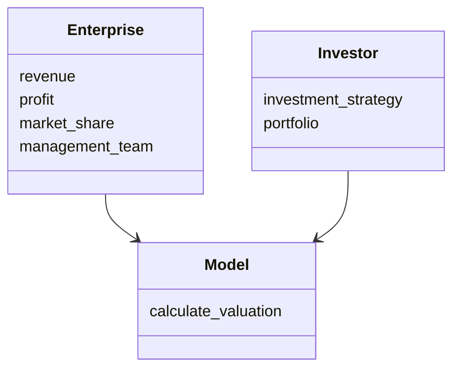

                 


# 费雪的创新企业评估：技术革新时代的投资机会

## 关键词：费雪、创新企业、技术变革、投资机会、企业评估、投资策略

## 摘要：
本文探讨了费雪的创新企业评估方法在技术革新时代下的应用，分析了技术变革对企业价值的影响，详细介绍了费雪评估模型的核心要素和算法原理。通过实际案例和项目实战，展示了如何在技术快速变化的环境中，利用费雪的评估方法识别投资机会，制定有效的投资策略。本文还结合系统架构设计和最佳实践，为投资者提供了在技术变革中进行创新企业评估的深度指导。

---

## 第1章: 费雪的投资理念概述

### 1.1 费雪的投资哲学

#### 1.1.1 费雪的生平与投资思想
菲利普·费雪（Philip Fisher）是20世纪著名的投资专家，被誉为“成长型投资之父”。他提出了“成长股投资”理论，强调投资于具有持续增长潜力的企业。费雪认为，投资者应选择那些具有强大管理团队、良好财务状况和广阔市场前景的公司，并长期持有。

#### 1.1.2 费雪投资理念的核心观点
费雪的核心观点包括：
1. **长期投资**：买入并持有优质股票，而非频繁交易。
2. **成长股投资**：选择那些具有高成长潜力的企业。
3. **管理层的重要性**：优秀的管理层是企业成功的关键。
4. **分散投资**：通过投资不同类型的企业降低风险。

#### 1.1.3 费雪与现代投资理论的联系
费雪的思想对现代投资理论有重要影响。他的成长股理念与巴菲特的价值投资理念有相似之处，同时也为后来的指数投资和量化投资提供了理论基础。

---

### 1.2 技术变革对企业评估的影响

#### 1.2.1 技术革命对企业价值的重塑
技术革命（如人工智能、大数据、区块链等）正在改变企业的商业模式和价值创造方式。技术创新不仅提升了企业的效率，还可能创造出新的市场需求，从而影响企业的估值。

#### 1.2.2 创新企业在技术变革中的角色
创新企业是技术变革的推动者。它们通过技术创新、产品创新和商业模式创新，引领行业的发展方向。在技术变革中，创新企业往往具有更高的增长潜力和竞争优势。

#### 1.2.3 费雪理念在技术时代的适用性
尽管技术环境发生了变化，但费雪的核心理念依然适用。创新企业仍然需要具备强大的管理团队、财务状况和市场前景。技术变革为创新企业提供了新的增长机会，同时也带来了新的挑战。

---

### 1.3 费雪评估模型的核心要素

#### 1.3.1 费雪模型的基本框架
费雪模型是一个基于企业基本面分析的评估框架，主要包括以下几个要素：
1. **企业的财务状况**：包括收入、利润、负债等。
2. **企业的市场地位**：包括市场份额、品牌影响力等。
3. **企业的管理团队**：包括管理层的能力和稳定性。
4. **企业的成长潜力**：包括技术创新能力、市场扩展能力等。

#### 1.3.2 创新企业的核心竞争力分析
创新企业的核心竞争力体现在以下几个方面：
1. **技术创新能力**：企业是否具备持续的技术创新能力。
2. **产品差异化**：产品是否具有独特性，能否满足市场需求。
3. **商业模式的创新**：企业的商业模式是否具有竞争优势。

#### 1.3.3 企业生命周期与投资机会的关联
企业生命周期分为初创期、成长期、成熟期和衰退期。不同阶段的企业适合不同的投资策略。创新企业通常处于成长期，具有较高的增长潜力。

---

## 第2章: 技术变革对企业评估的影响

### 2.1 技术革命对企业价值的重塑

#### 2.1.1 数字化转型对企业估值的影响
数字化转型正在改变企业的运营模式和价值创造方式。通过数字化转型，企业可以提高效率、降低成本，从而提升估值。

#### 2.1.2 新兴技术对企业竞争优势的构建
新兴技术（如人工智能、大数据）为企业构建竞争优势提供了新的工具。创新企业可以通过技术领先来获得市场优势。

#### 2.1.3 技术不确定性对投资决策的挑战
技术变革带来了不确定性，这使得企业评估更加复杂。投资者需要考虑技术风险、市场风险和竞争风险。

---

### 2.2 创新企业在技术变革中的角色

#### 2.2.1 创新企业的定义与特征
创新企业是指那些通过技术创新、产品创新或商业模式创新，为市场提供新价值的企业。它们通常具有较高的增长潜力和竞争优势。

#### 2.2.2 创新企业的技术领先性分析
创新企业的技术领先性是其核心竞争力之一。投资者需要评估企业的技术储备、研发能力和技术应用能力。

#### 2.2.3 创新企业的市场定位与战略选择
创新企业的市场定位决定了其竞争优势。投资者需要分析企业的市场定位、目标客户和战略方向。

---

### 2.3 费雪理念在技术时代的适用性

#### 2.3.1 费雪模型的灵活性与可扩展性
费雪模型具有较强的灵活性，可以适应不同的技术和市场环境。投资者可以根据具体情况进行调整和扩展。

#### 2.3.2 技术变革对费雪模型的验证与调整
技术变革可能验证或调整费雪模型的有效性。投资者需要根据实际情况对模型进行调整，以适应新的技术和市场环境。

#### 2.3.3 费雪理念在现代投资中的应用案例
本文将通过实际案例分析，展示费雪理念在现代投资中的应用。例如，如何通过费雪模型评估一家人工智能企业的投资价值。

---

## 第3章: 费雪评估模型的算法原理

### 3.1 费雪模型的数学表达

#### 3.1.1 模型的基本公式
费雪模型的核心公式为：
$$
V = \frac{E}{k}
$$
其中，$V$ 是企业的估值，$E$ 是企业的预期收益，$k$ 是资本成本。

#### 3.1.2 变量的定义与关系
- $E$：企业的预期收益，包括营业收入、利润等。
- $k$：资本成本，通常以企业的加权平均资本成本（WACC）为基础。

#### 3.1.3 模型的假设条件与限制
- 假设企业的收益可以持续增长。
- 忽略企业的非财务因素（如管理团队的能力）。

---

### 3.2 费雪模型的实现步骤

#### 3.2.1 数据收集与预处理
投资者需要收集企业的财务数据、市场数据和行业数据。数据预处理包括清洗、转换和标准化。

#### 3.2.2 模型参数的估计与优化
通过回归分析或其他方法，估计模型的参数。优化参数以提高模型的准确性和稳定性。

#### 3.2.3 模型的验证与测试
通过历史数据验证模型的准确性。测试模型在不同市场环境下的表现。

---

### 3.3 费雪模型的代码实现

#### 3.3.1 环境配置与依赖安装
```python
# 安装必要的库
import numpy as np
import pandas as pd
from sklearn.linear_model import LinearRegression
```

#### 3.3.2 核心算法的Python代码
```python
# 示例代码：计算企业的预期收益
def calculate_expected_revenue(revenue_history, growth_rate):
    return revenue_history * (1 + growth_rate)

# 示例代码：计算资本成本
def calculate_wacc(asset beta, marketRiskPremium, cost_of_equity, cost_of_debt):
    wacc = (cost_of_equity * equity_weight) + (cost_of_debt * debt_weight * (1 - tax_rate))
    return wacc

# 示例代码：计算企业估值
def calculate_valuation(revenue, wacc):
    return revenue / wacc
```

---

## 第4章: 系统分析与架构设计

### 4.1 问题场景介绍
本文将构建一个基于费雪模型的企业评估系统，用于在技术变革时代评估创新企业的投资价值。

### 4.2 系统功能设计

#### 4.2.1 领域模型（Mermaid 类图）


#### 4.2.2 系统架构设计（Mermaid 架构图）


---

## 第5章: 项目实战

### 5.1 环境安装与配置
安装必要的开发工具和库，如Python、Jupyter Notebook、Pandas等。

### 5.2 核心算法实现

#### 5.2.1 数据预处理
```python
# 示例代码：数据预处理
data = pd.read_csv('enterprise_data.csv')
data = data.dropna()
data = (data - data.mean()) / data.std()
```

#### 5.2.2 模型训练与验证
```python
# 示例代码：模型训练
model = LinearRegression()
model.fit(X_train, y_train)

# 示例代码：模型验证
y_pred = model.predict(X_test)
```

### 5.3 案例分析
通过实际案例分析，展示如何利用费雪模型评估创新企业的投资价值。

---

## 第6章: 最佳实践与总结

### 6.1 最佳实践 tips
- 定期更新模型参数，以适应技术和市场的变化。
- 结合定量分析和定性分析，全面评估企业的价值。
- 注意技术风险和市场风险，制定合理的投资策略。

### 6.2 小结
本文通过详细分析费雪的创新企业评估方法，探讨了其在技术变革时代下的应用。通过算法原理和系统设计，展示了如何利用费雪模型识别投资机会。希望本文能为投资者提供有价值的参考。

---

## 作者：AI天才研究院 & 禅与计算机程序设计艺术

---

### 注意事项：
- 本文内容基于费雪的投资理念和现代技术分析方法，具体实施时需结合实际情况。
- 本文仅为学术探讨，不构成投资建议。

